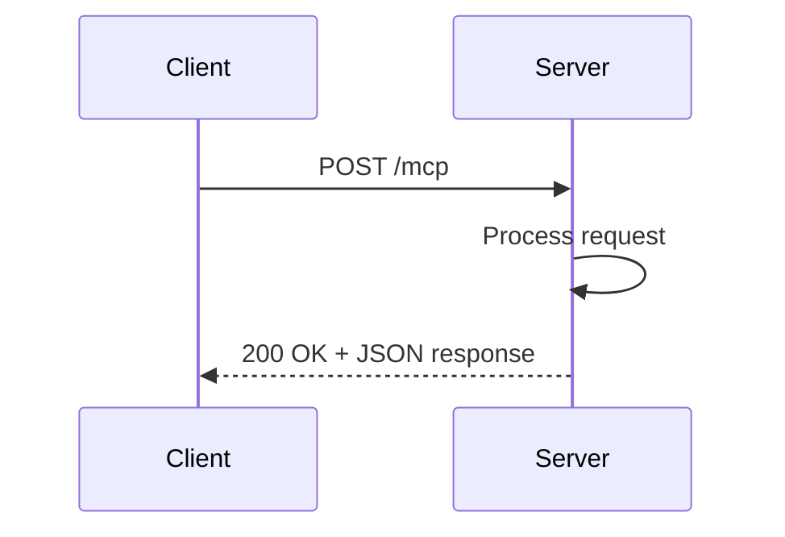
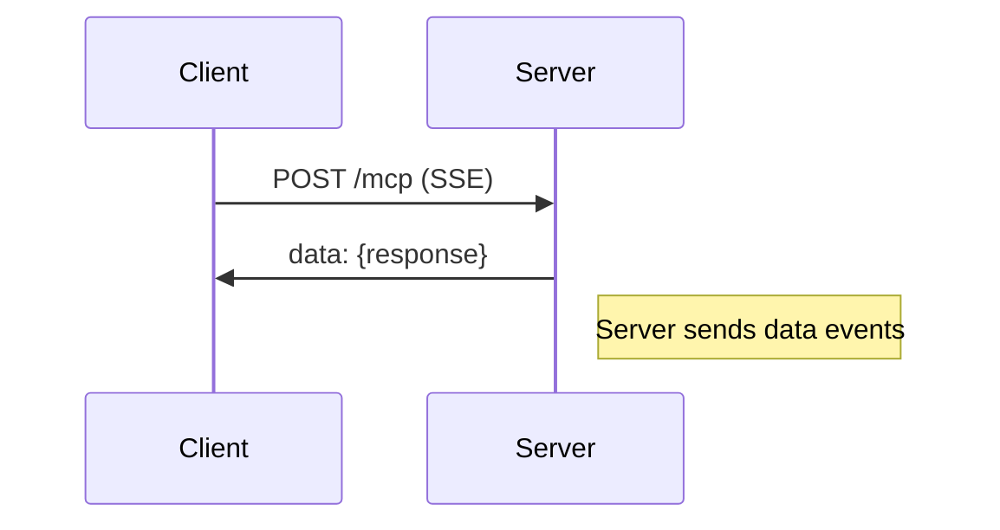
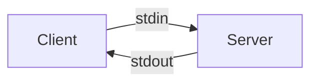
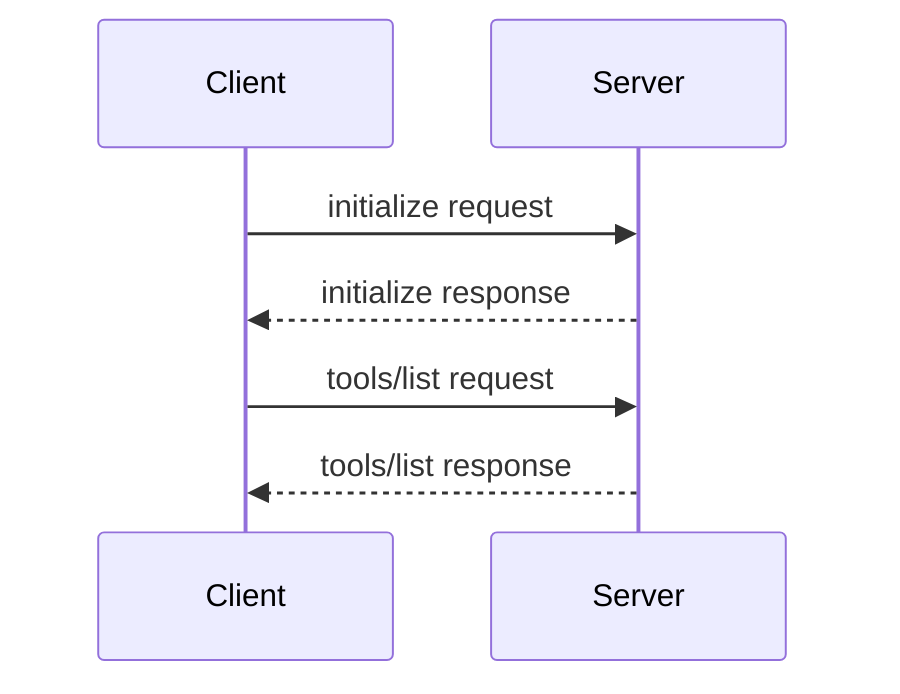
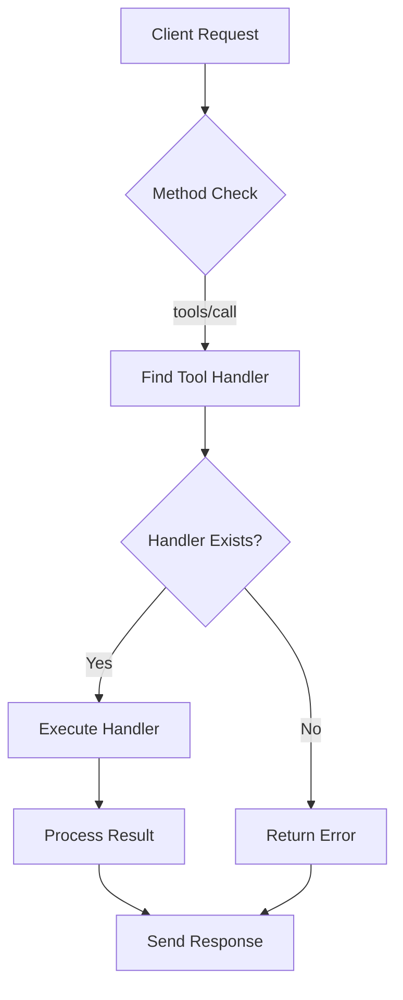
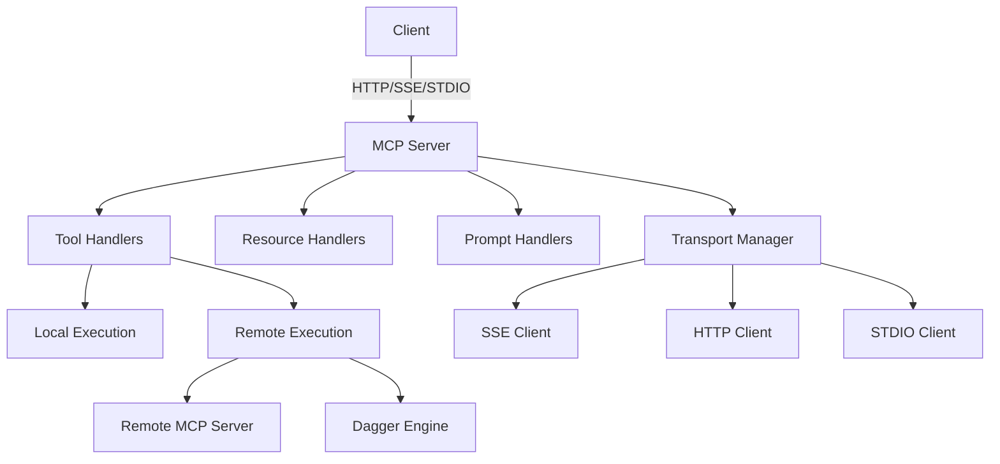

# MCP Server API Reference


## Table of Contents
1. [Introduction](#introduction)
2. [Transport Modes](#transport-modes)
3. [API Endpoints](#api-endpoints)
4. [Request/Response Formats](#requestresponse-formats)
5. [Tool Discovery](#tool-discovery)
6. [Tool Execution](#tool-execution)
7. [Authentication](#authentication)
8. [Error Handling](#error-handling)
9. [Examples](#examples)
10. [Architecture Overview](#architecture-overview)

## Introduction
The Model Context Protocol (MCP) server provides a standardized interface for agents to share tools and capabilities. This document details the API endpoints, transport modes, and implementation details for the MCP server implementation in the Praxis Go SDK. The server acts as an adapter between agents and various execution engines, including local engines like Dagger and remote MCP servers.

The MCP server supports three transport modes: HTTP, Server-Sent Events (SSE), and STDIO, allowing flexible integration with different client types. It enables tool discovery, execution, and resource access through a standardized JSON-RPC based protocol.

**Section sources**
- [internal/mcp/server.go](file://internal/mcp/server.go#L1-L50)
- [examples/simple-mcp-server.go](file://examples/simple-mcp-server.go#L1-L20)

## Transport Modes
The MCP server supports three transport modes for client communication: HTTP, SSE, and STDIO. Each mode provides the same functionality but with different communication patterns and performance characteristics.

### HTTP Transport
The HTTP transport mode uses standard HTTP requests and responses for communication. It is suitable for clients that prefer traditional REST-like interactions. The server can be started in HTTP mode using the `StartHTTP` method.



**Diagram sources**
- [internal/mcp/server.go](file://internal/mcp/server.go#L130-L140)

### SSE Transport
The Server-Sent Events (SSE) transport mode provides a persistent connection for real-time communication. It is ideal for streaming responses and maintaining long-lived connections. The server can be started in SSE mode using the `StartSSE` method.



**Diagram sources**
- [internal/mcp/server.go](file://internal/mcp/server.go#L110-L120)

### STDIO Transport
The STDIO transport mode uses standard input and output streams for communication. This mode is suitable for command-line tools and processes that communicate through pipes. The server can be started in STDIO mode using the `StartSTDIO` method.



**Diagram sources**
- [internal/mcp/server.go](file://internal/mcp/server.go#L142-L149)

## API Endpoints
The MCP server exposes several endpoints for tool discovery, execution, and management. These endpoints follow the Model Context Protocol specification and use JSON-RPC 2.0 for message formatting.

### /mcp/v1/tools (GET)
This endpoint returns a list of all available tools on the server. It supports both HTTP and SSE transports.

**Request**
```
GET /mcp/v1/tools
```

**Response**
```json
{
  "tools": [
    {
      "name": "tool_name",
      "description": "Tool description",
      "inputSchema": {
        "type": "object",
        "properties": {
          "param1": {
            "type": "string",
            "description": "Parameter description"
          }
        }
      }
    }
  ]
}
```

### /mcp/v1/execute (POST)
This endpoint executes a specified tool with the provided arguments.

**Request**
```
POST /mcp/v1/execute
Content-Type: application/json
```

```json
{
  "name": "tool_name",
  "arguments": {
    "param1": "value1"
  }
}
```

**Response**
```json
{
  "result": {
    "content": [
      {
        "type": "text",
        "text": "Execution result"
      }
    ],
    "isError": false
  }
}
```

### /mcp/v1/spec (GET)
This endpoint returns an OpenAPI-like specification of the server's capabilities and available tools.

**Request**
```
GET /mcp/v1/spec
```

**Response**
```json
{
  "openapi": "3.0.0",
  "info": {
    "title": "MCP Server",
    "version": "1.0.0"
  },
  "paths": {
    "/tools": {
      "get": {
        "summary": "List available tools"
      }
    },
    "/execute": {
      "post": {
        "summary": "Execute a tool"
      }
    }
  }
}
```

**Section sources**
- [internal/mcp/server.go](file://internal/mcp/server.go#L60-L97)
- [examples/mcp-http-server.go](file://examples/mcp-http-server.go#L1-L54)

## Request/Response Formats
The MCP server uses JSON-RPC 2.0 for message formatting, with additional fields for tool-specific data.

### Tool Call Request Format
The request format for tool invocation includes the tool name and arguments.

```json
{
  "jsonrpc": "2.0",
  "id": 1,
  "method": "tools/call",
  "params": {
    "name": "tool_name",
    "arguments": {
      "param1": "value1",
      "param2": "value2"
    }
  }
}
```

**Key fields:**
- **jsonrpc**: Protocol version (always "2.0")
- **id**: Request identifier for matching responses
- **method**: Method name ("tools/call" for tool execution)
- **params.name**: Name of the tool to execute
- **params.arguments**: Object containing tool arguments

### Tool Call Response Format
The response format includes the result of tool execution or an error message.

```json
{
  "jsonrpc": "2.0",
  "id": 1,
  "result": {
    "content": [
      {
        "type": "text",
        "text": "Tool execution result"
      }
    ],
    "isError": false
  }
}
```

```json
{
  "jsonrpc": "2.0",
  "id": 1,
  "error": {
    "code": -32603,
    "message": "Tool execution failed"
  }
}
```

**Key fields:**
- **result.content**: Array of content objects (text, JSON, etc.)
- **result.isError**: Boolean indicating if the result represents an error
- **error.code**: Error code (standard JSON-RPC codes)
- **error.message**: Human-readable error message

### Result Serialization
Results are serialized as an array of content objects, each with a type and value. The most common type is "text", but other types may be supported depending on the tool.

```go
type CallToolResult struct {
    Content []Content `json:"content"`
    IsError bool      `json:"isError"`
}

type Content interface {
    GetContentType() string
}

type TextContent struct {
    Type string `json:"type"`
    Text string `json:"text"`
}
```

**Section sources**
- [internal/mcp/server.go](file://internal/mcp/server.go#L60-L97)
- [internal/mcp/client.go](file://internal/mcp/client.go#L105-L164)

## Tool Discovery
The MCP server provides mechanisms for dynamic discovery of available tools, allowing clients to automatically detect and use tools without prior configuration.

### Discovery Process
The tool discovery process involves two steps:
1. Initialize connection with the server
2. List available tools



**Diagram sources**
- [internal/mcp/discovery.go](file://internal/mcp/discovery.go#L41-L89)

### Discovery Implementation
The `ToolDiscoveryService` handles the discovery process by making HTTP requests to the MCP server endpoint.

```go
func (s *ToolDiscoveryService) DiscoverToolsFromServer(ctx context.Context, serverURL string) ([]DiscoveredTool, error) {
    // Step 1: Initialize connection
    initRequest := map[string]interface{}{
        "jsonrpc": "2.0",
        "id":      1,
        "method":  "initialize",
        "params": map[string]interface{}{
            "protocolVersion": mcpTypes.LATEST_PROTOCOL_VERSION,
            "capabilities":    map[string]interface{}{},
            "clientInfo": map[string]interface{}{
                "name":    "Praxis MCP Discovery",
                "version": "1.0.0",
            },
        },
    }

    // Step 2: List available tools
    toolsRequest := map[string]interface{}{
        "jsonrpc": "2.0",
        "id":      2,
        "method":  "tools/list",
        "params":  map[string]interface{}{},
    }

    // Process response and extract tools
    // ...
}
```

The discovery service returns a list of `DiscoveredTool` objects containing the tool name, description, input schema, and server information.

**Section sources**
- [internal/mcp/discovery.go](file://internal/mcp/discovery.go#L0-L89)

## Tool Execution
Tool execution in the MCP server involves routing tool calls to appropriate handlers and returning the results to the client.

### Execution Flow
The tool execution process follows this sequence:



**Diagram sources**
- [internal/p2p/bridge.go](file://internal/p2p/bridge.go#L106-L156)

### Handler Registration
Tools are registered with the server using the `AddTool` method, which associates a tool specification with a handler function.

```go
func (w *MCPServerWrapper) AddTool(tool mcpTypes.Tool, handler server.ToolHandlerFunc) {
    w.server.AddTool(tool, handler)
    w.toolHandlers[tool.Name] = handler
    w.registeredTools = append(w.registeredTools, tool)
}
```

The handler function receives the execution context and request parameters, and returns a result or error.

### Remote Tool Execution
For external tools, the MCP server acts as a proxy, forwarding requests to remote servers through the `RemoteMCPEngine`.

```go
handler := func(ctx context.Context, req mcpTypes.CallToolRequest) (*mcpTypes.CallToolResult, error) {
    // Prepare arguments for the remote call
    args := req.GetArguments()

    // Create contract for remote execution
    contract := contracts.ToolContract{
        Engine: "remote-mcp",
        Name:   toolNameCopy,
        EngineSpec: map[string]interface{}{
            "address": addrCopy,
        },
    }

    // Execute via remote engine
    result, err := remoteEngine.Execute(ctx, contract, args)
    // ...
}
```

**Section sources**
- [internal/mcp/server.go](file://internal/mcp/server.go#L70-L97)
- [internal/agent/agent.go](file://internal/agent/agent.go#L1032-L1070)

## Authentication
Based on the code analysis, the current MCP server implementation does not include bearer token authentication or other authentication mechanisms. The server accepts requests without authentication headers.

The `ClientConfig` struct in the transport package includes a `Headers` field that could be used to pass authentication headers, but there is no server-side validation of these headers.

```go
type ClientConfig struct {
    Type    ClientType
    Address string
    Command string
    Args    []string
    Headers map[string]string
    Logger  *logrus.Logger
}
```

Clients can include headers when registering endpoints, which are then passed to the server:

```go
func (tm *TransportManager) RegisterSSEEndpoint(name, url string, headers map[string]string) {
    config := ClientConfig{
        Type:    ClientTypeSSE,
        Address: url,
        Headers: headers,
        Logger:  tm.logger,
    }
    tm.factory.RegisterConfig(name, config)
}
```

However, the server does not validate or authenticate these requests. Authentication would need to be implemented at the transport layer or through a reverse proxy.

**Section sources**
- [internal/mcp/transport.go](file://internal/mcp/transport.go#L0-L64)
- [internal/mcp/client.go](file://internal/mcp/client.go#L0-L54)

## Error Handling
The MCP server implements comprehensive error handling for various failure scenarios, providing meaningful error messages to clients.

### Error Response Format
Errors are returned in the standard JSON-RPC error format:

```json
{
  "jsonrpc": "2.0",
  "id": 1,
  "error": {
    "code": -32601,
    "message": "Method not found"
  }
}
```

Common error codes include:
- **-32601**: Method not found (tool not registered)
- **-32602**: Invalid params (missing or invalid arguments)
- **-32603**: Internal error (execution failure)

### Server-Side Error Handling
The server handles errors at multiple levels:

```go
func (w *MCPServerWrapper) FindToolHandler(toolName string) server.ToolHandlerFunc {
    return w.toolHandlers[toolName]
}

func (b *P2PMCPBridge) handleCallTool(ctx context.Context, request MCPRequest) MCPResponse {
    toolHandler := b.mcpServer.FindToolHandler(toolName)
    if toolHandler == nil {
        return MCPResponse{
            ID:    request.ID,
            Error: &MCPError{Code: -32601, Message: fmt.Sprintf("Tool %s not found", toolName)},
        }
    }

    result, err := toolHandler(ctx, mcpReq)
    if err != nil {
        return MCPResponse{
            ID:    request.ID,
            Error: &MCPError{Code: -32603, Message: fmt.Sprintf("Tool execution failed: %v", err)},
        }
    }
    // ...
}
```

The server logs errors internally while returning appropriate error responses to clients.

**Section sources**
- [internal/mcp/server.go](file://internal/mcp/server.go#L80-L97)
- [internal/p2p/bridge.go](file://internal/p2p/bridge.go#L158-L202)

## Examples
This section provides practical examples of using the MCP server API with curl commands.

### Tool Discovery
Discover available tools from an MCP server:

```bash
curl -X POST http://localhost:3000/mcp \
  -H "Content-Type: application/json" \
  -H "Accept: text/event-stream" \
  -d '{
    "jsonrpc": "2.0",
    "id": 1,
    "method": "initialize",
    "params": {
      "protocolVersion": "2023-09-01",
      "clientInfo": {
        "name": "praxis-client",
        "version": "1.0.0"
      }
    }
  }'
```

```bash
curl -X POST http://localhost:3000/mcp \
  -H "Content-Type: application/json" \
  -H "Accept: text/event-stream" \
  -d '{
    "jsonrpc": "2.0",
    "id": 2,
    "method": "tools/list",
    "params": {}
  }'
```

### Tool Execution
Execute a tool with parameters:

```bash
curl -X POST http://localhost:3000/mcp \
  -H "Content-Type: application/json" \
  -H "Accept: text/event-stream" \
  -d '{
    "jsonrpc": "2.0",
    "id": 3,
    "method": "tools/call",
    "params": {
      "name": "read_file",
      "arguments": {
        "path": "/tmp/example.txt"
      }
    }
  }'
```

### Starting the Server
Start an MCP server with HTTP transport:

```go
config := mcp.ServerConfig{
    Name:        "Filesystem MCP Server",
    Version:     "1.0.0",
    Transport:   mcp.TransportHTTP,
    Port:        "3000",
    EnableTools: true,
}

server, err := mcp.NewMCPServer(config)
if err != nil {
    log.Fatal(err)
}

// Add tools
readTool := mcpTypes.NewTool("read_file",
    mcpTypes.WithDescription("Read contents of a file"),
    mcpTypes.WithString("path", mcpTypes.Required()),
)
server.AddTool(readTool, readFileHandler)

// Start server
server.StartHTTP("3000")
```

**Section sources**
- [examples/simple-mcp-server.go](file://examples/simple-mcp-server.go#L129-L173)
- [examples/mcp-http-server.go](file://examples/mcp-http-server.go#L1-L54)

## Architecture Overview
The MCP server architecture consists of several components that work together to provide tool sharing capabilities between agents.



**Diagram sources**
- [internal/mcp/server.go](file://internal/mcp/server.go#L1-L326)
- [internal/mcp/transport.go](file://internal/mcp/transport.go#L0-L294)

The MCP server acts as an adapter between clients and various execution engines. It receives tool calls from clients through one of the transport modes (HTTP, SSE, or STDIO), routes them to the appropriate handler, and returns the results. The server can execute tools locally or forward them to remote execution engines like Dagger or other MCP servers.

The Transport Manager handles connections to remote MCP servers, allowing the server to act as a proxy for external tools. This enables a federated architecture where agents can discover and use tools from multiple sources.

**Referenced Files in This Document**
- [internal/mcp/server.go](file://internal/mcp/server.go)
- [internal/mcp/transport.go](file://internal/mcp/transport.go)
- [internal/mcp/discovery.go](file://internal/mcp/discovery.go)
- [internal/mcp/client.go](file://internal/mcp/client.go)
- [internal/agent/agent.go](file://internal/agent/agent.go)
- [examples/simple-mcp-server.go](file://examples/simple-mcp-server.go)
- [examples/mcp-http-server.go](file://examples/mcp-http-server.go)
