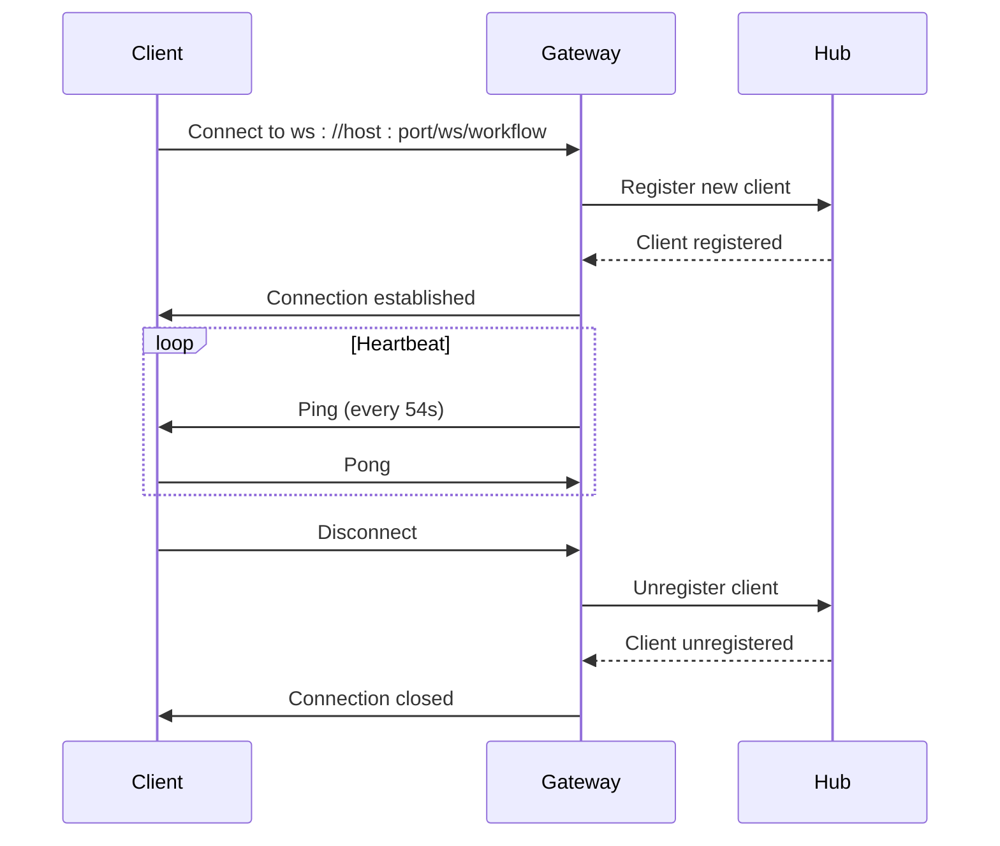
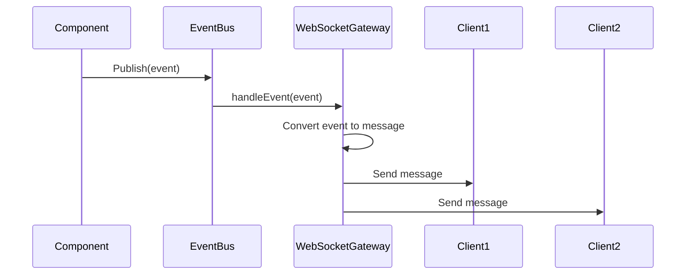
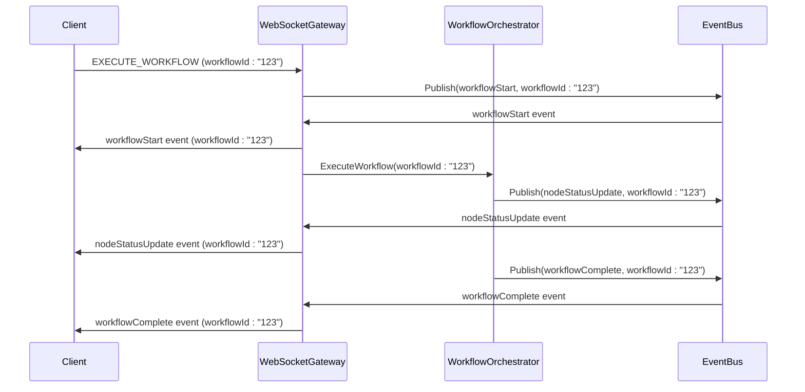
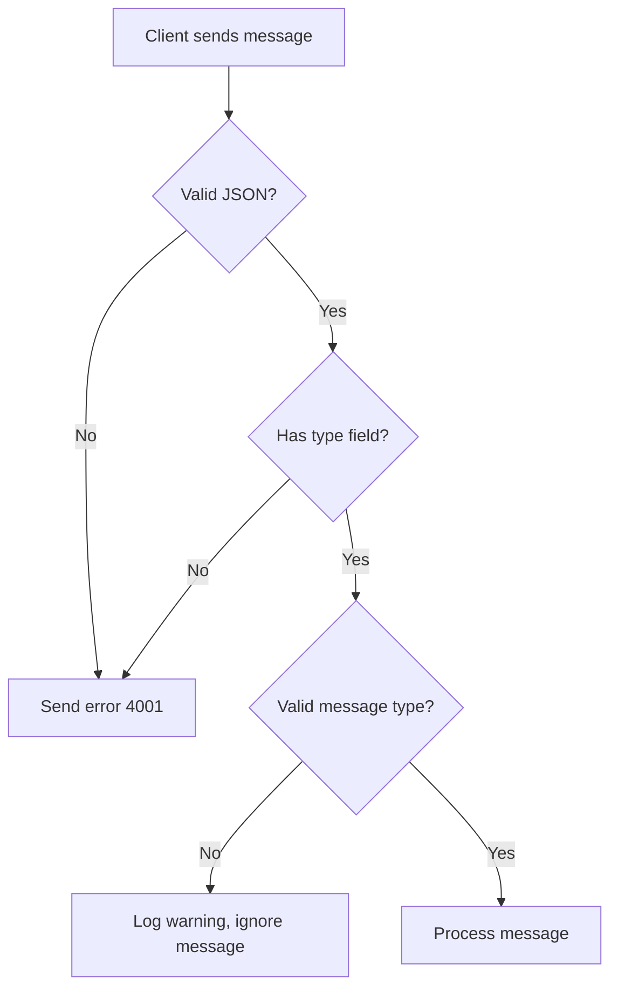

# WebSocket API Reference


## Table of Contents
1. [Introduction](#introduction)
2. [Connection and Lifecycle](#connection-and-lifecycle)
3. [Message Types and Schema](#message-types-and-schema)
4. [Event Subscription Mechanism](#event-subscription-mechanism)
5. [Command Execution Flow](#command-execution-flow)
6. [Error Handling](#error-handling)
7. [Reconnection Strategies](#reconnection-strategies)
8. [Client Code Examples](#client-code-examples)

## Introduction
The WebSocket API provides real-time bidirectional communication between clients and the Praxis agent. It enables clients to send commands, receive execution updates, monitor agent status, and get task completion notifications through a persistent connection. The API is implemented in the `WebSocketGateway` component, which acts as a bridge between WebSocket clients and the internal event bus.

**Section sources**
- [websocket_gateway.go](file://internal/api/websocket_gateway.go#L1-L50)

## Connection and Lifecycle

### Connection URL
Clients connect to the WebSocket server using the following URL format:
```
ws://host:port/ws/workflow
```
Where `host` is the server address and `port` is the WebSocket port configured in the agent (default: 9001).

### Handshake Requirements
The WebSocket connection uses the standard WebSocket handshake protocol. The server accepts connections from any origin during development, but this should be restricted in production. The connection upgrade is handled by the `handleWebSocket` method in the `WebSocketGateway`.

### Lifecycle Events
The WebSocket connection lifecycle is managed through the following events:

- **Connect**: When a client successfully connects, a new `Client` instance is registered with the hub, and the `readPump` and `writePump` goroutines are started.
- **Disconnect**: When a client disconnects (expected or unexpected), the client is unregistered from the hub, and the connection is closed.
- **Ping/Pong**: The server implements a heartbeat mechanism to maintain connection liveness. The server sends ping messages every 54 seconds (90% of the 60-second pong wait period), and expects clients to respond with pong messages.



**Diagram sources**
- [websocket_gateway.go](file://internal/api/websocket_gateway.go#L131-L150)
- [websocket_gateway.go](file://internal/api/websocket_gateway.go#L152-L201)

**Section sources**
- [websocket_gateway.go](file://internal/api/websocket_gateway.go#L131-L201)

## Message Types and Schema

The WebSocket API supports four main message types: 'event', 'command', 'response', and 'error'. All messages are JSON objects with a `type` field and a `payload` field.

### Message Schema
```json
{
  "type": "message_type",
  "payload": {
    // message-specific data
  }
}
```

### Client-to-Server Messages

#### DSL_COMMAND
Sent by clients to execute a DSL command.

**Schema:**
```json
{
  "type": "DSL_COMMAND",
  "payload": {
    "command": "string",
    "workflowId": "string (optional)"
  }
}
```

**Section sources**
- [websocket_gateway.go](file://internal/api/websocket_gateway.go#L259-L306)

#### EXECUTE_WORKFLOW
Sent by clients to execute a workflow.

**Schema:**
```json
{
  "type": "EXECUTE_WORKFLOW",
  "payload": {
    "workflowId": "string (optional)",
    "nodes": "array",
    "edges": "array"
  }
}
```

**Section sources**
- [websocket_gateway.go](file://internal/api/websocket_gateway.go#L429-L479)

#### CHAT_MESSAGE
Sent by clients to send a chat message.

**Schema:**
```json
{
  "type": "CHAT_MESSAGE",
  "payload": {
    "content": "string",
    "sender": "string"
  }
}
```

**Section sources**
- [websocket_gateway.go](file://internal/api/websocket_gateway.go#L479-L512)

### Server-to-Client Messages (Events)
Server-to-client messages are published as events through the EventBus and broadcast to all connected clients.

#### dslProgress
Indicates progress in DSL command processing.

**Schema:**
```json
{
  "type": "dslProgress",
  "payload": {
    "stage": "string",
    "message": "string",
    "details": "object (optional)"
  }
}
```

#### dslResult
Contains the result of a DSL command execution.

**Schema:**
```json
{
  "type": "dslResult",
  "payload": {
    "success": "boolean",
    "command": "string",
    "result": "object",
    "workflowSuggestion": "object (optional)"
  }
}
```

#### workflowStart
Indicates that a workflow execution has started.

**Schema:**
```json
{
  "type": "workflowStart",
  "payload": {
    "workflowId": "string"
  }
}
```

#### nodeStatusUpdate
Indicates a change in the status of a workflow node.

**Schema:**
```json
{
  "type": "nodeStatusUpdate",
  "payload": {
    "workflowId": "string",
    "nodeId": "string",
    "status": "string"
  }
}
```

#### workflowLog
Contains a log message from workflow execution.

**Schema:**
```json
{
  "type": "workflowLog",
  "payload": {
    "workflowId": "string",
    "level": "string",
    "message": "string",
    "source": "string",
    "nodeId": "string (optional)"
  }
}
```

#### workflowComplete
Indicates that a workflow execution has completed successfully.

**Schema:**
```json
{
  "type": "workflowComplete",
  "payload": {
    "workflowId": "string",
    "result": "object",
    "message": "string",
    "toolResults": "array (optional)"
  }
}
```

#### workflowError
Indicates that a workflow execution has failed.

**Schema:**
```json
{
  "type": "workflowError",
  "payload": {
    "workflowId": "string",
    "message": "string",
    "nodeId": "string (optional)"
  }
}
```

#### chatMessage
Contains a chat message from the agent.

**Schema:**
```json
{
  "type": "chatMessage",
  "payload": {
    "content": "string",
    "sender": "string"
  }
}
```

**Section sources**
- [event_bus.go](file://internal/bus/event_bus.go#L0-L58)
- [websocket_gateway.go](file://internal/api/websocket_gateway.go#L549-L571)

## Event Subscription Mechanism

The WebSocket API uses a publish-subscribe pattern for event distribution. Clients do not need to explicitly subscribe to events - they receive all events broadcast by the server.

### Event Flow
1. Components in the system publish events to the EventBus.
2. The WebSocketGateway is subscribed to all event types.
3. When an event is published, the EventBus calls the `handleEvent` method of the WebSocketGateway.
4. The `handleEvent` method converts the event to a WebSocket message and broadcasts it to all connected clients.



**Diagram sources**
- [event_bus.go](file://internal/bus/event_bus.go#L119-L135)
- [websocket_gateway.go](file://internal/api/websocket_gateway.go#L549-L571)

**Section sources**
- [event_bus.go](file://internal/bus/event_bus.go#L119-L135)
- [websocket_gateway.go](file://internal/api/websocket_gateway.go#L549-L571)

### Supported Event Types
The following event types are supported for execution updates, agent status changes, and task completions:

- **Execution Updates**: `dslProgress`, `nodeStatusUpdate`, `workflowLog`
- **Agent Status Changes**: `chatMessage`
- **Task Completions**: `workflowComplete`, `workflowError`

**Section sources**
- [event_bus.go](file://internal/bus/event_bus.go#L0-L58)

## Command Execution Flow

The command execution flow via WebSocket uses correlation IDs to track requests and responses. The flow is as follows:

1. Client sends a command message with a `workflowId` (used as correlation ID).
2. Server processes the command and publishes events with the same `workflowId`.
3. Client correlates events with the original command using the `workflowId`.

### Example Flow for EXECUTE_WORKFLOW


**Diagram sources**
- [websocket_gateway.go](file://internal/api/websocket_gateway.go#L429-L479)
- [websocket_gateway.go](file://internal/api/websocket_gateway.go#L549-L571)

**Section sources**
- [websocket_gateway.go](file://internal/api/websocket_gateway.go#L429-L479)

## Error Handling

The WebSocket API includes comprehensive error handling for various scenarios.

### Error Message Schema
```json
{
  "type": "error",
  "payload": {
    "message": "string"
  }
}
```

### Error Codes
The API uses the following error codes:

- **4001**: Invalid message format
- **4002**: Unauthorized access

These error codes are not explicitly defined in the code but are standard HTTP status codes that could be used in the context of WebSocket error handling.

### Error Scenarios
- **Invalid Message**: When a client sends a message that cannot be parsed as JSON or does not have the required fields.
- **Unknown Message Type**: When a client sends a message with a type that is not recognized by the server.
- **WebSocket Connection Errors**: When there are issues with the WebSocket connection itself.



**Diagram sources**
- [websocket_gateway.go](file://internal/api/websocket_gateway.go#L152-L201)
- [websocket_gateway.go](file://internal/api/websocket_gateway.go#L554-L589)

**Section sources**
- [websocket_gateway.go](file://internal/api/websocket_gateway.go#L152-L201)

## Reconnection Strategies

The WebSocket API supports client reconnection to maintain reliable communication.

### Automatic Reconnection
Clients should implement automatic reconnection with exponential backoff. After a disconnection, the client should wait for a short period before attempting to reconnect, doubling the wait time after each failed attempt.

### Connection State Management
Clients should maintain their state and resubscribe to any necessary events after reconnection. Since the server broadcasts all events to all clients, no explicit resubscription is needed.

### Heartbeat Mechanism
The server's heartbeat mechanism (ping/pong) helps detect broken connections quickly. If a client fails to respond to a ping, the server will close the connection.

**Section sources**
- [websocket_gateway.go](file://internal/api/websocket_gateway.go#L199-L257)

## Client Code Examples

### JavaScript Client for Subscribing to Execution Events
```javascript
class PraxisWebSocketClient {
    constructor(host, port) {
        this.url = `ws://${host}:${port}/ws/workflow`;
        this.socket = null;
        this.reconnectInterval = 1000; // Start with 1 second
        this.maxReconnectInterval = 30000; // Max 30 seconds
    }

    connect() {
        this.socket = new WebSocket(this.url);

        this.socket.onopen = () => {
            console.log('Connected to Praxis agent');
            this.reconnectInterval = 1000; // Reset reconnect interval
        };

        this.socket.onmessage = (event) => {
            const message = JSON.parse(event.data);
            this.handleMessage(message);
        };

        this.socket.onclose = (event) => {
            console.log('Connection closed', event);
            this.scheduleReconnect();
        };

        this.socket.onerror = (error) => {
            console.error('WebSocket error', error);
        };
    }

    scheduleReconnect() {
        setTimeout(() => {
            console.log('Reconnecting...');
            this.connect();
            // Exponential backoff
            this.reconnectInterval = Math.min(this.reconnectInterval * 2, this.maxReconnectInterval);
        }, this.reconnectInterval);
    }

    handleMessage(message) {
        switch (message.type) {
            case 'workflowStart':
                console.log(`Workflow ${message.payload.workflowId} started`);
                break;
            case 'nodeStatusUpdate':
                console.log(`Node ${message.payload.nodeId} status: ${message.payload.status}`);
                break;
            case 'workflowLog':
                console.log(`[${message.payload.level}] ${message.payload.message}`);
                break;
            case 'workflowComplete':
                console.log(`Workflow ${message.payload.workflowId} completed: ${message.payload.message}`);
                break;
            case 'workflowError':
                console.error(`Workflow ${message.payload.workflowId} error: ${message.payload.message}`);
                break;
            case 'chatMessage':
                console.log(`${message.payload.sender}: ${message.payload.content}`);
                break;
            default:
                console.log('Received event:', message);
        }
    }

    executeWorkflow(workflowId, nodes, edges) {
        const message = {
            type: 'EXECUTE_WORKFLOW',
            payload: {
                workflowId,
                nodes,
                edges
            }
        };
        this.socket.send(JSON.stringify(message));
    }

    sendChatMessage(content) {
        const message = {
            type: 'CHAT_MESSAGE',
            payload: {
                content,
                sender: 'user'
            }
        };
        this.socket.send(JSON.stringify(message));
    }
}

// Usage example
const client = new PraxisWebSocketClient('localhost', 9001);
client.connect();

// Subscribe to execution events
// (All events are automatically received)

// Execute a workflow
client.executeWorkflow('test-workflow', [
    { id: 'node1', type: 'test', data: { label: 'Test Node' } }
], []);

// Send a chat message
client.sendChatMessage('Hello, Praxis agent!');
```

**Section sources**
- [websocket_gateway.go](file://internal/api/websocket_gateway.go#L259-L306)
- [websocket_gateway_test.go](file://internal/api/websocket_gateway_test.go#L111-L164)

**Referenced Files in This Document**
- [websocket_gateway.go](file://internal/api/websocket_gateway.go)
- [event_bus.go](file://internal/bus/event_bus.go)
- [agent.go](file://internal/agent/agent.go)
