# Praxis P2P Agent Architecture

## Table of Contents

1. [Overview](#overview)
2. [Architecture Deep Dive](#architecture-deep-dive)
3. [DSL (Domain Specific Language)](#dsl-domain-specific-language)
4. [P2P Communication](#p2p-communication)
5. [A2A Card Exchange](#a2a-card-exchange)
6. [MCP Tools System](#mcp-tools-system)
7. [Visual Guide](#visual-guide)

## Overview

Praxis P2P Agent is a distributed agent system that combines:

- **P2P networking** via libp2p for decentralized agent communication
- **MCP (Model Context Protocol)** for standardized tool execution
- **DSL processing** for natural command interpretation
- **A2A (Agent-to-Agent) cards** for capability discovery

### Key Features

- Automatic peer discovery via mDNS
- Dynamic tool discovery across network
- Remote tool execution via P2P
- Extensible tool system
- DSL-based command interface

## Architecture Deep Dive

### System Architecture

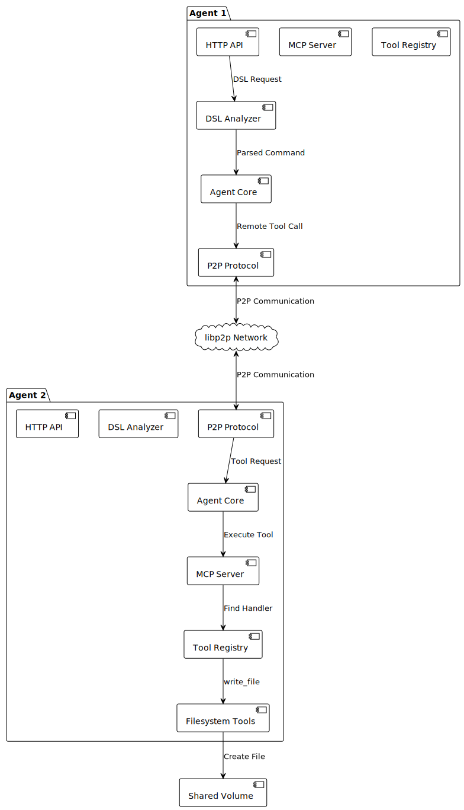

### Component Interaction Flow

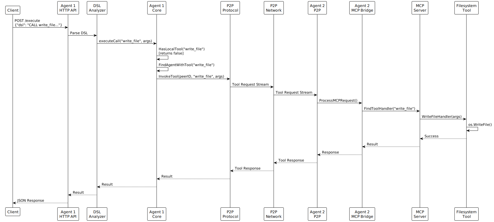

## DSL (Domain Specific Language)

### DSL Processing Pipeline

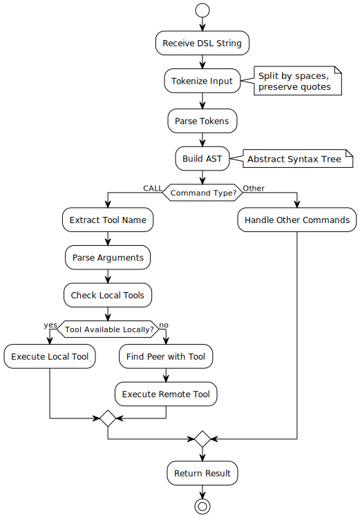

### DSL Syntax

The DSL supports a simple command syntax:

```
CALL <tool_name> [arg1] [arg2] ... [argN]
```

**Examples:**

```bash
# Write a file
CALL write_file filename.txt "content to write"

# Read a file
CALL read_file filename.txt

# List files
CALL list_files

# Custom tool with JSON argument
CALL analyze_data '{"threshold": 0.8, "mode": "fast"}'
```

### DSL Parser Implementation

The DSL parser (`internal/dsl/analyzer.go`) tokenizes input and builds an AST:

```go
type ASTNode struct {
    Type     string        // "call", "literal", etc.
    Value    string        // Command or value
    Children []ASTNode     // Arguments
}
```

## P2P Communication

### P2P Discovery Process

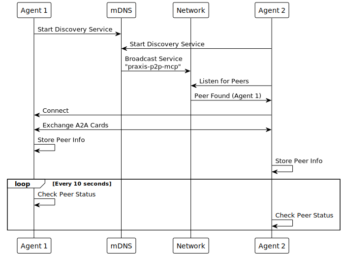

### P2P Protocol Stack

The system uses three main protocols:

1. **`/praxis/mcp/1.0.0`** - MCP message protocol
2. **`/praxis/card/1.0.0`** - A2A card exchange
3. **`/praxis/tool/1.0.0`** - Tool invocation

### Connection Management

```go
// P2P Discovery automatically connects to peers
discovery := p2p.NewDiscovery(host, logger)
discovery.Start()

// Register handlers for peer discovery
discovery.RegisterPeerHandler(func(peerInfo *PeerInfo) {
    // Handle new peer
})
```

## A2A Card Exchange

### Card Structure

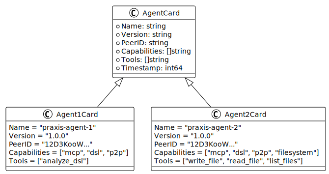

### Card Exchange Flow

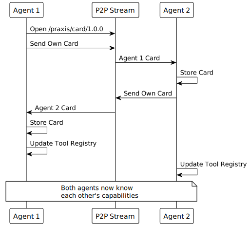

### Automatic Card Exchange

Cards are automatically exchanged when:

1. Peers discover each other via mDNS
2. Manual connection is established
3. Reconnection after network issues

## MCP Tools System

### Tool Architecture

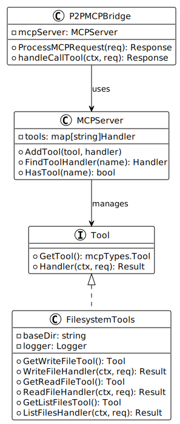

### Tool Execution Flow

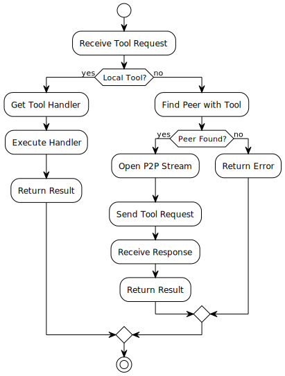

## Visual Guide

### System Overview at a Glance

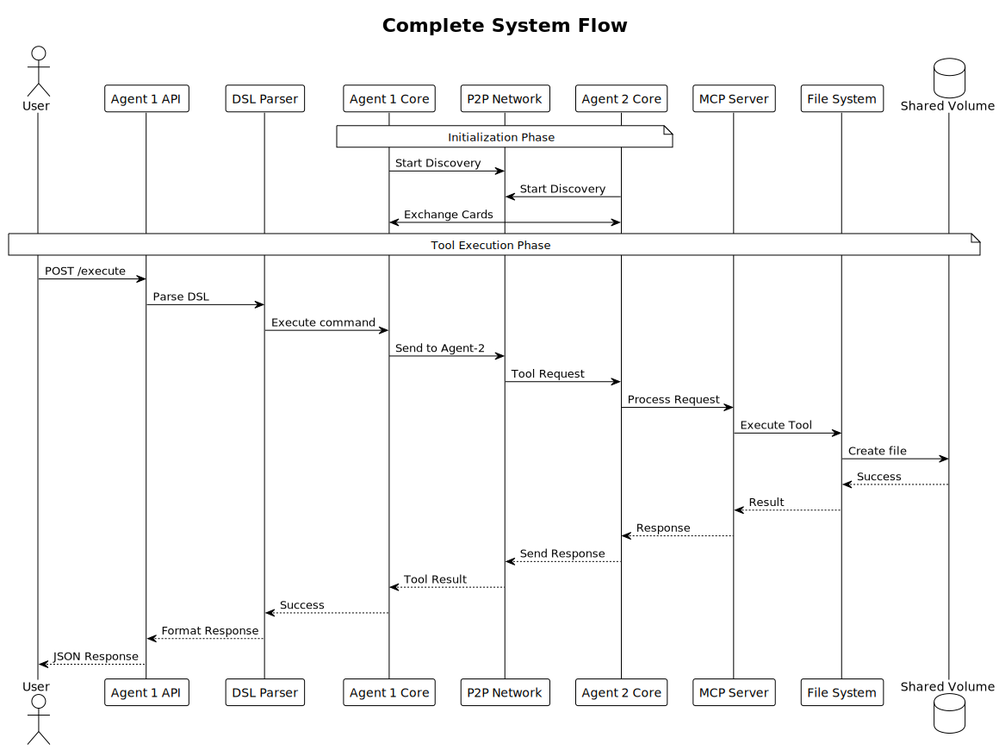

### Key Concepts Explained

#### 1. DSL (Domain Specific Language)


#### 2. P2P Discovery Mechanism

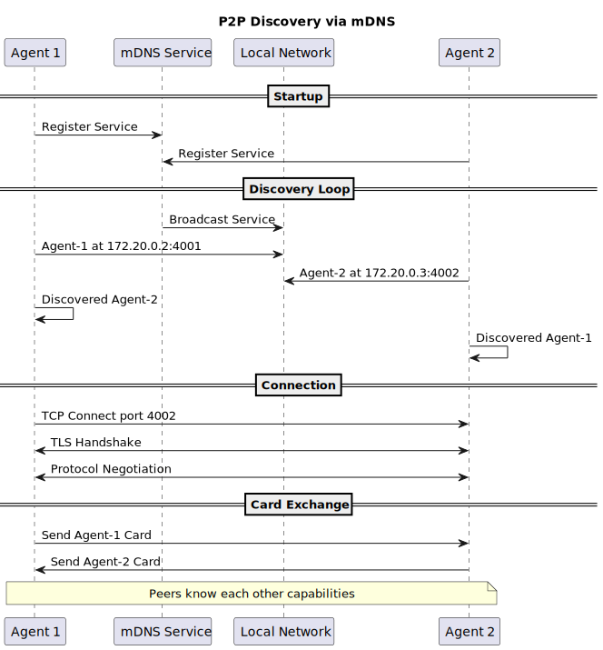

#### 3. A2A Card Structure

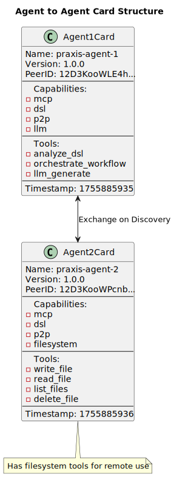

#### 4. Tool Execution Flow

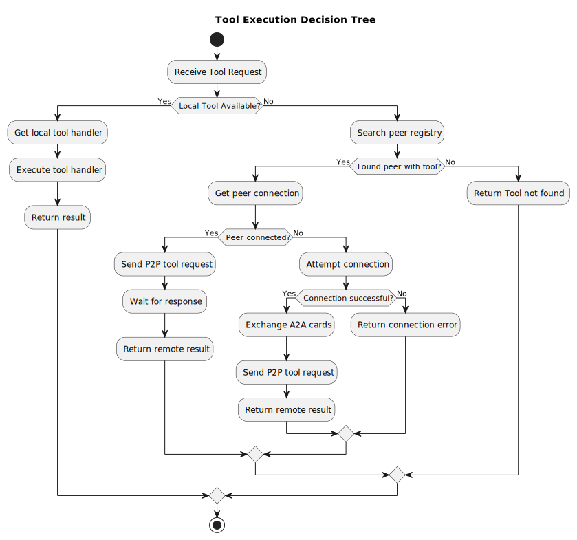

#### 5. MCP Bridge Architecture

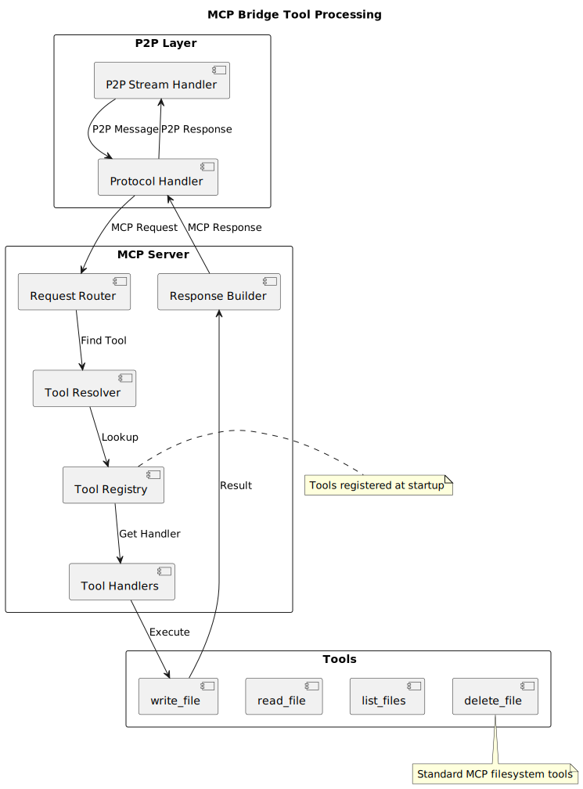

### Common Scenarios

#### Scenario 1: File Creation Across Agents

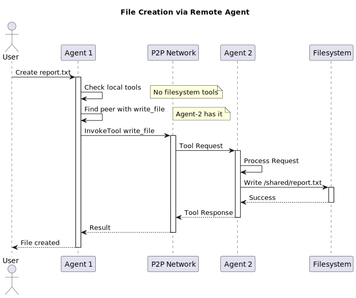

#### Scenario 2: Tool Discovery Process

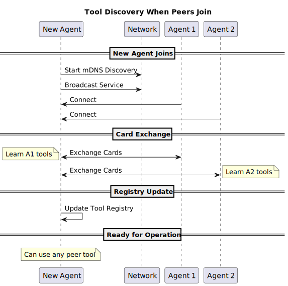

### Architecture Diagram - Simplified

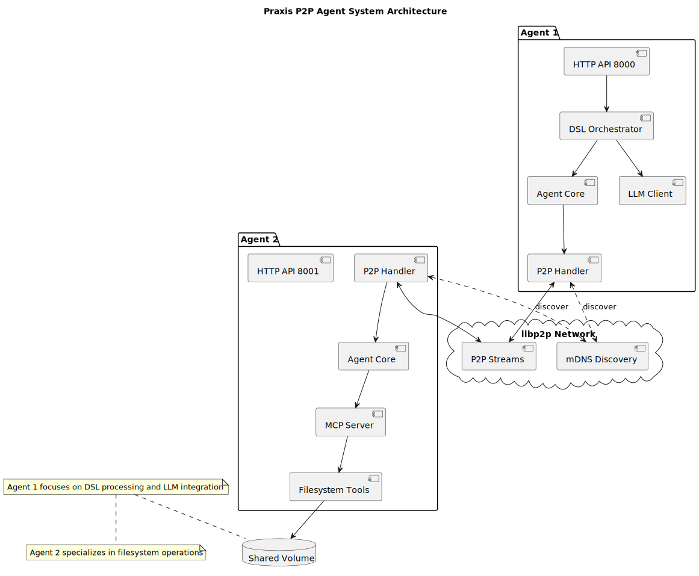

### Component Diagram

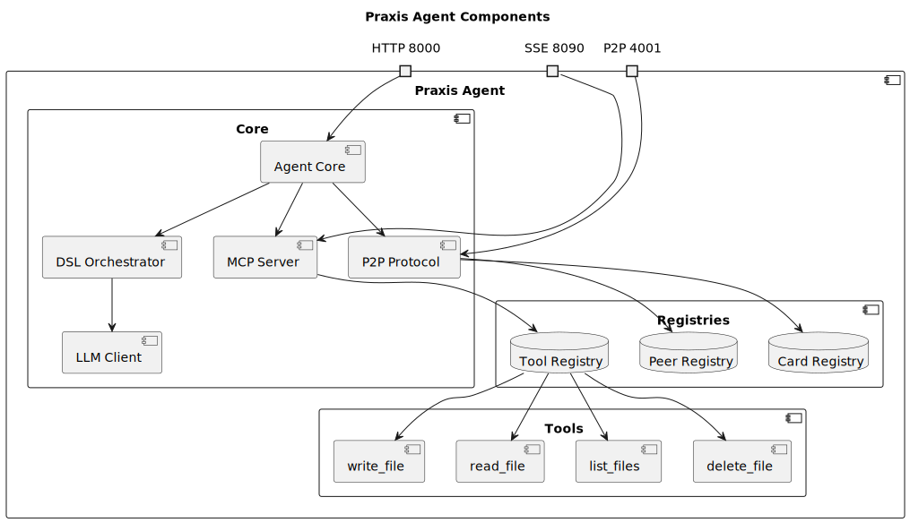

### Data Flow Diagram

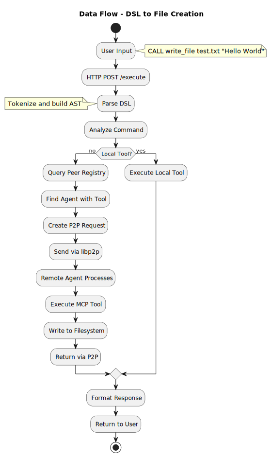

### Tool Addition Flow

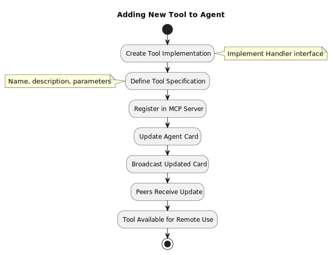

### P2P Protocol Stack

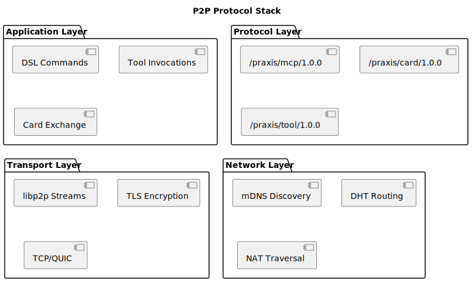

### Tool Communication Patterns

#### Local Tool Execution

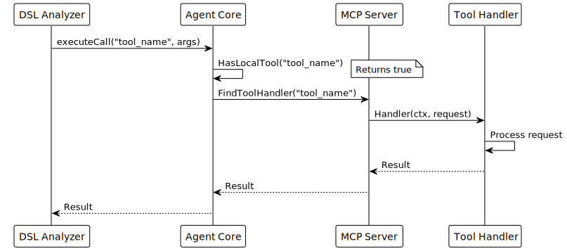

#### Remote Tool Execution

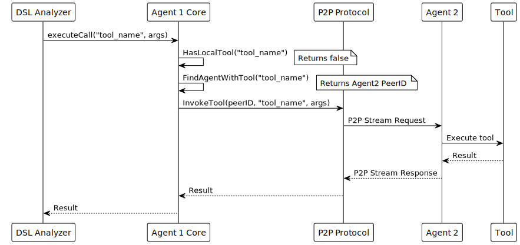

## Monitoring and Debugging

### Key Log Patterns

```bash
# Discovery
"Discovered peer" 
"P2P connection established"
"mDNS discovery started"

# Card Exchange
"Agent card exchanged"
"Received agent card"
"Updated tool registry"

# Tool Execution
"Executing tool"
"Tool executed successfully"
"Routing to peer"

# DSL Processing
"Parsing DSL command"
"Converting natural language to DSL"
"LLM tool suggestion generated"

# Errors
"Tool not found"
"Peer connection failed"
"DSL parsing error"
```

### Health Check Flow

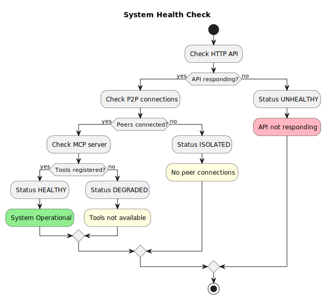

## File Locations

| Path | Description |
|------|-------------|
| `/shared/` | Shared volume for file operations |
| `/data/` | Agent data directory |
| `./cmd/agent/main.go` | Main entry point |
| `./internal/agent/` | Agent core implementation |
| `./internal/mcp/` | MCP server and tools |
| `./internal/p2p/` | P2P protocol implementation |
| `./internal/dsl/` | DSL parser and orchestrator |
| `./internal/config/` | Configuration management |