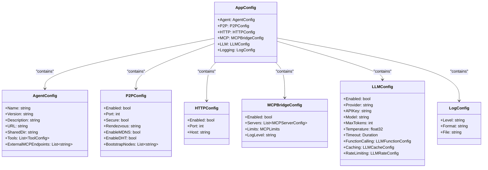
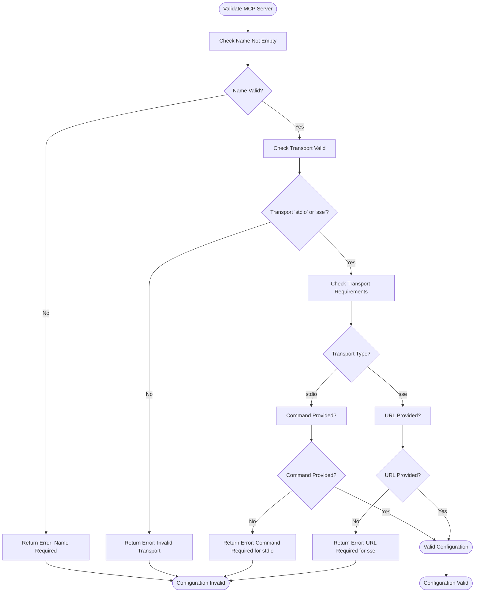
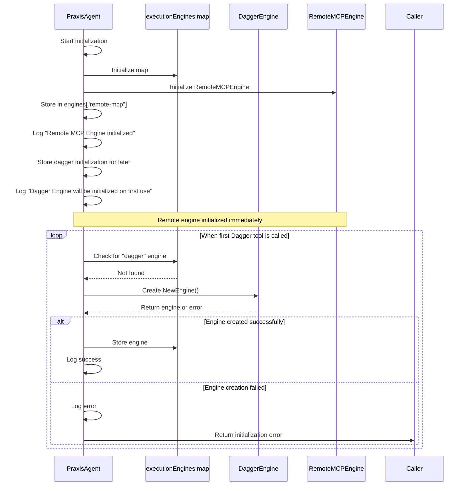
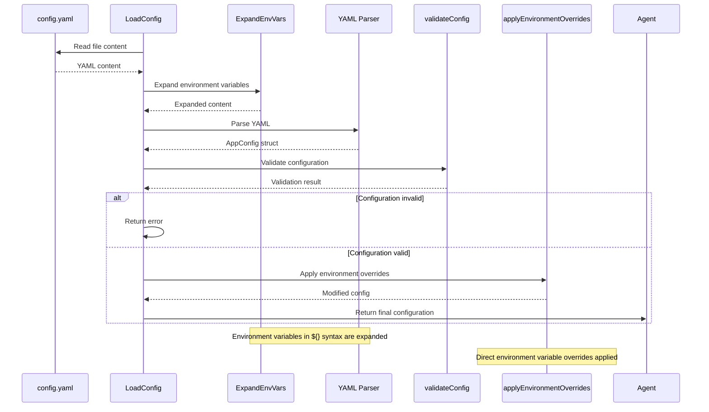
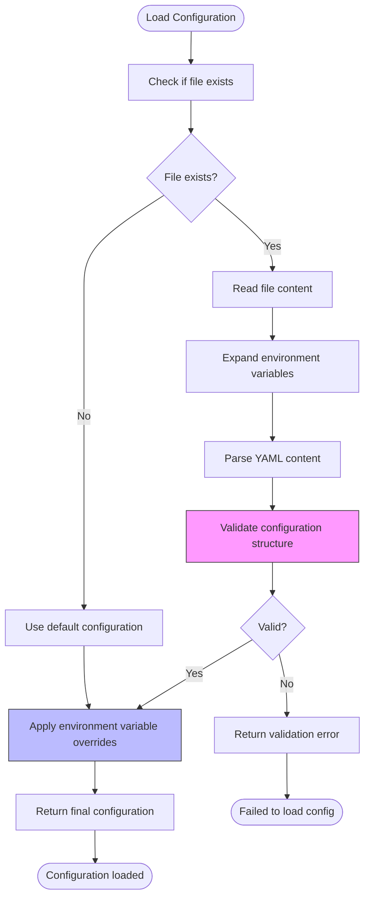

# Agent Configuration


## Table of Contents
1. [Agent Configuration Structure](#agent-configuration-structure)
2. [P2P Settings](#p2p-settings)
3. [MCP Server Configuration](#mcp-server-configuration)
4. [Execution Engine Options](#execution-engine-options)
5. [Logging Parameters](#logging-parameters)
6. [Environment Variable Overrides](#environment-variable-overrides)
7. [Configuration Profiles](#configuration-profiles)
8. [MCP Transport Configuration](#mcp-transport-configuration)
9. [Validation Rules and Error Handling](#validation-rules-and-error-handling)
10. [Securing Sensitive Configuration Data](#securing-sensitive-configuration-data)
11. [Configuration Management Across Environments](#configuration-management-across-environments)

## Agent Configuration Structure

The agent configuration is defined in YAML format and structured around several key components: agent metadata, P2P networking, HTTP server, MCP bridge, LLM integration, and logging. The configuration structure is defined by the `AppConfig` struct in `types.go`.



**Diagram sources**
- [types.go](file://internal/config/types.go#L15-L110)

**Section sources**
- [types.go](file://internal/config/types.go#L15-L110)
- [agent.yaml](file://configs/agent.yaml#L1-L118)

## P2P Settings

The P2P configuration controls the libp2p networking capabilities of the agent. These settings enable peer-to-peer communication, discovery, and secure connections.

### Configuration Options
- **Enabled**: Whether P2P networking is enabled (default: true)
- **Port**: Network port for P2P communication (default: 0, random port)
- **Secure**: Whether to use secure connections (default: true)
- **Rendezvous**: Rendezvous string for peer discovery (default: "praxis-agents")
- **EnableMDNS**: Whether to enable mDNS discovery (default: true)
- **EnableDHT**: Whether to enable DHT routing (default: true)
- **BootstrapNodes**: List of bootstrap nodes for network entry

### Example Configuration
```yaml
p2p:
  enabled: true
  port: 4001
  secure: true
  rendezvous: "praxis-agents"
  enable_mdns: true
  enable_dht: true
  bootstrap_nodes: []
```

The P2P configuration is validated to ensure that the rendezvous string is not empty when P2P is enabled. The default configuration enables all discovery mechanisms for maximum connectivity.

**Section sources**
- [types.go](file://internal/config/types.go#L52-L61)
- [config.go](file://internal/config/config.go#L85-L88)
- [agent.yaml](file://configs/agent.yaml#L90-L96)

## MCP Server Configuration

The MCP (Model Context Protocol) bridge configuration manages connections to MCP servers, which provide tools and services to the agent.

### Configuration Options
- **Enabled**: Whether MCP bridge is enabled (default: true)
- **Servers**: List of MCP server configurations
- **Limits**: Resource limits for MCP operations
- **LogLevel**: Logging level for MCP operations (default: "info")

### MCPServerConfig Structure
Each MCP server is defined with:
- **Name**: Unique identifier for the server
- **Transport**: Communication method ("stdio" or "sse")
- **Command**: Command to execute for stdio transport
- **Args**: Arguments for the command
- **Env**: Environment variables for the server
- **URL**: Endpoint URL for sse transport
- **WorkDir**: Working directory for execution
- **Timeout**: Request timeout duration
- **Enabled**: Whether this server is active

### Validation Rules
The system validates MCP server configurations to ensure:
- Name is not empty
- Transport is either "stdio" or "sse"
- Command is provided for stdio transport
- URL is provided for sse transport



**Diagram sources**
- [config.go](file://internal/config/config.go#L109-L127)

**Section sources**
- [types.go](file://internal/config/types.go#L72-L82)
- [config.go](file://internal/config/config.go#L109-L127)
- [agent.yaml](file://configs/agent.yaml#L98-L118)

## Execution Engine Options

The agent supports multiple execution engines for running tools and services. The configuration determines which engine is used for each tool.

### Dagger Execution Engine
The Dagger engine executes tools in containerized environments using the Dagger orchestration engine.

**Configuration in ToolConfig:**
```yaml
tools:
  - name: "python_analyzer"
    engine: "dagger"
    engineSpec:
      image: "python:3.11-slim"
      command: ["python", "/shared/analyzer.py"]
      mounts:
        ./shared: /shared
```

**EngineSpec Parameters:**
- **image**: Docker image to use
- **command**: Command to execute
- **mounts**: Directory mappings between host and container
- **env_passthrough**: Environment variables to pass through to the container

The Dagger engine is initialized on first use, allowing the agent to start even when Docker is not available. This lazy initialization prevents startup failures in environments without container runtime.

### Remote MCP Execution Engine
The remote MCP engine connects to external MCP servers to execute tools.

**Configuration in ToolConfig:**
```yaml
tools:
  - name: "greet_external"
    engine: "remote-mcp"
    engineSpec:
      address: "http://host.docker.internal:8080"
```

The remote MCP engine is automatically initialized when the agent starts and is always available for connecting to external MCP servers.

### Engine Initialization
The agent maintains a registry of execution engines and initializes them as needed:



**Diagram sources**
- [agent.go](file://internal/agent/agent.go#L88-L124)
- [agent.go](file://internal/agent/agent.go#L433-L469)

**Section sources**
- [agent.go](file://internal/agent/agent.go#L88-L124)
- [agent.go](file://internal/agent/agent.go#L368-L405)
- [dagger/engine.go](file://internal/dagger/engine.go#L0-L48)

## Logging Parameters

The logging configuration controls the agent's logging behavior, including log level, format, and output destination.

### Configuration Options
- **Level**: Minimum log level to record ("debug", "info", "warn", "error") (default: "info")
- **Format**: Output format ("text" or "json") (default: "text")
- **File**: Output file path (empty for stdout only)

### Default Configuration
The default logging configuration is defined in the `DefaultConfig()` function:

```go
Logging: LogConfig{
    Level:  "info",
    Format: "text",
}
```

### Configuration Example
```yaml
logging:
  level: "debug"
  format: "text"
  file: "agent.log"
```

When a file path is specified, logs are written to both the file and stdout. The text format includes timestamps, while the JSON format is suitable for log aggregation systems.

**Section sources**
- [types.go](file://internal/config/types.go#L108-L110)
- [agent.yaml](file://configs/agent.yaml#L116-L118)
- [agent1_golden.yaml](file://configs/agent1_golden.yaml#L80-L82)

## Environment Variable Overrides

Environment variables can override configuration values from the YAML file, allowing for flexible configuration across different environments without modifying configuration files.

### Override Mechanism
The `applyEnvironmentOverrides` function in `config.go` processes environment variables and applies them to the configuration:

```go
func applyEnvironmentOverrides(config *AppConfig) {
    // Agent overrides
    if name := os.Getenv("AGENT_NAME"); name != "" {
        config.Agent.Name = name
    }
    // ... other overrides
}
```

### Supported Environment Variables
- **AGENT_NAME**: Overrides agent name
- **AGENT_VERSION**: Overrides agent version
- **AGENT_DESCRIPTION**: Overrides agent description
- **AGENT_URL**: Overrides agent URL
- **P2P_ENABLED**: Overrides P2P enabled state (boolean)
- **INSECURE_P2P**: Disables P2P security when set to true
- **P2P_PORT**: Overrides P2P port
- **HTTP_ENABLED**: Overrides HTTP server enabled state
- **HTTP_PORT**: Overrides HTTP server port
- **MCP_ENABLED**: Overrides MCP bridge enabled state
- **LLM_ENABLED**: Overrides LLM integration enabled state
- **OPENAI_API_KEY**: Overrides OpenAI API key
- **LLM_MODEL**: Overrides LLM model
- **LOG_LEVEL**: Overrides logging level

### Boolean Conversion
Boolean environment variables are converted using `BoolFromEnv`, which recognizes "true", "yes", "1", and "on" (case-insensitive) as true values. All other values are considered false.

### Variable Expansion
The configuration system expands environment variables in the YAML content using `ExpandEnvVars`, which supports the `${VAR_NAME}` syntax:

```yaml
llm:
  api_key: "${OPENAI_API_KEY}"
```

This allows sensitive data like API keys to be kept out of configuration files and provided through environment variables.



**Diagram sources**
- [config.go](file://internal/config/config.go#L0-L50)
- [env.go](file://pkg/utils/env.go#L0-L53)

**Section sources**
- [config.go](file://internal/config/config.go#L132-L176)
- [env.go](file://pkg/utils/env.go#L0-L53)
- [agent.yaml](file://configs/agent.yaml#L68)

## Configuration Profiles

The system includes several configuration profiles for different use cases, demonstrating various agent configurations.

### Golden Configuration (agent1_golden.yaml)
This profile represents a reference configuration for Agent 1, focusing on Dagger tools for local execution.

**Key Features:**
- Only Dagger tools configured
- No external MCP endpoints
- Debug logging level
- Specific P2P rendezvous string
- Lower MCP concurrency limits

```yaml
agent:
  name: "praxis-agent-1"
  description: "Orchestrator Agent with Dagger Tools"
  external_mcp_endpoints: []
  tools:
    - name: "python_analyzer"
      engine: "dagger"
    - name: "twitter_scraper"
      engine: "dagger"
```

This configuration is optimized for a controlled environment where all tools are executed locally using Dagger.

**Section sources**
- [agent1_golden.yaml](file://configs/agent1_golden.yaml#L1-L82)

### Auto-Discovery Configuration (agent_with_mcp_discovery.yaml)
This profile enables automatic discovery of MCP servers through external endpoints.

**Key Features:**
- External MCP endpoints configured for discovery
- Empty servers list (discovered dynamically)
- Full LLM configuration
- Standard MCP limits

```yaml
agent:
  name: "praxis-agent-autodiscovery"
  external_mcp_endpoints:
    - "http://localhost:3000/mcp"
    - "http://localhost:3001/mcp"
```

This configuration allows the agent to automatically discover and integrate with MCP servers at the specified endpoints, enabling dynamic tool availability without manual server configuration.

**Section sources**
- [agent_with_mcp_discovery.yaml](file://configs/agent_with_mcp_discovery.yaml#L1-L78)

### External Testing Configuration (agent_test_external.yaml)
This profile is designed for testing with external MCP servers and includes both local and remote tools.

**Key Features:**
- External MCP endpoint for testing
- Mixed tool types (Dagger and local-go)
- Debug logging
- LLM disabled
- Local file operations tools

```yaml
agent:
  name: "praxis-agent-external-test"
  external_mcp_endpoints:
    - "http://localhost:8080"
  tools:
    - name: "python_analyzer"
      engine: "dagger"
    - name: "write_file"
      engine: "local-go"
    - name: "read_file"
      engine: "local-go"
```

This configuration is useful for integration testing, combining local tool execution with external MCP server connectivity. The LLM is disabled to focus on tool execution testing.

**Section sources**
- [agent_test_external.yaml](file://configs/agent_test_external.yaml#L1-L107)

## MCP Transport Configuration

The agent supports multiple transport methods for MCP server communication, allowing flexibility in how tools are accessed and executed.

### Supported Transports
- **stdio**: Standard input/output communication with local processes
- **sse**: Server-Sent Events for HTTP-based communication with remote servers

### STDIO Transport
The stdio transport executes a local command and communicates through standard input and output streams.

**Configuration Example:**
```yaml
mcp:
  servers:
    - name: "local-python-tool"
      transport: "stdio"
      command: "python"
      args: ["-m", "my_tool_server"]
      workdir: "/opt/tools"
      timeout: "30s"
```

This transport is ideal for tools that can be run as local processes and communicate via JSON over standard streams.

### SSE Transport
The SSE transport connects to remote MCP servers via HTTP using Server-Sent Events for bidirectional communication.

**Configuration Example:**
```yaml
mcp:
  servers:
    - name: "remote-filesystem"
      transport: "sse"
      url: "http://localhost:3000/mcp"
      timeout: "30s"
```

This transport enables integration with MCP servers running on different machines or in containerized environments.

### Transport Selection
The transport type is specified in the `transport` field of the `MCPServerConfig`. The validation ensures that:
- stdio transport requires a command
- sse transport requires a URL

This prevents misconfiguration and ensures that each server has the necessary information to establish communication.

**Section sources**
- [types.go](file://internal/config/types.go#L72-L82)
- [config.go](file://internal/config/config.go#L109-L127)
- [agent_with_mcp_discovery.yaml](file://configs/agent_with_mcp_discovery.yaml#L1-L78)

## Validation Rules and Error Handling

The configuration system includes comprehensive validation to ensure that configurations are correct and complete before the agent starts.

### Configuration Validation Process
When loading a configuration file, the system follows this process:



### Specific Validation Rules
The system enforces the following validation rules:

**Agent Configuration:**
- Agent name cannot be empty

**P2P Configuration:**
- Rendezvous string cannot be empty when P2P is enabled

**LLM Configuration:**
- Provider cannot be empty when LLM is enabled
- OpenAI API key cannot be empty when using OpenAI provider

**MCP Server Configuration:**
- Server name cannot be empty
- Transport must be "stdio" or "sse"
- Command is required for stdio transport
- URL is required for sse transport

### Error Handling
Validation errors are returned with descriptive messages to help users identify and fix configuration issues. The system stops agent startup if the configuration is invalid, preventing operation with incorrect settings.

When environment variables contain invalid values (e.g., non-numeric port), the system logs a warning but continues with the existing value, ensuring robustness against configuration errors.

**Section sources**
- [config.go](file://internal/config/config.go#L80-L127)
- [types.go](file://internal/config/types.go#L137-L199)

## Securing Sensitive Configuration Data

The system provides mechanisms to protect sensitive configuration data, particularly API keys and credentials.

### Environment Variable Usage
Sensitive data should be provided through environment variables rather than stored in configuration files:

```yaml
llm:
  api_key: "${OPENAI_API_KEY}"
```

This approach keeps secrets out of version control and allows different secrets for different deployment environments.

### API Key Protection
The system includes specific handling for API keys:

1. **Validation**: The configuration validates that the OpenAI API key is not empty when the OpenAI provider is used.
2. **Logging Protection**: When expanding environment variables, the system logs only the first 20 characters of the API key to prevent full key exposure in logs.

```go
// In ExpandEnvVars function
if strings.Contains(s, "${OPENAI_API_KEY}") {
    originalKey := "${OPENAI_API_KEY}"
    envKey := os.Getenv("OPENAI_API_KEY")
    if len(envKey) > 0 {
        log.Printf("🔑 [DEBUG] API Key substitution: %s -> %s (first 20 chars)",
            originalKey, envKey[:Min(20, len(envKey))])
    }
}
```

### Configuration File Permissions
When saving configuration files, the system uses restrictive permissions (0644), preventing unauthorized read access.

### Security Best Practices
1. Never commit configuration files with sensitive data to version control
2. Use environment variables for secrets in all environments
3. Set appropriate file permissions on configuration files
4. Use different API keys for development, testing, and production
5. Rotate API keys regularly

The combination of environment variable support and validation ensures that sensitive data is handled securely while maintaining usability.

**Section sources**
- [config.go](file://internal/config/config.go#L92)
- [env.go](file://pkg/utils/env.go#L22-L24)
- [types.go](file://internal/config/types.go#L99)

## Configuration Management Across Environments

Effective configuration management is essential for deploying the agent across different environments (development, testing, production).

### Environment-Specific Configuration
Use environment variables to customize behavior without changing configuration files:

```bash
# Development
export AGENT_NAME="dev-agent"
export LOG_LEVEL="debug"
export OPENAI_API_KEY="sk-dev-..."

# Production
export AGENT_NAME="prod-agent"
export LOG_LEVEL="info"
export OPENAI_API_KEY="sk-prod-..."
```

### Configuration Hierarchy
The system uses the following configuration hierarchy, with later sources overriding earlier ones:

1. Default configuration (hardcoded defaults)
2. YAML configuration file
3. Environment variable expansion in YAML
4. Direct environment variable overrides

This hierarchy allows for flexible configuration management, where base settings are defined in YAML files and environment-specific settings are provided through environment variables.

### Configuration Profiles Strategy
Use different configuration files as templates for various scenarios:

- **agent.yaml**: Base configuration with common settings
- **agent1_golden.yaml**: Reference configuration for specific agents
- **agent_with_mcp_discovery.yaml**: Configuration for discovery scenarios
- **agent_test_external.yaml**: Configuration for testing environments

Deploy the appropriate profile for each use case, then customize with environment variables as needed.

### Docker and Containerization
When running in containers, pass environment variables through the container runtime:

```yaml
# docker-compose.yml
environment:
  - AGENT_NAME=container-agent
  - OPENAI_API_KEY=${OPENAI_API_KEY}
  - LOG_LEVEL=info
```

This approach keeps sensitive data out of container images and allows runtime configuration.

### Configuration Validation in CI/CD
Include configuration validation in your CI/CD pipeline:

```bash
# Validate configuration
go run main.go --validate-config configs/agent.yaml

# Test with environment variables
OPENAI_API_KEY=test-key go test ./...
```

This ensures that configurations are valid before deployment.

**Section sources**
- [agent.yaml](file://configs/agent.yaml)
- [agent1_golden.yaml](file://configs/agent1_golden.yaml)
- [agent_with_mcp_discovery.yaml](file://configs/agent_with_mcp_discovery.yaml)
- [agent_test_external.yaml](file://configs/agent_test_external.yaml)
- [config.go](file://internal/config/config.go)
- [env.go](file://pkg/utils/env.go)

**Referenced Files in This Document**
- [agent.yaml](file://configs/agent.yaml)
- [agent1_golden.yaml](file://configs/agent1_golden.yaml)
- [agent_with_mcp_discovery.yaml](file://configs/agent_with_mcp_discovery.yaml)
- [agent_test_external.yaml](file://configs/agent_test_external.yaml)
- [types.go](file://internal/config/types.go)
- [config.go](file://internal/config/config.go)
- [env.go](file://pkg/utils/env.go)
