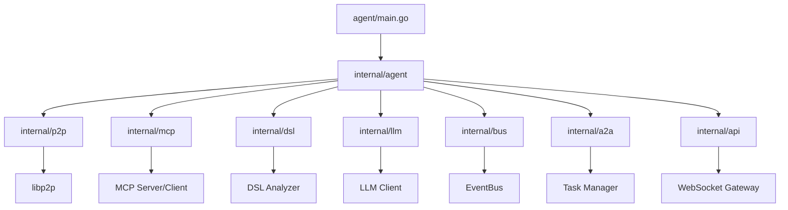
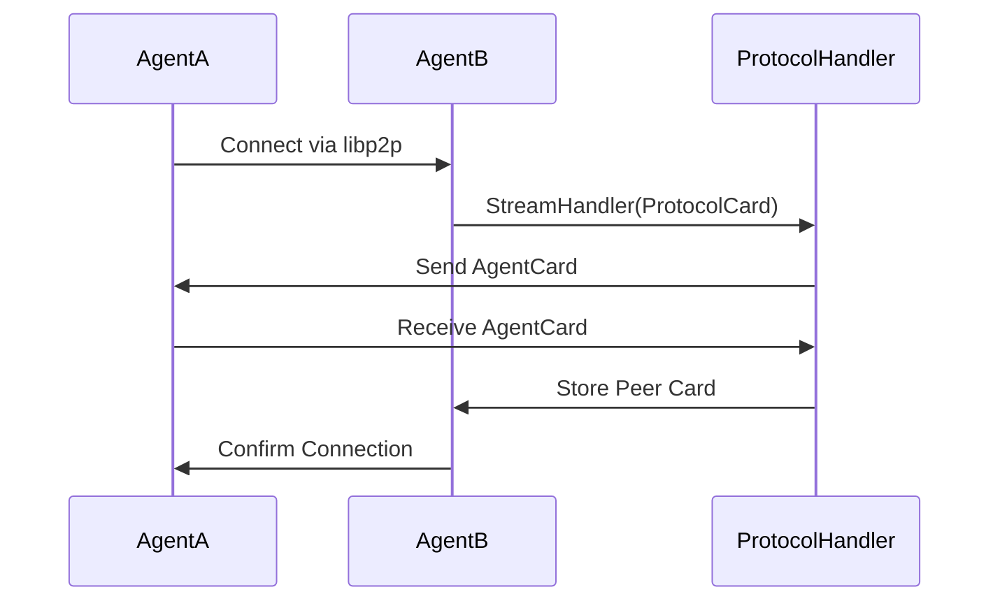
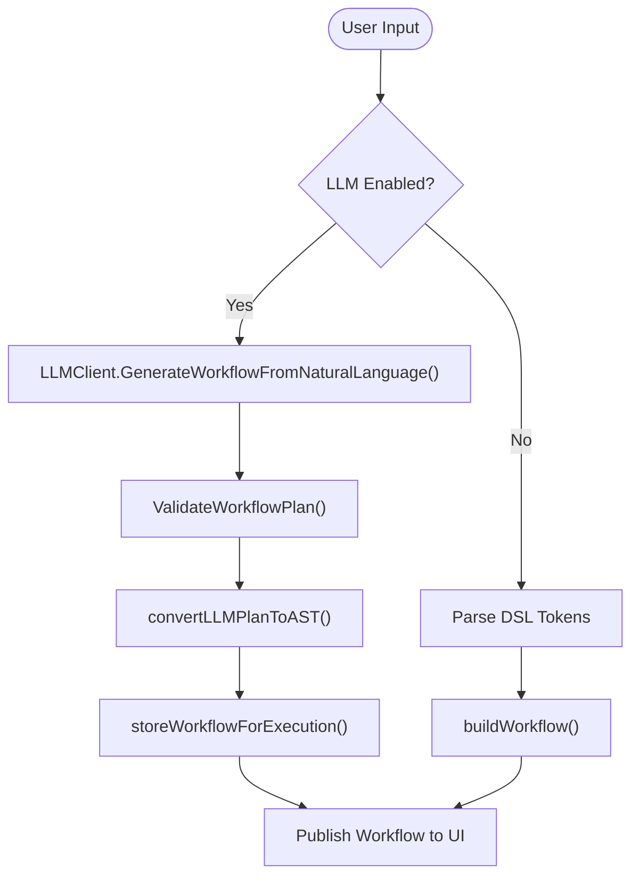
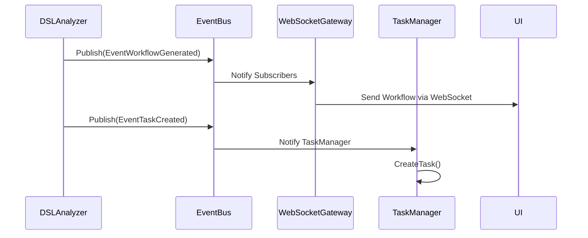
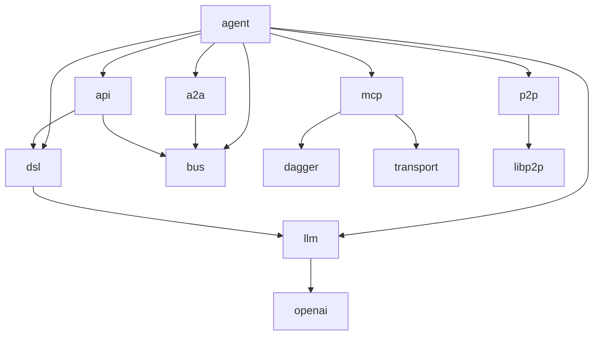

# Architecture Overview


## Table of Contents
1. [Introduction](#introduction)
2. [Project Structure](#project-structure)
3. [Core Components](#core-components)
4. [Architecture Overview](#architecture-overview)
5. [Detailed Component Analysis](#detailed-component-analysis)
6. [Dependency Analysis](#dependency-analysis)
7. [Performance Considerations](#performance-considerations)
8. [Troubleshooting Guide](#troubleshooting-guide)
9. [Conclusion](#conclusion)

## Introduction
The PraxisAgent system is a microservices-based, event-driven distributed agent platform designed for decentralized collaboration and intelligent task orchestration. Built in Go for high concurrency and reliability, it leverages libp2p for peer-to-peer networking, enabling agents to autonomously discover, communicate, and execute tasks across a decentralized network. The architecture integrates a DSL analyzer for natural language processing, an EventBus for internal event propagation, and supports dynamic tool sharing via the Model Context Protocol (MCP). This document provides a comprehensive overview of its architecture, component interactions, design patterns, and scalability mechanisms.

## Project Structure
The project follows a modular, layer-based organization with clear separation of concerns. Core functionality is encapsulated in the `internal` directory, while configuration, examples, and shared utilities are maintained separately.



**Diagram sources**
- [main.go](file://agent/main.go)
- [agent.go](file://internal/agent/agent.go)

**Section sources**
- [agent.go](file://internal/agent/agent.go#L100-L500)

## Core Components
The PraxisAgent system is composed of several core components that enable decentralized agent collaboration, intelligent task orchestration, and secure execution.

- **P2P Networking Layer**: Built on libp2p, it enables agent discovery, secure communication, and card exchange.
- **MCP Server/Client**: Facilitates tool sharing and invocation across agents using the Model Context Protocol.
- **DSL Analyzer**: Processes natural language input and converts it into executable workflows.
- **EventBus**: Coordinates internal communication through event publishing and subscription.
- **Task Manager**: Manages the lifecycle of agent-to-agent (A2A) tasks.
- **Execution Engines**: Support secure, isolated execution via Dagger and remote MCP tools.

**Section sources**
- [agent.go](file://internal/agent/agent.go#L100-L500)
- [task_manager.go](file://internal/a2a/task_manager.go#L0-L199)
- [client.go](file://internal/llm/client.go#L0-L199)

## Architecture Overview
The PraxisAgent system follows a microservices-based, event-driven architecture where agents operate as independent nodes in a decentralized network. Each agent runs multiple internal services that communicate via an EventBus, enabling loose coupling and asynchronous processing.

```mermaid
graph TB
subgraph "Agent Node"
P2P[P2P Networking]
MCP[MCP Server]
DSL[DSL Analyzer]
LLM[LLM Client]
EventBus[EventBus]
TaskManager[Task Manager]
API[WebSocket Gateway]
Execution[Dagger/Remote Engines]
P2P < --> MCP
MCP < --> Execution
DSL --> LLM
LLM --> EventBus
EventBus --> TaskManager
EventBus --> API
TaskManager --> Execution
API --> DSL
end
P2P <- --> P2P[Other Agents]
LLM --> OpenAI[OpenAI API]
Execution --> Docker[Docker Engine]
```

**Diagram sources**
- [agent.go](file://internal/agent/agent.go#L100-L500)
- [client.go](file://internal/llm/client.go#L0-L199)
- [remote_engine.go](file://internal/mcp/remote_engine.go#L0-L52)

## Detailed Component Analysis

### P2P Networking Layer
The P2P layer uses libp2p to establish a decentralized network of agents. It handles peer discovery, secure communication, and capability exchange via agent cards.



**Diagram sources**
- [protocol.go](file://internal/p2p/protocol.go#L0-L199)
- [agent.go](file://internal/agent/agent.go#L100-L200)

**Section sources**
- [protocol.go](file://internal/p2p/protocol.go#L0-L199)

### MCP Server and Client
The MCP (Model Context Protocol) subsystem enables agents to expose and consume tools. The server registers tools and resources, while the client discovers and invokes them across the network.

```mermaid
classDiagram
class MCPServer {
+AddTool(tool Tool, handler ToolHandlerFunc)
+AddResource(resource Resource, handler ResourceHandlerFunc)
+StartSSE(port string)
}
class RemoteMCPEngine {
-transportManager TransportManager
+Execute(contract ToolContract, args map[string]interface{}) string
}
class TransportManager {
+RegisterSSEEndpoint(name, address string)
+CallRemoteTool(ctx context.Context, clientName, toolName string, args map[string]interface{}) (*mcpTypes.PartialResponse, error)
}
MCPServer --> TransportManager : uses
RemoteMCPEngine --> TransportManager : uses
```

**Diagram sources**
- [remote_engine.go](file://internal/mcp/remote_engine.go#L0-L52)
- [execution.go](file://internal/contracts/execution.go#L0-L15)

**Section sources**
- [remote_engine.go](file://internal/mcp/remote_engine.go#L0-L52)

### DSL Analyzer and Orchestrator
The DSL analyzer interprets natural language input and generates executable workflows. When LLM integration is enabled, it uses an LLM to dynamically plan and orchestrate multi-agent workflows.



**Diagram sources**
- [orchestrator.go](file://internal/dsl/orchestrator.go#L0-L199)
- [client.go](file://internal/llm/client.go#L0-L199)

**Section sources**
- [orchestrator.go](file://internal/dsl/orchestrator.go#L0-L199)

### EventBus and Internal Communication
The EventBus enables event-driven communication between components. It supports event publishing and subscription, allowing decoupled interaction across the agent.



**Diagram sources**
- [websocket_gateway.go](file://internal/api/websocket_gateway.go#L0-L199)
- [task_manager.go](file://internal/a2a/task_manager.go#L0-L199)

**Section sources**
- [websocket_gateway.go](file://internal/api/websocket_gateway.go#L0-L199)

## Dependency Analysis
The system exhibits a well-defined dependency graph with clear boundaries between components. Core dependencies include:



**Diagram sources**
- [go.mod](file://go.mod)
- [agent.go](file://internal/agent/agent.go#L100-L500)

**Section sources**
- [go.mod](file://go.mod)
- [agent.go](file://internal/agent/agent.go#L100-L500)

## Performance Considerations
The architecture is designed for high concurrency and scalability:
- **Go Routines**: Used extensively for non-blocking I/O and parallel task execution.
- **Lazy Initialization**: Dagger engine is initialized on first use to avoid startup failures.
- **Caching**: LLM responses and network context are cached to reduce latency.
- **Event Batching**: EventBus supports batched event processing to reduce overhead.
- **Connection Pooling**: MCP transport manager reuses SSE connections for remote tool calls.

## Troubleshooting Guide
Common issues and their resolutions:

**Section sources**
- [agent.go](file://internal/agent/agent.go#L100-L500)
- [task_manager.go](file://internal/a2a/task_manager.go#L0-L199)
- [client.go](file://internal/llm/client.go#L0-L199)

### LLM Client Not Enabled
**Symptom**: "LLM client not enabled" in logs.  
**Cause**: `OPENAI_API_KEY` environment variable not set.  
**Fix**: Set the API key: `export OPENAI_API_KEY=your_key_here`.

### Dagger Engine Initialization Failure
**Symptom**: "Failed to initialize Dagger Engine" error.  
**Cause**: Docker daemon not running or inaccessible.  
**Fix**: Ensure Docker is installed and running: `sudo systemctl start docker`.

### P2P Connection Issues
**Symptom**: Agents fail to discover each other.  
**Cause**: Firewall blocking P2P ports or NAT traversal issues.  
**Fix**: Open ports 9000-9010 or configure libp2p relay.

### MCP Tool Not Found
**Symptom**: "Unknown engine 'dagger'" warning.  
**Cause**: Tool engine not registered in config.  
**Fix**: Verify `engine` field in `configs/agent.yaml` is correct.

## Conclusion
The PraxisAgent system presents a robust, scalable architecture for decentralized agent collaboration. By combining libp2p for P2P networking, MCP for tool sharing, and LLM-powered orchestration, it enables intelligent, autonomous agent networks. The use of Go ensures high performance and concurrency, while the event-driven design promotes loose coupling and extensibility. Future enhancements could include enhanced fault tolerance, encrypted payload support, and dynamic load balancing across agents.

**Referenced Files in This Document**   
- [agent.go](file://internal/agent/agent.go#L100-L500)
- [task_manager.go](file://internal/a2a/task_manager.go#L0-L199)
- [client.go](file://internal/llm/client.go#L0-L199)
- [protocol.go](file://internal/p2p/protocol.go#L0-L199)
- [remote_engine.go](file://internal/mcp/remote_engine.go#L0-L52)
- [execution.go](file://internal/contracts/execution.go#L0-L15)
- [websocket_gateway.go](file://internal/api/websocket_gateway.go#L0-L199)
- [orchestrator.go](file://internal/dsl/orchestrator.go#L0-L199)