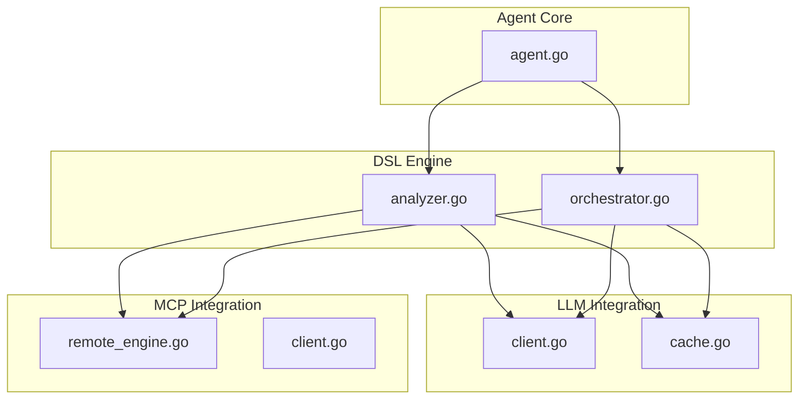
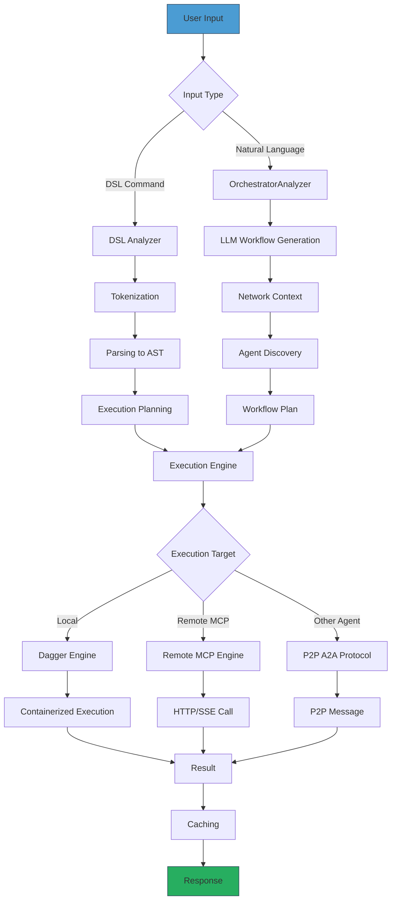
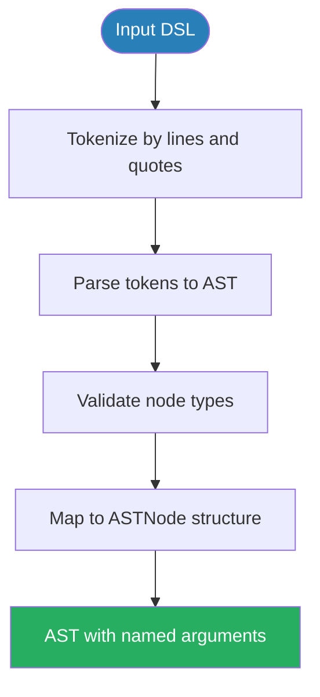
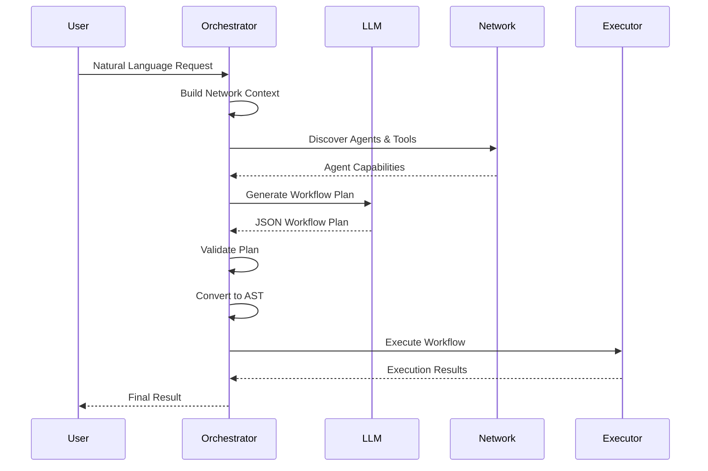
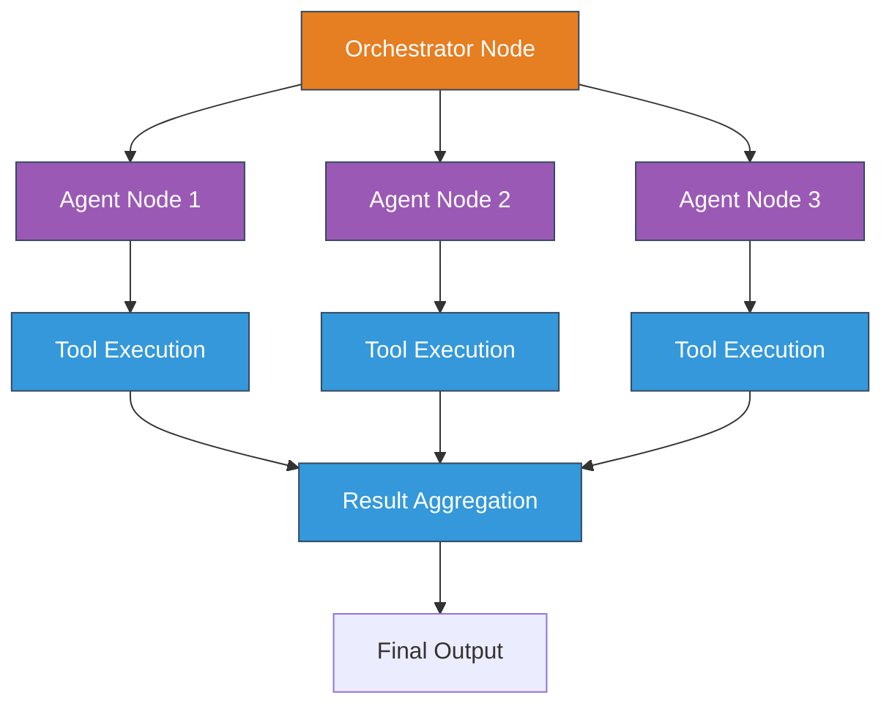
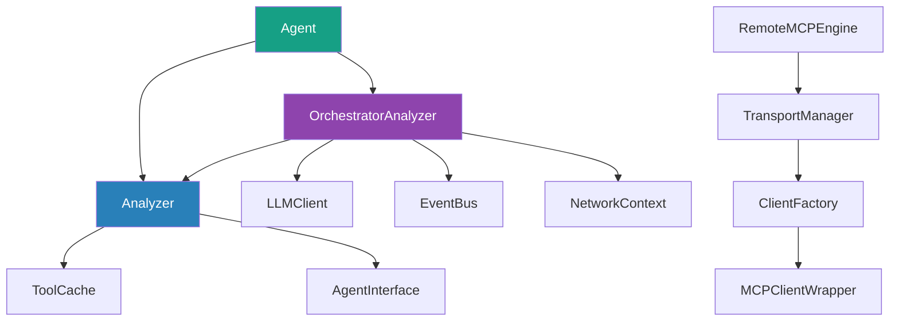
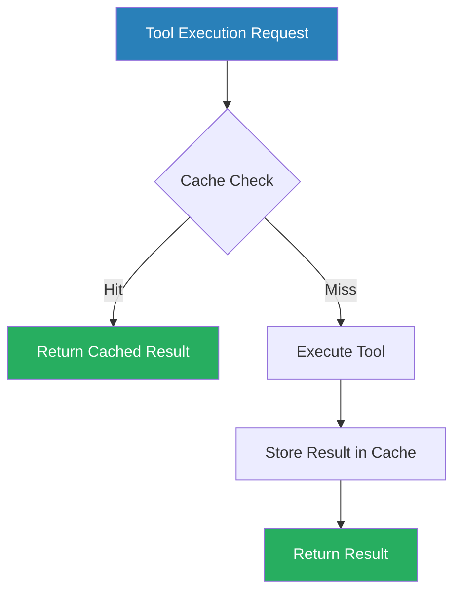
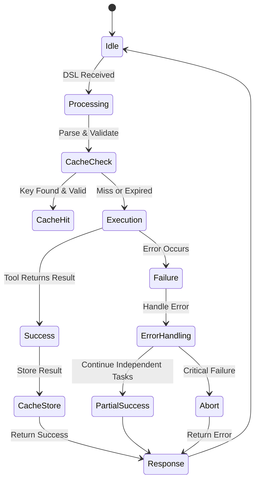

# DSL Processing Engine

## Table of Contents
1. [Introduction](#introduction)
2. [Project Structure](#project-structure)
3. [Core Components](#core-components)
4. [Architecture Overview](#architecture-overview)
5. [Detailed Component Analysis](#detailed-component-analysis)
6. [Dependency Analysis](#dependency-analysis)
7. [Performance Considerations](#performance-considerations)
8. [Troubleshooting Guide](#troubleshooting-guide)
9. [Conclusion](#conclusion)

## Introduction
The DSL Processing Engine is a core component of the Praxis Agent framework, responsible for transforming natural language commands into executable workflows. It enables agents to interpret user requests, orchestrate distributed execution across local and remote tools, and manage complex multi-step operations. The engine supports both direct DSL syntax and natural language processing through LLM integration, providing flexibility in how users interact with the agent network. This document details the parsing pipeline, semantic analysis, execution planning, and error handling mechanisms that make the DSL engine robust and scalable.

## Project Structure
The DSL processing engine is organized within the `internal/dsl` directory, with supporting components in `internal/llm`, `internal/mcp`, and `internal/agent`. The structure follows a modular design where parsing, analysis, orchestration, and execution are separated into distinct components that can be extended independently.

**Diagram sources**
- [internal/dsl/analyzer.go](file://internal/dsl/analyzer.go)
- [internal/dsl/orchestrator.go](file://internal/dsl/orchestrator.go)
- [internal/llm/client.go](file://internal/llm/client.go)
- [internal/llm/cache.go](file://internal/llm/cache.go)
- [internal/mcp/remote_engine.go](file://internal/mcp/remote_engine.go)
- [internal/mcp/client.go](file://internal/mcp/client.go)
- [internal/agent/agent.go](file://internal/agent/agent.go)

**Section sources**
- [internal/dsl/analyzer.go](file://internal/dsl/analyzer.go)
- [internal/dsl/orchestrator.go](file://internal/dsl/orchestrator.go)

## Core Components
The DSL Processing Engine consists of two primary components: the **Analyzer** and the **OrchestratorAnalyzer**. The Analyzer handles traditional DSL parsing and execution, while the OrchestratorAnalyzer extends this with LLM-powered workflow planning and intelligent agent selection. Both components implement semantic validation, dependency analysis, and execution coordination. The engine integrates with local tools via Dagger, remote services via MCP, and other agents via P2P A2A protocol, enabling a unified interface for heterogeneous execution environments.

**Section sources**
- [internal/dsl/analyzer.go](file://internal/dsl/analyzer.go#L1-L545)
- [internal/dsl/orchestrator.go](file://internal/dsl/orchestrator.go#L1-L1172)

## Architecture Overview
The DSL engine follows a layered architecture where user input flows through a parsing pipeline, semantic analysis, orchestration planning, and execution phases. The system supports both direct DSL commands and natural language requests, with the LLM client providing intelligent workflow generation when enabled. Execution is coordinated through a pluggable engine system that routes tasks to appropriate execution backends based on tool availability and requirements.

**Diagram sources**
- [internal/dsl/analyzer.go](file://internal/dsl/analyzer.go)
- [internal/dsl/orchestrator.go](file://internal/dsl/orchestrator.go)
- [internal/llm/client.go](file://internal/llm/client.go)
- [internal/mcp/remote_engine.go](file://internal/mcp/remote_engine.go)
- [internal/agent/agent.go](file://internal/agent/agent.go)

## Detailed Component Analysis

### DSL Analyzer
The DSL Analyzer is responsible for converting DSL commands into executable ASTs. It follows a three-stage pipeline: tokenization, parsing, and execution. The analyzer supports a simple command syntax with `CALL` statements that specify tool names and parameters. Parameters can be specified as positional arguments or named flags using `--key value` syntax.

#### Tokenization and Parsing
The analyzer first tokenizes the input by splitting on newlines and parsing quoted strings to preserve spaces within arguments. Each line is converted into a Token with a command type and arguments. The parser then converts these tokens into an Abstract Syntax Tree (AST) where each node represents a command with named arguments.

**Diagram sources**
- [internal/dsl/analyzer.go](file://internal/dsl/analyzer.go#L100-L200)

**Section sources**
- [internal/dsl/analyzer.go](file://internal/dsl/analyzer.go#L100-L250)

### Orchestrator Analyzer
The OrchestratorAnalyzer extends the base Analyzer with intelligent workflow planning capabilities powered by LLM integration. When LLM is enabled, it bypasses traditional DSL parsing and instead uses natural language understanding to generate optimized workflows that leverage the distributed agent network.

#### Workflow Planning Process
The orchestrator follows a multi-step planning process that begins with network context gathering, followed by LLM-based workflow generation, validation, and execution planning. It dynamically discovers available agents and their capabilities, then selects the most appropriate execution targets for each task.

**Diagram sources**
- [internal/dsl/orchestrator.go](file://internal/dsl/orchestrator.go#L50-L150)

**Section sources**
- [internal/dsl/orchestrator.go](file://internal/dsl/orchestrator.go#L50-L200)

### Execution Planning and Workflow Resolution
The OrchestratorAnalyzer performs sophisticated execution planning by analyzing task dependencies, identifying parallelization opportunities, and optimizing agent selection. It builds a directed acyclic graph (DAG) of workflow nodes that represents both data and control dependencies between tasks.

#### Dependency Analysis
The system analyzes the generated workflow plan to identify independent tasks that can be executed in parallel. It constructs a dependency graph where edges represent prerequisites, enabling efficient scheduling of operations. The orchestrator also identifies critical paths that determine overall workflow duration.

**Diagram sources**
- [internal/dsl/orchestrator.go](file://internal/dsl/orchestrator.go#L200-L300)

**Section sources**
- [internal/dsl/orchestrator.go](file://internal/dsl/orchestrator.go#L200-L350)

## Dependency Analysis
The DSL engine has a well-defined dependency structure that enables modular extension while maintaining separation of concerns. The core Analyzer depends on the LLM package for caching, while the OrchestratorAnalyzer has additional dependencies on the LLM client for natural language processing and the P2P package for agent discovery.

**Diagram sources**
- [internal/dsl/analyzer.go](file://internal/dsl/analyzer.go)
- [internal/dsl/orchestrator.go](file://internal/dsl/orchestrator.go)
- [internal/llm/cache.go](file://internal/llm/cache.go)
- [internal/llm/client.go](file://internal/llm/client.go)
- [internal/mcp/remote_engine.go](file://internal/mcp/remote_engine.go)
- [internal/mcp/client.go](file://internal/mcp/client.go)
- [internal/agent/agent.go](file://internal/agent/agent.go)

**Section sources**
- [internal/dsl/analyzer.go](file://internal/dsl/analyzer.go)
- [internal/dsl/orchestrator.go](file://internal/dsl/orchestrator.go)
- [internal/llm/cache.go](file://internal/llm/cache.go)
- [internal/llm/client.go](file://internal/llm/client.go)
- [internal/mcp/remote_engine.go](file://internal/mcp/remote_engine.go)
- [internal/mcp/client.go](file://internal/mcp/client.go)

## Performance Considerations
The DSL engine incorporates several performance optimizations to ensure efficient execution of workflows, particularly for frequently used command patterns. The most significant optimization is the implementation of a time-based LRU cache for tool execution results.

### Caching Mechanism
The ToolCache component provides transparent caching of tool execution results, reducing redundant operations and improving response times. The cache uses a combination of tool name and serialized arguments to generate unique keys, with a default TTL of 5 minutes and a maximum size of 1000 entries.

**Diagram sources**
- [internal/llm/cache.go](file://internal/llm/cache.go#L1-L127)

**Section sources**
- [internal/llm/cache.go](file://internal/llm/cache.go#L1-L127)

The cache eviction strategy uses a simple least-recently-used (LRU) algorithm, where the oldest accessed entries are removed when the cache reaches its maximum size. This ensures that frequently accessed results remain available while preventing unbounded memory growth.

## Troubleshooting Guide
The DSL engine includes comprehensive error handling and recovery mechanisms to ensure robust operation in distributed environments. When a step fails, the system provides detailed error information and attempts to continue with independent tasks when possible.

### Error Recovery Mechanisms
The engine handles failures at multiple levels:
- **Tool-level errors**: Individual tool failures are isolated and reported without aborting the entire workflow
- **Network errors**: Remote calls have timeouts and retry logic
- **Validation errors**: Invalid workflows are rejected before execution begins
- **Caching errors**: Cache failures degrade gracefully to direct execution

**Diagram sources**
- [internal/dsl/analyzer.go](file://internal/dsl/analyzer.go#L300-L500)
- [internal/dsl/orchestrator.go](file://internal/dsl/orchestrator.go#L500-L700)

**Section sources**
- [internal/dsl/analyzer.go](file://internal/dsl/analyzer.go#L300-L500)
- [internal/dsl/orchestrator.go](file://internal/dsl/orchestrator.go#L500-L700)

### Transactional Rollback Strategies
While the current implementation does not support full transactional rollback, it provides mechanisms for managing state consistency:
- **Idempotent operations**: Tools are designed to be idempotent where possible
- **Progress tracking**: The event bus publishes progress updates that can be used to resume workflows
- **Result isolation**: Each tool execution is isolated, preventing cascading failures

For critical operations, the system should implement application-level compensation actions rather than relying on automatic rollback.

## Conclusion
The DSL Processing Engine provides a powerful framework for converting natural language commands into executable workflows across distributed agents. Its modular architecture separates parsing, analysis, and execution concerns, enabling flexible extension and integration with various execution backends. The integration of LLM-powered orchestration allows for intelligent workflow planning that optimizes agent selection and task scheduling. With built-in caching, error handling, and performance optimizations, the engine delivers responsive and reliable execution of complex workflows. Future enhancements could include support for transactional rollback, more sophisticated dependency analysis, and enhanced visualization of workflow execution.

**Referenced Files in This Document**
- [internal/dsl/analyzer.go](file://internal/dsl/analyzer.go)
- [internal/dsl/orchestrator.go](file://internal/dsl/orchestrator.go)
- [internal/llm/cache.go](file://internal/llm/cache.go)
- [internal/llm/client.go](file://internal/llm/client.go)
- [internal/mcp/remote_engine.go](file://internal/mcp/remote_engine.go)
- [internal/mcp/client.go](file://internal/mcp/client.go)
- [internal/agent/agent.go](file://internal/agent/agent.go)
