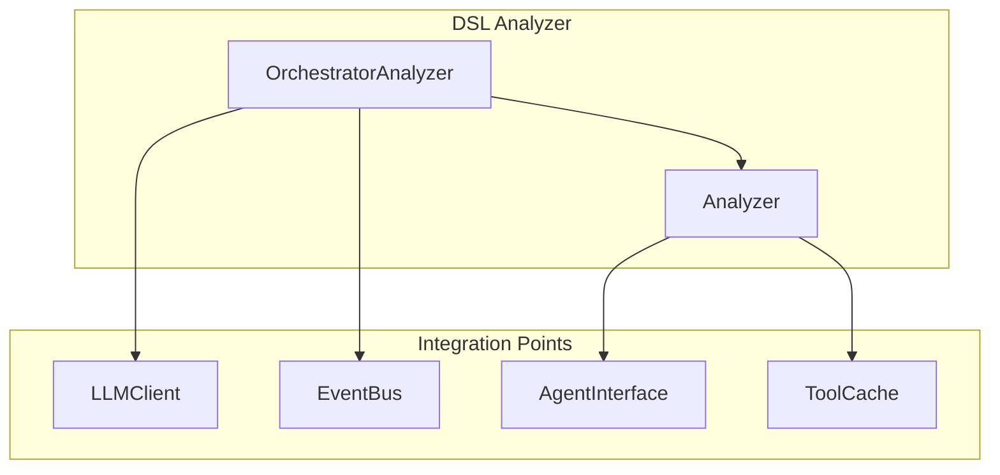
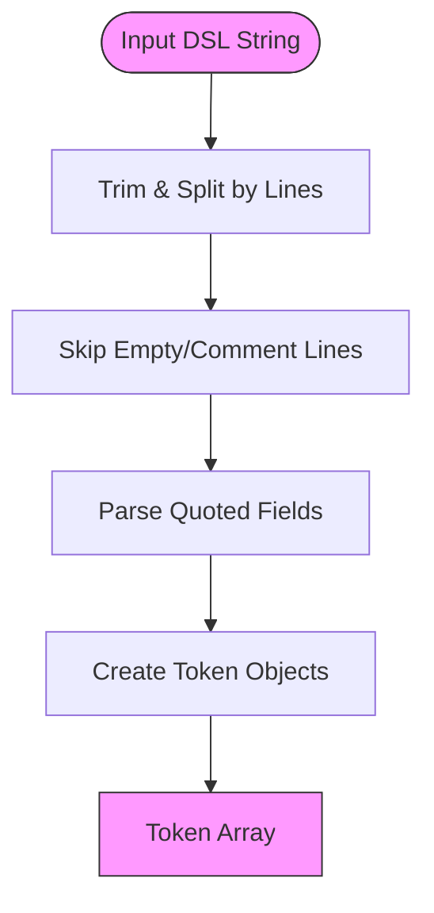
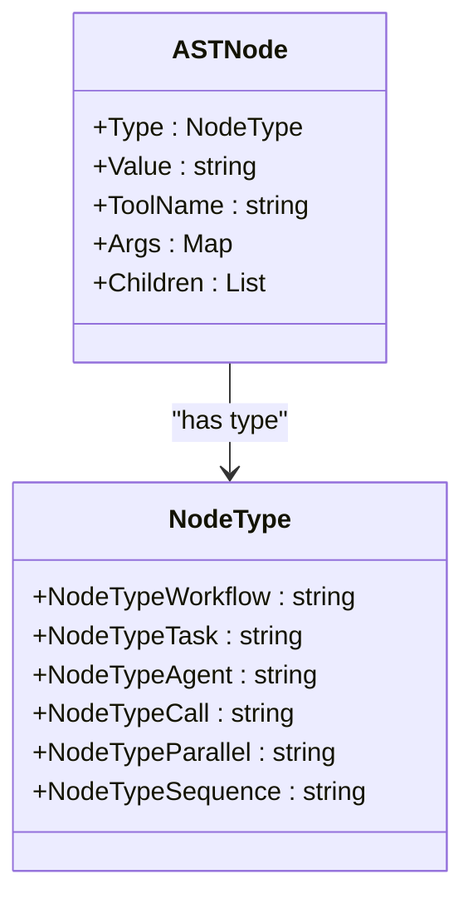
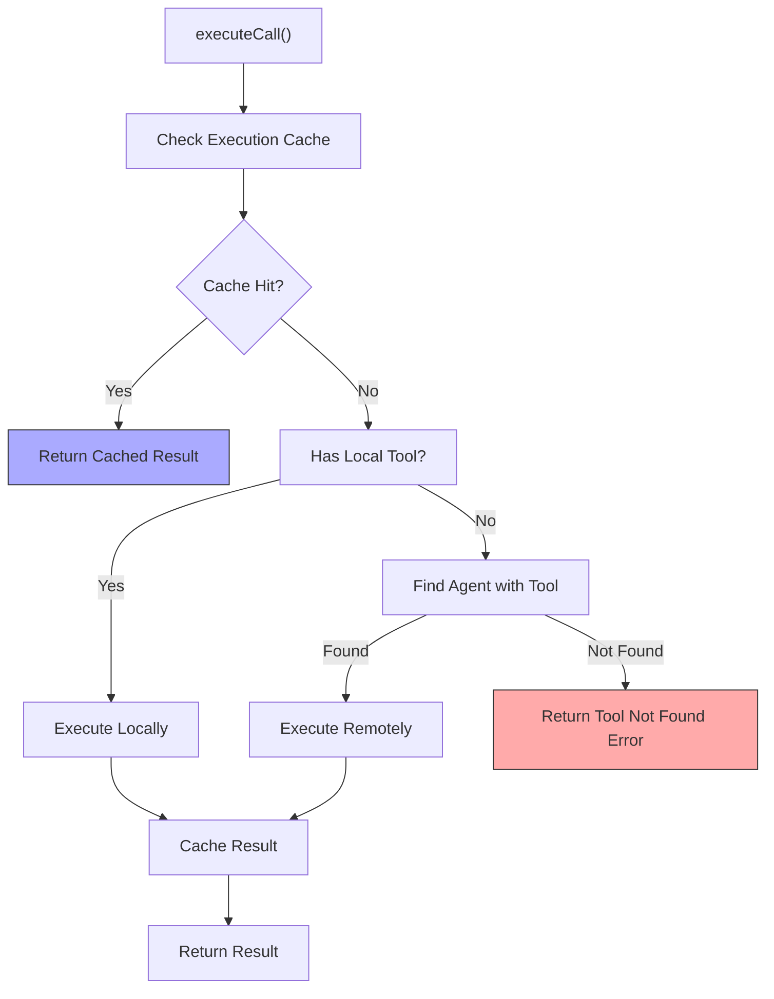
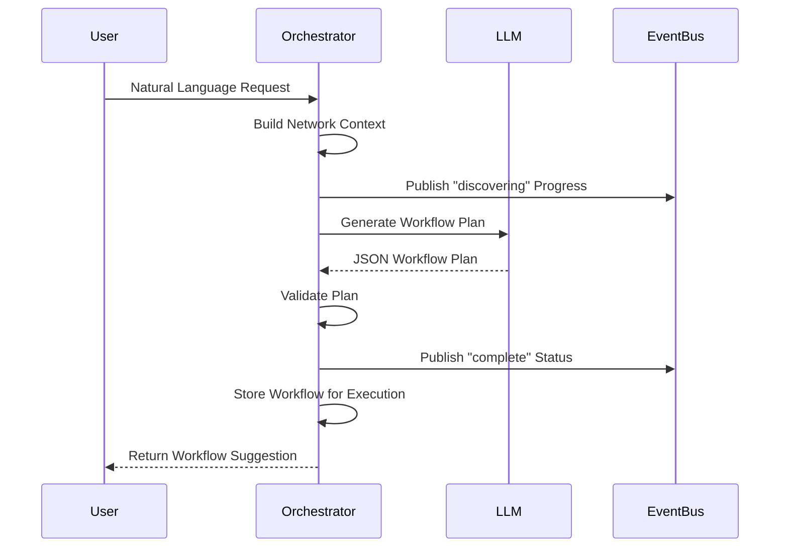
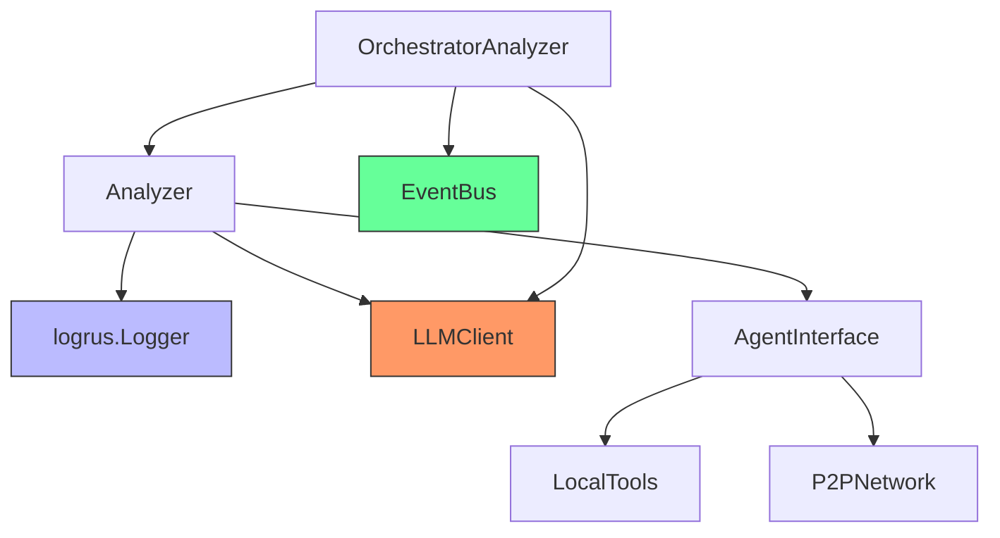

# DSL Analyzer


## Table of Contents
1. [Introduction](#introduction)
2. [Project Structure](#project-structure)
3. [Core Components](#core-components)
4. [Architecture Overview](#architecture-overview)
5. [Detailed Component Analysis](#detailed-component-analysis)
6. [Dependency Analysis](#dependency-analysis)
7. [Performance Considerations](#performance-considerations)
8. [Troubleshooting Guide](#troubleshooting-guide)
9. [Conclusion](#conclusion)

## Introduction
The DSL Analyzer is a core component responsible for interpreting Domain-Specific Language (DSL) commands, transforming them into executable workflows. It parses natural language or structured commands into Abstract Syntax Trees (ASTs), validates semantic correctness, resolves tool execution targets (local, remote, or agent-to-agent), and executes the resulting workflow. The analyzer supports both traditional DSL syntax and AI-driven orchestration via LLM integration, enabling intelligent agent selection and dynamic workflow planning.

## Project Structure
The DSL Analyzer resides in the `internal/dsl` directory and consists of two primary files: `analyzer.go` and `orchestrator.go`. The analyzer provides core parsing and execution logic, while the orchestrator extends this functionality with LLM-based workflow generation and event publishing capabilities. It integrates with other system components such as the LLM client, P2P network, and event bus for distributed execution and real-time feedback.



**Diagram sources**
- [analyzer.go](file://internal/dsl/analyzer.go#L1-L545)
- [orchestrator.go](file://internal/dsl/orchestrator.go#L1-L1172)

**Section sources**
- [analyzer.go](file://internal/dsl/analyzer.go#L1-L545)
- [orchestrator.go](file://internal/dsl/orchestrator.go#L1-L1172)

## Core Components
The DSL Analyzer's core functionality revolves around parsing, analyzing, and executing DSL commands. It converts input strings into tokens, constructs ASTs, validates tool availability, and routes execution to appropriate agents. The system supports both direct command execution and AI-driven orchestration, with caching to optimize repeated operations.

**Section sources**
- [analyzer.go](file://internal/dsl/analyzer.go#L50-L452)
- [orchestrator.go](file://internal/dsl/orchestrator.go#L100-L200)

## Architecture Overview
The DSL Analyzer follows a modular architecture with clear separation between parsing, analysis, and execution layers. It uses an AgentInterface abstraction to interact with local and remote tools, enabling flexible deployment across P2P networks. When LLM integration is enabled, the orchestrator delegates workflow planning to an AI model that selects optimal agents based on capability metadata.

```mermaid
graph TD
User[User Command] --> Parser[Tokenization & Parsing]
Parser --> AST[Abstract Syntax Tree]
AST --> Validator[Semantic Validation]
Validator --> Resolver[Tool Resolution]
Resolver --> Executor[Execution Engine]
subgraph "Execution Targets"
Local[Local Tools]
Remote[P2P Agents]
A2A[Agent-to-Agent]
end
Executor --> Local
Executor --> Remote
Executor --> A2A
LLM[LLM Orchestration] --> Planner[Workflow Planning]
Planner --> AST
EventBus[Event Bus] <- --> Orchestrator[OrchestratorAnalyzer]
style LLM fill:#f9f,stroke:#333
style EventBus fill:#bbf,stroke:#333
```

**Diagram sources**
- [analyzer.go](file://internal/dsl/analyzer.go#L76-L249)
- [orchestrator.go](file://internal/dsl/orchestrator.go#L100-L150)

## Detailed Component Analysis

### DSL Parsing and AST Construction
The analyzer converts DSL commands into structured ASTs through a multi-stage process: tokenization, argument parsing, and node construction. It handles quoted strings, escaped characters, and key-value arguments with robust error handling.

#### Tokenization Process


**Diagram sources**
- [analyzer.go](file://internal/dsl/analyzer.go#L76-L97)
- [analyzer.go](file://internal/dsl/analyzer.go#L100-L159)

#### AST Node Types
The analyzer supports multiple node types for different workflow constructs:



**Diagram sources**
- [analyzer.go](file://internal/dsl/analyzer.go#L525-L531)
- [analyzer.go](file://internal/dsl/analyzer.go#L533-L540)

**Section sources**
- [analyzer.go](file://internal/dsl/analyzer.go#L161-L249)

### Semantic Validation and Tool Resolution
The analyzer validates commands by checking tool availability and parameter correctness. It resolves execution targets by querying the AgentInterface to determine whether tools are available locally or on remote peers.

#### Tool Resolution Flow


**Diagram sources**
- [analyzer.go](file://internal/dsl/analyzer.go#L354-L452)

**Section sources**
- [analyzer.go](file://internal/dsl/analyzer.go#L354-L452)

### LLM-Driven Orchestration
When enabled, the OrchestratorAnalyzer uses an LLM to generate workflow plans from natural language input. It builds network context from agent capabilities and validates generated plans before execution.

#### LLM Orchestration Sequence


**Diagram sources**
- [orchestrator.go](file://internal/dsl/orchestrator.go#L100-L150)
- [client.go](file://internal/llm/client.go#L100-L150)

**Section sources**
- [orchestrator.go](file://internal/dsl/orchestrator.go#L100-L200)

### Example: AST Construction for Sample Commands
The following examples demonstrate how DSL commands are transformed into AST nodes:

**Command:** `CALL read_file "config.json"`
```json
{
  "Type": "call",
  "Value": "CALL",
  "ToolName": "read_file",
  "Args": {
    "filename": "config.json"
  }
}
```

**Command:** `CALL write_file report.txt --content "Hello World" --format json`
```json
{
  "Type": "call",
  "Value": "CALL",
  "ToolName": "write_file",
  "Args": {
    "filename": "report.txt",
    "content": "Hello World",
    "format": "json"
  }
}
```

**Section sources**
- [analyzer.go](file://internal/dsl/analyzer.go#L161-L249)

## Dependency Analysis
The DSL Analyzer depends on several key components to provide its functionality. These dependencies enable logging, caching, LLM integration, and P2P communication.



**Diagram sources**
- [analyzer.go](file://internal/dsl/analyzer.go#L1-L50)
- [orchestrator.go](file://internal/dsl/orchestrator.go#L1-L50)

**Section sources**
- [analyzer.go](file://internal/dsl/analyzer.go#L1-L50)
- [orchestrator.go](file://internal/dsl/orchestrator.go#L1-L50)

## Performance Considerations
The DSL Analyzer incorporates several performance optimizations:

- **Caching**: Tool execution results are cached for 5 minutes with a maximum of 1000 entries to avoid redundant operations.
- **Parallel Execution**: The `PARALLEL` node type allows concurrent execution of independent tasks.
- **Efficient Parsing**: The tokenizer processes input in a single pass with O(n) complexity.
- **LLM Optimization**: Network context is minimized and cached to reduce LLM prompt size and cost.

The system balances responsiveness with thorough validation, using context cancellation to prevent hanging operations during execution.

## Troubleshooting Guide
Common issues and their solutions:

- **Empty DSL Query**: Ensure input is not blank or commented out.
- **Unknown Tool**: Verify the tool is registered with the agent or available on the network.
- **Parameter Mismatch**: Check that required parameters are provided with correct types.
- **LLM Integration Failure**: Ensure OPENAI_API_KEY is set in environment variables.
- **Cache Misses**: Monitor cache hit rate using GetCacheStats(); consider increasing cache size for repetitive workloads.

Error messages include detailed context about failed operations, and the system gracefully degrades to simulation mode when agent integration is unavailable.

**Section sources**
- [analyzer.go](file://internal/dsl/analyzer.go#L354-L452)
- [orchestrator.go](file://internal/dsl/orchestrator.go#L500-L550)

## Conclusion
The DSL Analyzer provides a robust foundation for executing domain-specific commands in a distributed agent network. Its dual-mode operation—supporting both traditional DSL parsing and AI-driven orchestration—makes it adaptable to various use cases. The component's modular design, comprehensive error handling, and performance optimizations ensure reliable operation in production environments. Future enhancements could include more sophisticated caching strategies, enhanced LLM plan validation, and improved error recovery mechanisms.

**Referenced Files in This Document**
- [analyzer.go](file://internal/dsl/analyzer.go)
- [orchestrator.go](file://internal/dsl/orchestrator.go)
- [client.go](file://internal/llm/client.go)
