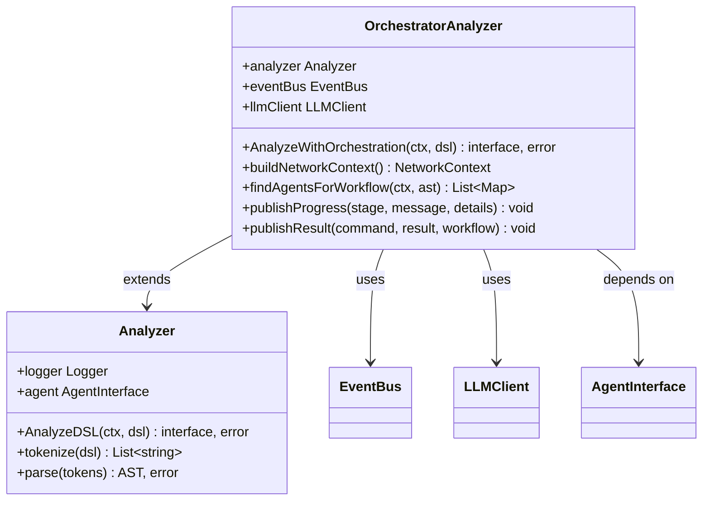
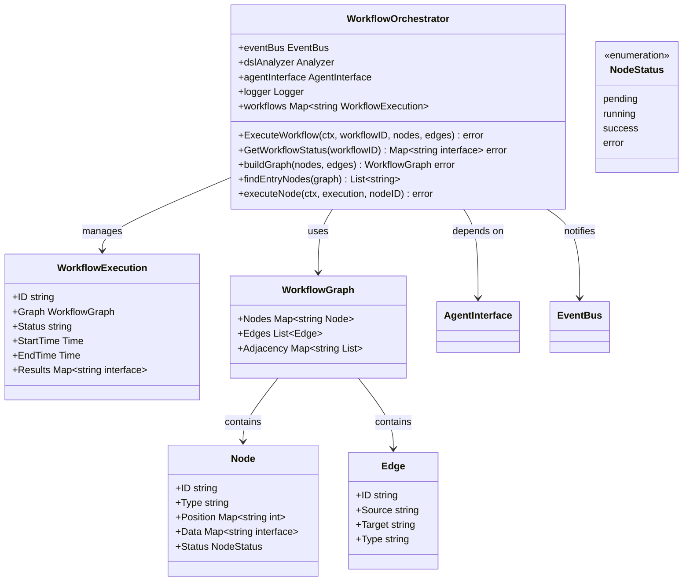
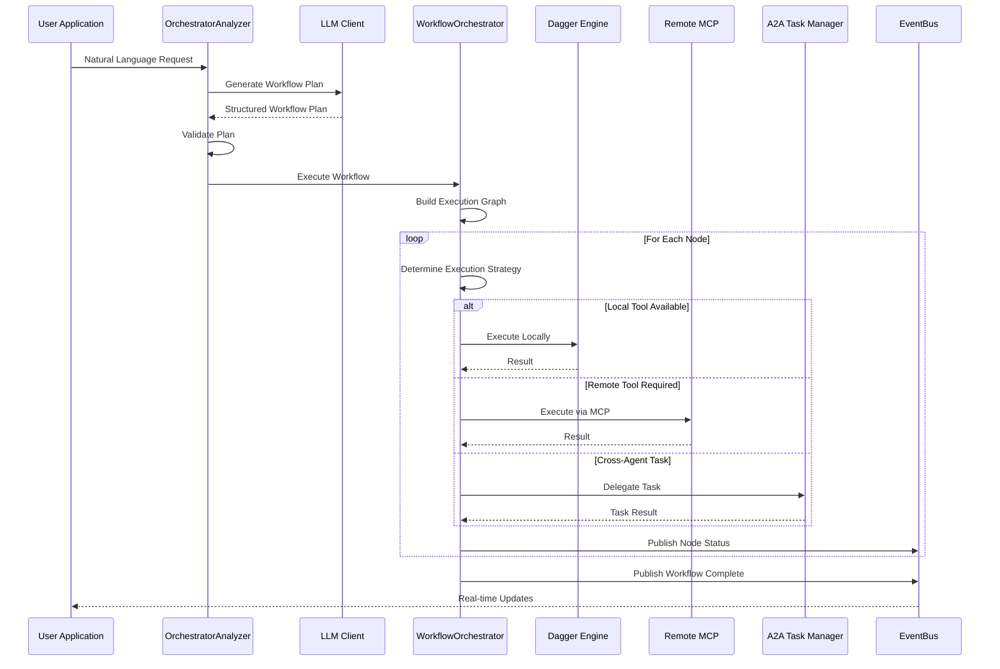

# DSL Orchestrator

## Table of Contents
1. [Introduction](#introduction)
2. [Project Structure](#project-structure)
3. [Core Components](#core-components)
4. [Architecture Overview](#architecture-overview)
5. [Detailed Component Analysis](#detailed-component-analysis)
6. [Dependency Analysis](#dependency-analysis)
7. [Performance Considerations](#performance-considerations)
8. [Troubleshooting Guide](#troubleshooting-guide)
9. [Conclusion](#conclusion)

## Introduction
The DSL Orchestrator is a central component in the Praxis Go SDK that transforms validated Abstract Syntax Trees (ASTs) into executable workflows. It enables intelligent orchestration of complex multi-agent workflows by leveraging AI-driven planning, dependency resolution, and dynamic execution strategies. The orchestrator integrates with local execution engines (Dagger), remote MCP tools, and A2A task delegation to coordinate distributed agent interactions based on resource availability and capabilities. This document provides a comprehensive analysis of the orchestrator's architecture, execution lifecycle, integration points, and optimization strategies.

## Project Structure
The project follows a modular Go application structure with clear separation of concerns. Core orchestrator functionality resides in the `internal/dsl` and `internal/workflow` packages, while supporting components are organized into dedicated modules for agents, execution engines, event handling, and communication protocols.

**Diagram sources**
- [agent.go](file://internal/agent/agent.go#L0-L1563)
- [orchestrator.go](file://internal/dsl/orchestrator.go#L0-L1172)
- [workflow_orchestrator.go](file://internal/workflow/workflow_orchestrator.go#L0-L517)

**Section sources**
- [agent.go](file://internal/agent/agent.go#L0-L1563)
- [orchestrator.go](file://internal/dsl/orchestrator.go#L0-L1172)

## Core Components
The DSL Orchestrator comprises several key components that work together to transform natural language requests into executable workflows. The `OrchestratorAnalyzer` extends the base `Analyzer` with AI-powered planning capabilities, while the `WorkflowOrchestrator` manages the execution of complex workflows with proper state tracking and error handling. The system integrates with the `EventBus` for real-time status updates and uses the `LLMClient` for intelligent agent and tool selection.

**Section sources**
- [orchestrator.go](file://internal/dsl/orchestrator.go#L0-L1172)
- [workflow_orchestrator.go](file://internal/workflow/workflow_orchestrator.go#L0-L517)

## Architecture Overview
The DSL Orchestrator implements a layered architecture that separates workflow planning from execution. The system uses AI-driven analysis to convert natural language into executable workflows, then coordinates their execution across multiple agents and execution engines.

**Diagram sources**
- [orchestrator.go](file://internal/dsl/orchestrator.go#L0-L1172)
- [workflow_orchestrator.go](file://internal/workflow/workflow_orchestrator.go#L0-L517)
- [event_bus.go](file://internal/bus/event_bus.go#L0-L188)

## Detailed Component Analysis

### OrchestratorAnalyzer Analysis
The `OrchestratorAnalyzer` is responsible for transforming natural language requests into executable workflow plans using AI-driven analysis. It leverages the LLM client to generate workflow plans based on network context and available agent capabilities.

#### For Object-Oriented Components:

**Diagram sources**
- [orchestrator.go](file://internal/dsl/orchestrator.go#L0-L1172)

**Section sources**
- [orchestrator.go](file://internal/dsl/orchestrator.go#L0-L1172)

### WorkflowOrchestrator Analysis
The `WorkflowOrchestrator` manages the execution of complex workflows by coordinating node execution, tracking state, and handling dependencies. It implements a graph-based execution model with support for parallel and sequential execution patterns.

#### For Object-Oriented Components:

**Diagram sources**
- [workflow_orchestrator.go](file://internal/workflow/workflow_orchestrator.go#L0-L517)

**Section sources**
- [workflow_orchestrator.go](file://internal/workflow/workflow_orchestrator.go#L0-L517)

### Execution Engine Integration
The orchestrator coordinates between multiple execution engines based on resource availability and agent capabilities. It supports local execution via Dagger, remote execution via MCP, and cross-agent delegation via A2A protocols.

#### For API/Service Components:

**Diagram sources**
- [orchestrator.go](file://internal/dsl/orchestrator.go#L0-L1172)
- [workflow_orchestrator.go](file://internal/workflow/workflow_orchestrator.go#L0-L517)
- [engine.go](file://internal/dagger/engine.go#L0-L184)
- [client.go](file://internal/mcp/client.go#L0-L292)

**Section sources**
- [orchestrator.go](file://internal/dsl/orchestrator.go#L0-L1172)
- [workflow_orchestrator.go](file://internal/workflow/workflow_orchestrator.go#L0-L517)

### Workflow Execution Lifecycle
The orchestrator manages the complete lifecycle of workflow execution from initialization to completion, with comprehensive state tracking and error handling.

#### For Complex Logic Components:

**Diagram sources**
- [orchestrator.go](file://internal/dsl/orchestrator.go#L0-L1172)
- [workflow_orchestrator.go](file://internal/workflow/workflow_orchestrator.go#L0-L517)

**Section sources**
- [orchestrator.go](file://internal/dsl/orchestrator.go#L0-L1172)
- [workflow_orchestrator.go](file://internal/workflow/workflow_orchestrator.go#L0-L517)

## Dependency Analysis
The DSL Orchestrator has a well-defined dependency structure that enables modular integration with various execution engines and communication protocols. The system uses dependency injection to maintain loose coupling between components.

**Diagram sources**
- [orchestrator.go](file://internal/dsl/orchestrator.go#L0-L1172)
- [workflow_orchestrator.go](file://internal/workflow/workflow_orchestrator.go#L0-L517)
- [event_bus.go](file://internal/bus/event_bus.go#L0-L188)
- [agent.go](file://internal/agent/agent.go#L0-L1563)

**Section sources**
- [orchestrator.go](file://internal/dsl/orchestrator.go#L0-L1172)
- [workflow_orchestrator.go](file://internal/workflow/workflow_orchestrator.go#L0-L517)

## Performance Considerations
The orchestrator implements several performance optimizations to ensure efficient workflow execution:

- **Step Batching**: Multiple independent nodes are executed in parallel to maximize throughput
- **Resource Pooling**: Execution engines maintain persistent connections to reduce initialization overhead
- **Timeout Management**: Configurable timeouts prevent hanging operations from blocking workflow progress
- **Caching**: Results are cached to avoid redundant computation for identical operations
- **Lazy Initialization**: Execution engines are initialized on first use to reduce startup time

The system also implements backpressure mechanisms through the EventBus's bounded channel to prevent overwhelming downstream components during high-load scenarios.

## Troubleshooting Guide
Common issues and their solutions when working with the DSL Orchestrator:

**Section sources**
- [orchestrator.go](file://internal/dsl/orchestrator.go#L0-L1172)
- [workflow_orchestrator.go](file://internal/workflow/workflow_orchestrator.go#L0-L517)
- [event_bus.go](file://internal/bus/event_bus.go#L0-L188)

### Workflow Not Starting
- **Symptom**: Workflow remains in "pending" state
- **Cause**: No entry nodes detected in the workflow graph
- **Solution**: Ensure at least one node has no incoming edges, or verify the graph structure

### Node Execution Failures
- **Symptom**: Individual nodes fail with execution errors
- **Cause**: Tool not available, invalid parameters, or execution engine issues
- **Solution**: Check agent capabilities, validate input parameters, and verify execution engine status

### Event Bus Overload
- **Symptom**: Event channel full warnings in logs
- **Cause**: High event volume overwhelming the EventBus
- **Solution**: Increase event channel buffer size or optimize event publishing frequency

### LLM Planning Failures
- **Symptom**: "LLM analysis failed" errors
- **Cause**: LLM service unavailable or invalid network context
- **Solution**: Verify LLM service connectivity and check peer discovery status

## Conclusion
The DSL Orchestrator provides a robust framework for transforming natural language requests into executable workflows across distributed agent networks. By leveraging AI-driven planning, the system intelligently selects appropriate agents and tools based on capabilities and availability. The modular architecture enables seamless integration with various execution engines and communication protocols, while the EventBus provides real-time visibility into workflow execution. Future enhancements could include more sophisticated error recovery mechanisms, enhanced parallelization strategies, and improved resource optimization algorithms.

**Referenced Files in This Document**
- [agent.go](file://internal/agent/agent.go#L0-L1563)
- [orchestrator.go](file://internal/dsl/orchestrator.go#L0-L1172)
- [workflow_orchestrator.go](file://internal/workflow/workflow_orchestrator.go#L0-L517)
- [event_bus.go](file://internal/bus/event_bus.go#L0-L188)
- [engine.go](file://internal/dagger/engine.go#L0-L184)
- [client.go](file://internal/mcp/client.go#L0-L292)
