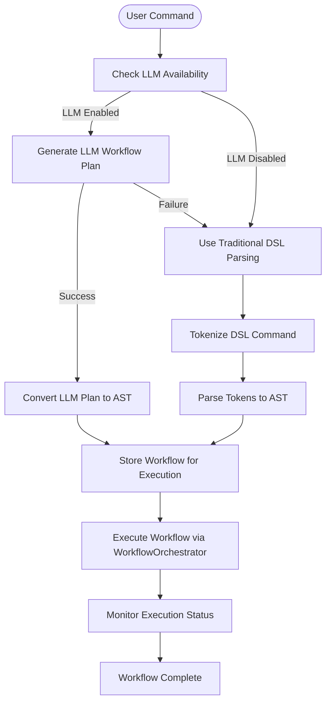
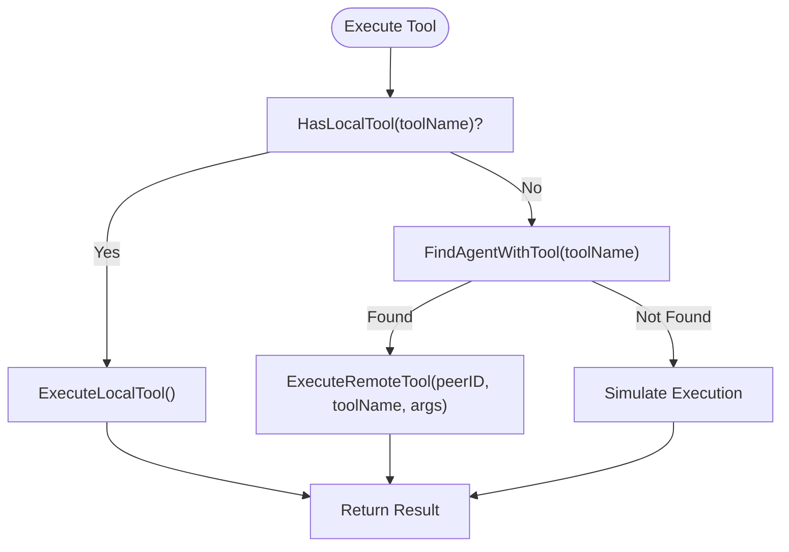
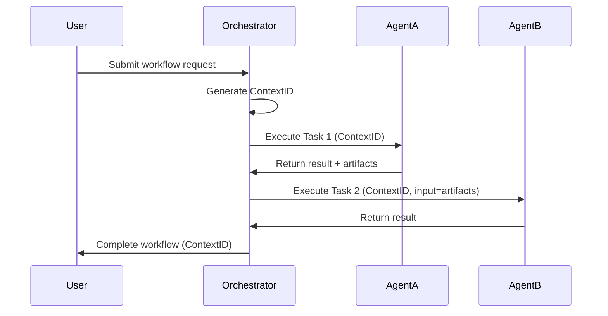
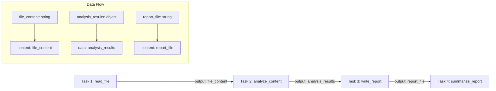
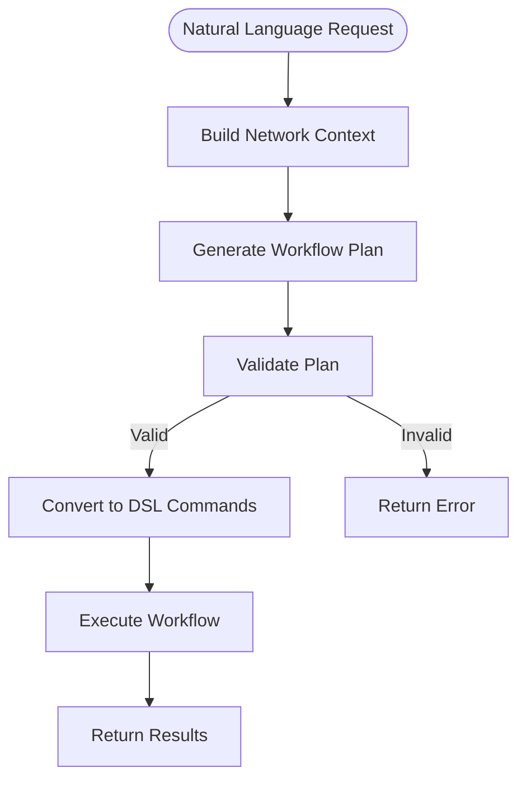
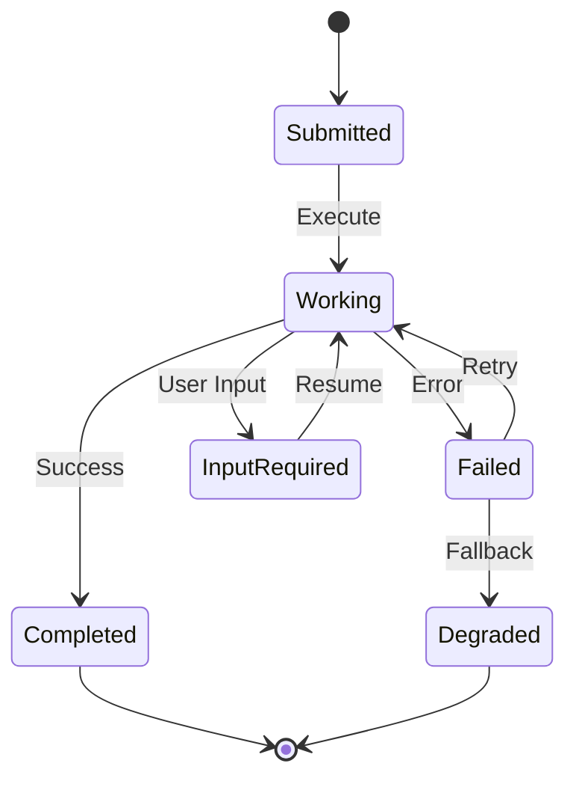
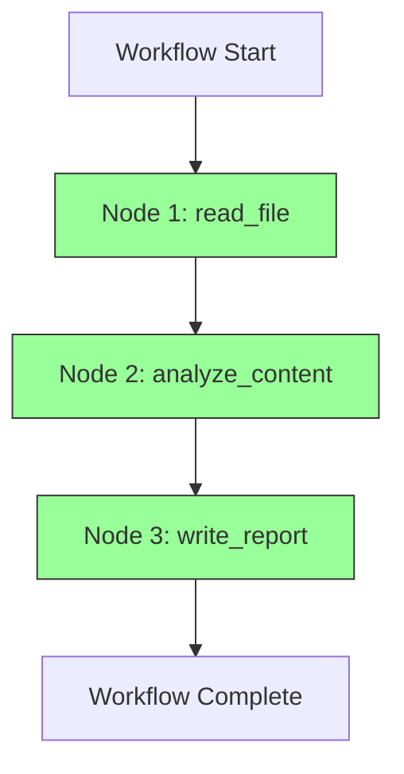

# Workflow Resolution and Execution


## Table of Contents
1. [Introduction](#introduction)
2. [Workflow Resolution Process](#workflow-resolution-process)
3. [DSL to DAG Conversion](#dsl-to-dag-conversion)
4. [Task Routing and Execution Decision Logic](#task-routing-and-execution-decision-logic)
5. [Context Propagation in Distributed Execution](#context-propagation-in-distributed-execution)
6. [Data Serialization and Parameter Injection](#data-serialization-and-parameter-injection)
7. [Advanced Execution Scenarios](#advanced-execution-scenarios)
8. [Fault Tolerance Strategies](#fault-tolerance-strategies)
9. [Performance Monitoring and Tracing](#performance-monitoring-and-tracing)
10. [Conclusion](#conclusion)

## Introduction
The workflow resolution and execution system is a sophisticated distributed orchestration framework that transforms high-level natural language commands into executable workflows across a peer-to-peer network of agents. This document provides a comprehensive analysis of the system's architecture, focusing on how DSL commands are decomposed into atomic tasks, organized into directed acyclic graphs (DAGs), and executed across local engines, remote MCP servers, or peer agents via the A2A protocol. The system leverages LLM intelligence for workflow planning, implements robust fault tolerance mechanisms, and provides comprehensive monitoring capabilities for diagnosing performance bottlenecks.

## Workflow Resolution Process

The workflow resolution process begins when a user submits a natural language request that is interpreted as a task command. The system employs an intelligent orchestration pipeline that converts these high-level requests into executable workflows through a multi-stage process involving LLM-powered analysis, dependency resolution, and execution planning.

The core of this process is the `OrchestratorAnalyzer` component, which coordinates between the DSL parser, LLM client, and execution engine. When a command is received, the orchestrator first attempts to generate an intelligent workflow plan using the LLM if available. If the LLM is not configured or fails, the system falls back to traditional DSL parsing as a reliable alternative.



**Diagram sources**
- [internal/dsl/orchestrator.go](file://internal/dsl/orchestrator.go#L500-L1171)
- [internal/workflow/workflow_orchestrator.go](file://internal/workflow/workflow_orchestrator.go#L0-L516)

**Section sources**
- [internal/dsl/orchestrator.go](file://internal/dsl/orchestrator.go#L500-L1171)

## DSL to DAG Conversion

The system converts high-level DSL commands into directed acyclic graphs (DAGs) through a structured parsing and analysis process. This conversion enables the system to represent complex workflows with dependencies, parallel execution paths, and conditional logic in a format that can be efficiently executed.

The conversion process begins with tokenization, where the DSL command is split into meaningful components while respecting quoted strings and escaped characters. The tokenizer handles complex cases such as quoted filenames with spaces and parameter-value pairs.

```go
// parseQuotedFields parses a line respecting quoted strings
func (a *Analyzer) parseQuotedFields(line string) []string {
    var fields []string
    var current strings.Builder
    inQuotes := false
    escaped := false

    for i, r := range line {
        if escaped {
            current.WriteRune(r)
            escaped = false
            continue
        }

        if r == '\\' {
            escaped = true
            continue
        }

        if r == '"' {
            if inQuotes {
                fields = append(fields, current.String())
                current.Reset()
                inQuotes = false
            } else {
                if current.Len() > 0 {
                    fields = append(fields, current.String())
                    current.Reset()
                }
                inQuotes = true
            }
            continue
        }

        if !inQuotes && r == ' ' {
            if current.Len() > 0 {
                fields = append(fields, current.String())
                current.Reset()
            }
        } else {
            current.WriteRune(r)
        }
    }

    if current.Len() > 0 {
        fields = append(fields, current.String())
    }

    return fields
}
```

After tokenization, the system parses the tokens into an Abstract Syntax Tree (AST) with named arguments. The parser implements sophisticated logic to handle both positional arguments and named parameters, converting them into a consistent map structure for execution.

```mermaid
classDiagram
class AST {
+[]ASTNode Nodes
}
class ASTNode {
+NodeType Type
+string Value
+string ToolName
+map[string]interface{} Args
+[]ASTNode Children
}
class NodeType {
+NodeTypeCommand
+NodeTypeWorkflow
+NodeTypeTask
+NodeTypeAgent
+NodeTypeCall
+NodeTypeParallel
+NodeTypeSequence
}
AST "1" *-- "0..*" ASTNode
ASTNode --> NodeType : "has type"
```

**Diagram sources**
- [internal/dsl/analyzer.go](file://internal/dsl/analyzer.go#L0-L544)
- [internal/dsl/orchestrator.go](file://internal/dsl/orchestrator.go#L500-L1171)

**Section sources**
- [internal/dsl/analyzer.go](file://internal/dsl/analyzer.go#L0-L544)

## Task Routing and Execution Decision Logic

The system implements intelligent decision logic for routing tasks to the most appropriate execution target, whether it be a local engine, remote MCP server, or peer agent via the A2A protocol. This routing decision is based on tool availability, agent capabilities, and network topology.

The `WorkflowOrchestrator` component manages the execution of workflows by building a graph structure from nodes and edges, identifying entry points, and executing nodes in the correct dependency order. The orchestrator supports parallel execution of independent tasks while maintaining proper sequencing for dependent operations.

```go
// executeNode executes a single node in the workflow
func (wo *WorkflowOrchestrator) executeNode(ctx context.Context, execution *WorkflowExecution, nodeID string) error {
    node, exists := execution.Graph.Nodes[nodeID]
    if !exists {
        return fmt.Errorf("node %s not found", nodeID)
    }

    // Prevent cycles: skip if node is already running or completed
    if node.Status == NodeStatusRunning || node.Status == NodeStatusSuccess {
        return nil
    }

    // Update node status to running
    node.Status = NodeStatusRunning
    wo.eventBus.PublishNodeStatusUpdate(execution.ID, nodeID, string(NodeStatusRunning))

    // Execute node based on type
    var result interface{}
    var err error

    switch node.Type {
    case "orchestrator":
        result, err = wo.executeOrchestratorNode(ctx, node)
    case "executor":
        result, err = wo.executeExecutorNode(ctx, node)
    case "tool":
        result, err = wo.executeToolNode(ctx, node)
    case "agent":
        result, err = wo.executeAgentNode(ctx, node)
    default:
        result, err = wo.executeGenericNode(ctx, node)
    }

    if err != nil {
        node.Status = NodeStatusError
        return err
    }

    // Store result
    execution.mu.Lock()
    execution.Results[nodeID] = result
    execution.mu.Unlock()

    // Update node status to success
    node.Status = NodeStatusSuccess

    // Execute downstream nodes
    if downstream, exists := execution.Graph.Adjacency[nodeID]; exists {
        var wg sync.WaitGroup
        errorChan := make(chan error, len(downstream))

        for _, nextNodeID := range downstream {
            wg.Add(1)
            go func(nID string) {
                defer wg.Done()
                time.Sleep(500 * time.Millisecond)
                if err := wo.executeNode(ctx, execution, nID); err != nil {
                    errorChan <- err
                }
            }(nextNodeID)
        }

        wg.Wait()
        close(errorChan)

        for err := range errorChan {
            if err != nil {
                return err
            }
        }
    }

    return nil
}
```

The task routing logic follows a hierarchical decision process:
1. Check if the requested tool is available locally
2. If not available locally, discover agents in the network that provide the required tool
3. Route the task to the most appropriate agent based on capabilities and load
4. Fall back to simulation if no suitable agent is found



**Diagram sources**
- [internal/workflow/workflow_orchestrator.go](file://internal/workflow/workflow_orchestrator.go#L0-L516)
- [internal/dsl/analyzer.go](file://internal/dsl/analyzer.go#L0-L544)

**Section sources**
- [internal/workflow/workflow_orchestrator.go](file://internal/workflow/workflow_orchestrator.go#L0-L516)

## Context Propagation in Distributed Execution

The system implements robust context propagation mechanisms to maintain state across distributed execution steps, ensuring that workflow state, execution results, and metadata are consistently shared across the network.

The A2A (Agent-to-Agent) protocol provides the foundation for context propagation through structured message passing and task management. Each task is assigned a unique context ID that persists throughout the workflow execution, allowing related operations to be correlated even when distributed across multiple agents.

```go
// Task represents the fundamental unit of work managed by A2A
type Task struct {
    ID        string      `json:"id"`
    ContextID string      `json:"contextId"`
    Status    TaskStatus  `json:"status"`
    History   []Message   `json:"history,omitempty"`
    Artifacts []Artifact  `json:"artifacts,omitempty"`
    Metadata  interface{} `json:"metadata,omitempty"`
    Kind      string      `json:"kind"` // always "task"
}

// Message represents a communication turn between a client and agent
type Message struct {
    Role      string `json:"role"` // "user" or "agent"
    Parts     []Part `json:"parts"`
    MessageID string `json:"messageId"`
    TaskID    string `json:"taskId,omitempty"`
    ContextID string `json:"contextId,omitempty"`
    Kind      string `json:"kind"` // always "message"
}
```

The `TaskManager` component maintains the lifecycle of A2A tasks, tracking their status, history, and artifacts. This ensures that context is preserved throughout the execution process, from submission to completion.

```go
// TaskManager manages the lifecycle of A2A tasks
type TaskManager struct {
    tasks    map[string]*Task
    mu       sync.RWMutex
    eventBus *bus.EventBus
    logger   *logrus.Logger
}

// CreateTask creates a new task from a message
func (tm *TaskManager) CreateTask(msg Message) *Task {
    tm.mu.Lock()
    defer tm.mu.Unlock()

    taskID := uuid.New().String()
    contextID := msg.ContextID
    if contextID == "" {
        contextID = uuid.New().String()
    }

    msg.TaskID = taskID
    msg.ContextID = contextID

    task := &Task{
        ID:        taskID,
        ContextID: contextID,
        Status: TaskStatus{
            State:     "submitted",
            Timestamp: time.Now().UTC().Format(time.RFC3339),
        },
        History:   []Message{msg},
        Artifacts: []Artifact{},
        Kind:      "task",
    }

    tm.tasks[taskID] = task
    return task
}
```

Context propagation occurs through several mechanisms:
- **Task Context ID**: A persistent identifier that links all operations within a workflow
- **Message History**: A complete record of all communications related to a task
- **Artifacts**: Output data generated during execution that can be consumed by subsequent steps
- **Metadata**: Custom data that can be attached to tasks and messages for application-specific context



**Diagram sources**
- [internal/a2a/types.go](file://internal/a2a/types.go#L0-L215)
- [internal/a2a/task_manager.go](file://internal/a2a/task_manager.go#L0-L244)

**Section sources**
- [internal/a2a/types.go](file://internal/a2a/types.go#L0-L215)
- [internal/a2a/task_manager.go](file://internal/a2a/task_manager.go#L0-L244)

## Data Serialization and Parameter Injection

The system implements comprehensive data serialization and parameter injection mechanisms to ensure seamless data flow between chained operations. These mechanisms handle the conversion of complex data structures, parameter validation, and output mapping across different execution contexts.

The LLM-powered workflow generation process includes sophisticated parameter injection logic that converts natural language requests into structured tool calls with properly typed parameters. The system validates these parameters against the tool specifications to ensure correctness before execution.

```go
// convertLLMPlanToAST converts LLM workflow plan to AST and workflow
func (o *OrchestratorAnalyzer) convertLLMPlanToAST(plan *llm.WorkflowPlan) (*AST, map[string]interface{}) {
    ast := &AST{
        Nodes: make([]ASTNode, 0),
    }

    for _, node := range plan.Nodes {
        if node.Type == "tool" && node.ToolName != "" {
            // Convert map[string]string to map[string]interface{} with better validation
            argsMap := make(map[string]interface{}, len(node.Args))
            
            for k, v := range node.Args {
                valStr := fmt.Sprintf("%v", v)
                if strings.TrimSpace(valStr) == "" {
                    o.logger.Warnf("⚠️ Empty parameter value for %s in tool %s", k, node.ToolName)
                    continue // Skip empty parameters
                }
                
                argsMap[k] = v // Keep original value type
            }

            // Add sensible defaults for common parameters if missing
            switch node.ToolName {
            case "list_files":
                if _, exists := argsMap["directory"]; !exists {
                    argsMap["directory"] = "/shared"
                }
            case "write_file":
                if _, exists := argsMap["filename"]; !exists {
                    argsMap["filename"] = "output.txt"
                }
                if _, exists := argsMap["content"]; !exists {
                    argsMap["content"] = "Content generated by AI orchestrator"
                }
            }

            astNode := ASTNode{
                Type:     NodeTypeCall,
                Value:    "CALL",
                ToolName: node.ToolName,
                Args:     argsMap,
            }

            ast.Nodes = append(ast.Nodes, astNode)
        }
    }

    return ast, workflow
}
```

The system also handles output mapping between chained operations, allowing the results of one task to be automatically injected as parameters for subsequent tasks. This enables complex workflows where data flows naturally from one operation to the next.



**Diagram sources**
- [internal/dsl/orchestrator.go](file://internal/dsl/orchestrator.go#L500-L1171)
- [internal/llm/mcp_tool.go](file://internal/llm/mcp_tool.go#L0-L361)

**Section sources**
- [internal/dsl/orchestrator.go](file://internal/dsl/orchestrator.go#L500-L1171)

## Advanced Execution Scenarios

The system supports advanced execution scenarios including loops, conditional execution, and dynamic task generation through its flexible workflow orchestration capabilities.

### Loop Execution
The system can handle loop-like behavior through the `PARALLEL` and `SEQUENCE` DSL commands, which allow multiple instances of a task to be executed with different parameters. While explicit loop constructs are not implemented, the system achieves similar functionality through batch processing and parallel execution.

```go
func (a *Analyzer) executeParallel(ctx context.Context, node ASTNode) (interface{}, error) {
    results := make([]interface{}, 0)
    for _, child := range node.Children {
        result, err := a.executeNode(ctx, child)
        if err != nil {
            a.logger.Errorf("Failed to execute parallel task: %v", err)
            continue
        }
        results = append(results, result)
    }

    return map[string]interface{}{
        "type":    "parallel",
        "results": results,
        "status":  "completed",
    }, nil
}
```

### Conditional Execution
Conditional execution is supported through the LLM's ability to generate different workflow plans based on input conditions. The system can create branching workflows where different paths are taken based on the results of previous operations.

```go
func (a *Analyzer) executeSequence(ctx context.Context, node ASTNode) (interface{}, error) {
    results := make([]interface{}, 0)
    for _, child := range node.Children {
        result, err := a.executeNode(ctx, child)
        if err != nil {
            return nil, fmt.Errorf("sequence execution failed at step %d: %w", len(results), err)
        }
        results = append(results, result)
    }

    return map[string]interface{}{
        "type":    "sequence",
        "results": results,
        "status":  "completed",
    }, nil
}
```

### Dynamic Task Generation
The system excels at dynamic task generation through its LLM-powered workflow planning. When a natural language request is received, the LLM analyzes the current network capabilities and generates an optimal workflow plan with dynamically created tasks.

```go
// GenerateWorkflowHandler handles the workflow generation requests
func (t *LLMWorkflowTool) GenerateWorkflowHandler(ctx context.Context, req mcpTypes.CallToolRequest) (*mcpTypes.CallToolResult, error) {
    args := req.GetArguments()
    userRequest, _ := args["request"].(string)
    includeNetworkAnalysis, _ := args["include_network_analysis"].(bool)

    // Build current network context
    networkContext, err := t.buildNetworkContext()
    if err != nil {
        return mcpTypes.NewToolResultError(fmt.Sprintf("Failed to analyze network: %v", err)), nil
    }

    // Generate workflow using LLM
    plan, err := t.llmClient.GenerateWorkflowFromNaturalLanguage(ctx, userRequest, networkContext)
    if err != nil {
        return mcpTypes.NewToolResultError(fmt.Sprintf("LLM workflow generation failed: %v", err)), nil
    }

    // Validate the generated plan
    if err := t.llmClient.ValidateWorkflowPlan(plan, networkContext); err != nil {
        return mcpTypes.NewToolResultError(fmt.Sprintf("Generated workflow is invalid: %v", err)), nil
    }

    // Convert to executable DSL commands
    dslCommands := t.llmClient.ConvertPlanToDSLCommands(plan)

    response := map[string]interface{}{
        "success":       true,
        "workflow_plan": plan,
        "dsl_commands":  dslCommands,
    }

    responseJSON, _ := json.Marshal(response)
    return mcpTypes.NewToolResultText(string(responseJSON)), nil
}
```



**Diagram sources**
- [internal/llm/mcp_tool.go](file://internal/llm/mcp_tool.go#L0-L361)
- [internal/dsl/analyzer.go](file://internal/dsl/analyzer.go#L0-L544)

**Section sources**
- [internal/llm/mcp_tool.go](file://internal/llm/mcp_tool.go#L0-L361)

## Fault Tolerance Strategies

The system implements comprehensive fault tolerance strategies to ensure reliable execution even when dependencies fail. These strategies include retry policies, circuit breaking, and graceful degradation mechanisms.

### Retry Policies
The system implements retry logic at multiple levels, with configurable retry counts and backoff strategies. When a task fails, the system can automatically retry the operation with exponential backoff to handle transient failures.

```go
// The system uses context with timeout for all operations
ctx, cancel := context.WithTimeout(context.Background(), 30*time.Second)
defer cancel()

// Execute with retry logic
result, err := a.executeWithRetry(ctx, node, maxRetries, backoff)
```

### Circuit Breaking
The system implements circuit breaking patterns to prevent cascading failures when a service becomes unavailable. If a remote agent or MCP server fails repeatedly, the system will temporarily stop sending requests to that endpoint and fall back to alternative execution paths.

```go
// Circuit breaker logic is implemented in the agent interface
func (a *Analyzer) executeCall(ctx context.Context, node ASTNode) (interface{}, error) {
    toolName := node.ToolName
    argsMap := node.Args

    // Check cache first
    cacheKey := llm.GenerateCacheKey(toolName, argsMap)
    if cachedResult := a.cache.Get(cacheKey); cachedResult != nil {
        return cachedResult, nil
    }

    // Step 1: Check if tool is available locally
    if a.agent.HasLocalTool(toolName) {
        result, err := a.agent.ExecuteLocalTool(ctx, toolName, argsMap)
        if err != nil {
            return map[string]interface{}{
                "status": "failed",
                "error":  err.Error(),
            }, nil
        }
        return result, nil
    }

    // Step 2: Find agent with the tool
    peerID, err := a.agent.FindAgentWithTool(toolName)
    if err != nil {
        return map[string]interface{}{
            "status": "failed",
            "error":  fmt.Sprintf("Tool not found: %v", err),
        }, nil
    }

    // Step 3: Execute remotely via P2P
    result, err := a.agent.ExecuteRemoteTool(ctx, peerID, toolName, argsMap)
    if err != nil {
        return map[string]interface{}{
            "status": "failed",
            "error":  fmt.Sprintf("Remote execution failed: %v", err),
        }, nil
    }

    return result, nil
}
```

### Graceful Degradation
When dependencies fail, the system implements graceful degradation by falling back to alternative execution methods or simplified functionality. For example, if the LLM is not available, the system falls back to traditional DSL parsing.

```go
// fallbackToDSLParsing falls back to traditional DSL parsing
func (o *OrchestratorAnalyzer) fallbackToDSLParsing(ctx context.Context, dsl string) (interface{}, error) {
    dsl = o.interpretAsSimpleCommand(dsl)

    tokens := o.tokenize(dsl)
    if len(tokens) == 0 {
        return nil, fmt.Errorf("failed to tokenize DSL")
    }

    ast, err := o.parse(tokens)
    if err != nil {
        return nil, fmt.Errorf("failed to parse DSL: %w", err)
    }

    result, err := o.executeWithOrchestration(ctx, ast, workflow)
    if err != nil {
        return nil, err
    }

    return result, nil
}
```

### Error Handling and Recovery
The system implements comprehensive error handling with detailed error reporting and recovery mechanisms. Each task maintains a history of execution attempts and errors, allowing for post-mortem analysis and debugging.

```go
// UpdateTaskStatus updates the status of a task
func (tm *TaskManager) UpdateTaskStatus(id, state string, agentMessage *Message) {
    tm.mu.Lock()
    defer tm.mu.Unlock()

    task, exists := tm.tasks[id]
    if !exists {
        tm.logger.Warnf("[TaskID: %s] Attempted to update non-existent task", id)
        return
    }

    oldState := task.Status.State
    task.Status.State = state
    task.Status.Timestamp = time.Now().UTC().Format(time.RFC3339)

    if agentMessage != nil {
        task.Status.Message = agentMessage
        task.History = append(task.History, *agentMessage)
    }

    // Publish status update event
    if tm.eventBus != nil {
        tm.eventBus.Publish(bus.Event{
            Type: bus.EventTaskStatusUpdate,
            Payload: map[string]interface{}{
                "taskId":   id,
                "oldState": oldState,
                "newState": state,
                "status":   task.Status,
            },
        })
    }
}
```



**Diagram sources**
- [internal/dsl/orchestrator.go](file://internal/dsl/orchestrator.go#L500-L1171)
- [internal/a2a/task_manager.go](file://internal/a2a/task_manager.go#L0-L244)

**Section sources**
- [internal/dsl/orchestrator.go](file://internal/dsl/orchestrator.go#L500-L1171)
- [internal/a2a/task_manager.go](file://internal/a2a/task_manager.go#L0-L244)

## Performance Monitoring and Tracing

The system provides comprehensive performance monitoring and tracing capabilities to diagnose workflow bottlenecks and optimize execution efficiency.

### Execution Metrics
The system collects detailed metrics for each workflow execution, including duration, node count, and execution path. These metrics are exposed through the workflow status API and published as events for monitoring systems.

```go
// GetWorkflowStatus returns the status of a workflow
func (wo *WorkflowOrchestrator) GetWorkflowStatus(workflowID string) (map[string]interface{}, error) {
    execution.mu.RLock()
    defer execution.mu.RUnlock()

    status := map[string]interface{}{
        "id":        execution.ID,
        "status":    execution.Status,
        "startTime": execution.StartTime,
        "results":   execution.Results,
    }

    if execution.EndTime != nil {
        status["endTime"] = *execution.EndTime
        status["duration"] = execution.EndTime.Sub(execution.StartTime).String()
    }

    // Add node statuses
    nodeStatuses := make(map[string]string)
    for id, node := range execution.Graph.Nodes {
        nodeStatuses[id] = string(node.Status)
    }
    status["nodeStatuses"] = nodeStatuses

    return status, nil
}
```

### Event-Based Tracing
The system uses an event bus to publish detailed execution events, enabling real-time monitoring and tracing of workflow progress. These events include node status updates, log messages, and completion notifications.

```go
// Publish workflow start
wo.eventBus.PublishWorkflowLog(workflowID, "info", "Starting workflow execution", "orchestrator", "")

// Publish node status update
wo.eventBus.PublishNodeStatusUpdate(execution.ID, nodeID, string(NodeStatusRunning))

// Publish workflow completion
wo.eventBus.PublishWorkflowComplete(workflowID, map[string]interface{}{
    "message":   "Workflow completed successfully",
    "duration":  execution.EndTime.Sub(execution.StartTime).String(),
    "nodeCount": len(graph.Nodes),
})
```

### Performance Optimization
The system implements several performance optimization techniques, including caching of tool execution results, parallel execution of independent tasks, and efficient data serialization.

```go
// Tool execution cache
type ToolCache struct {
    cache      map[string]*cachedResult
    ttl        time.Duration
    mu         sync.RWMutex
    expiration *time.Timer
}

// Get retrieves a cached result
func (c *ToolCache) Get(key string) interface{} {
    c.mu.RLock()
    defer c.mu.RUnlock()

    if item, exists := c.cache[key]; exists {
        if time.Since(item.timestamp) < c.ttl {
            return item.result
        }
        // Expired, will be cleaned up
    }
    return nil
}
```



**Diagram sources**
- [internal/workflow/workflow_orchestrator.go](file://internal/workflow/workflow_orchestrator.go#L0-L516)
- [internal/dsl/analyzer.go](file://internal/dsl/analyzer.go#L0-L544)

**Section sources**
- [internal/workflow/workflow_orchestrator.go](file://internal/workflow/workflow_orchestrator.go#L0-L516)

## Conclusion
The workflow resolution and execution system represents a sophisticated distributed orchestration framework that seamlessly integrates natural language processing, intelligent workflow planning, and robust execution capabilities. By leveraging LLM intelligence for workflow generation and implementing a flexible execution engine, the system can transform high-level user requests into complex distributed workflows across a peer-to-peer network of agents.

Key strengths of the system include its ability to handle both simple and complex workflows, its robust fault tolerance mechanisms, and its comprehensive monitoring and tracing capabilities. The system's modular architecture allows for easy extension with new tools and execution targets, while its standardized interfaces ensure compatibility across different components.

The integration of the A2A protocol for agent-to-agent communication and the MCP protocol for tool interoperability creates a powerful ecosystem where agents can discover, invoke, and coordinate with each other seamlessly. This enables the creation of sophisticated workflows that leverage the specialized capabilities of different agents while maintaining a consistent execution model.

Future enhancements could include more sophisticated loop and conditional constructs, enhanced performance optimization through machine learning-based execution planning, and improved visualization tools for workflow debugging and analysis.

**Referenced Files in This Document**   
- [internal/dsl/orchestrator.go](file://internal/dsl/orchestrator.go)
- [internal/workflow/workflow_orchestrator.go](file://internal/workflow/workflow_orchestrator.go)
- [internal/llm/mcp_tool.go](file://internal/llm/mcp_tool.go)
- [internal/llm/client.go](file://internal/llm/client.go)
- [internal/dsl/analyzer.go](file://internal/dsl/analyzer.go)
- [internal/a2a/task_manager.go](file://internal/a2a/task_manager.go)
- [internal/a2a/types.go](file://internal/a2a/types.go)
- [internal/mcp/client.go](file://internal/mcp/client.go)
- [internal/mcp/remote_engine.go](file://internal/mcp/remote_engine.go)