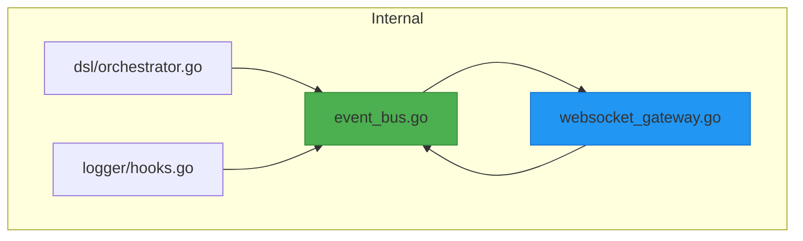
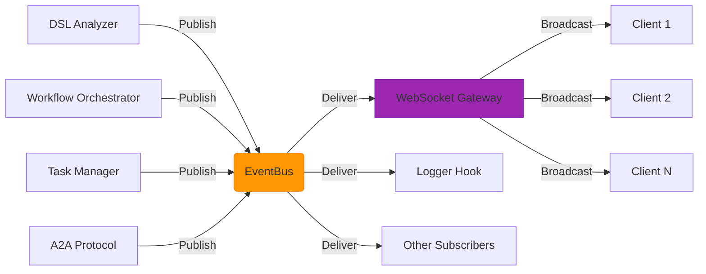
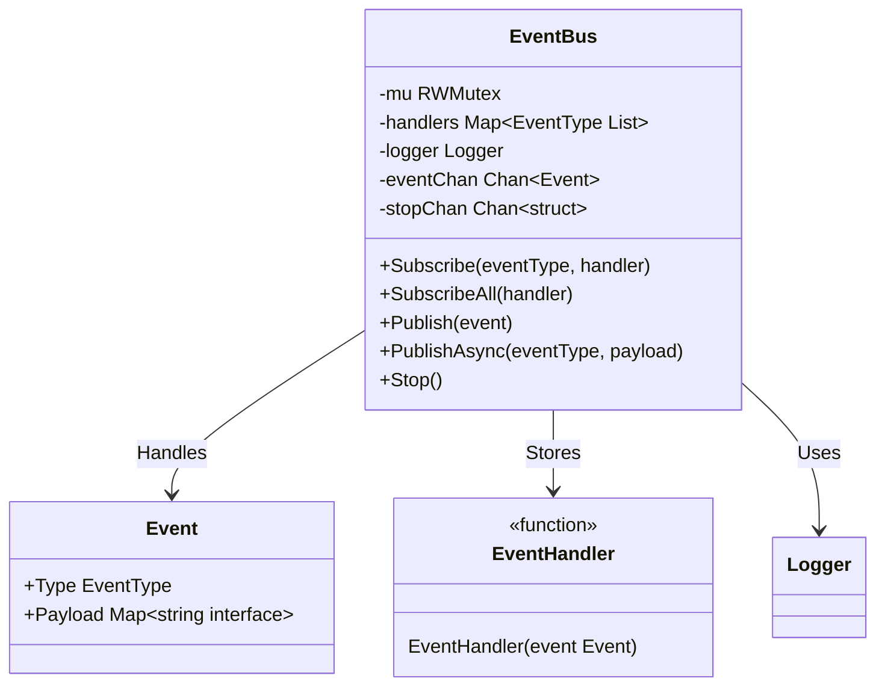
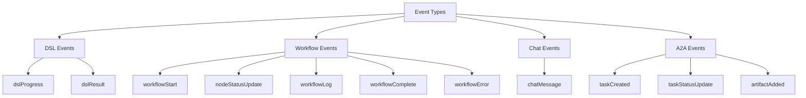
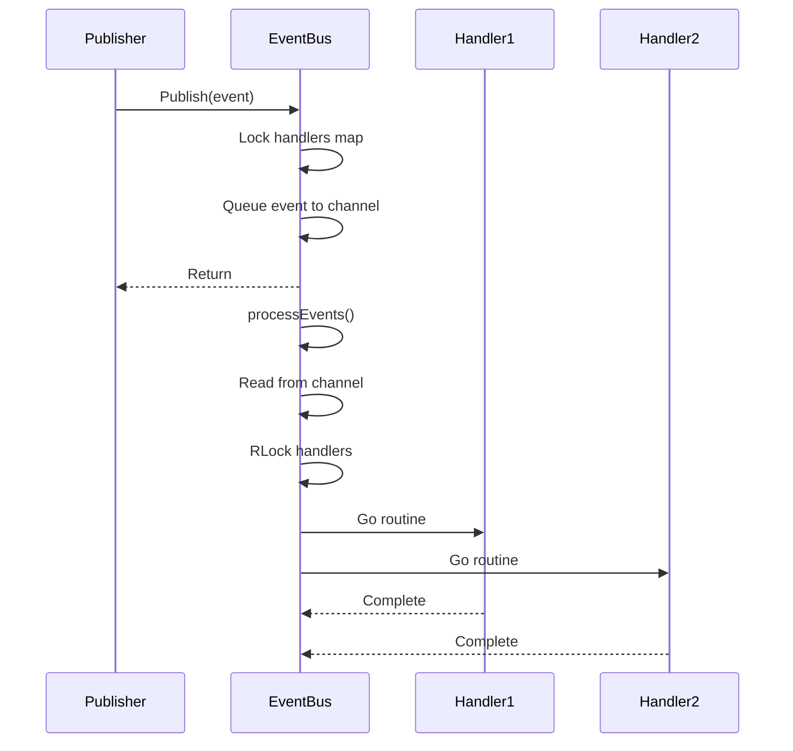
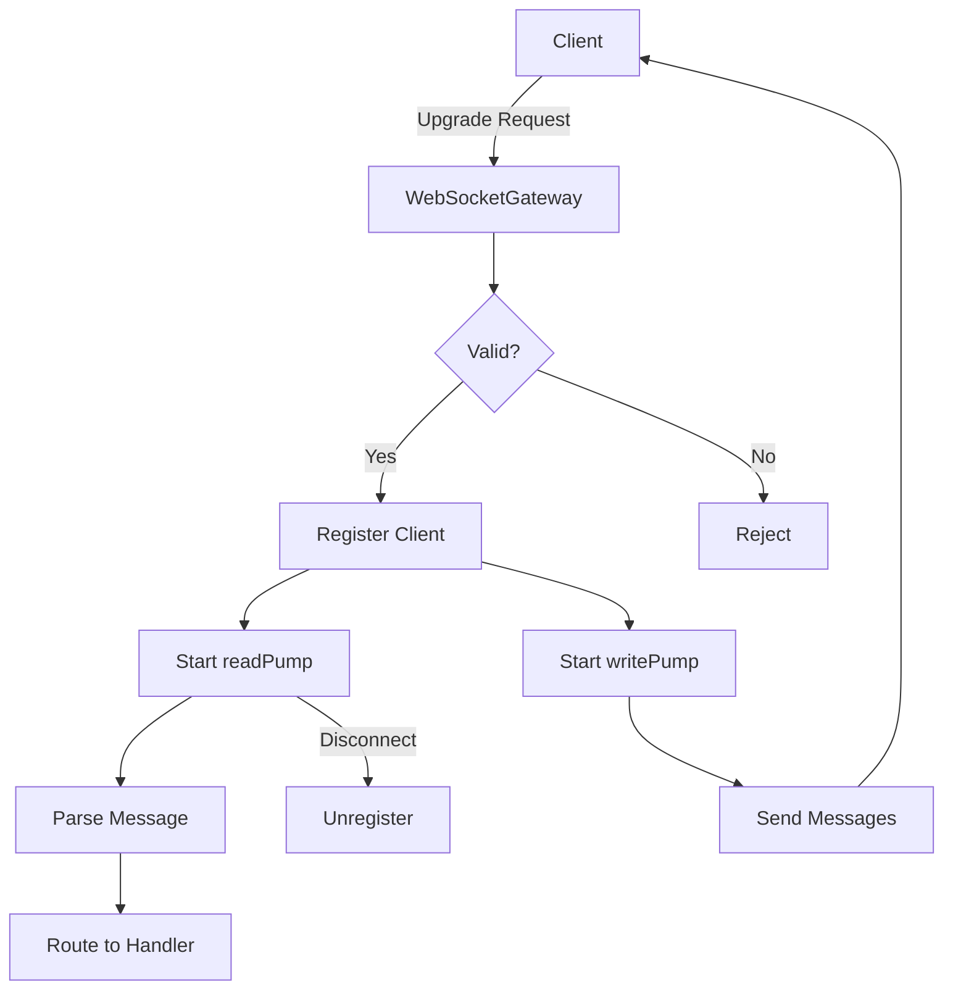
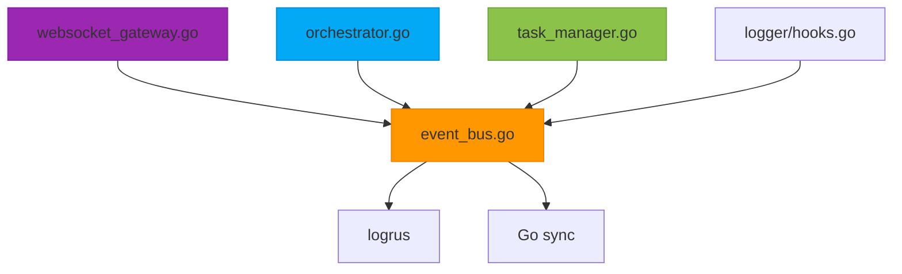

# Event Bus and Messaging System

## Table of Contents
1. [Introduction](#introduction)
2. [Project Structure](#project-structure)
3. [Core Components](#core-components)
4. [Architecture Overview](#architecture-overview)
5. [Detailed Component Analysis](#detailed-component-analysis)
6. [Dependency Analysis](#dependency-analysis)
7. [Performance Considerations](#performance-considerations)
8. [Troubleshooting Guide](#troubleshooting-guide)
9. [Conclusion](#conclusion)

## Introduction
The Event Bus and Messaging System provides a robust, asynchronous communication framework for decoupling components in a distributed agent-based architecture. It enables real-time updates, workflow monitoring, and cross-component coordination through a publish-subscribe model. This system is central to the operation of the Praxis agent platform, facilitating lifecycle events, execution status updates, error notifications, and chat interactions. The EventBus implementation ensures thread-safe event handling, integrates with a WebSocket gateway for UI updates, and supports logging hooks for audit trails.

## Project Structure
The messaging system is organized within the `internal` directory, with core components located in dedicated subpackages. The EventBus resides in `internal/bus`, while integration with external systems like WebSocket is handled in `internal/api`. The modular structure separates concerns such as event definition, subscription management, and message routing.

**Diagram sources**
- [event_bus.go](file://internal/bus/event_bus.go#L1-L188)
- [websocket_gateway.go](file://internal/api/websocket_gateway.go#L1-L671)

**Section sources**
- [event_bus.go](file://internal/bus/event_bus.go#L1-L50)
- [websocket_gateway.go](file://internal/api/websocket_gateway.go#L1-L100)

## Core Components
The core of the messaging system consists of the EventBus struct, which manages event publication and subscription, and the WebSocketGateway, which bridges internal events to real-time UI updates. The EventBus uses Go channels and goroutines for asynchronous processing, ensuring non-blocking event delivery. It supports both typed event publishing through helper methods and generic event publishing via the `Publish` method.

**Section sources**
- [event_bus.go](file://internal/bus/event_bus.go#L25-L100)
- [websocket_gateway.go](file://internal/api/websocket_gateway.go#L25-L100)

## Architecture Overview
The messaging architecture follows an event-driven design where components publish events to a central EventBus, and subscribers receive notifications asynchronously. The WebSocketGateway acts as a subscriber to all events, transforming them into JSON messages broadcast to connected clients. This enables real-time UI updates without direct coupling between business logic and presentation layers.

**Diagram sources**
- [event_bus.go](file://internal/bus/event_bus.go#L1-L188)
- [websocket_gateway.go](file://internal/api/websocket_gateway.go#L1-L671)

## Detailed Component Analysis

### EventBus Implementation
The EventBus struct provides thread-safe event handling using `sync.RWMutex` for concurrent access to subscribers and a buffered channel for asynchronous event processing. Events are published to a channel with a capacity of 100, providing basic backpressure handling by dropping events when the channel is full.

#### Class Diagram of EventBus

**Diagram sources**
- [event_bus.go](file://internal/bus/event_bus.go#L35-L41)

**Section sources**
- [event_bus.go](file://internal/bus/event_bus.go#L1-L188)

### Event Types and Lifecycle
The system defines several event types for different operational contexts, including DSL processing, workflow execution, chat messaging, and A2A tasks. Each event carries a type identifier and a payload containing relevant data in a flexible `map[string]interface{}` structure.

#### Event Types Classification

**Diagram sources**
- [event_bus.go](file://internal/bus/event_bus.go#L5-L30)

**Section sources**
- [event_bus.go](file://internal/bus/event_bus.go#L5-L30)

### Subscription Patterns and Thread Safety
The EventBus supports two subscription patterns: subscribing to specific event types or subscribing to all events. All modifications to the handlers map are protected by a read-write mutex, ensuring thread safety during subscription and unsubscription. Event delivery occurs in separate goroutines, preventing blocking of the event loop.

#### Sequence Diagram of Event Flow

**Diagram sources**
- [event_bus.go](file://internal/bus/event_bus.go#L89-L117)

**Section sources**
- [event_bus.go](file://internal/bus/event_bus.go#L89-L117)

### WebSocket Integration for Real-Time Updates
The WebSocketGateway subscribes to all events on the EventBus and broadcasts them to connected clients in real time. It uses Gorilla WebSocket to manage connections and implements ping/pong keep-alive mechanisms to maintain connection health. Each client connection runs independent read and write pumps for message handling.

#### WebSocket Connection Flow

**Diagram sources**
- [websocket_gateway.go](file://internal/api/websocket_gateway.go#L1-L671)

**Section sources**
- [websocket_gateway.go](file://internal/api/websocket_gateway.go#L1-L671)

## Dependency Analysis
The EventBus has minimal external dependencies, relying primarily on the standard library and logrus for logging. It is imported by multiple components including the WebSocketGateway, DSL orchestrator, and task manager, making it a central coordination point in the system.

**Diagram sources**
- [go.mod](file://go.mod#L1-L20)
- [event_bus.go](file://internal/bus/event_bus.go#L1-L10)

**Section sources**
- [event_bus.go](file://internal/bus/event_bus.go#L1-L188)
- [websocket_gateway.go](file://internal/api/websocket_gateway.go#L1-L671)

## Performance Considerations
The EventBus implements several performance optimizations:
- Buffered channel with capacity of 100 events to handle bursts
- Goroutine-based event delivery to prevent blocking
- Read-write mutex for concurrent access patterns
- Asynchronous publishing via `PublishAsync` method

Backpressure is handled by dropping events when the channel is full, which is logged as a warning. For high-throughput scenarios, this could be enhanced with more sophisticated strategies like rate limiting or persistent queues.

Message persistence is not currently implemented in the EventBus itself, relying on external systems for audit trails. The WebSocketGateway includes small delays between message broadcasts to prevent message batching, which could impact throughput under heavy load.

## Troubleshooting Guide
Common issues and their solutions:

**Event not received by subscriber**
- Verify subscription was made before event publication
- Check event type matches exactly (case-sensitive)
- Ensure EventBus instance is shared between publisher and subscriber

**WebSocket connection drops**
- Check server logs for upgrade errors
- Verify client is sending ping messages
- Ensure network stability and firewall settings

**High memory usage**
- Monitor event channel length
- Review event frequency and consider filtering
- Check for goroutine leaks in event handlers

**Section sources**
- [event_bus.go](file://internal/bus/event_bus.go#L1-L188)
- [websocket_gateway.go](file://internal/api/websocket_gateway.go#L1-L671)
- [websocket_gateway_test.go](file://internal/api/websocket_gateway_test.go#L1-L266)

## Conclusion
The EventBus implementation provides a reliable foundation for asynchronous communication in the Praxis agent system. Its thread-safe design, integration with WebSocket for real-time updates, and comprehensive event taxonomy enable robust component interaction. While the current implementation handles basic backpressure through channel dropping, future enhancements could include message persistence, event filtering, and schema versioning for improved reliability and backward compatibility. The system demonstrates effective use of Go's concurrency primitives to build a scalable messaging infrastructure.

**Referenced Files in This Document**
- [event_bus.go](file://internal/bus/event_bus.go#L1-L188)
- [websocket_gateway.go](file://internal/api/websocket_gateway.go#L1-L671)
- [websocket_gateway_test.go](file://internal/api/websocket_gateway_test.go#L1-L266)
