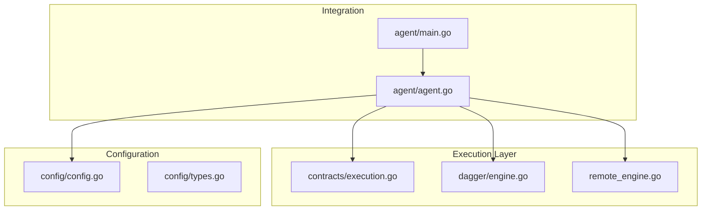
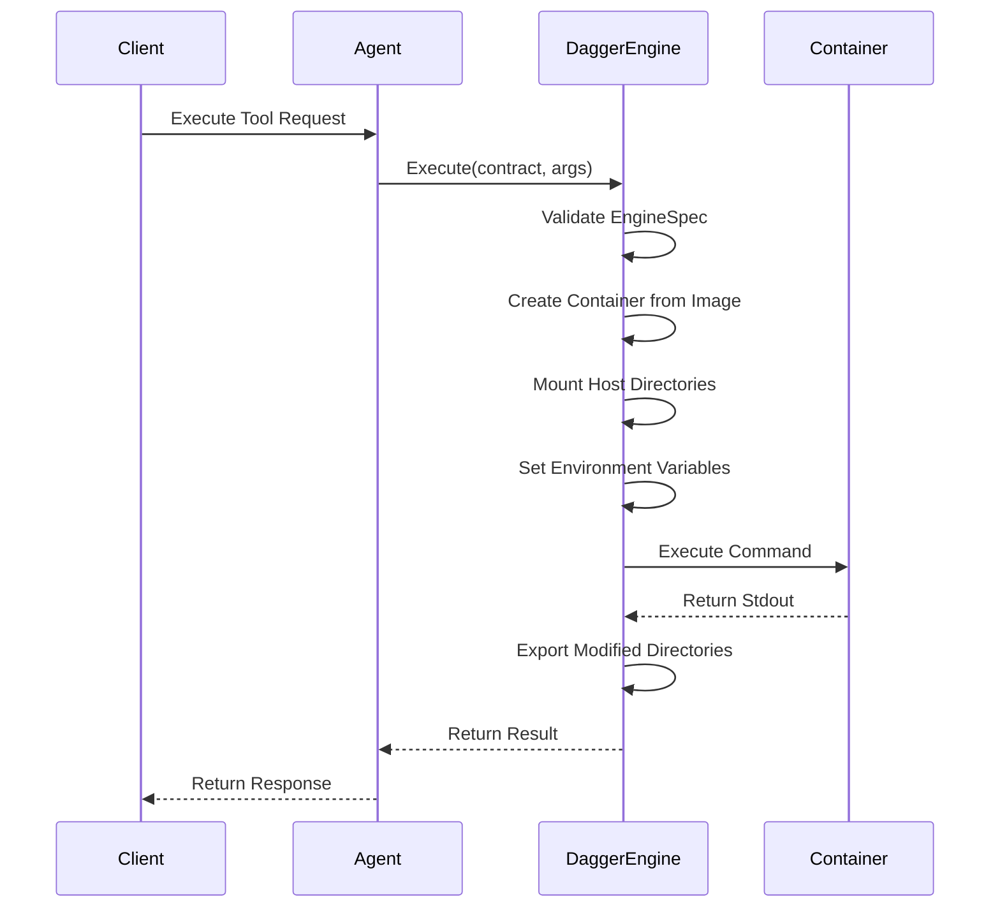
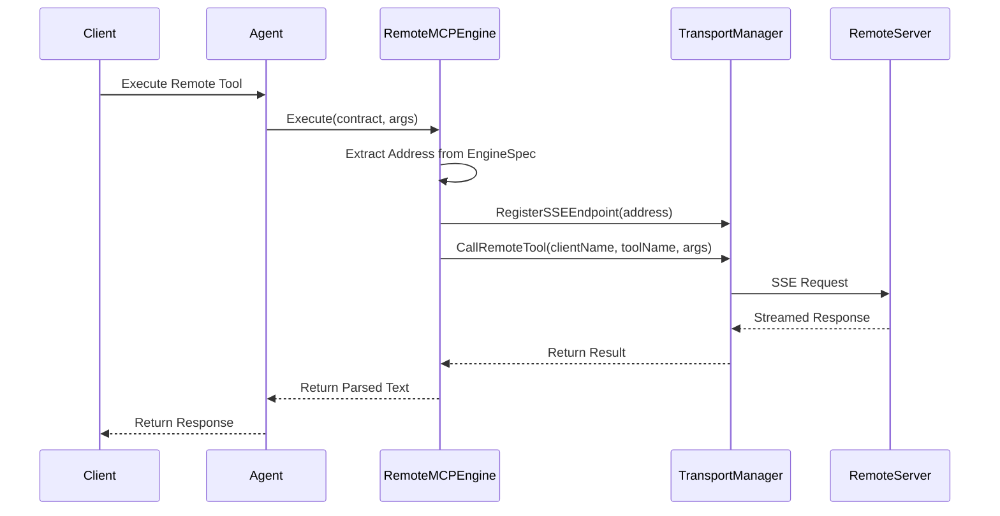
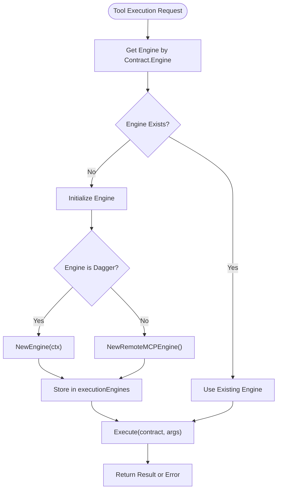
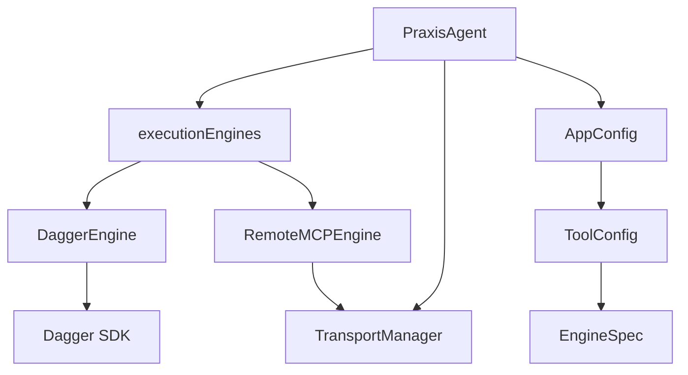

# Execution Engine Abstraction


## Table of Contents
1. [Introduction](#introduction)
2. [Project Structure](#project-structure)
3. [Core Components](#core-components)
4. [Architecture Overview](#architecture-overview)
5. [Detailed Component Analysis](#detailed-component-analysis)
6. [Dependency Analysis](#dependency-analysis)
7. [Performance Considerations](#performance-considerations)
8. [Troubleshooting Guide](#troubleshooting-guide)
9. [Conclusion](#conclusion)

## Introduction
This document provides comprehensive architectural documentation for the execution engine abstraction layer in the Praxis Go SDK. The system implements a factory pattern that dynamically selects between two execution backends: Dagger (local containerized execution) and Remote MCP (distributed execution via Model Context Protocol). This abstraction enables secure, isolated tool execution while supporting both local and remote capabilities. The design emphasizes flexibility, security, and fault tolerance through standardized interfaces, lazy initialization, and fallback strategies.

## Project Structure
The project follows a layered architecture with clear separation of concerns. The execution engine abstraction is primarily implemented in the `internal` directory, with key components organized into domain-specific packages. The `contracts` package defines the interface abstraction, `dagger` implements local containerized execution, and `mcp` handles remote distributed execution. Configuration is managed through the `config` package, while the `agent` package serves as the integration point that orchestrates engine selection and execution.



**Diagram sources**
- [execution.go](file://internal/contracts/execution.go)
- [engine.go](file://internal/dagger/engine.go)
- [remote_engine.go](file://internal/mcp/remote_engine.go)
- [agent.go](file://internal/agent/agent.go)
- [types.go](file://internal/config/types.go)
- [config.go](file://internal/config/config.go)
- [main.go](file://agent/main.go)

**Section sources**
- [execution.go](file://internal/contracts/execution.go)
- [engine.go](file://internal/dagger/engine.go)
- [remote_engine.go](file://internal/mcp/remote_engine.go)
- [agent.go](file://internal/agent/agent.go)
- [types.go](file://internal/config/types.go)
- [config.go](file://internal/config/config.go)
- [main.go](file://agent/main.go)

## Core Components
The execution engine abstraction consists of three core components: the `ExecutionEngine` interface contract, the `DaggerEngine` implementation for local containerized execution, and the `RemoteMCPEngine` implementation for proxying requests to external MCP servers. These components work together through a factory pattern implemented in the `PraxisAgent` class, which manages engine lifecycle and selection based on tool configuration.

**Section sources**
- [execution.go](file://internal/contracts/execution.go#L1-L14)
- [engine.go](file://internal/dagger/engine.go#L1-L184)
- [remote_engine.go](file://internal/mcp/remote_engine.go#L1-L53)
- [agent.go](file://internal/agent/agent.go#L1-L199)

## Architecture Overview
The execution engine architecture implements a strategy pattern through a centralized factory that selects the appropriate execution backend based on the tool contract's engine specification. The system maintains a registry of available engines and routes execution requests accordingly. This design enables transparent switching between local and remote execution models while maintaining a consistent interface for tool invocation.

```mermaid
classDiagram
class ExecutionEngine {
<<interface>>
+Execute(ctx, contract, args) string, error
}
class DaggerEngine {
-client *dagger.Client
+Execute(ctx, contract, args) string, error
+Close()
}
class RemoteMCPEngine {
-transportManager *TransportManager
+Execute(ctx, contract, args) string, error
}
class PraxisAgent {
-executionEngines map[string]ExecutionEngine
-transportManager *TransportManager
+handleExecuteTool()
+handleDaggerTool()
}
class ToolContract {
+Engine string
+Name string
+EngineSpec map[string]interface{}
}
ExecutionEngine <|-- DaggerEngine
ExecutionEngine <|-- RemoteMCPEngine
PraxisAgent --> ExecutionEngine : "uses"
PraxisAgent --> ToolContract : "executes"
PraxisAgent --> TransportManager : "manages"
RemoteMCPEngine --> TransportManager : "uses"
```

**Diagram sources**
- [execution.go](file://internal/contracts/execution.go#L10-L14)
- [engine.go](file://internal/dagger/engine.go#L13-L30)
- [remote_engine.go](file://internal/mcp/remote_engine.go#L10-L37)
- [agent.go](file://internal/agent/agent.go#L39-L88)

## Detailed Component Analysis

### Execution Engine Interface Contract
The `ExecutionEngine` interface defines a standardized contract for tool execution, abstracting away the underlying implementation details of different execution backends. This interface ensures consistent input/output handling across all engines, accepting a context, tool contract, and arguments map, and returning a string result or error.

```go
type ExecutionEngine interface {
    Execute(ctx context.Context, contract ToolContract, args map[string]interface{}) (string, error)
}
```

The `ToolContract` structure includes three key fields: `Engine` (specifying the execution backend), `Name` (identifying the tool), and `EngineSpec` (containing engine-specific configuration). This design enables polymorphic execution while maintaining type safety and extensibility.

**Section sources**
- [execution.go](file://internal/contracts/execution.go#L10-L14)

### Dagger Engine Implementation
The `DaggerEngine` implements secure local execution through containerization, leveraging the Dagger SDK to run tools in isolated environments. This engine provides resource isolation, dependency management, and security boundaries by executing tools within Docker containers.



**Diagram sources**
- [engine.go](file://internal/dagger/engine.go#L17-L184)

The engine processes the `EngineSpec` to extract container configuration including:
- **image**: Base Docker image for the container
- **command**: Command to execute within the container
- **mounts**: Directory mappings from host to container
- **env**: Fixed environment variables
- **env_passthrough**: Host environment variables to forward

Key security features include automatic directory existence validation, absolute path resolution, and cache busting via timestamp injection to prevent unintended caching of container states.

**Section sources**
- [engine.go](file://internal/dagger/engine.go#L17-L184)

### Remote MCP Engine Implementation
The `RemoteMCPEngine` acts as a proxy to external MCP servers, enabling distributed execution of tools across networked agents. This engine facilitates service discovery, load balancing, and fault tolerance by routing requests to available remote endpoints.



**Diagram sources**
- [remote_engine.go](file://internal/mcp/remote_engine.go#L1-L53)

The engine requires the `address` field in `EngineSpec` to identify the target MCP server. It leverages the `TransportManager` to handle SSE (Server-Sent Events) connections, automatically registering endpoints and managing the connection lifecycle. The response is parsed to extract text content from MCP's structured response format.

**Section sources**
- [remote_engine.go](file://internal/mcp/remote_engine.go#L1-L53)

### Factory Pattern Implementation
The factory pattern is implemented within the `PraxisAgent` class, which manages the lifecycle and selection of execution engines. This implementation uses lazy initialization for the Dagger engine to avoid startup failures when Docker is unavailable.



**Diagram sources**
- [agent.go](file://internal/agent/agent.go#L88-L124)
- [agent.go](file://internal/agent/agent.go#L400-L500)

The agent initializes the `RemoteMCPEngine` during startup since it has no external dependencies, while the `DaggerEngine` is initialized on first use. This approach ensures the agent can start successfully even in environments without Docker, providing graceful degradation of capabilities.

**Section sources**
- [agent.go](file://internal/agent/agent.go#L88-L124)

## Dependency Analysis
The execution engine abstraction has well-defined dependencies that enable loose coupling between components. The core dependency graph shows how the agent orchestrates engine selection while maintaining separation between execution backends.



**Diagram sources**
- [agent.go](file://internal/agent/agent.go#L39-L88)
- [types.go](file://internal/config/types.go#L1-L200)
- [engine.go](file://internal/dagger/engine.go#L1-L184)
- [remote_engine.go](file://internal/mcp/remote_engine.go#L1-L53)

The system uses configuration-driven engine selection, where the `ToolConfig` in `AppConfig` specifies which engine to use for each tool. This allows runtime configuration of execution strategies without code changes.

**Section sources**
- [types.go](file://internal/config/types.go#L1-L200)
- [config.go](file://internal/config/config.go#L1-L180)

## Performance Considerations
The two execution engines have distinct performance characteristics that affect system behavior:

**Dagger Engine Performance:**
- **Startup Overhead**: Container creation adds latency (100-500ms)
- **Cold Start**: Image pulling can take several seconds
- **Warm Execution**: Subsequent runs are faster due to Docker layer caching
- **Resource Isolation**: Memory and CPU limits prevent tool interference
- **Disk I/O**: Mount operations can be slow for large directories

**Remote MCP Engine Performance:**
- **Network Latency**: Round-trip time depends on network conditions
- **Connection Reuse**: TransportManager maintains persistent SSE connections
- **Scalability**: Distributed load across multiple remote servers
- **Fault Tolerance**: Automatic retry mechanisms for failed requests
- **Bandwidth**: Text-based responses minimize data transfer

The factory pattern enables performance optimization through intelligent engine selection based on tool requirements, resource availability, and network conditions.

## Troubleshooting Guide
Common issues and their solutions for the execution engine abstraction:

**Dagger Engine Issues:**
- **Docker Not Available**: Ensure Docker daemon is running; the agent will continue with only remote execution capabilities
- **Image Pull Failures**: Verify internet connectivity and image name correctness
- **Mount Path Errors**: Ensure host directories exist and have proper permissions
- **Permission Denied**: Run agent with sufficient privileges for directory access

**Remote MCP Engine Issues:**
- **Missing Address**: Verify `address` field in EngineSpec for remote tools
- **Connection Refused**: Check if remote MCP server is running and accessible
- **Authentication Failed**: Verify any required authentication tokens
- **Timeout Errors**: Increase timeout settings in configuration

**Configuration Issues:**
- **Invalid Engine Name**: Ensure engine name matches registered engines (dagger, remote-mcp)
- **Missing EngineSpec**: Verify all required fields are present for the selected engine
- **Type Mismatch**: Ensure EngineSpec values are of correct type (string, array, object)

**Section sources**
- [engine.go](file://internal/dagger/engine.go#L30-L184)
- [remote_engine.go](file://internal/mcp/remote_engine.go#L25-L53)
- [agent.go](file://internal/agent/agent.go#L400-L500)

## Conclusion
The execution engine abstraction layer provides a robust foundation for secure and flexible tool execution in the Praxis Go SDK. By implementing a factory pattern that dynamically selects between Dagger (local containerized) and Remote MCP (distributed) execution engines, the system achieves a balance of security, performance, and scalability. The standardized `ExecutionEngine` interface ensures consistent behavior across backends, while lazy initialization and fallback strategies enhance reliability. This architecture enables the platform to support both isolated local execution and distributed collaboration, making it adaptable to various deployment scenarios and use cases.

**Referenced Files in This Document**   
- [execution.go](file://internal/contracts/execution.go)
- [engine.go](file://internal/dagger/engine.go)
- [remote_engine.go](file://internal/mcp/remote_engine.go)
- [agent.go](file://internal/agent/agent.go)
- [types.go](file://internal/config/types.go)
- [config.go](file://internal/config/config.go)
- [main.go](file://agent/main.go)