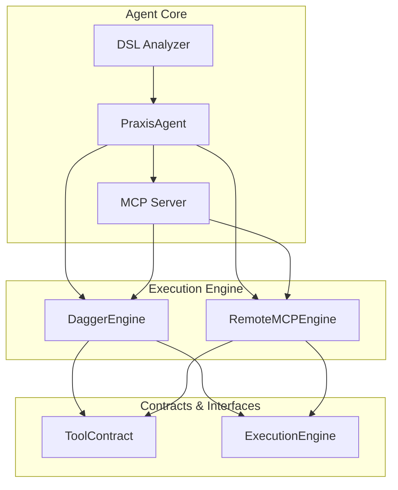
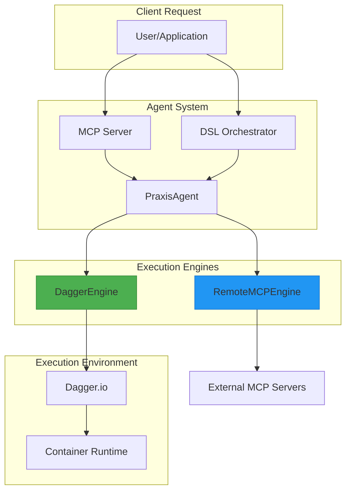
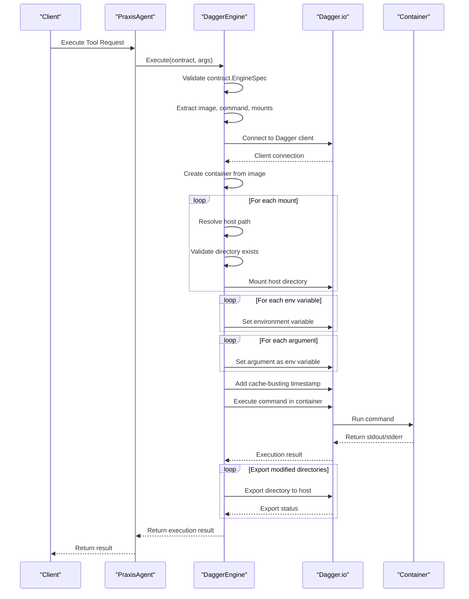
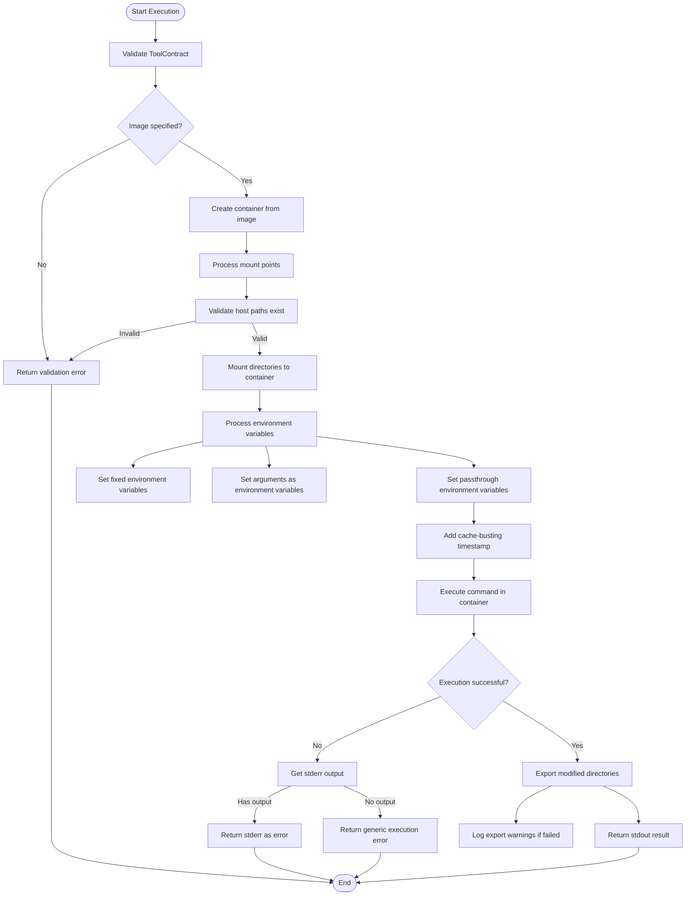
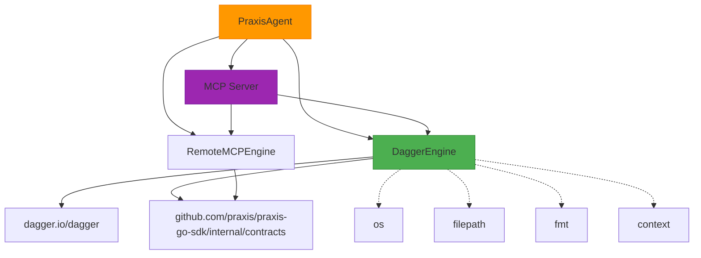

# Dagger Execution Engine


## Table of Contents
1. [Introduction](#introduction)
2. [Project Structure](#project-structure)
3. [Core Components](#core-components)
4. [Architecture Overview](#architecture-overview)
5. [Detailed Component Analysis](#detailed-component-analysis)
6. [Dependency Analysis](#dependency-analysis)
7. [Performance Considerations](#performance-considerations)
8. [Troubleshooting Guide](#troubleshooting-guide)
9. [Conclusion](#conclusion)

## Introduction
The Dagger Execution Engine is a secure, containerized tool execution system built on Dagger.io, designed to execute tools in isolated environments with strong security guarantees. This document provides a comprehensive analysis of the `DaggerEngine` struct implementation, its integration with the broader agent system, and the complete lifecycle of tool execution requests. The engine enables dynamic tool invocation through integration with the DSL orchestrator and MCP server, supporting configuration parameters such as container images, resource limits, and timeout settings. This documentation covers the implementation details, performance characteristics, error handling mechanisms, and troubleshooting guidance based on test cases.

## Project Structure
The project follows a modular architecture with clear separation of concerns. The Dagger execution engine is located in the `internal/dagger` directory, while integration points with the agent system are found in `internal/agent`. Core contracts and interfaces are defined in `internal/contracts`, and configuration management is handled in `internal/config`. The execution engine works in conjunction with other components like the MCP server, DSL orchestrator, and P2P communication layer to provide a comprehensive tool execution framework.



**Diagram sources**
- [engine.go](file://internal/dagger/engine.go#L1-L183)
- [agent.go](file://internal/agent/agent.go#L1-L1562)
- [execution.go](file://internal/contracts/execution.go#L1-L15)

**Section sources**
- [engine.go](file://internal/dagger/engine.go#L1-L183)
- [agent.go](file://internal/agent/agent.go#L1-L1562)

## Core Components
The core components of the Dagger execution system include the `DaggerEngine` struct, the `ExecutionEngine` interface, and the `ToolContract` structure. The `DaggerEngine` implements secure containerized execution using Dagger.io, while the `ExecutionEngine` interface provides a contract for tool execution. The `ToolContract` defines the specification for tool execution, including container image, command, and mount points.

```go
type DaggerEngine struct {
	client *dagger.Client
}

type ExecutionEngine interface {
	Execute(ctx context.Context, contract ToolContract, args map[string]interface{}) (string, error)
}

type ToolContract struct {
	Engine     string                 `json:"engine"`
	Name       string                 `json:"name"`
	EngineSpec map[string]interface{} `json:"engineSpec"`
}
```

**Section sources**
- [engine.go](file://internal/dagger/engine.go#L13-L15)
- [execution.go](file://internal/contracts/execution.go#L12-L14)
- [execution.go](file://internal/contracts/execution.go#L5-L8)

## Architecture Overview
The Dagger execution engine integrates with the Praxis agent system through a well-defined architecture that enables secure, isolated tool execution. The agent manages multiple execution engines, including the Dagger engine for containerized execution and the remote MCP engine for distributed tool invocation. When a tool execution request is received, the agent routes it to the appropriate engine based on the tool configuration.



**Diagram sources**
- [agent.go](file://internal/agent/agent.go#L1-L1562)
- [engine.go](file://internal/dagger/engine.go#L1-L183)

## Detailed Component Analysis

### DaggerEngine Implementation
The `DaggerEngine` struct provides secure, containerized tool execution by implementing the `ExecutionEngine` interface. It uses the Dagger.io SDK to create and manage containers, ensuring isolation and security for tool execution.

#### Class Diagram
```mermaid
classDiagram
class DaggerEngine {
+client *dagger.Client
+NewEngine(ctx context.Context) (*DaggerEngine, error)
+Close()
+Execute(ctx context.Context, contract ToolContract, args map[string]interface{}) (string, error)
}
class ExecutionEngine {
<<interface>>
+Execute(ctx context.Context, contract ToolContract, args map[string]interface{}) (string, error)
}
DaggerEngine ..|> ExecutionEngine : implements
```

**Diagram sources**
- [engine.go](file://internal/dagger/engine.go#L13-L15)
- [execution.go](file://internal/contracts/execution.go#L12-L14)

**Section sources**
- [engine.go](file://internal/dagger/engine.go#L1-L183)

### Tool Execution Lifecycle
The lifecycle of a tool execution request in the Dagger engine follows a well-defined sequence from input validation to result serialization. This process ensures secure and reliable execution of tools in isolated container environments.

#### Sequence Diagram


**Diagram sources**
- [engine.go](file://internal/dagger/engine.go#L30-L120)
- [agent.go](file://internal/agent/agent.go#L400-L600)

**Section sources**
- [engine.go](file://internal/dagger/engine.go#L30-L120)

### Configuration Parameters
The Dagger engine supports various configuration parameters that control the execution environment, including container image selection, resource limits, and timeout settings. These parameters are specified in the `EngineSpec` field of the `ToolContract`.

#### Flowchart


**Diagram sources**
- [engine.go](file://internal/dagger/engine.go#L30-L120)

**Section sources**
- [engine.go](file://internal/dagger/engine.go#L30-L120)

## Dependency Analysis
The Dagger execution engine has well-defined dependencies on the Dagger.io SDK, the contracts package, and the agent system. These dependencies enable secure containerized execution while maintaining loose coupling with the rest of the system.



**Diagram sources**
- [engine.go](file://internal/dagger/engine.go#L1-L183)
- [agent.go](file://internal/agent/agent.go#L1-L1562)

**Section sources**
- [engine.go](file://internal/dagger/engine.go#L1-L183)
- [agent.go](file://internal/agent/agent.go#L1-L1562)

## Performance Considerations
The Dagger execution engine provides several performance benefits through containerization and caching, but also introduces some overhead due to container startup time. The engine uses Dagger's built-in caching mechanism to optimize repeated executions, but includes a cache-busting timestamp to ensure fresh executions when needed.

The startup overhead of containerized execution is offset by the benefits of resource isolation and security. Each tool runs in its own isolated environment with controlled resource access, preventing interference between concurrent executions. The engine efficiently manages resources by reusing the Dagger client connection across multiple executions.

For performance-critical applications, the system provides configuration options to optimize execution, including:
- **Image selection**: Using lightweight base images like busybox reduces startup time
- **Mount optimization**: Minimizing the number of mounted directories improves performance
- **Environment variable management**: Careful selection of passthrough variables reduces container configuration time

The engine's performance characteristics make it suitable for both interactive and batch processing workloads, with predictable execution times and resource usage.

## Troubleshooting Guide
This section addresses common issues encountered when using the Dagger execution engine, based on analysis of test cases in `engine_test.go`. The troubleshooting guidance covers image pull failures, resource exhaustion, and timeout handling.

### Common Issues and Solutions

**Section sources**
- [engine_test.go](file://internal/dagger/engine_test.go#L1-L318)
- [engine.go](file://internal/dagger/engine.go#L30-L120)

#### Image Pull Failures
**Symptoms**: Execution fails with "failed to connect to dagger" or network-related errors.

**Causes**:
- Network connectivity issues preventing image download
- Invalid or inaccessible container image reference
- Registry authentication requirements

**Solutions**:
1. Verify network connectivity to the container registry
2. Check that the image reference is correct and publicly accessible
3. Use reliable base images like "busybox:latest" for testing
4. Implement retry logic for transient network errors

```go
func containsNetworkError(err error) bool {
	errStr := err.Error()
	networkErrors := []string{
		"TLS handshake timeout",
		"connection timeout",
		"network unreachable",
		"failed to resolve",
		"failed to connect",
	}
	
	for _, netErr := range networkErrors {
		if containsIgnoreCase(errStr, netErr) {
			return true
		}
	}
	return false
}
```

#### Resource Exhaustion
**Symptoms**: Execution fails with out of memory or disk space errors.

**Causes**:
- Insufficient host resources for container execution
- Unbounded resource usage in the executed tool
- Multiple concurrent executions consuming excessive resources

**Solutions**:
1. Monitor host resource usage and scale accordingly
2. Implement resource limits in the container configuration
3. Use lightweight container images to reduce memory footprint
4. Limit concurrent executions based on available resources

#### Timeout Handling
**Symptoms**: Execution hangs or takes longer than expected.

**Causes**:
- Long-running tools without progress indication
- Network latency in distributed environments
- Resource contention slowing down execution

**Solutions**:
1. Implement context timeouts for execution operations
2. Use the cache-busting timestamp to prevent stale executions
3. Monitor execution duration and implement timeout policies
4. Optimize tool commands for faster execution

The test suite includes comprehensive test cases for these scenarios, providing a foundation for robust error handling and recovery mechanisms.

## Conclusion
The Dagger execution engine provides a secure, containerized environment for tool execution within the Praxis agent system. By leveraging Dagger.io, it ensures isolation, security, and reproducibility for all executed tools. The engine's integration with the DSL orchestrator and MCP server enables dynamic tool invocation and flexible workflow execution.

Key strengths of the implementation include:
- **Security**: Isolated container execution prevents interference between tools
- **Flexibility**: Support for various container images and configuration options
- **Integration**: Seamless integration with the agent's MCP and DSL systems
- **Reliability**: Comprehensive error handling and recovery mechanisms

The engine's design follows best practices for containerized execution, with careful attention to input validation, resource management, and error reporting. The comprehensive test suite ensures reliability and provides a foundation for troubleshooting common issues.

For optimal performance, users should select appropriate container images, minimize mounted directories, and monitor resource usage. The system's modular architecture allows for easy extension and integration with additional execution engines as needed.

**Referenced Files in This Document**   
- [engine.go](file://internal/dagger/engine.go#L1-L183)
- [engine_test.go](file://internal/dagger/engine_test.go#L1-L318)
- [execution.go](file://internal/contracts/execution.go#L1-L15)
- [agent.go](file://internal/agent/agent.go#L1-L1562)