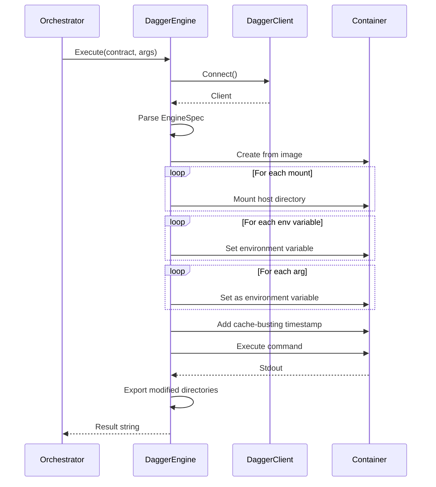
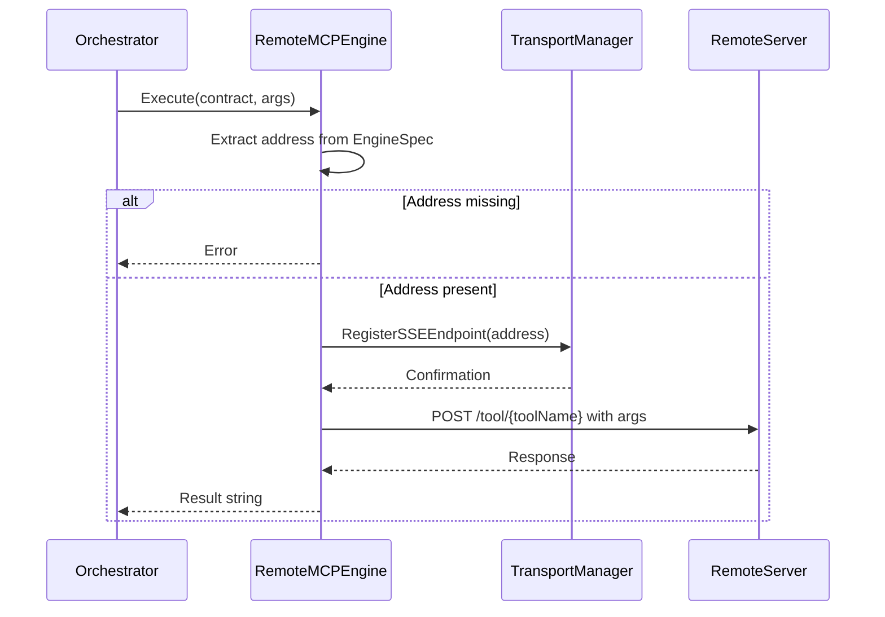
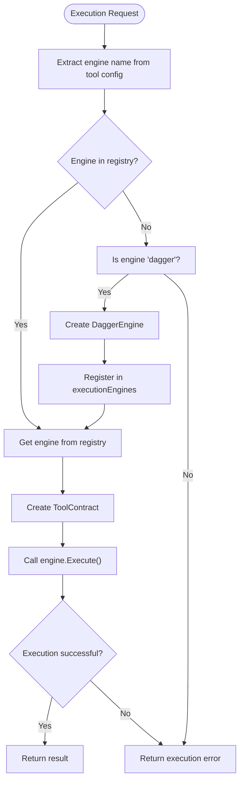
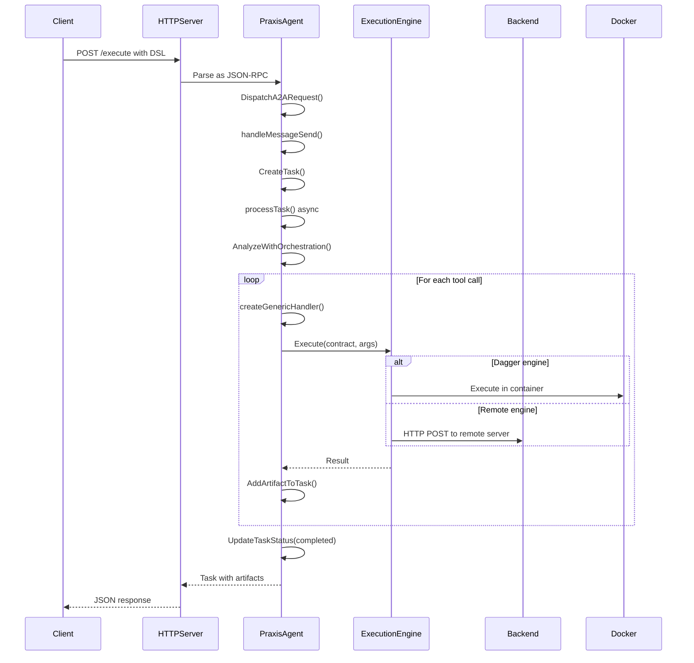

# Execution Engine Interface Contract


## Table of Contents
1. [Introduction](#introduction)
2. [Core Interface Definition](#core-interface-definition)
3. [Task and Result Data Models](#task-and-result-data-models)
4. [Implementation Analysis](#implementation-analysis)
5. [Orchestrator Integration](#orchestrator-integration)
6. [Design Trade-offs](#design-trade-offs)
7. [Versioning and Extensibility](#versioning-and-extensibility)
8. [Custom Engine Implementation Guide](#custom-engine-implementation-guide)

## Introduction
The Execution Engine Interface Contract provides a standardized abstraction for executing tasks across heterogeneous backend systems. This interface enables polymorphic engine selection by decoupling the orchestrator from execution backend specifics, allowing seamless switching between local execution (via Dagger) and remote execution (via Remote MCP). The contract defines a uniform method signature for task execution while accommodating the unique requirements of different execution environments through the EngineSpec configuration. This documentation details the interface design, data structures, implementation patterns, and integration points that enable this flexible execution model.

## Core Interface Definition

The `ExecutionEngine` interface defines a single method for executing tasks, providing a minimal yet powerful contract that supports diverse execution backends. The interface uses the `ToolContract` structure to encapsulate execution parameters, enabling language-agnostic tool definitions.

```go
// ExecutionEngine defines an abstraction for executing any ToolContract.
type ExecutionEngine interface {
	Execute(ctx context.Context, contract ToolContract, args map[string]interface{}) (string, error)
}
```

### Method Signature Details

**Execute Method**
- **ctx**: Context for cancellation and timeout control
- **contract**: ToolContract containing engine-specific configuration
- **args**: Dynamic arguments passed to the execution environment
- **Return**: Result string and error (nil if successful)

The method signature follows Go's standard error handling pattern, returning a result string and an error value. This simple return type facilitates integration with text-based tool interfaces while allowing error details to be conveyed through the error object.

### ToolContract Structure

The `ToolContract` struct standardizes the configuration format for execution engines:

```go
type ToolContract struct {
	Engine     string                 `json:"engine"`
	Name       string                 `json:"name"`
	EngineSpec map[string]interface{} `json:"engineSpec"`
}
```

**Field Definitions:**
- **Engine**: Specifies the execution engine type (e.g., "dagger", "remote-mcp")
- **Name**: Unique identifier for the tool being executed
- **EngineSpec**: Engine-specific configuration parameters as key-value pairs

This structure enables the orchestrator to route execution requests to the appropriate engine based on the Engine field, while providing each engine with its specific configuration through EngineSpec.

**Section sources**
- [execution.go](file://internal/contracts/execution.go#L0-L14)

## Task and Result Data Models

The system employs a comprehensive data model for representing tasks and their execution results, facilitating asynchronous processing and state management.

### Task Structure

The `Task` struct represents the fundamental unit of work in the system:

```go
type Task struct {
	ID        string      `json:"id"`
	ContextID string      `json:"contextId"`
	Status    TaskStatus  `json:"status"`
	History   []Message   `json:"history,omitempty"`
	Artifacts []Artifact  `json:"artifacts,omitempty"`
	Metadata  interface{} `json:"metadata,omitempty"`
	Kind      string      `json:"kind"` // always "task"
}
```

**Field Definitions:**
- **ID**: Unique identifier for the task
- **ContextID**: Identifier for the conversation or workflow context
- **Status**: Current state of the task execution
- **History**: Sequence of messages between client and agent
- **Artifacts**: Output files or data generated during execution
- **Metadata**: Additional information about the task
- **Kind**: Type discriminator (always "task")

### TaskStatus Structure

The `TaskStatus` struct tracks the execution state:

```go
type TaskStatus struct {
	State     string   `json:"state"` // "submitted", "working", "completed", "failed", "input-required"
	Message   *Message `json:"message,omitempty"`
	Timestamp string   `json:"timestamp,omitempty"`
}
```

**State Values:**
- **submitted**: Task created but not yet processed
- **working**: Task is currently being executed
- **completed**: Task finished successfully
- **failed**: Task execution encountered an error
- **input-required**: Additional input needed from user

### Message and Artifact Structures

The `Message` struct represents communication between client and agent:

```go
type Message struct {
	Role      string `json:"role"` // "user" or "agent"
	Parts     []Part `json:"parts"`
	MessageID string `json:"messageId"`
	TaskID    string `json:"taskId,omitempty"`
	ContextID string `json:"contextId,omitempty"`
	Kind      string `json:"kind"` // always "message"
}
```

The `Artifact` struct represents output generated by task execution:

```go
type Artifact struct {
	ArtifactID  string      `json:"artifactId"`
	Name        string      `json:"name,omitempty"`
	Description string      `json:"description,omitempty"`
	Parts       []Part      `json:"parts"`
	Metadata    interface{} `json:"metadata,omitempty"`
}
```

### Part Structure

The `Part` struct represents the smallest unit of content:

```go
type Part struct {
	Kind string      `json:"kind"` // "text", "file", "data"
	Text string      `json:"text,omitempty"`
	File *File       `json:"file,omitempty"`
	Data interface{} `json:"data,omitempty"`
}
```

This hierarchical structure enables rich content representation, supporting text, file attachments, and arbitrary data payloads within messages and artifacts.

**Section sources**
- [types.go](file://internal/a2a/types.go#L7-L71)

## Implementation Analysis

The ExecutionEngine interface is implemented by two primary engine types: DaggerEngine for local containerized execution and RemoteMCPEngine for remote protocol-based execution.

### Dagger Engine Implementation

The `DaggerEngine` provides local execution capabilities using the Dagger.io platform:

```mermaid
classDiagram
class DaggerEngine {
+*dagger.Client : client
+Execute(ctx: Context, contract: ToolContract, args: Map<string, interface>) : (string, error)
+Close()
}
class ToolContract {
+string : Engine
+string : Name
+map[string]interface{} : EngineSpec
}
DaggerEngine --> ToolContract : "executes"
DaggerEngine --> "dagger.Client" : "uses"
```

**Diagram sources**
- [engine.go](file://internal/dagger/engine.go#L0-L183)

**Section sources**
- [engine.go](file://internal/dagger/engine.go#L0-L183)

#### Configuration Parameters

The Dagger engine interprets the following EngineSpec parameters:

- **image**: Docker image to use as the base container
- **command**: Command to execute within the container
- **mounts**: Host-to-container directory mappings
- **env**: Environment variables to set in the container
- **env_passthrough**: Host environment variables to pass through

#### Execution Flow



**Diagram sources**
- [engine.go](file://internal/dagger/engine.go#L30-L183)

**Section sources**
- [engine.go](file://internal/dagger/engine.go#L30-L183)

### Remote MCP Engine Implementation

The `RemoteMCPEngine` enables execution on remote servers via the Model Context Protocol:

```mermaid
classDiagram
class RemoteMCPEngine {
+*TransportManager : transportManager
+Execute(ctx: Context, contract: ToolContract, args: Map<string, interface>) : (string, error)
}
class ToolContract {
+string : Engine
+string : Name
+map[string]interface{} : EngineSpec
}
class TransportManager {
+RegisterSSEEndpoint(name: string, address: string, config: EndpointConfig)
+GetClient(name: string) : SSEClient
}
RemoteMCPEngine --> ToolContract : "executes"
RemoteMCPEngine --> TransportManager : "uses"
```

**Diagram sources**
- [remote_engine.go](file://internal/mcp/remote_engine.go#L0-L37)

**Section sources**
- [remote_engine.go](file://internal/mcp/remote_engine.go#L0-L37)

#### Configuration Parameters

The Remote MCP engine requires the following EngineSpec parameter:

- **address**: URL of the remote MCP server

#### Execution Flow



**Diagram sources**
- [remote_engine.go](file://internal/mcp/remote_engine.go#L20-L37)

**Section sources**
- [remote_engine.go](file://internal/mcp/remote_engine.go#L20-L37)

## Orchestrator Integration

The PraxisAgent orchestrator integrates multiple execution engines, enabling dynamic engine selection and seamless switching between backend implementations.

### Engine Registration and Management

The orchestrator maintains a registry of available execution engines:

```go
type PraxisAgent struct {
	// ...
	executionEngines map[string]contracts.ExecutionEngine
	// ...
}
```

Engines are registered during agent initialization:

```go
// Initialize Remote MCP Engine (always available)
remoteMCPEngine := mcp.NewRemoteMCPEngine(agent.transportManager)
agent.executionEngines["remote-mcp"] = remoteMCPEngine

// Dagger Engine initialized on first use
```

This lazy initialization pattern prevents startup failures when Docker is unavailable, enhancing system resilience.

### Dynamic Engine Selection

The orchestrator uses a generic handler to route execution requests to the appropriate engine:



**Diagram sources**
- [agent.go](file://internal/agent/agent.go#L400-L600)

**Section sources**
- [agent.go](file://internal/agent/agent.go#L400-L600)

### Execution Context Flow

The complete execution flow from HTTP request to engine execution:



**Diagram sources**
- [agent.go](file://internal/agent/agent.go#L800-L1400)

**Section sources**
- [agent.go](file://internal/agent/agent.go#L800-L1400)

## Design Trade-offs

The execution engine contract design involves several important trade-offs that balance flexibility, simplicity, and maintainability.

### Interface Simplicity vs. Feature Completeness

The decision to include only the `Execute` method in the interface represents a deliberate trade-off:

**Advantages:**
- Minimal interface reduces implementation complexity
- Easy to understand and implement for new engines
- Flexible enough to support diverse execution models
- Reduces coupling between orchestrator and engines

**Disadvantages:**
- Lacks validation capabilities at the interface level
- No built-in capability discovery mechanism
- Limited introspection capabilities
- Error handling is engine-specific

### Dynamic Configuration via EngineSpec

The use of `map[string]interface{}` for EngineSpec enables maximum flexibility but sacrifices type safety:

**Advantages:**
- Supports arbitrary configuration parameters for different engines
- Enables backward-compatible additions without interface changes
- Facilitates dynamic configuration from external sources
- Simplifies JSON serialization and deserialization

**Disadvantages:**
- Runtime type errors instead of compile-time checking
- Requires extensive validation within each engine implementation
- Documentation must be maintained separately
- IDE support and autocomplete are limited

### String-based Results

Returning results as strings rather than structured data:

**Advantages:**
- Simple integration with text-based tools and LLMs
- Easy to serialize and transmit over network protocols
- Compatible with various output formats (JSON, text, etc.)
- Reduces complexity of result handling

**Disadvantages:**
- Requires parsing for structured data consumption
- Loss of type information
- Potential encoding issues with binary data
- Limited metadata about the result

### Context Propagation

The design relies on Go's context for cancellation and timeouts:

**Advantages:**
- Standard Go pattern familiar to developers
- Built-in support for deadlines and cancellation
- Hierarchical context propagation
- Integration with existing Go ecosystem

**Disadvantages:**
- Context must be properly propagated through all layers
- Limited interoperability with non-Go systems
- Serialization for distributed contexts requires additional work
- Debugging context-related issues can be challenging

## Versioning and Extensibility

The contract design incorporates several features to support versioning and future extensibility.

### Backward Compatibility

The interface supports backward compatibility through several mechanisms:

1. **Engine field in ToolContract**: Allows new engines to be added without affecting existing ones
2. **EngineSpec flexibility**: New configuration parameters can be added without interface changes
3. **Optional parameters**: Engines can ignore unrecognized EngineSpec fields
4. **Error handling**: Clear error messages help diagnose version mismatches

### Extension Strategies

When extending the contract, consider these approaches:

**Adding New Engines:**
- Implement the existing ExecutionEngine interface
- Register with a unique engine name
- Define engine-specific EngineSpec parameters
- Ensure backward compatibility with existing ToolContract fields

**Enhancing Existing Engines:**
- Add new optional parameters to EngineSpec
- Maintain support for deprecated parameters during transition
- Use semantic versioning for breaking changes
- Provide migration paths for users

### Future Enhancement Possibilities

Potential future enhancements to the contract:

1. **Validation method**: Add a `Validate(contract ToolContract) error` method to verify configuration before execution
2. **Capabilities method**: Add a `Capabilities() Capabilities` method to expose engine features
3. **Streaming support**: Add a streaming execution method for long-running processes
4. **Health check**: Add a `Health() error` method for monitoring engine status

These enhancements could be introduced through interface embedding or versioned interfaces while maintaining backward compatibility.

**Section sources**
- [execution.go](file://internal/contracts/execution.go#L0-L14)
- [agent.go](file://internal/agent/agent.go#L400-L600)

## Custom Engine Implementation Guide

Creating a custom engine implementation requires conforming to the ExecutionEngine interface and integrating with the orchestrator's engine registry.

### Step 1: Define the Engine Struct

Create a struct that will implement the ExecutionEngine interface:

```go
type CustomEngine struct {
    // Engine-specific fields
    config *EngineConfig
    client *ExternalAPIClient
}
```

Include any necessary configuration, clients, or state management fields required for your execution backend.

### Step 2: Implement the Execute Method

Implement the Execute method with proper error handling:

```go
func (e *CustomEngine) Execute(ctx context.Context, contract contracts.ToolContract, args map[string]interface{}) (string, error) {
    // Validate required EngineSpec fields
    spec := contract.EngineSpec
    endpoint, ok := spec["endpoint"].(string)
    if !ok || endpoint == "" {
        return "", fmt.Errorf("custom engine spec missing 'endpoint' for tool '%s'", contract.Name)
    }

    // Additional validation and processing
    // ...

    // Perform the actual execution
    result, err := e.performExecution(ctx, contract, args)
    if err != nil {
        return "", fmt.Errorf("custom engine execution failed: %w", err)
    }

    return result, nil
}
```

### Step 3: Add Engine-Specific Configuration

Define the EngineSpec parameters your engine supports:

- **endpoint**: URL of the external service
- **timeout**: Execution timeout in seconds
- **retries**: Number of retry attempts
- **headers**: Additional HTTP headers to include
- **auth_token**: Authentication token for the service

### Step 4: Create a Constructor Function

Provide a constructor function to create and initialize engine instances:

```go
func NewCustomEngine(config *EngineConfig) (*CustomEngine, error) {
    client, err := NewExternalAPIClient(config.APIKey)
    if err != nil {
        return nil, fmt.Errorf("failed to create API client: %w", err)
    }

    return &CustomEngine{
        config: config,
        client: client,
    }, nil
}
```

### Step 5: Register with the Orchestrator

Integrate your engine with the PraxisAgent orchestrator by registering it during initialization:

```go
// In agent initialization code
customEngine, err := NewCustomEngine(customConfig)
if err != nil {
    logger.Errorf("Failed to initialize CustomEngine: %v", err)
} else {
    agent.executionEngines["custom"] = customEngine
    logger.Info("Custom Engine initialized successfully")
}
```

### Best Practices

1. **Error Handling**: Provide clear, descriptive error messages that help users diagnose configuration issues
2. **Context Usage**: Respect the context for cancellation and timeouts
3. **Resource Management**: Implement proper cleanup in a Close() method if needed
4. **Logging**: Include relevant information in logs for debugging
5. **Validation**: Validate EngineSpec parameters early and provide helpful error messages
6. **Testing**: Implement comprehensive tests, including edge cases and error conditions

By following these guidelines, you can create custom engine implementations that seamlessly integrate with the existing execution framework while maintaining the benefits of the standardized interface contract.

**Section sources**
- [execution.go](file://internal/contracts/execution.go#L0-L14)
- [engine.go](file://internal/dagger/engine.go#L0-L183)
- [remote_engine.go](file://internal/mcp/remote_engine.go#L0-L37)
- [agent.go](file://internal/agent/agent.go#L400-L600)

**Referenced Files in This Document**
- [execution.go](file://internal/contracts/execution.go)
- [types.go](file://internal/a2a/types.go)
- [engine.go](file://internal/dagger/engine.go)
- [remote_engine.go](file://internal/mcp/remote_engine.go)
- [agent.go](file://internal/agent/agent.go)
