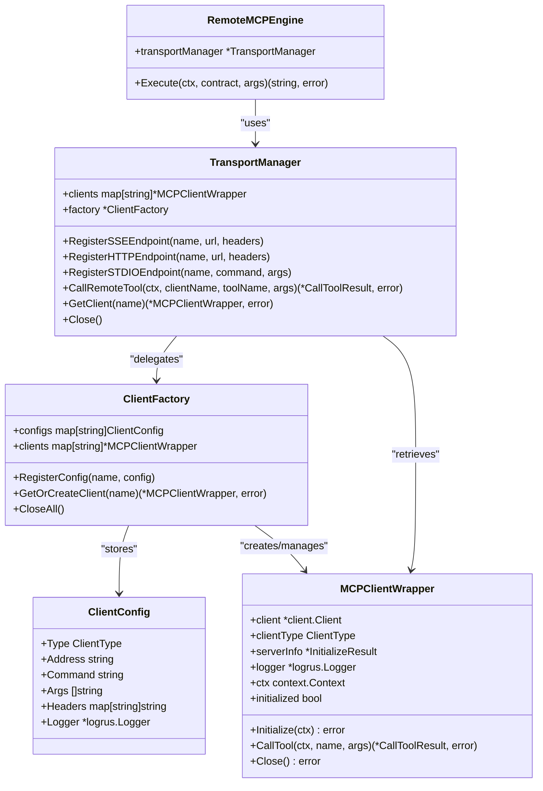
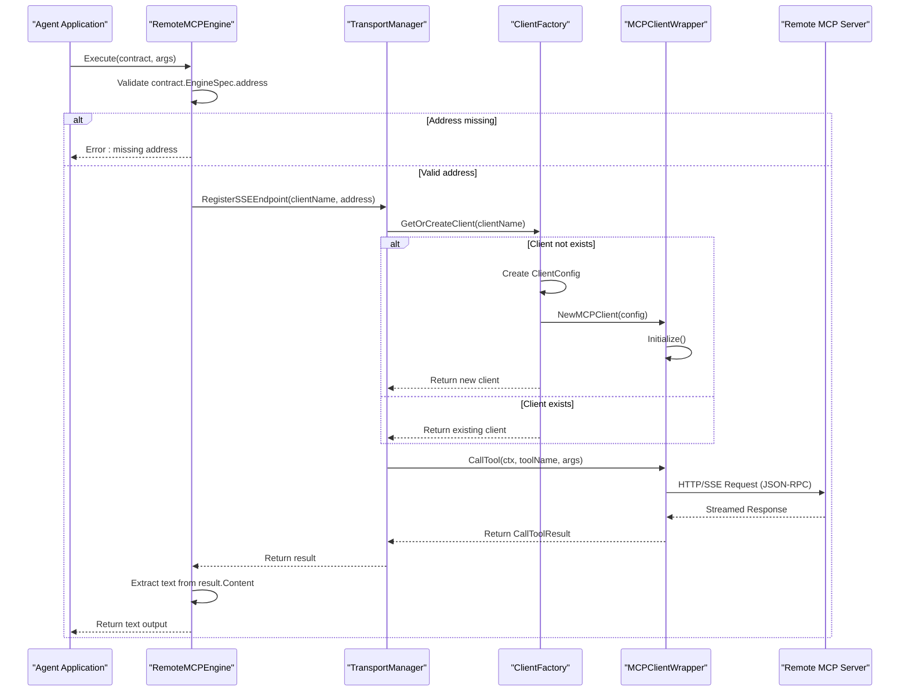

# Remote MCP Execution Engine


## Table of Contents
1. [Introduction](#introduction)
2. [Core Architecture](#core-architecture)
3. [Request Flow](#request-flow)
4. [Configuration Options](#configuration-options)
5. [Transport Mechanisms](#transport-mechanisms)
6. [Error Handling](#error-handling)
7. [Integration with MCP Client](#integration-with-mcp-client)
8. [Security Considerations](#security-considerations)
9. [Performance Characteristics](#performance-characteristics)
10. [Conclusion](#conclusion)

## Introduction

The Remote MCP Execution Engine enables Praxis agents to execute tools hosted on external MCP (Modular Compute Protocol) servers. It acts as a proxy between local agents and remote services, allowing cross-agent tool sharing and distributed computation. The engine implements the `ExecutionEngine` interface and routes tool execution requests via HTTP, SSE (Server-Sent Events), or STDIO transports.

This document details the implementation, configuration, and operational characteristics of the RemoteEngine, focusing on its role in enabling interoperability across distributed agent systems.

**Section sources**
- [remote_engine.go](file://internal/mcp/remote_engine.go#L1-L52)
- [execution.go](file://internal/contracts/execution.go#L1-L15)

## Core Architecture

The Remote MCP Execution Engine follows a modular architecture centered around transport abstraction and contract-based execution. At its core, the `RemoteMCPEngine` struct delegates communication to a `TransportManager`, which manages connections to remote MCP servers.



**Diagram sources**
- [remote_engine.go](file://internal/mcp/remote_engine.go#L13-L22)
- [transport.go](file://internal/mcp/transport.go#L7-L15)
- [client.go](file://internal/mcp/client.go#L30-L45)

**Section sources**
- [remote_engine.go](file://internal/mcp/remote_engine.go#L1-L52)
- [transport.go](file://internal/mcp/transport.go#L1-L294)

## Request Flow

The execution flow begins when a tool call is made through the `Execute` method of `RemoteMCPEngine`. The engine validates the tool contract, determines the target endpoint, and forwards the request via the appropriate transport.



**Diagram sources**
- [remote_engine.go](file://internal/mcp/remote_engine.go#L25-L52)
- [transport.go](file://internal/mcp/transport.go#L55-L75)
- [client.go](file://internal/mcp/client.go#L100-L120)

**Section sources**
- [remote_engine.go](file://internal/mcp/remote_engine.go#L25-L52)
- [transport.go](file://internal/mcp/transport.go#L55-L75)

## Configuration Options

The Remote MCP Execution Engine is configured through YAML files that define remote endpoints, authentication, and retry policies. These configurations are loaded at startup and used to initialize transport clients.

### Example Configuration (agent.yaml)
```yaml
tools:
  - name: "greet_external"
    description: "Calls a greeting tool on an external MCP server"
    engine: "remote-mcp"
    params:
      - name: "name"
        type: "string"
        required: "true"
    engineSpec:
      address: "http://host.docker.internal:8080"
```

### Global MCP Settings
```yaml
mcp:
  limits:
    max_concurrent_requests: 100
    request_timeout_ms: 30000
    max_response_size_bytes: 10485760
    connection_pool_size: 5
    retry_attempts: 3
    retry_backoff_ms: 1000
  log_level: "info"
```

**Configuration Parameters:**
- **address**: Target URL of the remote MCP server
- **connection_pool_size**: Number of concurrent connections maintained
- **request_timeout_ms**: Maximum time to wait for a response
- **retry_attempts**: Number of retry attempts on failure
- **retry_backoff_ms**: Base delay for exponential backoff between retries

**Section sources**
- [agent.yaml](file://configs/agent.yaml#L1-L118)

## Transport Mechanisms

The engine supports multiple transport protocols through the `TransportManager`, which abstracts the underlying communication mechanism.

### Supported Transport Types
| Type | Description | Initialization Method |
|------|-------------|------------------------|
| SSE | Server-Sent Events for streaming | RegisterSSEEndpoint() |
| HTTP | Streamable HTTP endpoints | RegisterHTTPEndpoint() |
| STDIO | Local process communication | RegisterSTDIOEndpoint() |

### Connection Pooling and Reconnection
The `TransportManager` uses a factory pattern to manage client lifecycle:
- **ClientFactory**: Creates and caches `MCPClientWrapper` instances
- **StreamableHTTPClientPool**: Maintains a pool of reusable HTTP clients
- **ResilientSSEClient**: Implements automatic reconnection for SSE streams

```go
// Example: Creating SSE endpoint
tm.RegisterSSEEndpoint("http://remote-server:8080", "http://remote-server:8080", nil)

// Example: Creating HTTP endpoint with headers
headers := map[string]string{"Authorization": "Bearer token123"}
tm.RegisterHTTPEndpoint("api-service", "https://api.example.com/mcp", headers)
```

**Section sources**
- [transport.go](file://internal/mcp/transport.go#L20-L50)

## Error Handling

The engine implements comprehensive error handling for network failures, server unavailability, and contract validation issues.

### Key Error Scenarios
- **Missing Address**: Contract validation fails if `engineSpec.address` is absent
- **Connection Failure**: Transport layer returns error and triggers reconnection
- **Initialization Failure**: Client fails to handshake with remote server
- **Tool Execution Error**: Remote tool returns error or times out

### Test Coverage
The test suite validates error conditions:
```go
// TestRemoteMCPEngine_Execute_MissingAddress verifies address validation
func TestRemoteMCPEngine_Execute_MissingAddress(t *testing.T) {
    // Setup contract without address
    contract := contracts.ToolContract{
        Engine: "remote-mcp",
        Name:   "test_tool",
        EngineSpec: map[string]interface{}{},
    }
    
    result, err := engine.Execute(ctx, contract, args)
    
    assert.Error(t, err)
    assert.Contains(t, err.Error(), "missing 'address'")
}
```

The engine propagates errors with contextual information, enabling effective debugging and monitoring.

**Section sources**
- [remote_engine_test.go](file://internal/mcp/remote_engine_test.go#L30-L63)
- [remote_engine.go](file://internal/mcp/remote_engine.go#L30-L35)

## Integration with MCP Client

The RemoteEngine integrates tightly with the MCP client module to enable standardized communication with external servers.

### JSON-RPC Message Construction
When executing a tool, the engine constructs a JSON-RPC request:
```json
{
  "jsonrpc": "2.0",
  "method": "tool.call",
  "params": {
    "name": "greet_external",
    "arguments": {
      "name": "Alice"
    }
  },
  "id": "req-123"
}
```

### Response Handling
The engine processes MCP responses and extracts text content:
```go
if result != nil && len(result.Content) > 0 {
    if textContent, ok := result.Content[0].(*mcpTypes.TextContent); ok {
        return textContent.Text, nil
    }
}
```

The integration allows seamless interoperability with any MCP-compliant server, enabling cross-platform tool sharing.

**Section sources**
- [remote_engine.go](file://internal/mcp/remote_engine.go#L45-L52)
- [client.go](file://internal/mcp/client.go#L100-L120)

## Security Considerations

The engine implements several security measures to protect data and ensure secure communication.

### Endpoint Validation
- All remote endpoints are validated during configuration loading
- Only HTTPS endpoints should be used in production (enforced via configuration policy)
- Hostname verification is performed by the underlying HTTP/SSE clients

### Data Encryption
- All communication over HTTP/SSE uses TLS encryption when connecting to HTTPS endpoints
- Authentication tokens can be passed via headers:
```go
headers := map[string]string{
    "Authorization": "Bearer " + os.Getenv("MCP_API_TOKEN"),
    "X-Api-Key": os.Getenv("API_KEY")
}
tm.RegisterSSEEndpoint("secure-service", "https://api.example.com", headers)
```

### Secure Configuration
Sensitive credentials should be injected via environment variables rather than hardcoded values:
```yaml
engineSpec:
  address: "${EXTERNAL_MCP_URL}"
```

**Section sources**
- [transport.go](file://internal/mcp/transport.go#L20-L50)
- [agent.yaml](file://configs/agent.yaml#L1-L118)

## Performance Characteristics

The engine is designed for high-performance distributed execution with several optimization strategies.

### Connection Management
- **Connection Pooling**: HTTP clients are pooled to reduce handshake overhead
- **Persistent SSE Connections**: Long-lived connections minimize latency
- **Lazy Initialization**: Clients are created on first use to reduce startup time

### Latency Optimization
- **Parallel Execution**: Multiple tools can be executed concurrently
- **Streaming Responses**: SSE/HTTP streaming enables incremental result processing
- **Caching**: Results can be cached at the agent level (configured separately)

### Resource Limits
The configuration enforces resource constraints:
- Maximum concurrent requests: 100
- Request timeout: 30 seconds
- Response size limit: 10MB
- Connection pool size: 5 connections per endpoint

These settings prevent resource exhaustion and ensure system stability under load.

**Section sources**
- [transport.go](file://internal/mcp/transport.go#L200-L294)
- [agent.yaml](file://configs/agent.yaml#L70-L80)

## Conclusion

The Remote MCP Execution Engine provides a robust mechanism for executing tools on external MCP servers. By implementing the `ExecutionEngine` interface and leveraging the `TransportManager`, it enables secure, reliable, and efficient cross-agent tool sharing. The engine supports multiple transport protocols, implements comprehensive error handling, and integrates seamlessly with the MCP protocol specification.

Key strengths include:
- **Modular Design**: Clear separation between execution logic and transport
- **Resilience**: Automatic reconnection and retry mechanisms
- **Security**: Support for encrypted communication and secure credential management
- **Performance**: Connection pooling and streaming capabilities

This architecture enables Praxis agents to form a distributed ecosystem of interoperable tools and services.

**Referenced Files in This Document**   
- [remote_engine.go](file://internal/mcp/remote_engine.go#L1-L52)
- [remote_engine_test.go](file://internal/mcp/remote_engine_test.go#L1-L63)
- [transport.go](file://internal/mcp/transport.go#L1-L294)
- [client.go](file://internal/mcp/client.go#L1-L291)
- [agent.yaml](file://configs/agent.yaml#L1-L118)
- [execution.go](file://internal/contracts/execution.go#L1-L15)