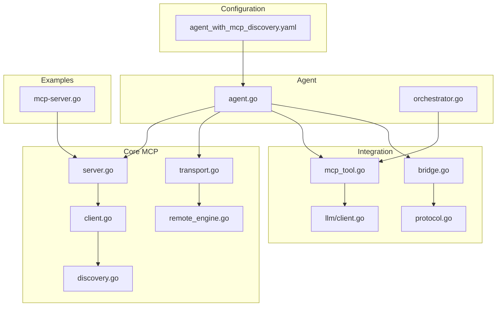
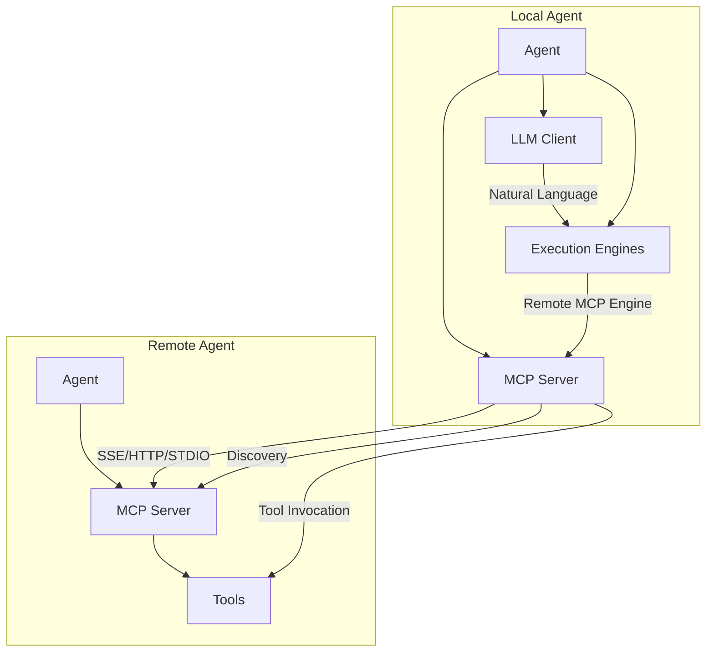
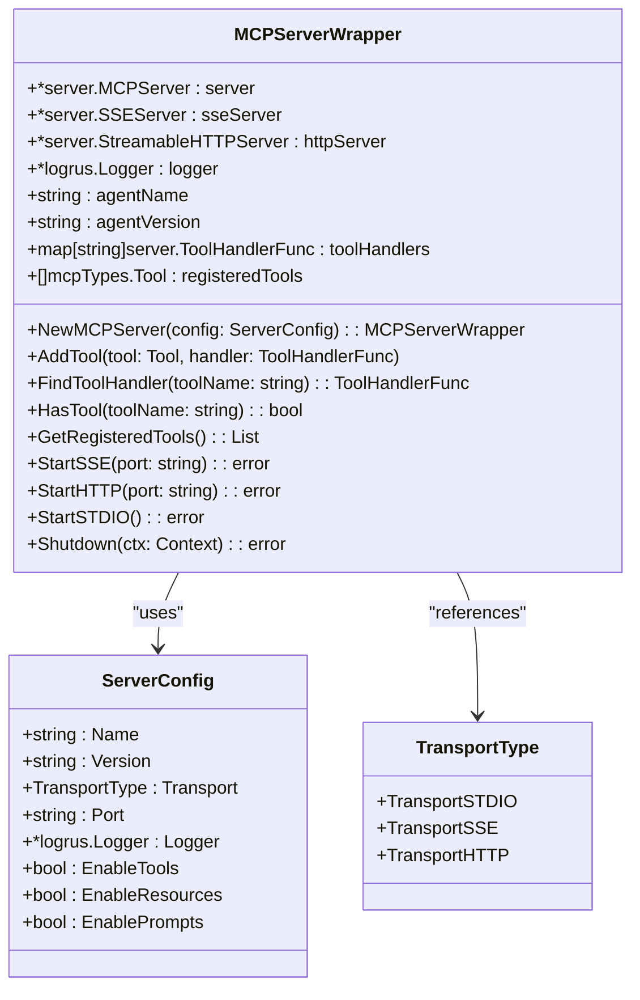
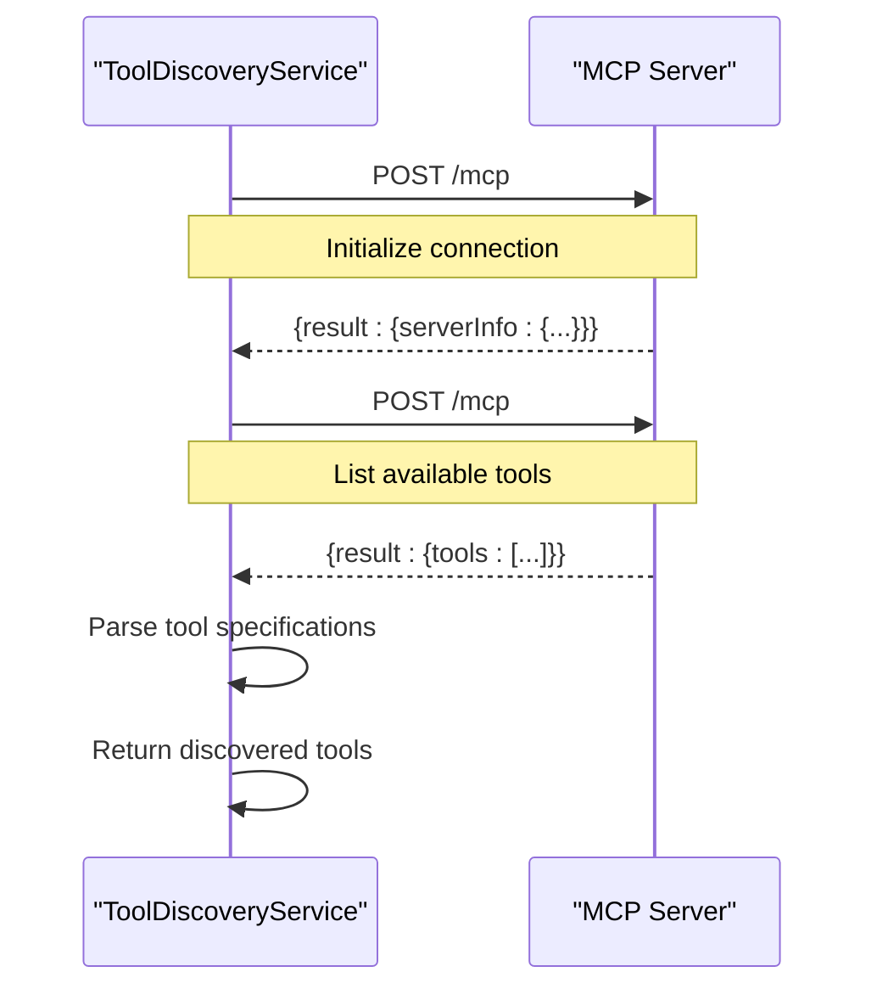
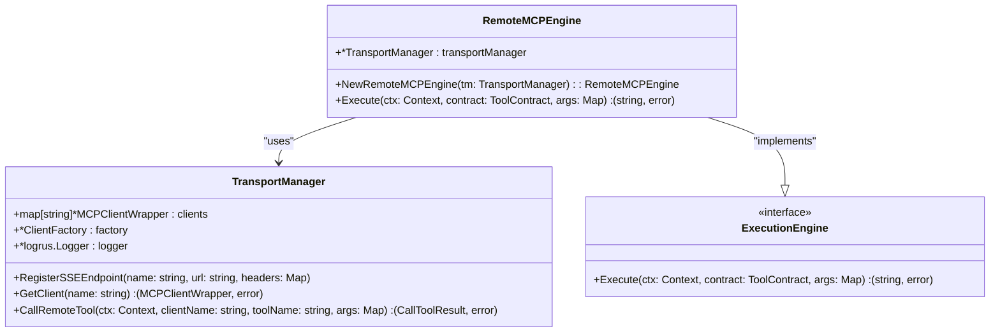
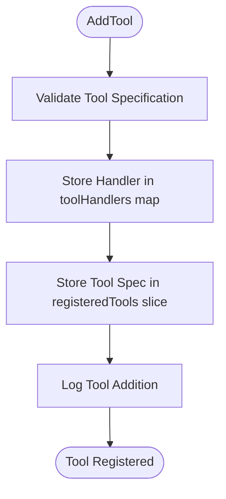
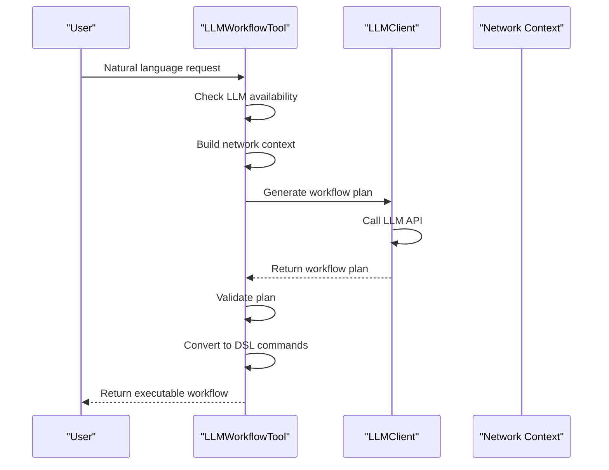
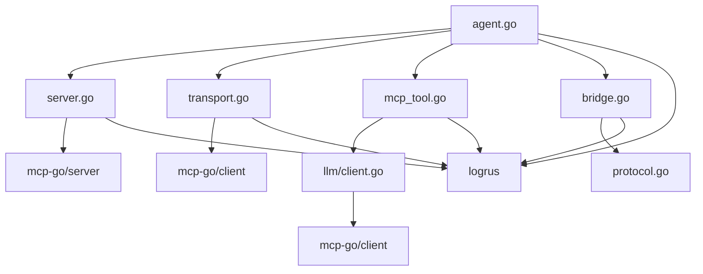

# Model Context Protocol (MCP) Integration

## Table of Contents
1. [Introduction](#introduction)
2. [Project Structure](#project-structure)
3. [Core Components](#core-components)
4. [Architecture Overview](#architecture-overview)
5. [Detailed Component Analysis](#detailed-component-analysis)
6. [Dependency Analysis](#dependency-analysis)
7. [Performance Considerations](#performance-considerations)
8. [Troubleshooting Guide](#troubleshooting-guide)
9. [Conclusion](#conclusion)

## Introduction
The Model Context Protocol (MCP) subsystem enables distributed agents to expose and discover tools across multiple transport mechanisms. This documentation details the implementation of MCP servers that expose tools via Server-Sent Events (SSE), HTTP, and STDIO transports. It explains the client-side discovery mechanism for locating remote MCP servers and retrieving tool manifests. The adapter pattern bridges local execution engines with external MCP endpoints, enabling seamless integration. The system supports dynamic tool registration and capability exposure, integrates with LLM clients for natural language tool invocation, and provides comprehensive configuration options for transport selection, timeout settings, and error handling strategies in unreliable network environments.

## Project Structure
The project follows a modular architecture with clear separation of concerns. The MCP subsystem is primarily located in the `internal/mcp` directory, with supporting components in `internal/llm`, `internal/p2p`, and `internal/agent`. Configuration files in the `configs` directory define agent behavior and discovery settings, while examples in the `examples` directory demonstrate practical implementations of MCP servers.

**Diagram sources**
- [server.go](file://internal/mcp/server.go#L0-L327)
- [client.go](file://internal/mcp/client.go#L0-L292)
- [discovery.go](file://internal/mcp/discovery.go#L0-L226)
- [transport.go](file://internal/mcp/transport.go#L0-L295)
- [remote_engine.go](file://internal/mcp/remote_engine.go#L0-L53)
- [mcp_tool.go](file://internal/llm/mcp_tool.go#L0-L362)
- [client.go](file://internal/llm/client.go#L0-L419)
- [bridge.go](file://internal/p2p/bridge.go#L0-L472)
- [protocol.go](file://internal/p2p/protocol.go#L0-L536)
- [agent.go](file://internal/agent/agent.go#L0-L1563)
- [orchestrator.go](file://internal/dsl/orchestrator.go#L0-L1172)
- [agent_with_mcp_discovery.yaml](file://configs/agent_with_mcp_discovery.yaml#L0-L79)
- [mcp-server.go](file://examples/mcp-server.go#L0-L591)

**Section sources**
- [server.go](file://internal/mcp/server.go#L0-L327)
- [client.go](file://internal/mcp/client.go#L0-L292)
- [discovery.go](file://internal/mcp/discovery.go#L0-L226)
- [transport.go](file://internal/mcp/transport.go#L0-L295)
- [remote_engine.go](file://internal/mcp/remote_engine.go#L0-L53)
- [mcp_tool.go](file://internal/llm/mcp_tool.go#L0-L362)
- [client.go](file://internal/llm/client.go#L0-L419)
- [bridge.go](file://internal/p2p/bridge.go#L0-L472)
- [protocol.go](file://internal/p2p/protocol.go#L0-L536)
- [agent.go](file://internal/agent/agent.go#L0-L1563)
- [orchestrator.go](file://internal/dsl/orchestrator.go#L0-L1172)
- [agent_with_mcp_discovery.yaml](file://configs/agent_with_mcp_discovery.yaml#L0-L79)
- [mcp-server.go](file://examples/mcp-server.go#L0-L591)

## Core Components
The MCP subsystem consists of several core components that work together to enable distributed tool execution and discovery. The `MCPServerWrapper` in `server.go` manages tool registration and exposes endpoints via SSE, HTTP, and STDIO transports. The `MCPClientWrapper` in `client.go` handles communication with remote servers and provides methods for listing and calling tools. The `ToolDiscoveryService` in `discovery.go` implements the discovery mechanism for locating remote MCP servers and retrieving their tool manifests. The `TransportManager` in `transport.go` manages multiple client connections and provides resilient communication with remote endpoints.

**Section sources**
- [server.go](file://internal/mcp/server.go#L0-L327)
- [client.go](file://internal/mcp/client.go#L0-L292)
- [discovery.go](file://internal/mcp/discovery.go#L0-L226)
- [transport.go](file://internal/mcp/transport.go#L0-L295)

## Architecture Overview
The MCP architecture enables distributed agents to expose, discover, and invoke tools across a P2P network. Agents can host MCP servers that expose local tools via multiple transport mechanisms. Other agents can discover these servers and their available tools, then invoke them remotely. The system integrates with LLM clients to enable natural language invocation of tools, where the LLM determines the appropriate tool and agent for a given request.

**Diagram sources**
- [server.go](file://internal/mcp/server.go#L0-L327)
- [client.go](file://internal/mcp/client.go#L0-L292)
- [discovery.go](file://internal/mcp/discovery.go#L0-L226)
- [transport.go](file://internal/mcp/transport.go#L0-L295)
- [mcp_tool.go](file://internal/llm/mcp_tool.go#L0-L362)
- [client.go](file://internal/llm/client.go#L0-L419)
- [agent.go](file://internal/agent/agent.go#L0-L1563)

## Detailed Component Analysis

### MCP Server Implementation
The MCP server implementation in `server.go` exposes tools via SSE, HTTP, and STDIO transports. It uses the `MCPServerWrapper` struct to manage the underlying MCP server and track registered tools and handlers. The server supports dynamic tool registration through the `AddTool` method, which stores both the tool specification and its handler function.

**Diagram sources**
- [server.go](file://internal/mcp/server.go#L0-L327)

**Section sources**
- [server.go](file://internal/mcp/server.go#L0-L327)

### Client-Side Discovery Mechanism
The client-side discovery mechanism in `discovery.go` enables agents to locate remote MCP servers and retrieve their tool manifests. The `ToolDiscoveryService` makes HTTP requests to server endpoints, initializes connections, and lists available tools. It parses the responses to extract tool information and returns a list of discovered tools with their specifications.

**Diagram sources**
- [discovery.go](file://internal/mcp/discovery.go#L0-L226)

**Section sources**
- [discovery.go](file://internal/mcp/discovery.go#L0-L226)

### Adapter Pattern for External Endpoints
The adapter pattern in `remote_engine.go` bridges local execution engines with external MCP endpoints. The `RemoteMCPEngine` uses a `TransportManager` to manage connections to remote servers and route tool calls to the appropriate endpoint. This allows local tools to be implemented as proxies to remote MCP servers.

**Diagram sources**
- [remote_engine.go](file://internal/mcp/remote_engine.go#L0-L53)
- [transport.go](file://internal/mcp/transport.go#L0-L295)

**Section sources**
- [remote_engine.go](file://internal/mcp/remote_engine.go#L0-L53)
- [transport.go](file://internal/mcp/transport.go#L0-L295)

### Tool Registration and Dynamic Capability Exposure
The tool registration process in `server.go` allows for dynamic capability exposure. Tools are registered with their specifications and handler functions, which are stored in maps for quick lookup. The server tracks all registered tools and their specifications, enabling discovery and invocation.

**Diagram sources**
- [server.go](file://internal/mcp/server.go#L0-L327)

**Section sources**
- [server.go](file://internal/mcp/server.go#L0-L327)

### LLM Integration for Natural Language Invocation
The integration with LLM clients in `mcp_tool.go` enables natural language tool invocation. The `LLMWorkflowTool` converts natural language requests into executable workflow plans using an LLM. It analyzes the current network context to determine the best agents and tools for each task.

**Diagram sources**
- [mcp_tool.go](file://internal/llm/mcp_tool.go#L0-L362)
- [client.go](file://internal/llm/client.go#L0-L419)

**Section sources**
- [mcp_tool.go](file://internal/llm/mcp_tool.go#L0-L362)
- [client.go](file://internal/llm/client.go#L0-L419)

## Dependency Analysis
The MCP subsystem has a well-defined dependency structure that enables modularity and extensibility. The core components depend on the `mcp-go` library for protocol implementation, while integration components depend on the core MCP classes. The agent orchestrates all components, creating a dependency on both the MCP subsystem and the P2P networking layer.

**Diagram sources**
- [agent.go](file://internal/agent/agent.go#L0-L1563)
- [server.go](file://internal/mcp/server.go#L0-L327)
- [transport.go](file://internal/mcp/transport.go#L0-L295)
- [mcp_tool.go](file://internal/llm/mcp_tool.go#L0-L362)
- [bridge.go](file://internal/p2p/bridge.go#L0-L472)
- [protocol.go](file://internal/p2p/protocol.go#L0-L536)
- [client.go](file://internal/llm/client.go#L0-L419)

**Section sources**
- [agent.go](file://internal/agent/agent.go#L0-L1563)
- [server.go](file://internal/mcp/server.go#L0-L327)
- [transport.go](file://internal/mcp/transport.go#L0-L295)
- [mcp_tool.go](file://internal/llm/mcp_tool.go#L0-L362)
- [bridge.go](file://internal/p2p/bridge.go#L0-L472)
- [protocol.go](file://internal/p2p/protocol.go#L0-L536)
- [client.go](file://internal/llm/client.go#L0-L419)

## Performance Considerations
The MCP subsystem includes several performance optimizations and configuration options. The `agent_with_mcp_discovery.yaml` configuration file defines limits for concurrent requests, request timeouts, and response sizes. The `ResilientSSEClient` in `transport.go` implements reconnection logic with exponential backoff to handle unreliable networks. The system uses connection pooling and caching to improve performance in high-throughput scenarios.

**Section sources**
- [agent_with_mcp_discovery.yaml](file://configs/agent_with_mcp_discovery.yaml#L0-L79)
- [transport.go](file://internal/mcp/transport.go#L0-L295)

## Troubleshooting Guide
Common issues with the MCP subsystem include connection failures, tool not found errors, and LLM integration problems. Connection failures can be diagnosed by checking the server URL and network connectivity. Tool not found errors may indicate a registration issue or mismatched tool names. LLM integration problems can be caused by missing API keys or network issues.

**Section sources**
- [client.go](file://internal/mcp/client.go#L0-L292)
- [discovery.go](file://internal/mcp/discovery.go#L0-L226)
- [mcp_tool.go](file://internal/llm/mcp_tool.go#L0-L362)
- [client.go](file://internal/llm/client.go#L0-L419)

## Conclusion
The Model Context Protocol subsystem provides a robust framework for distributed tool execution and discovery. It supports multiple transport mechanisms, enables dynamic capability exposure, and integrates with LLM clients for natural language invocation. The adapter pattern allows seamless bridging between local execution engines and external MCP endpoints. The system is configurable for various network conditions and provides comprehensive error handling for unreliable environments. This architecture enables flexible and scalable agent-to-agent communication in distributed systems.

**Referenced Files in This Document**
- [server.go](file://internal/mcp/server.go#L0-L327)
- [client.go](file://internal/mcp/client.go#L0-L292)
- [discovery.go](file://internal/mcp/discovery.go#L0-L226)
- [transport.go](file://internal/mcp/transport.go#L0-L295)
- [remote_engine.go](file://internal/mcp/remote_engine.go#L0-L53)
- [mcp_tool.go](file://internal/llm/mcp_tool.go#L0-L362)
- [agent.go](file://internal/agent/agent.go#L0-L1563)
- [bridge.go](file://internal/p2p/bridge.go#L0-L472)
- [protocol.go](file://internal/p2p/protocol.go#L0-L536)
- [orchestrator.go](file://internal/dsl/orchestrator.go#L0-L1172)
- [client.go](file://internal/llm/client.go#L0-L419)
- [agent_with_mcp_discovery.yaml](file://configs/agent_with_mcp_discovery.yaml#L0-L79)
- [mcp-server.go](file://examples/mcp-server.go#L0-L591)
