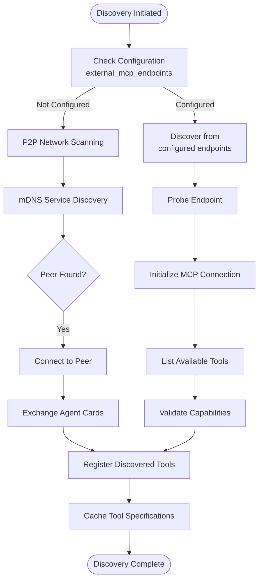
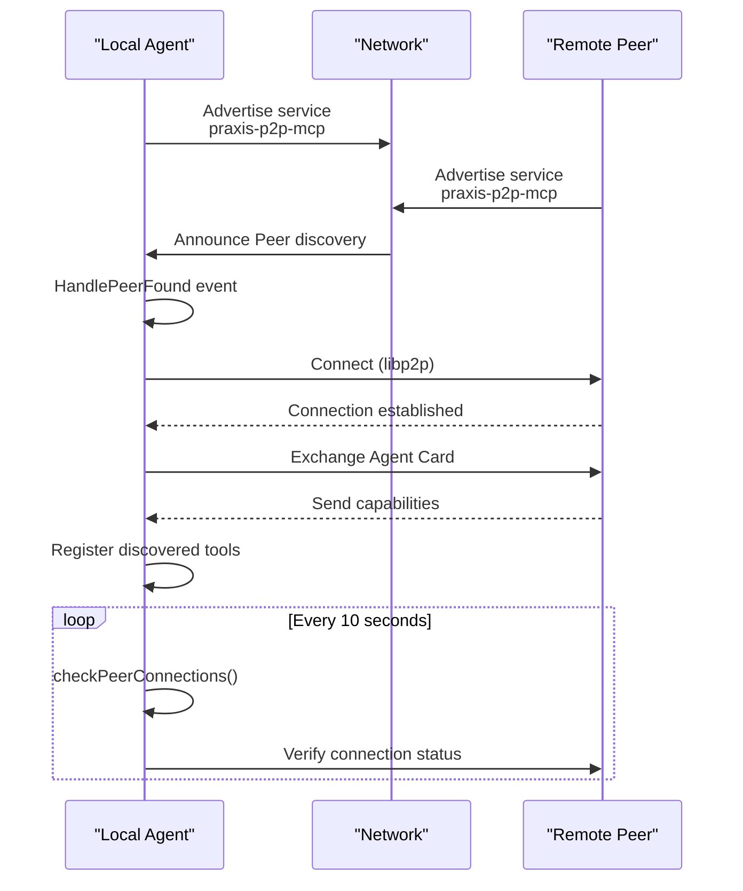
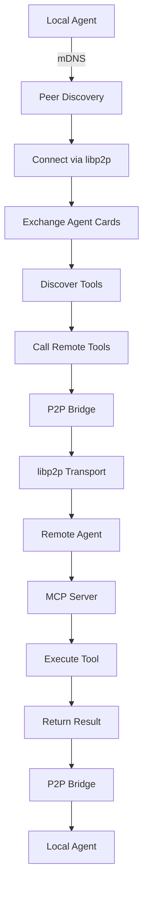

# MCP Client and Discovery Mechanism


## Table of Contents
1. [Introduction](#introduction)
2. [Discovery Mechanism Overview](#discovery-mechanism-overview)
3. [Static Configuration-Based Discovery](#static-configuration-based-discovery)
4. [Dynamic Network Scanning and Endpoint Probing](#dynamic-network-scanning-and-endpoint-probing)
5. [Manifest Fetching and Capability Validation](#manifest-fetching-and-capability-validation)
6. [Caching Mechanism for Discovered Tools](#caching-mechanism-for-discovered-tools)
7. [Retry Strategies for Transient Failures](#retry-strategies-for-transient-failures)
8. [Tool Specification Parsing and Contract Mapping](#tool-specification-parsing-and-contract-mapping)
9. [P2P Integration for Decentralized Discovery](#p2p-integration-for-decentralized-discovery)
10. [Fallback Mechanisms](#fallback-mechanisms)

## Introduction
The MCP (Model Context Protocol) Client and Discovery subsystem enables agents to automatically discover and utilize remote MCP servers. This document details the architecture and implementation of the discovery mechanism, covering both static configuration and dynamic network scanning approaches. The system supports multiple discovery methods including direct URL configuration, P2P broadcast, and decentralized discovery through libp2p. The discovery process involves endpoint probing, manifest fetching, capability validation, and caching of discovered tool sets. The client parses OpenAPI-like tool specifications and maps them to executable contracts for seamless integration.

## Discovery Mechanism Overview
The MCP discovery system combines static configuration with dynamic network scanning to locate and integrate remote MCP servers. Agents can discover tools through predefined endpoints in configuration files or through dynamic P2P network scanning. The discovery process follows a structured workflow: endpoint probing, server initialization, tool listing, and capability validation. Discovered tools are cached and made available through the agent's MCP server interface. The system implements robust retry strategies for transient failures and provides fallback mechanisms when primary endpoints are unreachable.



**Diagram sources**
- [internal/mcp/discovery.go](file://internal/mcp/discovery.go#L1-L225)
- [internal/p2p/discovery.go](file://internal/p2p/discovery.go#L1-L282)
- [internal/agent/agent.go](file://internal/agent/agent.go#L1005-L1030)

## Static Configuration-Based Discovery
Agents can discover remote MCP servers through static configuration in YAML files. The configuration supports two equivalent field names for backward compatibility: `external_mcp_endpoints` and `external_mcp_servers`. When an agent starts with MCP enabled, it automatically initiates the discovery process against all configured endpoints. Each endpoint is probed using SSE (Server-Sent Events) protocol to establish a connection and retrieve tool information.

The configuration file specifies the discovery endpoints as a list of URLs:

```yaml
agent:
  name: "praxis-agent-autodiscovery"
  version: "1.0.0"
  # External MCP servers for automatic tool discovery
  external_mcp_endpoints:
    - "http://localhost:3000/mcp"
    - "http://localhost:3001/mcp"
```

During the discovery process, the agent registers each endpoint with the TransportManager before probing it. This ensures that the connection details are properly configured for subsequent interactions with the discovered server.

**Section sources**
- [configs/agent_with_mcp_discovery.yaml](file://configs/agent_with_mcp_discovery.yaml#L1-L79)
- [internal/agent/agent.go](file://internal/agent/agent.go#L1005-L1030)
- [internal/config/types.go](file://internal/config/types.go#L33-L54)

## Dynamic Network Scanning and Endpoint Probing
The system implements dynamic network scanning through P2P (Peer-to-Peer) discovery using libp2p and mDNS (multicast DNS). The P2P discovery service runs as a background process that periodically scans the local network for other agents advertising the same service tag. When a peer is discovered, the system automatically attempts to establish a connection and exchange capability information.

The discovery process involves several key steps:
1. **Service Advertisement**: Agents advertise their presence on the local network using a specific service tag (`praxis-p2p-mcp`).
2. **Peer Detection**: The discovery service listens for mDNS announcements and detects new peers.
3. **Connection Establishment**: When a new peer is found, the system attempts to establish a libp2p connection.
4. **Heartbeat Monitoring**: Connected peers are monitored with periodic heartbeat checks to detect disconnections.

The discovery interval is configurable, with a default of 10 seconds between connection status checks. Peers that haven't been seen within 5 minutes are considered stale and removed from the peer list.



**Diagram sources**
- [internal/p2p/discovery.go](file://internal/p2p/discovery.go#L1-L282)
- [internal/agent/agent.go](file://internal/agent/agent.go#L472-L513)

## Manifest Fetching and Capability Validation
Once a connection is established with a remote MCP server, the discovery service performs manifest fetching and capability validation through a standardized protocol. The process follows the MCP specification and involves two primary JSON-RPC calls: `initialize` and `tools/list`.

The discovery workflow:
1. **Initialization**: The client sends an `initialize` request to establish a session with the server. This includes protocol version, client information, and capabilities.
2. **Server Information**: The server responds with its serverInfo, including name, version, and supported capabilities.
3. **Tool Listing**: The client requests the list of available tools using the `tools/list` method.
4. **Tool Validation**: Each discovered tool is validated for proper schema and required fields.

The `DiscoverToolsFromServer` method in the `ToolDiscoveryService` handles this entire process, extracting tool information including name, description, input schema, and server metadata. The input schema is parsed and preserved for later use in contract mapping.

```go
// DiscoverToolsFromServer discovers tools from an MCP server
func (s *ToolDiscoveryService) DiscoverToolsFromServer(ctx context.Context, serverURL string) ([]DiscoveredTool, error) {
    // Step 1: Initialize connection
    initRequest := map[string]interface{}{
        "jsonrpc": "2.0",
        "id":      1,
        "method":  "initialize",
        "params": map[string]interface{}{
            "protocolVersion": mcpTypes.LATEST_PROTOCOL_VERSION,
            "capabilities":    map[string]interface{}{},
            "clientInfo": map[string]interface{}{
                "name":    "Praxis MCP Discovery",
                "version": "1.0.0",
            },
        },
    }

    // Step 2: List available tools
    toolsRequest := map[string]interface{}{
        "jsonrpc": "2.0",
        "id":      2,
        "method":  "tools/list",
        "params":  map[string]interface{}{},
    }
    // ... rest of implementation
}
```

**Section sources**
- [internal/mcp/discovery.go](file://internal/mcp/discovery.go#L60-L225)
- [internal/mcp/discovery_test.go](file://internal/mcp/discovery_test.go#L1-L185)

## Caching Mechanism for Discovered Tools
The system implements a multi-layer caching mechanism for discovered tools to optimize performance and reduce network overhead. When tools are discovered from remote servers, they are registered with the local MCP server and made available through the agent's interface. The tool specifications are also cached in memory and used to update the agent's P2P card, which is shared with other agents in the network.

The caching process occurs in several stages:
1. **Local Registration**: Discovered tools are registered with the agent's MCP server using dynamically generated names (appended with `_external`).
2. **P2P Card Update**: The agent's P2P card is updated with the full list of registered tools, including both local and discovered tools.
3. **Memory Caching**: The TransportManager maintains a cache of MCP clients for each endpoint, reusing connections when possible.

The `updateP2PCardWithTools` method is responsible for synchronizing the agent's capabilities with the P2P network. It retrieves all registered tools from the MCP server and converts them to P2P ToolSpec format for inclusion in the agent card.

```go
func (a *PraxisAgent) updateP2PCardWithTools() {
    if a.p2pProtocol == nil || a.mcpServer == nil {
        return
    }

    // Get all registered tools from MCP server
    registeredTools := a.mcpServer.GetRegisteredTools()

    // Convert MCP tools to P2P ToolSpecs
    var toolSpecs []p2p.ToolSpec
    for _, tool := range registeredTools {
        spec := p2p.ToolSpec{
            Name:        tool.Name,
            Description: tool.Description,
            Parameters:  []p2p.ToolParameter{},
        }
        toolSpecs = append(toolSpecs, spec)
    }

    // Create updated P2P card
    p2pCard := &p2p.AgentCard{
        Name:         a.card.Name,
        Version:      a.card.Version,
        PeerID:       a.host.ID().String(),
        Capabilities: []string{"mcp", "dsl", "workflow", "p2p"},
        Tools:        toolSpecs,
        Timestamp:    time.Now().Unix(),
    }

    a.p2pProtocol.SetAgentCard(p2pCard)
}
```

**Section sources**
- [internal/agent/agent.go](file://internal/agent/agent.go#L472-L513)
- [internal/mcp/server.go](file://internal/mcp/server.go#L60-L97)

## Retry Strategies for Transient Failures
The discovery system implements robust retry strategies to handle transient failures during the discovery process. When a connection attempt fails or a server is temporarily unreachable, the system employs exponential backoff and reconnect mechanisms to recover gracefully.

The `ResilientSSEClient` struct provides built-in retry functionality for SSE connections. It features:
- **Automatic Reconnection**: A dedicated `reconnectLoop` goroutine monitors connection status and attempts reconnection when needed.
- **Exponential Backoff**: Reconnection attempts use increasing delays (1s, 2s, 3s, etc.) to avoid overwhelming the server.
- **Maximum Retry Attempts**: The system limits reconnection attempts to 5 before giving up.
- **Context Cancellation**: All operations respect context cancellation for proper shutdown.

The discovery process also includes fallback mechanisms when discovery fails. If tool discovery from a remote server fails, the system registers fallback tools with hardcoded specifications for common operations like file reading and writing.

```go
func (rsc *ResilientSSEClient) reconnectLoop() {
    for {
        select {
        case <-rsc.ctx.Done():
            return
        case <-rsc.reconnectCh:
            rsc.logger.Info("Attempting to reconnect SSE client...")

            for attempt := 1; attempt <= 5; attempt++ {
                if err := rsc.connect(); err != nil {
                    rsc.logger.Errorf("Reconnection attempt %d failed: %v", attempt, err)

                    backoff := time.Duration(attempt) * time.Second
                    select {
                    case <-time.After(backoff):
                    case <-rsc.ctx.Done():
                        return
                    }
                } else {
                    rsc.logger.Info("Reconnected successfully")
                    break
                }
            }
        }
    }
}
```

**Section sources**
- [internal/mcp/transport.go](file://internal/mcp/transport.go#L150-L250)
- [internal/agent/agent.go](file://internal/agent/agent.go#L1005-L1199)

## Tool Specification Parsing and Contract Mapping
The system parses OpenAPI-like tool specifications from discovered servers and maps them to executable contracts that can be invoked through the agent's execution engines. When a tool is discovered, its input schema is analyzed to extract parameter information, which is then used to construct a proper MCP tool specification.

The parsing process involves:
1. **Schema Analysis**: The input schema is examined to determine parameter types, descriptions, and constraints.
2. **Option Construction**: MCP tool options are created based on the parameter types (string, number, boolean).
3. **Handler Creation**: A proxy handler is created that forwards tool calls to the remote server.
4. **Contract Mapping**: The handler maps the tool invocation to a `ToolContract` with the appropriate engine specification.

The proxy handler captures the remote server address and tool name, then uses the `remote-mcp` execution engine to forward the request. This creates a seamless integration where discovered tools appear as native tools to the agent's consumers.

```go
// Create tool specification dynamically with proper input schema
toolOptions := []mcpTypes.ToolOption{
    mcpTypes.WithDescription(fmt.Sprintf("%s (via %s)", tool.Description, tool.ServerName)),
}

// Parse input schema and add parameters
if tool.InputSchema.Properties != nil {
    for propName, propSchema := range tool.InputSchema.Properties {
        propMap, ok := propSchema.(map[string]interface{})
        if !ok {
            continue
        }

        propType, _ := propMap["type"].(string)
        propDesc, _ := propMap["description"].(string)

        // Add parameter based on type
        switch propType {
        case "string":
            toolOptions = append(toolOptions, mcpTypes.WithString(propName, mcpTypes.Description(propDesc)))
        case "integer", "number":
            toolOptions = append(toolOptions, mcpTypes.WithNumber(propName, mcpTypes.Description(propDesc)))
        case "boolean":
            toolOptions = append(toolOptions, mcpTypes.WithBoolean(propName, mcpTypes.Description(propDesc)))
        default:
            toolOptions = append(toolOptions, mcpTypes.WithString(propName, mcpTypes.Description(propDesc)))
        }
    }
}
```

**Section sources**
- [internal/agent/agent.go](file://internal/agent/agent.go#L1030-L1199)
- [internal/mcp/discovery.go](file://internal/mcp/discovery.go#L1-L225)

## P2P Integration for Decentralized Discovery
The system integrates with a P2P module to enable decentralized discovery without relying on centralized servers or configuration. Using libp2p, agents form a peer-to-peer network where they can discover each other automatically through mDNS on the local network and DHT (Distributed Hash Table) for wider discovery.

Key components of the P2P integration:
- **Discovery Service**: Manages peer discovery through mDNS and maintains a list of found peers.
- **P2P Bridge**: Facilitates communication between the MCP protocol and libp2p transport.
- **Protocol Handler**: Manages P2P-specific protocol interactions and message routing.
- **Agent Cards**: Lightweight capability advertisements shared between peers.

When a new peer is discovered, the system automatically exchanges agent cards, which contain information about available tools and capabilities. This allows agents to dynamically discover and utilize tools available on other agents in the network without prior configuration.

The P2P bridge implements standard MCP methods (`tools/list`, `tools/call`, `resources/list`, `resources/read`) over the libp2p transport, making remote tools accessible as if they were local.



**Diagram sources**
- [internal/p2p/bridge.go](file://internal/p2p/bridge.go#L1-L471)
- [internal/p2p/discovery.go](file://internal/p2p/discovery.go#L1-L282)

## Fallback Mechanisms
The system implements comprehensive fallback mechanisms to ensure availability when primary discovery endpoints are unreachable. These mechanisms provide resilience against network failures, server downtime, and configuration errors.

Key fallback strategies include:
1. **Backward Compatibility**: Support for both `external_mcp_endpoints` and `external_mcp_servers` configuration fields.
2. **Fallback Tool Registration**: When discovery fails, the system registers hardcoded fallback tools for common operations.
3. **Connection Pooling**: The `StreamableHTTPClientPool` maintains a pool of reusable connections to improve reliability.
4. **Graceful Degradation**: The agent continues to operate with available tools even when some discovery endpoints fail.

The fallback tool registration covers common filesystem operations:
- `read_file_external`: Read a file from external filesystem
- `write_file_external`: Write a file to external filesystem
- `list_directory_external`: List directory contents from external filesystem
- `create_directory_external`: Create a directory in external filesystem

These fallback tools use the same proxy pattern as discovered tools, forwarding requests to the configured endpoint using the `remote-mcp` execution engine.

```go
// registerFallbackTools registers hardcoded tools as fallback when discovery fails
func (a *PraxisAgent) registerFallbackTools(addr string, remoteEngine contracts.ExecutionEngine) {
    a.logger.Warn("Using fallback tool registration for backward compatibility")

    // Hardcoded common tools
    commonTools := []struct {
        name string
        desc string
        params []string
    }{
        {"read_file", "Read a file from external filesystem", []string{"path"}},
        {"write_file", "Write a file to external filesystem", []string{"path", "content"}},
        {"list_directory", "List directory contents from external filesystem", []string{"path"}},
        {"create_directory", "Create a directory in external filesystem", []string{"path"}},
    }

    for _, tool := range commonTools {
        // Create tool specification and handler
        // Register with MCP server
    }
}
```

**Section sources**
- [internal/agent/agent.go](file://internal/agent/agent.go#L1199-L1398)
- [internal/mcp/transport.go](file://internal/mcp/transport.go#L250-L294)

**Referenced Files in This Document**
- [internal/mcp/discovery.go](file://internal/mcp/discovery.go)
- [internal/mcp/client.go](file://internal/mcp/client.go)
- [internal/p2p/discovery.go](file://internal/p2p/discovery.go)
- [internal/agent/agent.go](file://internal/agent/agent.go)
- [internal/mcp/transport.go](file://internal/mcp/transport.go)
- [internal/p2p/bridge.go](file://internal/p2p/bridge.go)
- [configs/agent_with_mcp_discovery.yaml](file://configs/agent_with_mcp_discovery.yaml)
