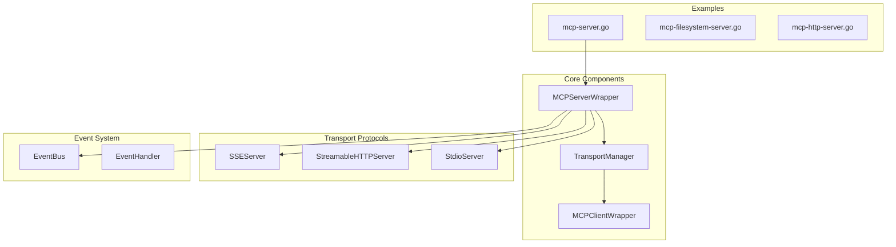
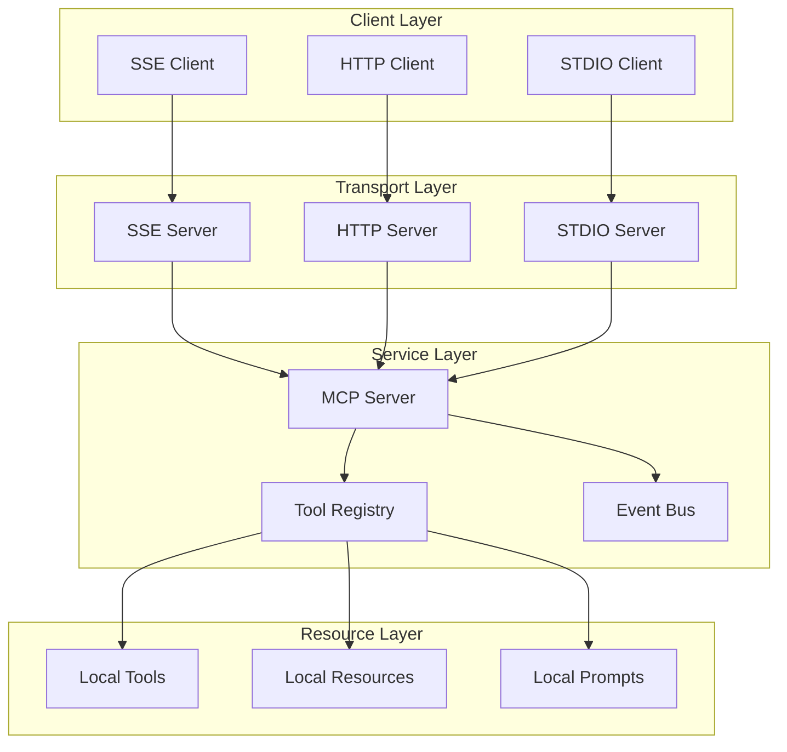
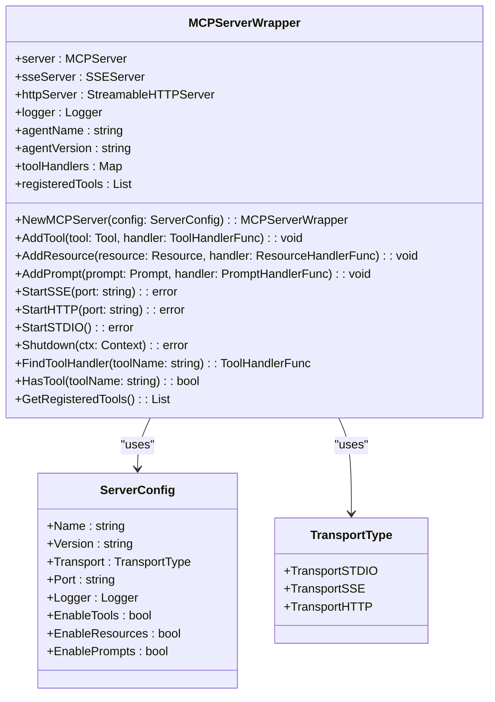
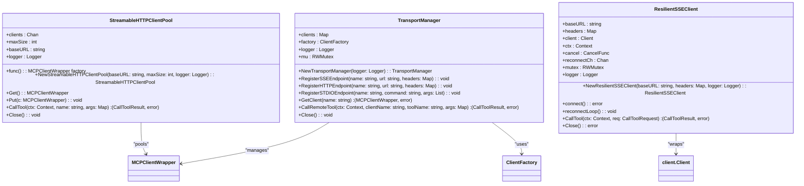
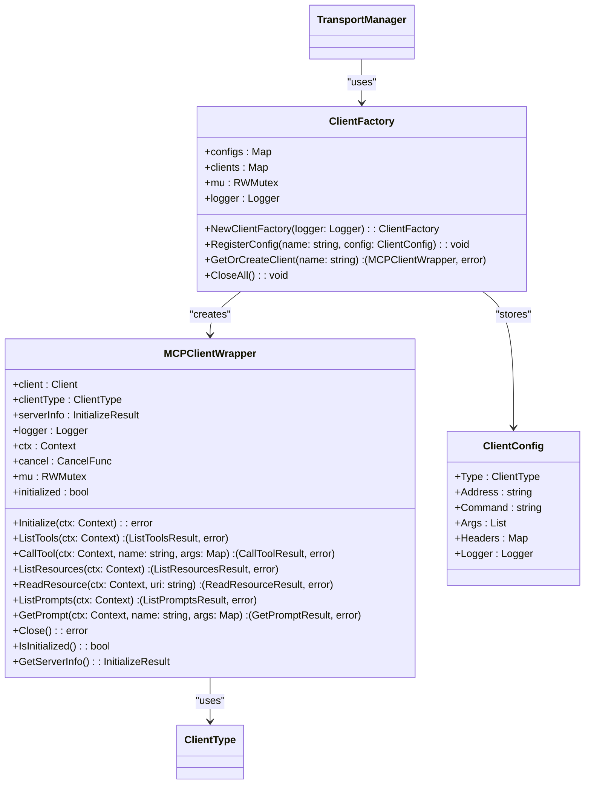
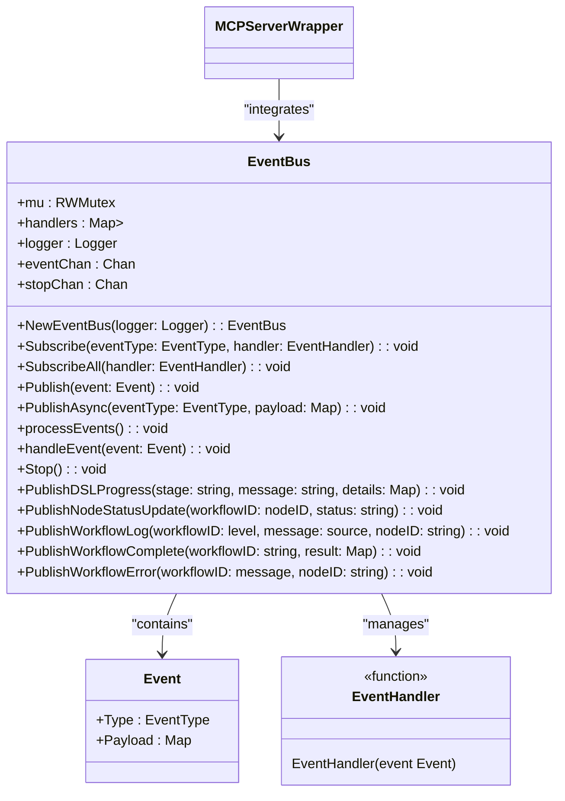
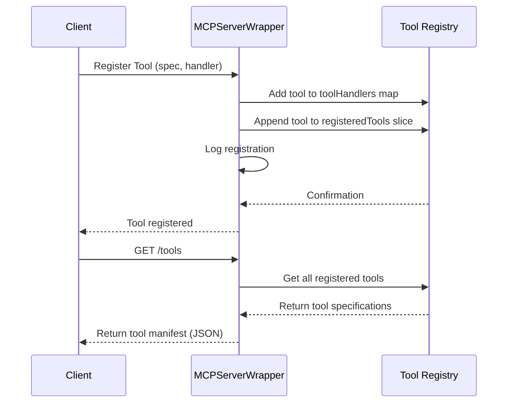
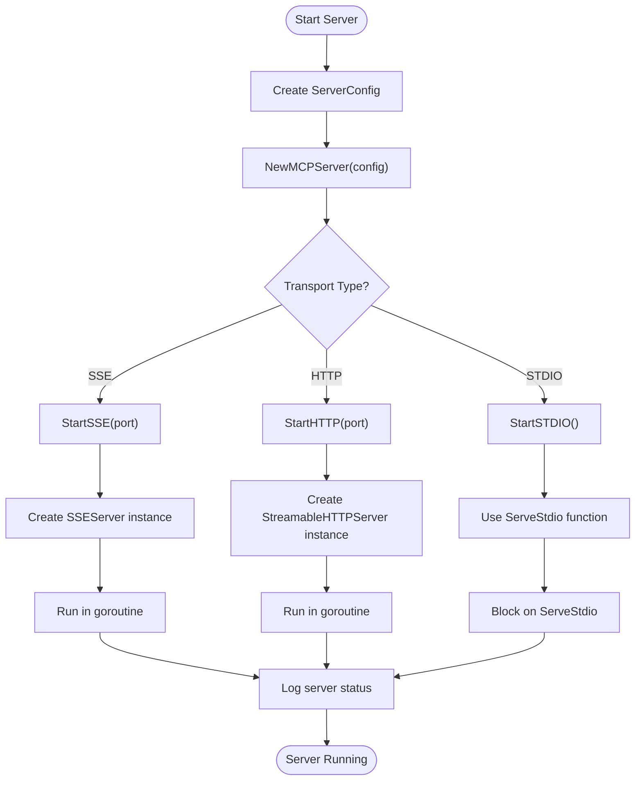
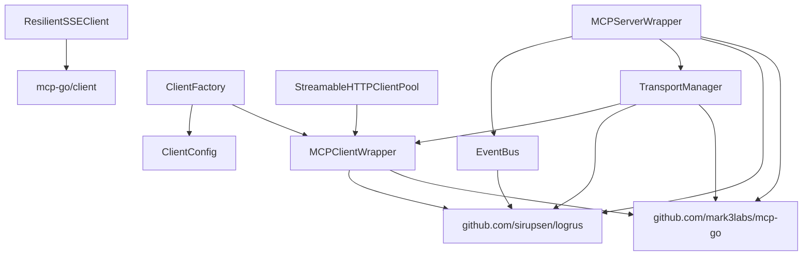

# MCP Server Implementation

## Table of Contents
1. [Introduction](#introduction)
2. [Project Structure](#project-structure)
3. [Core Components](#core-components)
4. [Architecture Overview](#architecture-overview)
5. [Detailed Component Analysis](#detailed-component-analysis)
6. [Dependency Analysis](#dependency-analysis)
7. [Performance Considerations](#performance-considerations)
8. [Troubleshooting Guide](#troubleshooting-guide)
9. [Conclusion](#conclusion)

## Introduction
The MCP Server component provides a modular framework for exposing local tools and resources through multiple transport protocols including SSE, HTTP, and STDIO. It implements the MCP (Modular Control Protocol) specification to enable interoperability between agents and tools in a distributed system. The server supports dynamic tool registration, capability discovery, and real-time event streaming through Server-Sent Events. This document details the implementation architecture, initialization process, transport abstraction, and integration patterns that enable flexible deployment and extensibility.

## Project Structure
The MCP Server implementation is organized within the internal/mcp directory, with supporting components in related packages. The core server logic is separated from transport mechanisms, allowing protocol-agnostic service implementation. The examples directory contains reference implementations demonstrating various deployment scenarios.

**Diagram sources**
- [server.go](file://internal/mcp/server.go#L13-L22)
- [transport.go](file://internal/mcp/transport.go#L13-L18)
- [client.go](file://internal/mcp/client.go#L28-L37)

**Section sources**
- [server.go](file://internal/mcp/server.go#L1-L327)
- [transport.go](file://internal/mcp/transport.go#L1-L295)

## Core Components
The MCP Server implementation consists of several key components that work together to provide a flexible and extensible platform for tool exposure. The MCPServerWrapper serves as the main entry point, managing server lifecycle and tool registration. The TransportManager handles communication with remote endpoints, while the EventBus enables real-time event distribution. Each component is designed to be protocol-agnostic, allowing seamless integration across different deployment scenarios.

**Section sources**
- [server.go](file://internal/mcp/server.go#L13-L22)
- [transport.go](file://internal/mcp/transport.go#L13-L18)
- [client.go](file://internal/mcp/client.go#L28-L37)

## Architecture Overview
The MCP Server architecture follows a layered design pattern, separating concerns between service logic, transport mechanisms, and event distribution. The core server component exposes tools through multiple transport layers, each implementing the same underlying protocol but optimized for different deployment scenarios. The transport abstraction layer enables protocol-agnostic communication, allowing clients to interact with the server regardless of the underlying transport mechanism.

**Diagram sources**
- [server.go](file://internal/mcp/server.go#L43-L74)
- [transport.go](file://internal/mcp/transport.go#L79-L88)
- [client.go](file://internal/mcp/client.go#L28-L37)

## Detailed Component Analysis

### MCPServerWrapper Analysis
The MCPServerWrapper struct serves as the primary interface for the MCP Server, encapsulating the underlying server implementation and providing a simplified API for initialization, tool registration, and transport management. It maintains references to registered tools and their handlers, enabling dynamic discovery and execution.

**Diagram sources**
- [server.go](file://internal/mcp/server.go#L13-L22)
- [server.go](file://internal/mcp/server.go#L43-L74)

**Section sources**
- [server.go](file://internal/mcp/server.go#L13-L327)

### TransportManager Analysis
The TransportManager component provides a centralized mechanism for managing connections to remote MCP endpoints through various transport protocols. It maintains a registry of client configurations and handles the lifecycle of client connections, including automatic reconnection for resilient communication.

**Diagram sources**
- [transport.go](file://internal/mcp/transport.go#L13-L18)
- [transport.go](file://internal/mcp/transport.go#L79-L88)
- [transport.go](file://internal/mcp/transport.go#L200-L294)

**Section sources**
- [transport.go](file://internal/mcp/transport.go#L1-L295)

### MCPClientWrapper Analysis
The MCPClientWrapper provides a unified interface for communicating with remote MCP servers regardless of the underlying transport protocol. It handles connection initialization, request routing, and response processing, abstracting the complexities of protocol-specific implementations.

**Diagram sources**
- [client.go](file://internal/mcp/client.go#L28-L37)
- [client.go](file://internal/mcp/client.go#L60-L69)
- [client.go](file://internal/mcp/client.go#L200-L291)

**Section sources**
- [client.go](file://internal/mcp/client.go#L1-L292)

### EventBus Analysis
The EventBus component enables real-time communication between different parts of the system through a publish-subscribe pattern. It facilitates event-driven architecture by allowing components to broadcast events and subscribe to specific event types, supporting both synchronous and asynchronous event processing.

**Diagram sources**
- [event_bus.go](file://internal/bus/event_bus.go#L24-L35)
- [event_bus.go](file://internal/bus/event_bus.go#L41-L50)
- [event_bus.go](file://internal/bus/event_bus.go#L52-L61)

**Section sources**
- [event_bus.go](file://internal/bus/event_bus.go#L1-L189)

### Tool Registration and Manifest Generation
The MCP Server supports dynamic tool registration through the AddTool method, which accepts a tool specification and handler function. Registered tools are tracked in both the toolHandlers map and registeredTools slice, enabling both execution and discovery. The server automatically exposes registered tools through the /tools endpoint, generating a comprehensive manifest that includes input schema, descriptions, and required parameters.

**Diagram sources**
- [server.go](file://internal/mcp/server.go#L76-L81)
- [server.go](file://internal/mcp/server.go#L95-L97)
- [mcp-server.go](file://examples/mcp-server.go#L56-L156)

**Section sources**
- [server.go](file://internal/mcp/server.go#L76-L81)
- [server.go](file://internal/mcp/server.go#L95-L97)

### Transport Abstraction Layer
The transport abstraction layer enables protocol-agnostic communication by providing a consistent interface across different transport mechanisms. The MCPServerWrapper exposes separate methods for starting servers on different transports (SSE, HTTP, STDIO), each of which wraps the core server instance with transport-specific adapters.

**Diagram sources**
- [server.go](file://internal/mcp/server.go#L109-L121)
- [server.go](file://internal/mcp/server.go#L123-L135)
- [server.go](file://internal/mcp/server.go#L137-L140)

**Section sources**
- [server.go](file://internal/mcp/server.go#L109-L140)

## Dependency Analysis
The MCP Server implementation has a well-defined dependency structure that separates concerns between core functionality, transport mechanisms, and external integrations. The core server component depends on the mcp-go library for protocol implementation, while transport components depend on both the core server and networking libraries.

**Diagram sources**
- [go.mod](file://go.mod#L1-L20)
- [server.go](file://internal/mcp/server.go#L1-L20)
- [transport.go](file://internal/mcp/transport.go#L1-L20)

**Section sources**
- [go.mod](file://go.mod#L1-L30)
- [server.go](file://internal/mcp/server.go#L1-L327)

## Performance Considerations
The MCP Server implementation includes several performance optimizations to handle concurrent requests and maintain responsiveness. The StreamableHTTPClientPool implements connection pooling to reduce the overhead of establishing new connections for each request. The EventBus uses buffered channels and goroutines to prevent blocking during event processing. The ResilientSSEClient implements automatic reconnection with exponential backoff to maintain connectivity in unstable network conditions.

For high-throughput scenarios, the HTTP transport with connection pooling provides the best performance characteristics. The SSE transport is optimized for real-time event streaming, while STDIO is suitable for local process communication with minimal overhead. Configuration options such as connection pool size and reconnection timeouts can be tuned based on specific deployment requirements.

## Troubleshooting Guide
Common issues with the MCP Server typically relate to transport configuration, tool registration, or network connectivity. Error handling is implemented consistently across components, with detailed logging to facilitate diagnosis.

**Initialization Errors**: Ensure that the ServerConfig includes valid values for Name and Version. The logger should be properly configured to capture diagnostic information.

**Transport-Specific Issues**:
- SSE: Verify that the port is available and not blocked by firewalls
- HTTP: Check that the port binding configuration is correct
- STDIO: Ensure that the parent process properly handles stdin/stdout

**Connection Problems**: For remote endpoints, validate that URLs are correct and accessible. The ResilientSSEClient will automatically attempt reconnection, but persistent failures may indicate network issues or server unavailability.

**Tool Execution Failures**: Verify that tools are properly registered with both specification and handler. Check that input parameters match the expected schema defined in the tool specification.

**Section sources**
- [server.go](file://internal/mcp/server.go#L142-L149)
- [transport.go](file://internal/mcp/transport.go#L142-L188)
- [client.go](file://internal/mcp/client.go#L100-L120)

## Conclusion
The MCP Server implementation provides a robust and flexible framework for exposing local tools through multiple transport protocols. Its modular architecture separates concerns between service logic, transport mechanisms, and event distribution, enabling easy extension and maintenance. The transport abstraction layer allows protocol-agnostic development, while the EventBus enables real-time communication between system components. With support for dynamic tool registration, comprehensive error handling, and performance optimizations, the MCP Server is well-suited for both local development and production deployment in distributed agent systems.

**Referenced Files in This Document**
- [server.go](file://internal/mcp/server.go#L1-L327)
- [transport.go](file://internal/mcp/transport.go#L1-L295)
- [client.go](file://internal/mcp/client.go#L1-L292)
- [event_bus.go](file://internal/bus/event_bus.go#L1-L189)
- [mcp-server.go](file://examples/mcp-server.go#L1-L591)
