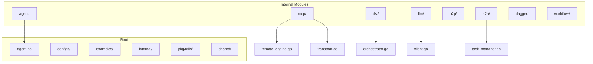
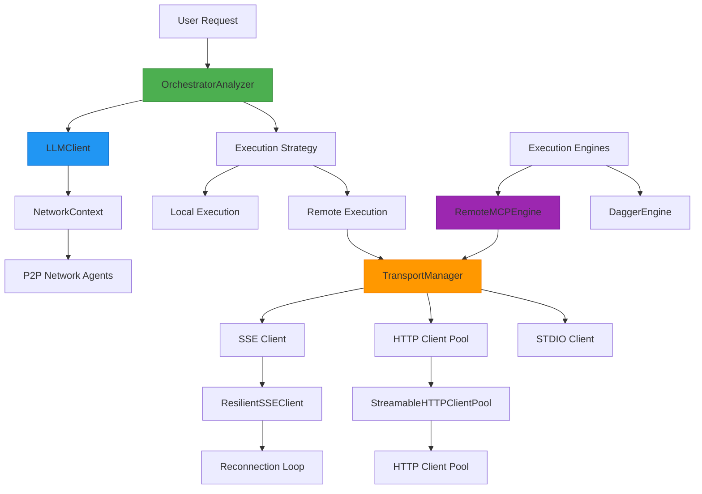
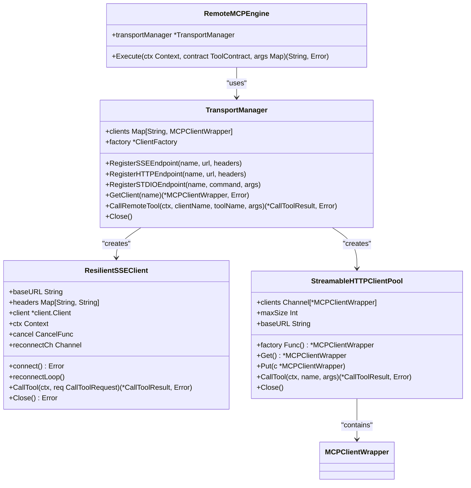
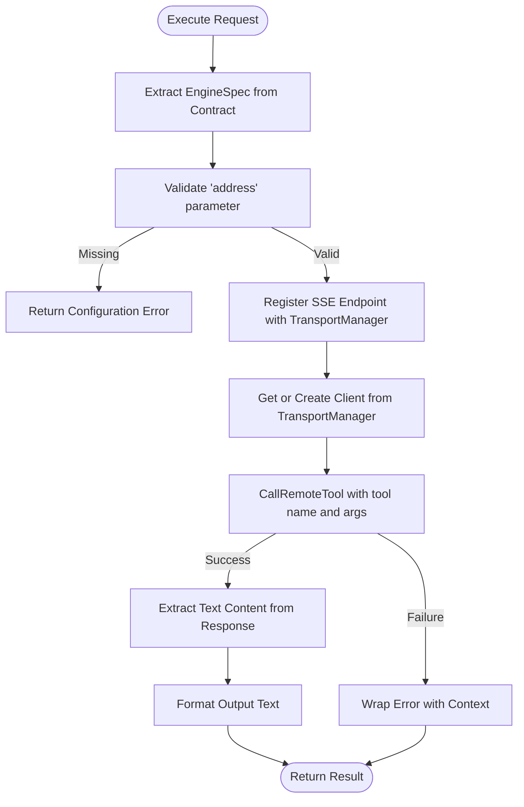
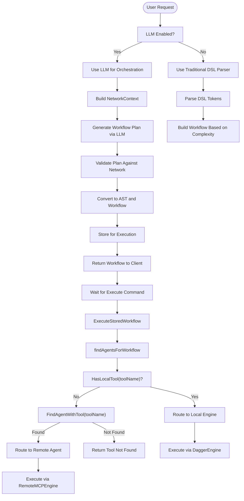
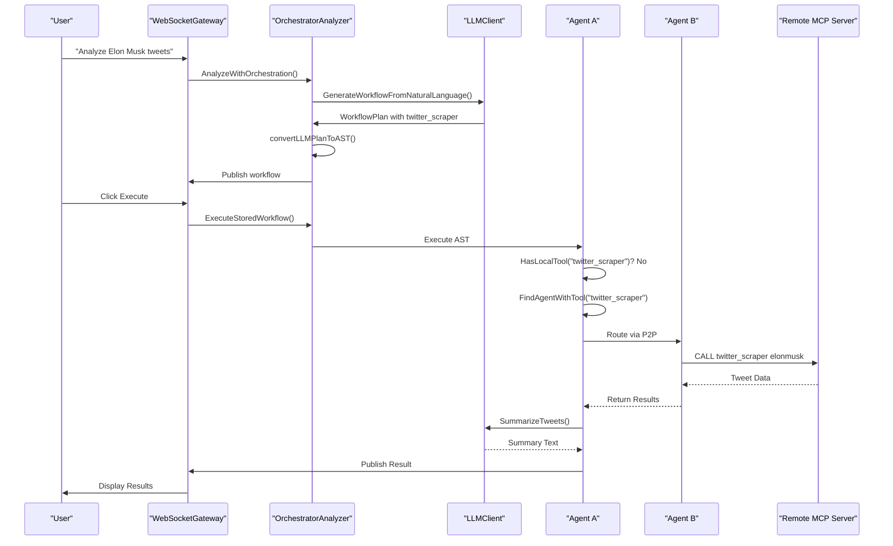
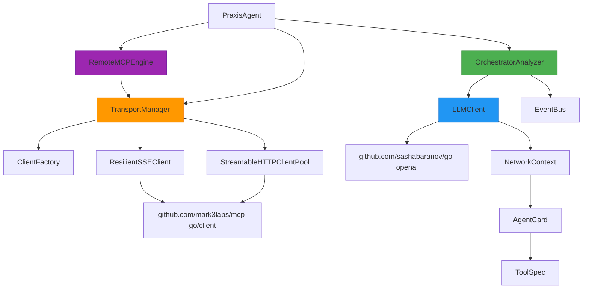

# Remote MCP Engine Integration


## Table of Contents
1. [Introduction](#introduction)
2. [Project Structure](#project-structure)
3. [Core Components](#core-components)
4. [Architecture Overview](#architecture-overview)
5. [Detailed Component Analysis](#detailed-component-analysis)
6. [Dependency Analysis](#dependency-analysis)
7. [Performance Considerations](#performance-considerations)
8. [Troubleshooting Guide](#troubleshooting-guide)
9. [Conclusion](#conclusion)

## Introduction
The Remote MCP Engine enables distributed task execution across a peer-to-peer network of agents by delegating tool calls to remote MCP (Multi-Component Protocol) servers. This document details the architecture, routing logic, and execution mechanisms that allow the orchestrator to dynamically route tasks based on tool availability, agent capabilities, and cost metrics. The system supports resilient communication via SSE (Server-Sent Events), HTTP streaming, and STDIO transports, with intelligent fallbacks and retry mechanisms. It integrates AI-driven workflow planning using LLMs to optimize task distribution and execution strategies across the network.

## Project Structure
The project follows a modular Go structure with clear separation of concerns. Core functionality is organized under the `internal` directory, with key components for agent management, MCP communication, orchestration, and P2P networking.



**Diagram sources**
- [remote_engine.go](file://internal/mcp/remote_engine.go#L1-L52)
- [transport.go](file://internal/mcp/transport.go#L1-L294)
- [orchestrator.go](file://internal/dsl/orchestrator.go#L1-L1171)

**Section sources**
- [remote_engine.go](file://internal/mcp/remote_engine.go#L1-L52)
- [transport.go](file://internal/mcp/transport.go#L1-L294)

## Core Components

The Remote MCP Engine system consists of several interconnected components that enable distributed task execution:

- **RemoteMCPEngine**: Executes tool contracts by routing to remote MCP servers
- **TransportManager**: Manages client connections and communication protocols
- **OrchestratorAnalyzer**: Determines execution strategy using LLM-based planning
- **LLMClient**: Interfaces with OpenAI to generate workflow plans
- **PraxisAgent**: Hosts execution engines and manages agent lifecycle

These components work together to enable intelligent, resilient, and scalable cross-agent task execution.

**Section sources**
- [remote_engine.go](file://internal/mcp/remote_engine.go#L1-L52)
- [orchestrator.go](file://internal/dsl/orchestrator.go#L1-L1171)
- [client.go](file://internal/llm/client.go#L1-L418)

## Architecture Overview

The Remote MCP Engine architecture enables distributed task execution through a layered approach that combines protocol abstraction, intelligent routing, and AI-driven orchestration.



**Diagram sources**
- [remote_engine.go](file://internal/mcp/remote_engine.go#L1-L52)
- [transport.go](file://internal/mcp/transport.go#L1-L294)
- [orchestrator.go](file://internal/dsl/orchestrator.go#L1-L1171)
- [client.go](file://internal/llm/client.go#L1-L418)

## Detailed Component Analysis

### Remote MCP Engine Analysis

The RemoteMCPEngine is responsible for executing tool contracts on remote MCP servers. It uses the TransportManager to handle communication and implements a simple but effective routing mechanism based on tool specifications.



**Diagram sources**
- [remote_engine.go](file://internal/mcp/remote_engine.go#L1-L52)
- [transport.go](file://internal/mcp/transport.go#L1-L294)

**Section sources**
- [remote_engine.go](file://internal/mcp/remote_engine.go#L1-L52)
- [transport.go](file://internal/mcp/transport.go#L1-L294)

#### Request Routing Logic

The RemoteMCPEngine routes requests based on the engine specification in the tool contract. When a tool execution request arrives, the engine extracts the remote address from the contract's EngineSpec and registers it with the TransportManager if not already present.



**Diagram sources**
- [remote_engine.go](file://internal/mcp/remote_engine.go#L1-L52)

**Section sources**
- [remote_engine.go](file://internal/mcp/remote_engine.go#L1-L52)

#### Payload Serialization and Response Handling

The Remote MCP Engine handles payload serialization and response parsing through the underlying MCP client libraries. The TransportManager abstracts the communication protocol, while the ResilientSSEClient handles the actual data exchange.

```go
// Execute method from remote_engine.go
func (e *RemoteMCPEngine) Execute(ctx context.Context, contract contracts.ToolContract, args map[string]interface{}) (string, error) {
    spec := contract.EngineSpec
    address, ok := spec["address"].(string)
    if !ok || address == "" {
        return "", fmt.Errorf("remote-mcp spec missing 'address' for tool '%s'", contract.Name)
    }

    clientName := address
    e.transportManager.RegisterSSEEndpoint(clientName, address, nil)

    toolName := contract.Name
    result, err := e.transportManager.CallRemoteTool(ctx, clientName, toolName, args)
    if err != nil {
        return "", fmt.Errorf("failed to call remote tool '%s' at '%s': %w", toolName, address, err)
    }

    if result != nil && len(result.Content) > 0 {
        if textContent, ok := result.Content[0].(*mcpTypes.TextContent); ok {
            return textContent.Text, nil
        }
    }

    return fmt.Sprintf("Tool '%s' executed successfully with no text output.", toolName), nil
}
```

The response handling extracts text content from the MCP response and returns it as a string. If no text content is found, a success message is generated.

**Section sources**
- [remote_engine.go](file://internal/mcp/remote_engine.go#L1-L52)

### Retry Policies and Circuit Breaker Patterns

The Remote MCP Engine implements resilient communication through the ResilientSSEClient, which features automatic reconnection and retry logic.

```mermaid
sequenceDiagram
participant Client as "RemoteMCPEngine"
participant Transport as "TransportManager"
participant Resilient as "ResilientSSEClient"
participant MCP as "Remote MCP Server"
Client->>Transport : CallRemoteTool()
Transport->>Resilient : CallTool()
Resilient->>Resilient : Acquire Read Lock
alt Client Connected
Resilient->>MCP : Send Request
MCP-->>Resilient : Response
Resilient-->>Transport : Return Result
else Connection Error
Resilient->>Resilient : Trigger Reconnect
Resilient->>Resilient : Send to reconnectCh
Resilient->>Resilient : Start reconnectLoop
loop 5 Attempts
Resilient->>Resilient : connect() with backoff
Resilient->>MCP : Initialize Connection
alt Success
Resilient->>Resilient : Update client reference
break
end
end
Resilient-->>Transport : Return Connection Error
end
Transport-->>Client : Return Result or Error
```

The retry policy includes:
- 5 reconnection attempts with exponential backoff (1s, 2s, 3s, 4s, 5s)
- Context cancellation support for graceful shutdown
- Non-blocking reconnection channel to prevent goroutine leaks
- Timeout of 30 seconds for initialization

**Diagram sources**
- [transport.go](file://internal/mcp/transport.go#L1-L294)

**Section sources**
- [transport.go](file://internal/mcp/transport.go#L1-L294)

### Latency Monitoring Implementation

While explicit latency monitoring code is not visible in the provided files, the architecture supports performance tracking through:
- Structured logging with timestamps
- Event publishing via EventBus for progress tracking
- Configurable timeouts for connection and request operations
- Performance metrics in LLM-generated workflow plans

The system could be extended to include explicit latency monitoring by:
1. Adding timing instrumentation in the TransportManager
2. Publishing performance events to the EventBus
3. Including latency estimates in the PlanMetadata
4. Implementing circuit breaker thresholds based on response times

### Orchestrator Decision Logic

The OrchestratorAnalyzer determines whether to execute tasks locally or route them to remote agents based on tool availability, agent capabilities, and AI-driven planning.



**Diagram sources**
- [orchestrator.go](file://internal/dsl/orchestrator.go#L1-L1171)

**Section sources**
- [orchestrator.go](file://internal/dsl/orchestrator.go#L1-L1171)

The decision logic prioritizes:
1. **Tool Availability**: Checks if the tool exists locally or on remote agents
2. **Agent Capabilities**: Uses peer cards to understand agent specializations
3. **Cost Metrics**: LLM considers estimated duration and parallelism factor
4. **Locality**: Prefers local execution when possible to minimize latency

### Cross-Agent Workflow Execution

The system supports complex workflows that span multiple agents through the A2A (Agent-to-Agent) task management system.



**Diagram sources**
- [orchestrator.go](file://internal/dsl/orchestrator.go#L1-L1171)
- [client.go](file://internal/llm/client.go#L1-L418)
- [agent.go](file://internal/agent/agent.go#L1-L1562)

**Section sources**
- [orchestrator.go](file://internal/dsl/orchestrator.go#L1-L1171)
- [client.go](file://internal/llm/client.go#L1-L418)

### Error Propagation from Remote Endpoints

Error handling is implemented at multiple levels to ensure proper propagation from remote endpoints to the user interface.

```go
// From remote_engine.go
result, err := e.transportManager.CallRemoteTool(ctx, clientName, toolName, args)
if err != nil {
    return "", fmt.Errorf("failed to call remote tool '%s' at '%s': %w", toolName, address, err)
}
```

The error propagation chain:
1. **ResilientSSEClient**: Detects connection errors and triggers reconnection
2. **TransportManager**: Wraps client errors with context
3. **RemoteMCPEngine**: Wraps transport errors with tool and address context
4. **OrchestratorAnalyzer**: Converts errors to user-friendly messages
5. **EventBus**: Publishes error events to the WebSocket gateway
6. **WebSocketGateway**: Sends errors to the client UI

Critical error types include:
- Connection errors (handled with retries)
- Tool not found errors (invalid routing)
- Protocol errors (malformed requests/responses)
- Authentication errors (if implemented)
- Timeout errors (exceeded context deadline)

**Section sources**
- [remote_engine.go](file://internal/mcp/remote_engine.go#L1-L52)
- [transport.go](file://internal/mcp/transport.go#L1-L294)

### Configuration Options

The Remote MCP Engine supports various configuration options for connection management and secure communication.

#### Connection Pooling and Keep-Alive Settings

The StreamableHTTPClientPool implements connection pooling for HTTP-based MCP servers:

```go
func NewStreamableHTTPClientPool(baseURL string, maxSize int, logger *logrus.Logger) *StreamableHTTPClientPool {
    pool := &StreamableHTTPClientPool{
        clients: make(chan *MCPClientWrapper, maxSize),
        maxSize: maxSize,
        baseURL: baseURL,
        logger:  logger,
    }
    
    // Pre-create clients up to maxSize
    for i := 0; i < maxSize; i++ {
        if client := pool.factory(); client != nil {
            pool.clients <- client
        }
    }
    
    return pool
}
```

Key configuration parameters:
- **maxSize**: Maximum number of concurrent connections in the pool
- **baseURL**: Target MCP server address
- **factory**: Function to create new clients when pool is empty
- **clients**: Buffered channel that acts as the connection pool

The pool implements:
- Non-blocking Get() operation (returns new client if pool empty)
- Put() operation that returns clients to pool or closes excess connections
- Graceful Close() that closes all pooled connections

#### Secure Communication Configuration

While the provided code does not show explicit TLS configuration, secure communication can be enabled through:

1. **Environment Variables**: OPENAI_API_KEY for LLM communication
2. **Configuration Files**: agent.yaml for agent-specific settings
3. **Transport Configuration**: Headers for authentication tokens

The system could be extended to support:
- TLS certificates for HTTPS/SSE endpoints
- Mutual TLS authentication
- OAuth2 token management
- API key rotation
- Encrypted P2P communication

Configuration is managed through the AppConfig system loaded from YAML files:

```go
appConfig, err := appconfig.LoadConfig("configs/agent.yaml", logger)
if err != nil {
    logger.Warnf("Failed to load app config, using defaults: %v", err)
    appConfig = appconfig.DefaultConfig()
}
```

**Section sources**
- [transport.go](file://internal/mcp/transport.go#L1-L294)
- [agent.go](file://internal/agent/agent.go#L1-L1562)

## Dependency Analysis

The Remote MCP Engine system has a well-defined dependency structure that enables modularity and testability.



**Diagram sources**
- [remote_engine.go](file://internal/mcp/remote_engine.go#L1-L52)
- [transport.go](file://internal/mcp/transport.go#L1-L294)
- [orchestrator.go](file://internal/dsl/orchestrator.go#L1-L1171)
- [client.go](file://internal/llm/client.go#L1-L418)
- [agent.go](file://internal/agent/agent.go#L1-L1562)

**Section sources**
- [remote_engine.go](file://internal/mcp/remote_engine.go#L1-L52)
- [transport.go](file://internal/mcp/transport.go#L1-L294)
- [orchestrator.go](file://internal/dsl/orchestrator.go#L1-L1171)

## Performance Considerations

The Remote MCP Engine system implements several performance optimizations:

1. **Connection Pooling**: HTTP clients are pooled to reduce connection overhead
2. **Resilient Communication**: SSE clients maintain persistent connections with automatic reconnection
3. **Asynchronous Processing**: Long-running tasks are handled asynchronously
4. **Caching**: LLM responses and network context are effectively cached
5. **Parallel Execution**: Workflows can execute multiple tasks in parallel

Performance bottlenecks to consider:
- **LLM Latency**: External API calls for workflow planning
- **Network Latency**: Cross-agent communication over P2P network
- **Serialization Overhead**: JSON marshaling/unmarshaling of large payloads
- **Connection Establishment**: Initial setup time for new remote connections

Optimization recommendations:
1. Implement client-side caching for frequently accessed remote tools
2. Add connection warm-up for critical remote endpoints
3. Implement request batching for high-frequency tool calls
4. Add circuit breakers to prevent cascading failures
5. Monitor and optimize LLM prompt engineering for faster responses

## Troubleshooting Guide

Common issues and their solutions:

**Connection Failures**
- **Symptom**: "failed to call remote tool" errors
- **Cause**: Network issues, server downtime, or incorrect addresses
- **Solution**: Verify the address in the tool contract and check server status

**Tool Not Found**
- **Symptom**: "tool not found on any agent" errors
- **Cause**: Tool not registered or agent not discovered
- **Solution**: Check peer cards and tool registration

**LLM Integration Issues**
- **Symptom**: "LLM client not enabled" messages
- **Cause**: Missing OPENAI_API_KEY environment variable
- **Solution**: Set OPENAI_API_KEY or disable LLM features

**Authentication Errors**
- **Symptom**: Connection refused or unauthorized responses
- **Cause**: Missing authentication headers
- **Solution**: Configure headers in the endpoint registration

**Performance Problems**
- **Symptom**: Slow response times or timeouts
- **Cause**: Network latency or overloaded remote servers
- **Solution**: Implement caching, connection pooling, or load balancing

Debugging steps:
1. Check logs for error messages and stack traces
2. Verify network connectivity between agents
3. Test remote endpoints independently
4. Review configuration files for correct settings
5. Monitor resource usage on all involved systems

**Section sources**
- [remote_engine.go](file://internal/mcp/remote_engine.go#L1-L52)
- [transport.go](file://internal/mcp/transport.go#L1-L294)
- [orchestrator.go](file://internal/dsl/orchestrator.go#L1-L1171)

## Conclusion

The Remote MCP Engine provides a robust framework for distributed task execution across a network of agents. By combining protocol abstraction, intelligent routing, and AI-driven orchestration, it enables complex workflows that leverage the capabilities of multiple specialized agents. The system's modular architecture, resilient communication patterns, and flexible configuration options make it suitable for a wide range of distributed computing scenarios. Future enhancements could include more sophisticated load balancing, advanced circuit breaking, and enhanced security features to support production deployments at scale.

**Referenced Files in This Document**   
- [remote_engine.go](file://internal/mcp/remote_engine.go#L1-L52)
- [transport.go](file://internal/mcp/transport.go#L1-L294)
- [orchestrator.go](file://internal/dsl/orchestrator.go#L1-L1171)
- [client.go](file://internal/llm/client.go#L1-L418)
- [agent.go](file://internal/agent/agent.go#L1-L1562)
- [types.go](file://internal/a2a/types.go#L1-L100)