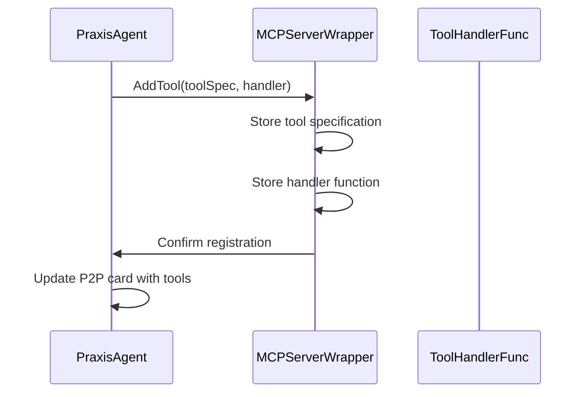
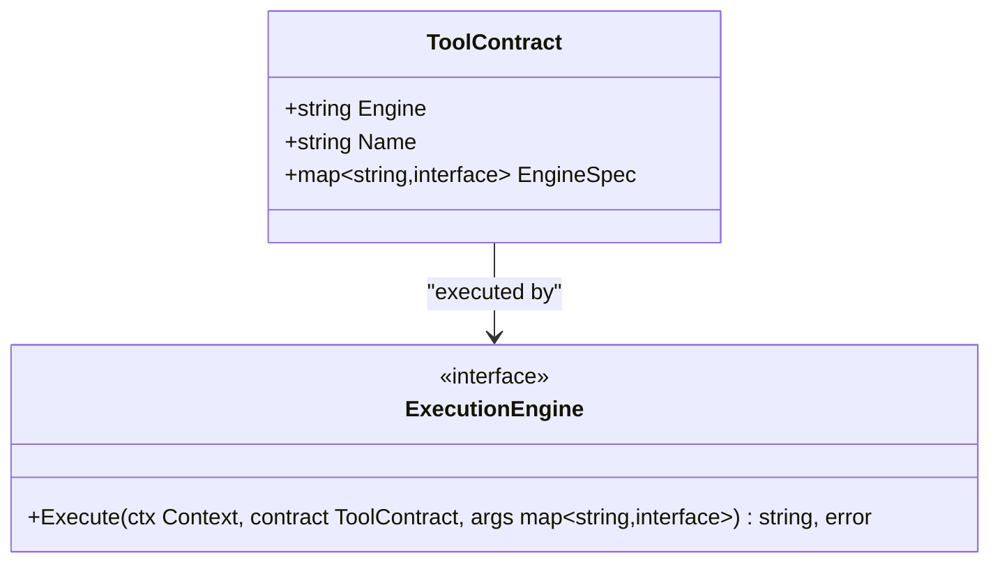
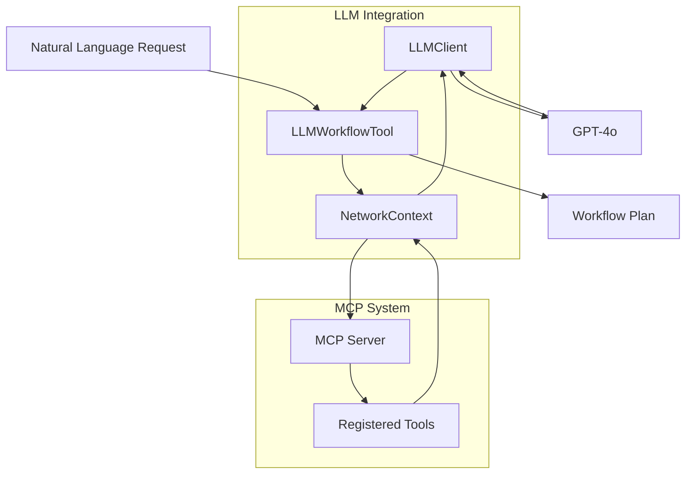
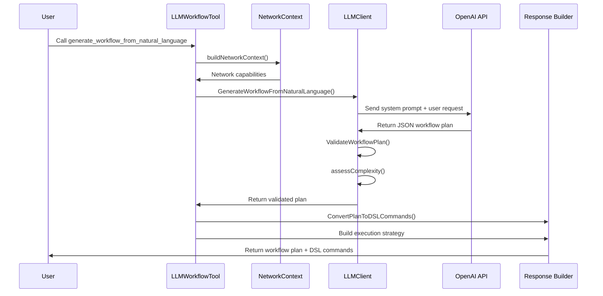

# Tool Registration and LLM Integration

## Table of Contents
1. [Introduction](#introduction)
2. [Tool Registration Process](#tool-registration-process)
3. [Tool Contract Mapping](#tool-contract-mapping)
4. [LLM Integration Architecture](#llm-integration-architecture)
5. [Workflow Generation Flow](#workflow-generation-flow)
6. [Security Considerations](#security-considerations)

## Introduction
This document details the mechanism for registering local tools with the MCP server and integrating them with LLM-powered workflow generation. The system enables natural language commands to be translated into structured tool invocations across a distributed P2P network. The architecture combines MCP (Modular Control Plane) tool registration, JSON-RPC compatible contracts, and LLM-driven orchestration to create an intelligent agent network capable of executing complex workflows.

## Tool Registration Process

The tool registration process enables local tools to be programmatically exposed as callable endpoints through the MCP server. Tools are registered with both specifications and handlers that define their execution logic.

**Diagram sources**
- [agent.go](file://internal/agent/agent.go#L329-L366)
- [server.go](file://internal/mcp/server.go#L60-L97)

**Section sources**
- [agent.go](file://internal/agent/agent.go#L329-L366)
- [server.go](file://internal/mcp/server.go#L60-L97)

Tools are registered through the `AddTool` method of the `MCPServerWrapper`, which stores both the tool specification and its handler function. The process involves:

1. **Tool Specification Creation**: Using `mcpTypes.NewTool()` with parameters defined via `WithDescription`, `WithString`, `WithNumber`, or `WithBoolean` options
2. **Handler Function Assignment**: Associating a `ToolHandlerFunc` that receives `CallToolRequest` and returns `CallToolResult`
3. **Storage**: The MCP server maintains two internal maps: `toolHandlers` for execution logic and `registeredTools` for metadata
4. **P2P Card Update**: After registration, the agent's P2P card is updated to advertise available tools to the network

Configuration-based tools are registered during agent initialization by iterating through tool configurations and creating generic handlers via `createGenericHandler`. External tools discovered via MCP endpoints are registered with proxy handlers that route calls through the `remoteEngine`.

## Tool Contract Mapping

The system uses `ToolContract` structures to map Go function signatures to JSON-RPC compatible tool contracts that can be executed across different engines.

**Diagram sources**
- [execution.go](file://internal/contracts/execution.go#L0-L14)

**Section sources**
- [execution.go](file://internal/contracts/execution.go#L0-L14)
- [agent.go](file://internal/agent/agent.go#L1066-L1101)

The `ToolContract` struct serves as a language-agnostic API contract with three key fields:
- **Engine**: Specifies the execution engine ("dagger", "remote-mcp", etc.)
- **Name**: Identifies the tool to be executed
- **EngineSpec**: Contains engine-specific configuration as key-value pairs

When a tool is invoked, the MCP server creates a `ToolContract` from the tool specification and passes it to the appropriate `ExecutionEngine`. For remote tools, the `EngineSpec` contains the address of the remote MCP server. The `ExecutionEngine` interface abstracts the execution details, allowing different engines to handle contracts according to their specific requirements.

Parameter mapping occurs during tool specification creation, where JSON schema types are converted to MCP type options:
- `"string"` → `mcpTypes.WithString()`
- `"number"` or `"integer"` → `mcpTypes.WithNumber()`
- `"boolean"` → `mcpTypes.WithBoolean()`

This mapping enables dynamic tool discovery from external MCP servers while maintaining compatibility with the local execution framework.

## LLM Integration Architecture

The LLM integration architecture enables natural language queries to be translated into structured tool invocations through a dedicated `LLMClient` and `LLMWorkflowTool`.

**Diagram sources**
- [client.go](file://internal/llm/client.go#L68-L121)
- [mcp_tool.go](file://internal/llm/mcp_tool.go#L48-L71)

**Section sources**
- [client.go](file://internal/llm/client.go#L68-L121)
- [mcp_tool.go](file://internal/llm/mcp_tool.go#L48-L71)

The architecture consists of:
- **LLMClient**: Manages interactions with the OpenAI API, handling chat completion requests and response parsing
- **LLMWorkflowTool**: An MCP tool that exposes LLM-powered workflow generation as a callable endpoint
- **NetworkContext**: Represents the current state of the P2P network, including agent capabilities and available tools

The `LLMWorkflowTool` registers a tool called `generate_workflow_from_natural_language` with parameters for the natural language request and whether to include network analysis. When invoked, it orchestrates the workflow generation process by gathering network context, calling the LLM, and formatting the response.

## Workflow Generation Flow

The end-to-end flow from natural language input to executable workflow involves several stages: context gathering, LLM processing, plan validation, and response formatting.

**Diagram sources**
- [client.go](file://internal/llm/client.go#L123-L165)
- [mcp_tool.go](file://internal/llm/mcp_tool.go#L101-L142)

**Section sources**
- [client.go](file://internal/llm/client.go#L123-L165)
- [mcp_tool.go](file://internal/llm/mcp_tool.go#L101-L142)

The workflow generation process follows these steps:

1. **Context Gathering**: The `buildNetworkContext` method collects information about all agents in the network, including their capabilities and available tools. This context is structured as a `NetworkContext` containing `AgentCapability` objects.

2. **System Prompt Construction**: The LLM client builds a system prompt that includes detailed documentation of all available tools, their parameters, and usage instructions. This enables the LLM to make informed decisions about tool selection.

3. **LLM Request**: A chat completion request is sent to GPT-4o with the system prompt and user request. The LLM is instructed to return a valid JSON workflow plan without any additional prose.

4. **Response Processing**: The raw LLM response is cleaned of markdown code blocks and unmarshaled into a `WorkflowPlan` struct. The response undergoes validation to ensure all referenced agents and tools exist.

5. **Plan Validation**: The `ValidateWorkflowPlan` method checks that all required fields are present and that referenced agents exist in the network context. This prevents the generation of invalid execution plans.

6. **Complexity Assessment**: If not provided by the LLM, the complexity is determined based on node and edge counts: 1 node = "simple", 2-3 nodes = "medium", 4+ nodes = "complex".

7. **DSL Conversion**: The validated plan is converted to executable DSL commands using `ConvertPlanToDSLCommands`, which generates appropriate `CALL` or `CALL_REMOTE` instructions.

8. **Response Formatting**: A comprehensive response is built containing the workflow plan, DSL commands, execution strategy, and summary for UI display.

## Security Considerations

The system implements several security measures to protect against unauthorized access and malicious input when exposing tools through the LLM interface.

**Section sources**
- [agent.go](file://internal/agent/agent.go#L1066-L1101)
- [client.go](file://internal/llm/client.go#L167-L188)

Security considerations include:

- **Input Validation**: All tool parameters are validated according to their defined types during registration. String, number, and boolean parameters are explicitly typed to prevent injection attacks.

- **Network Context Filtering**: The system prompt construction process carefully formats tool information, including agent IDs and tool names, but does not expose sensitive configuration details.

- **LLM Output Sanitization**: The `cleanMarkdownJSON` function removes markdown code block delimiters from LLM responses to prevent injection of unwanted formatting or code.

- **Access Control**: Tool exposure is controlled through the P2P network discovery mechanism. Only tools explicitly registered with the MCP server are advertised to the network.

- **Error Handling**: Invalid workflow plans are rejected during validation, preventing the execution of potentially harmful command sequences.

- **Fallback Mechanism**: When the LLM is not available (due to missing API key), the system provides simple DSL suggestions rather than failing silently, maintaining functionality while reducing risk.

The architecture ensures that all tool executions occur within the established MCP framework, leveraging its built-in security model and execution controls rather than allowing direct LLM access to system functions.

**Referenced Files in This Document**
- [agent.go](file://internal/agent/agent.go#L329-L366)
- [server.go](file://internal/mcp/server.go#L60-L97)
- [client.go](file://internal/llm/client.go#L68-L121)
- [mcp_tool.go](file://internal/llm/mcp_tool.go#L48-L71)
- [execution.go](file://internal/contracts/execution.go#L0-L14)
- [client.go](file://internal/llm/client.go#L123-L165)
- [mcp_tool.go](file://internal/llm/mcp_tool.go#L101-L142)
- [client.go](file://internal/llm/client.go#L227-L276)
- [mcp_tool.go](file://internal/llm/mcp_tool.go#L214-L261)
- [agent.go](file://internal/agent/agent.go#L1066-L1101)
- [client.go](file://internal/llm/client.go#L167-L188)
