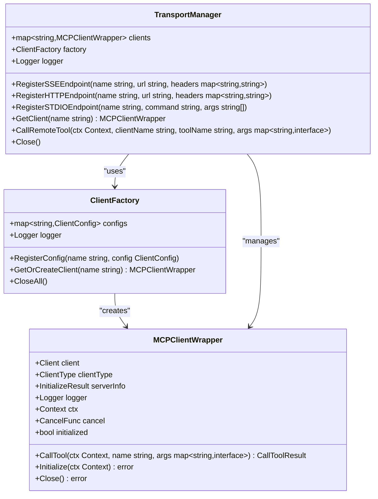
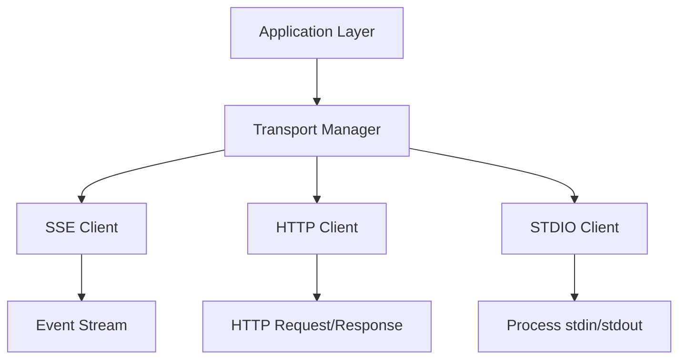
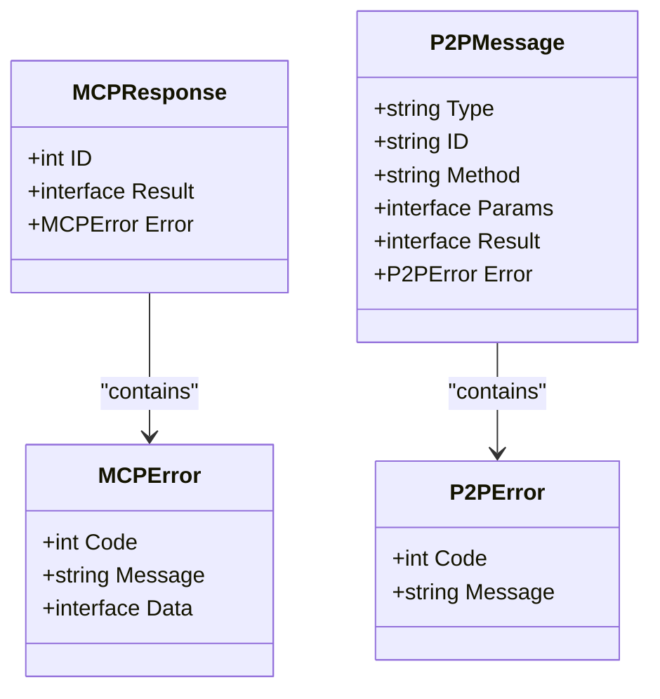

# Transport Adapters and Protocol Support


## Table of Contents
1. [Introduction](#introduction)
2. [Transport Abstraction Layer](#transport-abstraction-layer)
3. [Protocol Support and Message Framing](#protocol-support-and-message-framing)
4. [Error Serialization Formats](#error-serialization-formats)
5. [Backpressure and Flow Control](#backpressure-and-flow-control)
6. [Connection Lifecycle Management](#connection-lifecycle-management)
7. [Bidirectional Communication Mechanisms](#bidirectional-communication-mechanisms)
8. [Streaming Response Normalization](#streaming-response-normalization)
9. [Transport Configuration and Fallback](#transport-configuration-and-fallback)
10. [Performance Characteristics](#performance-characteristics)
11. [Transport Selection Guidance](#transport-selection-guidance)

## Introduction
The MCP Transport Adapters system provides a unified abstraction layer for communication across multiple transport protocols including SSE, HTTP, and STDIO. This documentation details the architecture, implementation, and configuration of the transport layer that enables seamless interoperability between different communication mechanisms while maintaining consistent interface patterns and error handling.

## Transport Abstraction Layer

The transport system implements a standardized interface that abstracts the underlying transport protocol details, allowing applications to interact with different transport types through a consistent API. The core abstraction is provided by the `TransportManager` which manages client connections and routing.



**Diagram sources**
- [transport.go](file://internal/mcp/transport.go#L0-L64)

**Section sources**
- [transport.go](file://internal/mcp/transport.go#L0-L64)

## Protocol Support and Message Framing

The system supports multiple transport protocols through specialized implementations that handle protocol-specific framing and message formatting. The primary transport types include SSE, HTTP, and STDIO, each with their own message framing characteristics.

### SSE Transport
Server-Sent Events (SSE) provides a streaming protocol for server-to-client communication with event-based message framing. The `ResilientSSEClient` implements automatic reconnection and error recovery.

### HTTP Transport
HTTP-based communication uses standard request-response patterns with JSON payloads. The `StreamableHTTPClientPool` manages connection pooling and reuse for improved performance.

### STDIO Transport
Standard I/O transport enables communication with external processes through stdin/stdout streams, allowing integration with command-line tools and subprocesses.



**Diagram sources**
- [transport.go](file://internal/mcp/transport.go#L0-L64)
- [transport.go](file://internal/mcp/transport.go#L171-L233)

**Section sources**
- [transport.go](file://internal/mcp/transport.go#L0-L294)

## Error Serialization Formats

The transport layer uses standardized error serialization formats across all protocol types, ensuring consistent error handling regardless of the underlying transport mechanism.

### MCP Error Format
```json
{
  "id": 1,
  "error": {
    "code": -32601,
    "message": "Method not found"
  }
}
```

### P2P Error Format
```json
{
  "type": "response",
  "id": "msg-123",
  "error": {
    "code": 404,
    "message": "Resource not found"
  }
}
```

The system defines a common error structure that maps to JSON-RPC 2.0 error conventions, with additional transport-specific error codes and messages.



**Diagram sources**
- [transport.go](file://internal/mcp/transport.go#L235-L293)
- [bridge.go](file://internal/p2p/bridge.go#L426-L470)

**Section sources**
- [transport.go](file://internal/mcp/transport.go#L235-L293)
- [bridge.go](file://internal/p2p/bridge.go#L426-L470)

## Backpressure and Flow Control

The transport layer implements flow control mechanisms to prevent overwhelming of resources during high-volume communication. These mechanisms vary by transport type but share common principles of rate limiting and connection management.

### Connection Pooling
The `StreamableHTTPClientPool` implements connection pooling to limit concurrent connections and prevent resource exhaustion:

```go
type StreamableHTTPClientPool struct {
    clients chan *MCPClientWrapper
    factory func() *MCPClientWrapper
    maxSize int
    baseURL string
    logger  *logrus.Logger
}
```

The pool uses a buffered channel to limit the number of concurrent connections, with a factory function to create new clients when needed.

### Rate Limiting
The system enforces rate limits through configuration parameters that control request frequency and concurrency:

```yaml
mcp:
  limits:
    maxConcurrentRequests: 100
    requestTimeoutMs: 30000
    maxResponseSizeBytes: 10485760
    connectionPoolSize: 5
    retryAttempts: 3
    retryBackoffMs: 1000
```

These limits are enforced at the transport manager level, providing consistent flow control across all transport types.

**Section sources**
- [transport.go](file://internal/mcp/transport.go#L235-L293)
- [types.go](file://internal/config/types.go#L137-L199)

## Connection Lifecycle Management

The transport system implements comprehensive connection lifecycle management, handling connection establishment, maintenance, and termination across different transport types.

### Connection Establishment
Connections are established through protocol-specific initialization sequences:

- **SSE**: The `ResilientSSEClient` performs an initialization handshake with timeout and retry logic
- **HTTP**: Connections are established through standard HTTP requests with connection pooling
- **STDIO**: External processes are spawned with stdin/stdout pipes for communication

### Automatic Reconnection
The SSE transport implements automatic reconnection with exponential backoff:

```go
func (rsc *ResilientSSEClient) reconnectLoop() {
    for {
        select {
        case <-rsc.ctx.Done():
            return
        case <-rsc.reconnectCh:
            rsc.logger.Info("Attempting to reconnect SSE client...")

            for attempt := 1; attempt <= 5; attempt++ {
                if err := rsc.connect(); err != nil {
                    rsc.logger.Errorf("Reconnection attempt %d failed: %v", attempt, err)

                    backoff := time.Duration(attempt) * time.Second
                    select {
                    case <-time.After(backoff):
                    case <-rsc.ctx.Done():
                        return
                    }
                } else {
                    rsc.logger.Info("Reconnected successfully")
                    break
                }
            }
        }
    }
}
```

### Connection Termination
Connections are gracefully terminated through the `Close()` method, which cancels contexts and releases resources:

```go
func (rsc *ResilientSSEClient) Close() error {
    rsc.cancel()

    rsc.mutex.Lock()
    defer rsc.mutex.Unlock()

    if rsc.client != nil {
        return rsc.client.Close()
    }

    return nil
}
```

**Section sources**
- [transport.go](file://internal/mcp/transport.go#L110-L169)
- [transport.go](file://internal/mcp/transport.go#L171-L233)

## Bidirectional Communication Mechanisms

The system achieves bidirectional communication through different transport mechanisms, enabling both request-response and event-driven communication patterns.

### P2P Bidirectional Streams
The P2P transport uses libp2p streams for bidirectional communication, with separate protocols for different message types:

```go
const (
    MCPProtocolID  = protocol.ID("/mcp/1.0.0")
    CardProtocolID = protocol.ID("/ai-agent/card/1.0.0")
)

func NewP2PMCPBridge(host host.Host, mcpServer *mcp.MCPServerWrapper, logger *logrus.Logger) *P2PMCPBridge {
    bridge := &P2PMCPBridge{
        host:         host,
        mcpServer:    mcpServer,
        transportMgr: mcp.NewTransportManager(logger),
        peerClients:  make(map[peer.ID]*mcp.MCPClientWrapper),
        logger:       logger,
        ctx:          ctx,
        cancel:       cancel,
    }

    host.SetStreamHandler(MCPProtocolID, bridge.handleMCPStream)
    host.SetStreamHandler(CardProtocolID, bridge.handleCardStream)

    return bridge
}
```

### Message Processing Loop
Each stream maintains a processing loop that handles incoming messages and sends responses:

```go
func (b *P2PMCPBridge) handleMCPStream(stream network.Stream) {
    defer stream.Close()

    peerID := stream.Conn().RemotePeer()
    decoder := json.NewDecoder(stream)
    encoder := json.NewEncoder(stream)

    for {
        var request MCPRequest
        if err := decoder.Decode(&request); err != nil {
            if err != io.EOF {
                b.logger.Errorf("Failed to decode MCP request: %v", err)
            }
            break
        }

        response := b.ProcessMCPRequest(request)

        if err := encoder.Encode(response); err != nil {
            b.logger.Errorf("Failed to encode MCP response: %v", err)
            break
        }
    }
}
```

**Section sources**
- [bridge.go](file://internal/p2p/bridge.go#L55-L104)
- [bridge.go](file://internal/p2p/bridge.go#L426-L470)

## Streaming Response Normalization

The transport layer normalizes streaming responses across different protocols, providing a consistent interface for handling streaming data regardless of the underlying transport.

### StreamableHTTPClientPool
The HTTP transport implements connection pooling with streaming support:

```go
func NewStreamableHTTPClientPool(baseURL string, maxSize int, logger *logrus.Logger) *StreamableHTTPClientPool {
    pool := &StreamableHTTPClientPool{
        clients: make(chan *MCPClientWrapper, maxSize),
        maxSize: maxSize,
        baseURL: baseURL,
        logger:  logger,
        factory: func() *MCPClientWrapper {
            config := ClientConfig{
                Type:    ClientTypeStreamableHTTP,
                Address: baseURL,
                Logger:  logger,
            }
            client, err := NewMCPClient(config)
            if err != nil {
                logger.Errorf("Failed to create client for pool: %v", err)
                return nil
            }

            ctx, cancel := context.WithTimeout(context.Background(), 10*time.Second)
            defer cancel()

            if err := client.Initialize(ctx); err != nil {
                logger.Errorf("Failed to initialize client for pool: %v", err)
                client.Close()
                return nil
            }

            return client
        },
    }

    for i := 0; i < maxSize; i++ {
        if client := pool.factory(); client != nil {
            pool.clients <- client
        }
    }

    return pool
}
```

### P2P Stream Transport
The P2P transport provides a stream abstraction that normalizes data transmission:

```go
type P2PStreamTransport struct {
    stream network.Stream
    logger *logrus.Logger
}

func (t *P2PStreamTransport) Send(data []byte) error {
    _, err := t.stream.Write(data)
    return err
}

func (t *P2PStreamTransport) Receive() ([]byte, error) {
    buf := make([]byte, 4096)
    n, err := t.stream.Read(buf)
    if err != nil {
        return nil, err
    }
    return buf[:n], nil
}

func (t *P2PStreamTransport) Close() error {
    return t.stream.Close()
}
```

**Section sources**
- [transport.go](file://internal/mcp/transport.go#L235-L293)
- [bridge.go](file://internal/p2p/bridge.go#L426-L470)

## Transport Configuration and Fallback

The system provides flexible configuration options for transport priorities, fallback chains, and timeout settings, allowing adaptation to different network conditions and use cases.

### Configuration Structure
The transport configuration is defined in the application configuration:

```go
type MCPServerConfig struct {
    Name      string            `yaml:"name" json:"name"`
    Transport string            `yaml:"transport" json:"transport"`
    Command   string            `yaml:"command" json:"command,omitempty"`
    Args      []string          `yaml:"args" json:"args,omitempty"`
    Env       map[string]string `yaml:"env" json:"env,omitempty"`
    URL       string            `yaml:"url" json:"url,omitempty"`
    WorkDir   string            `yaml:"workdir" json:"workdir,omitempty"`
    Timeout   time.Duration     `yaml:"timeout" json:"timeout,omitempty"`
    Enabled   bool              `yaml:"enabled" json:"enabled"`
}
```

### Transport Validation
The system validates transport configurations to ensure correctness:

```go
func validateMCPServer(server *MCPServerConfig) error {
    if server.Name == "" {
        return fmt.Errorf("MCP server name cannot be empty")
    }

    if server.Transport != "stdio" && server.Transport != "sse" {
        return fmt.Errorf("MCP server transport must be 'stdio' or 'sse', got '%s'", server.Transport)
    }

    if server.Transport == "stdio" && server.Command == "" {
        return fmt.Errorf("command is required for stdio transport in MCP server '%s'", server.Name)
    }

    if server.Transport == "sse" && server.URL == "" {
        return fmt.Errorf("URL is required for sse transport in MCP server '%s'", server.Name)
    }

    return nil
}
```

### Default Configuration
The system provides sensible defaults for transport settings:

```go
func DefaultConfig() *AppConfig {
    return &AppConfig{
        MCP: MCPBridgeConfig{
            Enabled: true,
            Limits: MCPLimits{
                MaxConcurrentRequests: 100,
                RequestTimeoutMs:      30000,
                MaxResponseSizeBytes:  10485760,
                MaxServersPerNode:     10,
                ConnectionPoolSize:    5,
                RetryAttempts:         3,
                RetryBackoffMs:        1000,
            },
            LogLevel: "info",
        },
    }
}
```

**Section sources**
- [types.go](file://internal/config/types.go#L56-L82)
- [config.go](file://internal/config/config.go#L96-L143)
- [types.go](file://internal/config/types.go#L137-L199)

## Performance Characteristics

The different transport types have distinct performance characteristics that affect their suitability for various use cases and network conditions.

### SSE Performance
- **Latency**: Moderate (HTTP overhead)
- **Throughput**: High (streaming capability)
- **Connection Overhead**: Low (persistent connections)
- **Use Cases**: Server-to-client streaming, real-time updates

### HTTP Performance
- **Latency**: Low to moderate
- **Throughput**: High with connection pooling
- **Connection Overhead**: Moderate (connection reuse)
- **Use Cases**: Request-response patterns, RESTful APIs

### STDIO Performance
- **Latency**: Low (direct process communication)
- **Throughput**: High (pipe-based streaming)
- **Connection Overhead**: None (process-local)
- **Use Cases**: Local tool integration, subprocess communication

### P2P Performance
- **Latency**: Variable (network-dependent)
- **Throughput**: High (direct peer connections)
- **Connection Overhead**: High (discovery and negotiation)
- **Use Cases**: Decentralized communication, mesh networks

The system includes performance monitoring capabilities, as evidenced by the test script:

```bash
# Quick performance test
local start_time=$(date +%s%N)
# ... request execution ...
local end_time=$(date +%s%N)
local duration=$(( (end_time - start_time) / 1000000 )) # Convert to milliseconds
echo "A2A message/send response time: ${duration}ms"
```

**Section sources**
- [transport.go](file://internal/mcp/transport.go#L235-L293)
- [bridge.go](file://internal/p2p/bridge.go#L426-L470)
- [test_a2a_full_docker.sh](file://test_a2a_full_docker.sh#L623-L666)

## Transport Selection Guidance

Based on the performance characteristics and implementation details, the following guidance is provided for selecting appropriate transports based on network conditions and use cases.

### Network Condition-Based Selection
- **High Latency Networks**: Use SSE for streaming updates, as it maintains persistent connections and reduces handshake overhead
- **Unreliable Networks**: Use HTTP with retry mechanisms, as it can recover from transient failures more easily
- **Local Networks**: Use P2P for direct communication, minimizing intermediate hops
- **Restricted Networks**: Use STDIO for local tool integration when network access is limited

### Use Case-Based Selection
- **Real-time Streaming**: SSE is preferred for server-to-client streaming of results or updates
- **Request-Response**: HTTP is optimal for traditional API interactions with clear request/response boundaries
- **Process Integration**: STDIO is ideal for integrating with local command-line tools and utilities
- **Decentralized Systems**: P2P enables direct agent-to-agent communication without central coordination

### Configuration Recommendations
- **Connection Pooling**: Enable connection pooling for HTTP transports in high-concurrency scenarios
- **Timeout Settings**: Configure appropriate timeouts based on expected processing times and network conditions
- **Retry Policies**: Implement exponential backoff for transient failures, especially in unreliable network environments
- **Resource Limits**: Set reasonable limits on concurrent requests and response sizes to prevent resource exhaustion

The transport system's abstraction layer allows for easy switching between transport types based on these factors, enabling adaptive communication strategies that optimize for performance and reliability in different environments.

**Section sources**
- [transport.go](file://internal/mcp/transport.go#L235-L293)
- [bridge.go](file://internal/p2p/bridge.go#L426-L470)
- [types.go](file://internal/config/types.go#L137-L199)

**Referenced Files in This Document**
- [transport.go](file://internal/mcp/transport.go)
- [bridge.go](file://internal/p2p/bridge.go)
- [types.go](file://internal/config/types.go)
- [config.go](file://internal/config/config.go)
- [protocol.go](file://internal/p2p/protocol.go)
