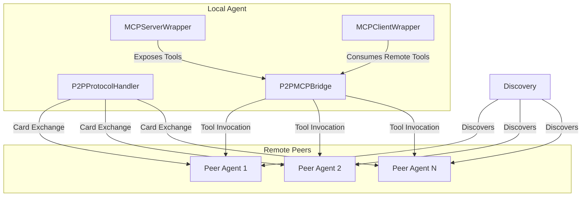
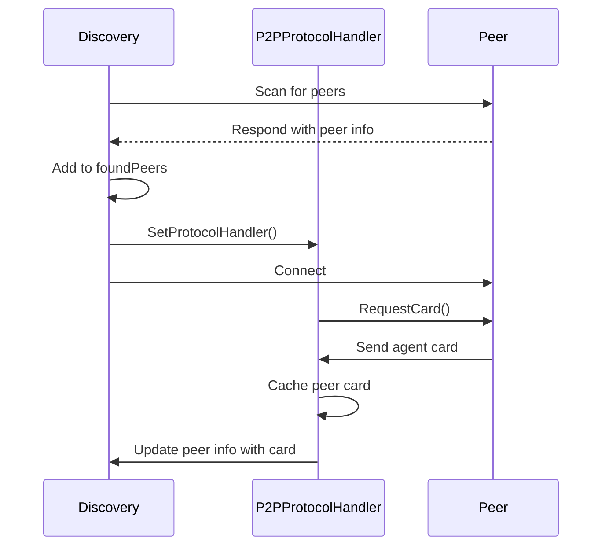
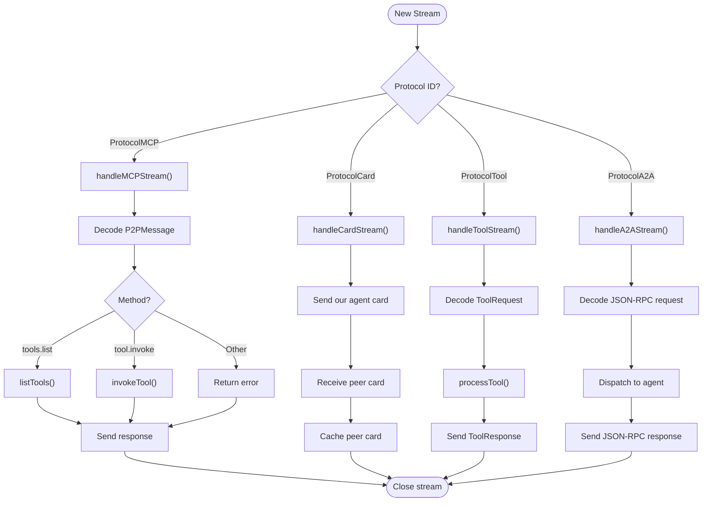

# P2P Networking Layer


## Table of Contents
1. [Introduction](#introduction)
2. [Project Structure](#project-structure)
3. [Core Components](#core-components)
4. [Architecture Overview](#architecture-overview)
5. [Detailed Component Analysis](#detailed-component-analysis)
6. [Dependency Analysis](#dependency-analysis)
7. [Performance Considerations](#performance-considerations)
8. [Troubleshooting Guide](#troubleshooting-guide)
9. [Conclusion](#conclusion)

## Introduction
This document provides comprehensive architectural documentation for the P2P networking layer based on libp2p. The system enables decentralized agent communication through peer discovery, secure connections, and message routing. It supports agent card exchange for capability negotiation, tool invocation across peers, and integration with higher-level services via the MCP (Model Control Protocol) framework. The design emphasizes modularity, extensibility, and interoperability in distributed agent networks.

## Project Structure
The P2P networking layer is implemented within the `internal/p2p` directory and integrates with the MCP subsystem in `internal/mcp`. Key components include protocol handlers for message routing, a bridge for interfacing with MCP services, and discovery mechanisms for peer detection.

```mermaid
graph TD
subgraph "P2P Layer"
P2PProtocolHandler[P2PProtocolHandler]
P2PMCPBridge[P2PMCPBridge]
Discovery[Discovery]
end
subgraph "MCP Integration"
MCPServerWrapper[MCPServerWrapper]
MCPClientWrapper[MCPClientWrapper]
end
P2PProtocolHandler --> P2PMCPBridge : "Uses"
P2PMCPBridge --> MCPServerWrapper : "Interfaces"
P2PMCPBridge --> MCPClientWrapper : "Creates"
Discovery --> P2PProtocolHandler : "Sets Handler"
```

**Diagram sources**
- [protocol.go](file://internal/p2p/protocol.go#L1-L536)
- [bridge.go](file://internal/p2p/bridge.go#L1-L472)
- [discovery.go](file://internal/p2p/discovery.go#L1-L233)
- [server.go](file://internal/mcp/server.go#L1-L327)
- [client.go](file://internal/mcp/client.go#L1-L292)

**Section sources**
- [protocol.go](file://internal/p2p/protocol.go#L1-L536)
- [bridge.go](file://internal/p2p/bridge.go#L1-L472)

## Core Components
The P2P networking layer consists of three core components: the **P2PProtocolHandler** for message processing, the **P2PMCPBridge** for integrating with MCP services, and the **Discovery** module for peer detection. These components work together to enable decentralized agent communication, capability exchange, and remote tool execution.

**Section sources**
- [protocol.go](file://internal/p2p/protocol.go#L1-L536)
- [bridge.go](file://internal/p2p/bridge.go#L1-L472)
- [discovery.go](file://internal/p2p/discovery.go#L1-L233)

## Architecture Overview
The P2P architecture is built on libp2p and implements multiple protocol handlers for different types of communication. Agents discover each other through a decentralized scanning mechanism, establish connections, and exchange capability information via agent cards. The system supports multiple message types including MCP commands, tool invocations, and A2A (Agent-to-Agent) JSON-RPC calls.



**Diagram sources**
- [protocol.go](file://internal/p2p/protocol.go#L1-L536)
- [bridge.go](file://internal/p2p/bridge.go#L1-L472)
- [discovery.go](file://internal/p2p/discovery.go#L1-L233)

## Detailed Component Analysis

### P2P Protocol Handler
The `P2PProtocolHandler` manages incoming streams for various protocols and routes messages to appropriate handlers. It supports four protocol types: MCP, Card, Tool, and A2A.

```mermaid
classDiagram
class P2PProtocolHandler {
+Host : host
+Logger : logger
+AgentCard~ : peerCards Map~PeerID
+AgentCard : ourCard
+P2PMCPBridge : mcpBridge
+A2AAgent : agent
+SetMCPBridge(bridge)
+SetAgent(agent)
+handleMCPStream(stream)
+handleCardStream(stream)
+handleToolStream(stream)
+handleA2AStream(stream)
+RequestCard(ctx: peerID)
+InvokeTool(ctx: peerID, name: args)
}
class AgentCard {
+string : Name
+string : Version
+string : PeerID
+[]string : Capabilities
+[]ToolSpec : Tools
+int64 : Timestamp
}
class ToolSpec {
+string : Name
+string : Description
+[]ToolParameter : Parameters
}
class ToolParameter {
+string : Name
+string : Type
+string : Description
+bool : Required
}
class P2PMessage {
+string : Type
+string : ID
+string : Method
+interface{} : Params
+interface{} : Result
+P2PError : Error
}
class P2PError {
+int : Code
+string : Message
}
P2PProtocolHandler --> AgentCard : "Stores"
P2PProtocolHandler --> ToolSpec : "Contains"
P2PProtocolHandler --> P2PMessage : "Processes"
P2PProtocolHandler --> P2PError : "Returns"
ToolSpec --> ToolParameter : "Has"
```

**Diagram sources**
- [protocol.go](file://internal/p2p/protocol.go#L1-L536)

**Section sources**
- [protocol.go](file://internal/p2p/protocol.go#L1-L536)

### P2P Bridge Implementation
The `P2PMCPBridge` serves as an interface between the P2P layer and MCP services, allowing remote peers to invoke tools and access resources on the local agent.

```mermaid
classDiagram
class P2PMCPBridge {
+Host : host
+MCPServerWrapper : mcpServer
+MCPClientWrapper~ : peerClients Map~PeerID
+ProcessMCPRequest(request)
+handleMCPStream(stream)
+handleCardStream(stream)
+ConnectToPeer(peerID)
+CallPeerTool(ctx: peerID, name: args)
+ListPeers(ctx)
+SendMessage(ctx: peerID, message)
}
class MCPRequest {
+int : ID
+string : Method
+interface{}~ : Params Map~string
}
class MCPResponse {
+int : ID
+interface{} : Result
+MCPError : Error
}
class MCPError {
+int : Code
+string : Message
+interface{} : Data
}
class P2PStreamTransport {
+Stream : stream
+Send(data)
+Receive()
+Close()
}
P2PMCPBridge --> MCPRequest : "Receives"
P2PMCPBridge --> MCPResponse : "Returns"
P2PMCPBridge --> MCPError : "Contains"
P2PMCPBridge --> P2PStreamTransport : "Uses"
P2PMCPBridge --> MCPServerWrapper : "Interfaces"
P2PMCPBridge --> MCPClientWrapper : "Manages"
```

**Diagram sources**
- [bridge.go](file://internal/p2p/bridge.go#L1-L472)

**Section sources**
- [bridge.go](file://internal/p2p/bridge.go#L1-L472)

### Agent Discovery Mechanism
The decentralized discovery system scans for peers and automatically exchanges agent cards upon connection.



**Diagram sources**
- [discovery.go](file://internal/p2p/discovery.go#L1-L233)
- [protocol.go](file://internal/p2p/protocol.go#L1-L536)

**Section sources**
- [discovery.go](file://internal/p2p/discovery.go#L1-L233)

### Message Flow and Protocol Handling
The system implements a stream multiplexing approach where different protocol handlers manage specific message types over separate logical streams.



**Diagram sources**
- [protocol.go](file://internal/p2p/protocol.go#L1-L536)

**Section sources**
- [protocol.go](file://internal/p2p/protocol.go#L1-L536)

## Dependency Analysis
The P2P networking layer has well-defined dependencies that enable its functionality while maintaining separation of concerns.

```mermaid
graph TD
P2PProtocolHandler --> libp2p : "Uses core types"
P2PMCPBridge --> libp2p : "Uses core types"
Discovery --> libp2p : "Uses core types"
P2PProtocolHandler --> logrus : "Uses for logging"
P2PMCPBridge --> logrus : "Uses for logging"
Discovery --> logrus : "Uses for logging"
P2PProtocolHandler --> mcpTypes : "Uses MCP types"
P2PMCPBridge --> mcpTypes : "Uses MCP types"
P2PMCPBridge --> MCPServerWrapper : "Interfaces with"
P2PMCPBridge --> MCPClientWrapper : "Creates instances"
P2PProtocolHandler --> P2PMCPBridge : "References for tool execution"
Discovery --> P2PProtocolHandler : "Sets for card exchange"
MCPServerWrapper --> mcpTypes : "Implements MCP protocol"
MCPClientWrapper --> mcpTypes : "Implements MCP protocol"
```

**Diagram sources**
- [go.mod](file://go.mod#L1-L30)
- [protocol.go](file://internal/p2p/protocol.go#L1-L536)
- [bridge.go](file://internal/p2p/bridge.go#L1-L472)
- [discovery.go](file://internal/p2p/discovery.go#L1-L233)

**Section sources**
- [protocol.go](file://internal/p2p/protocol.go#L1-L536)
- [bridge.go](file://internal/p2p/bridge.go#L1-L472)
- [discovery.go](file://internal/p2p/discovery.go#L1-L233)

## Performance Considerations
The P2P networking layer is designed for efficient operation in large-scale networks:

- **Connection Management**: The bridge maintains a pool of MCP clients for connected peers, reducing connection overhead for repeated interactions.
- **Caching**: Agent cards are cached after initial exchange, eliminating redundant card requests.
- **Stream Multiplexing**: libp2p's stream multiplexing allows multiple protocol conversations over a single connection.
- **Asynchronous Operations**: Card exchange occurs in a goroutine after connection, preventing blocking of the discovery process.
- **Timeouts**: All network operations use context timeouts to prevent hanging operations.

For optimal performance in large networks:
- Configure appropriate connection limits based on system resources
- Monitor peer client cleanup to prevent memory leaks
- Use selective peer discovery rather than network-wide scanning when possible
- Implement rate limiting for tool invocation requests

## Troubleshooting Guide
Common issues and their solutions:

**Connection Failures**
- Verify that libp2p host is properly initialized
- Check that protocol handlers are registered with the host
- Ensure network connectivity between peers

**Card Exchange Failures**
- Confirm that `SetProtocolHandler` is called on the Discovery component
- Check that agent cards are properly set via `SetAgentCard`
- Verify JSON serialization of card data

**Tool Invocation Issues**
- Ensure MCP server is initialized and tools are registered
- Validate that `SetMCPBridge` is called on the protocol handler
- Check that tool names match exactly between peers

**Resource Leaks**
- Always call `Close()` on the P2PMCPBridge to clean up peer clients
- Monitor goroutine count for unbounded growth
- Ensure streams are properly closed after use

**Section sources**
- [bridge.go](file://internal/p2p/bridge.go#L1-L472)
- [protocol.go](file://internal/p2p/protocol.go#L1-L536)
- [discovery.go](file://internal/p2p/discovery.go#L1-L233)

## Conclusion
The P2P networking layer provides a robust foundation for decentralized agent communication. By leveraging libp2p for transport and implementing a modular architecture with clear separation between protocol handling, bridge integration, and discovery, the system enables flexible and scalable agent networks. The agent card exchange mechanism facilitates capability discovery, while the MCP bridge allows seamless integration with higher-level services. This architecture supports the development of complex distributed agent systems with dynamic peer interactions and remote tool execution capabilities.

**Referenced Files in This Document**
- [protocol.go](file://internal/p2p/protocol.go#L1-L536)
- [bridge.go](file://internal/p2p/bridge.go#L1-L472)
- [discovery.go](file://internal/p2p/discovery.go#L1-L233)
- [server.go](file://internal/mcp/server.go#L1-L327)
- [client.go](file://internal/mcp/client.go#L1-L292)
