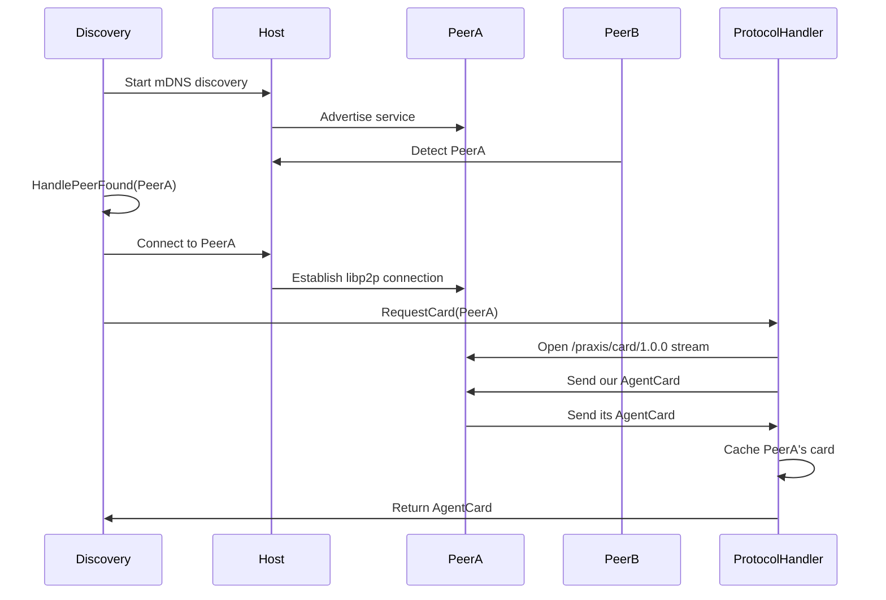
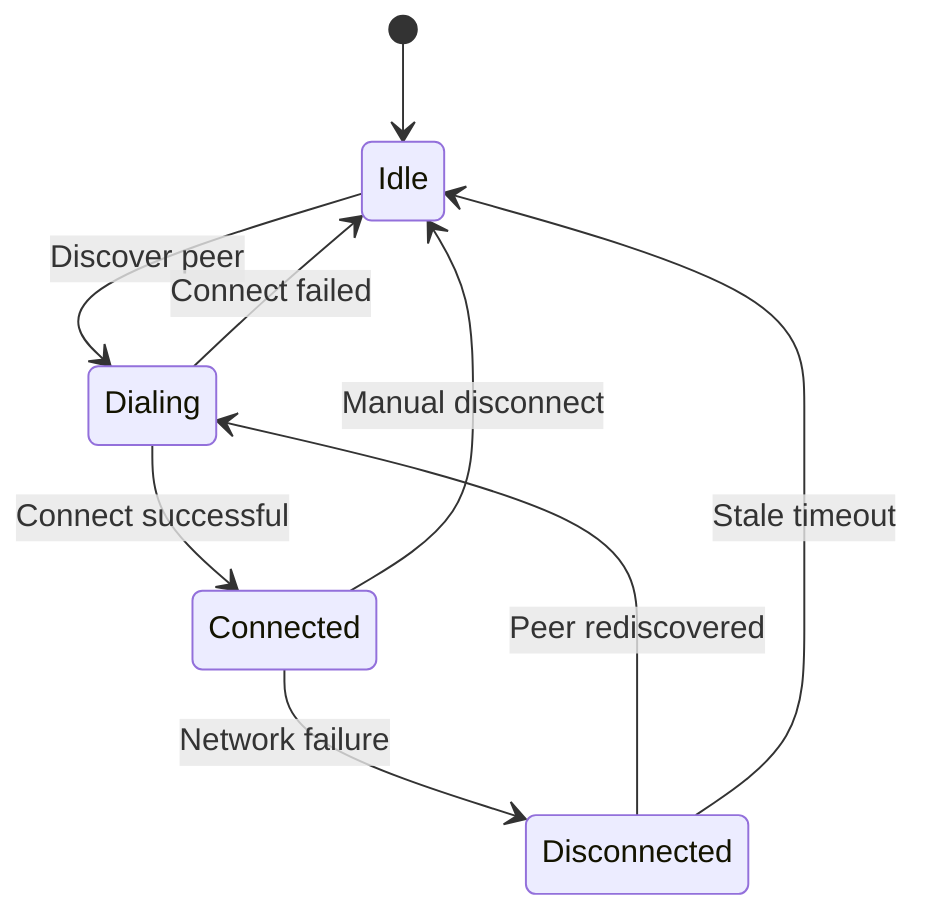
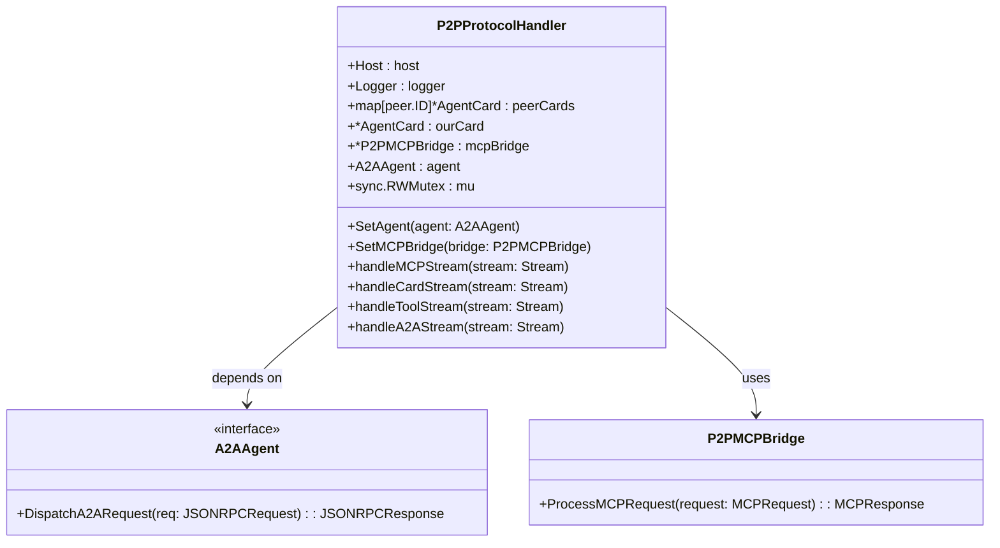
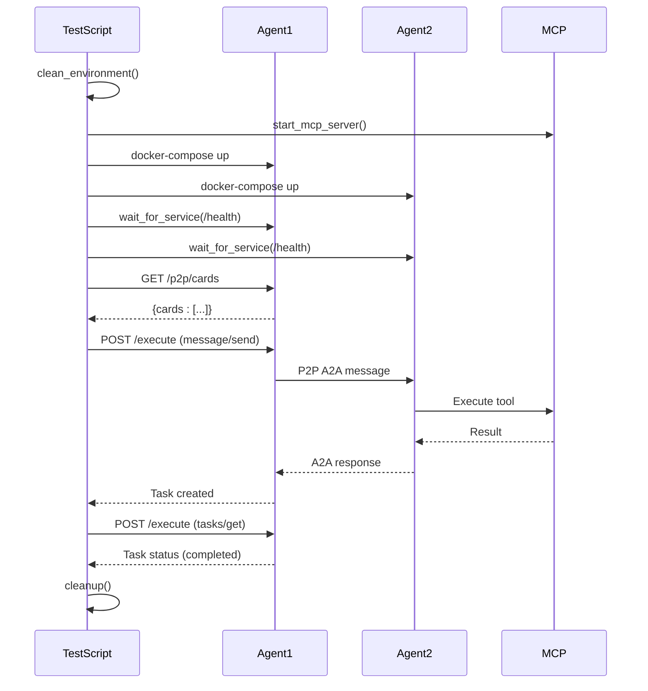

# Connection Lifecycle and Management


## Table of Contents
1. [Introduction](#introduction)
2. [Connection Handshake and Identity Verification](#connection-handshake-and-identity-verification)
3. [Stream Multiplexing and Message Framing](#stream-multiplexing-and-message-framing)
4. [Connection State Transitions and Error Recovery](#connection-state-transitions-and-error-recovery)
5. [ProtocolHandler and Message Routing](#protocolhandler-and-message-routing)
6. [Practical Examples from Integration Tests](#practical-examples-from-integration-tests)
7. [Common Failure Modes](#common-failure-modes)
8. [Best Practices for Connection Management](#best-practices-for-connection-management)

## Introduction
This document provides a comprehensive overview of the P2P connection lifecycle management within the Praxis Go SDK. It details the mechanisms for establishing secure, reliable peer-to-peer connections between agents, including identity verification, stream multiplexing, state management, and error recovery. The system leverages libp2p for underlying networking and implements a custom protocol suite for agent-to-agent (A2A) communication, tool invocation, and capability discovery. The architecture supports dynamic peer discovery, cryptographic identity exchange via AgentCards, and robust message routing through protocol-specific handlers.

**Section sources**
- [protocol.go](file://internal/p2p/protocol.go#L1-L50)
- [bridge.go](file://internal/p2p/bridge.go#L1-L50)

## Connection Handshake and Identity Verification

The connection handshake process is initiated through mDNS-based peer discovery and finalized with a bidirectional AgentCard exchange over a dedicated P2P protocol stream. This process ensures mutual identity verification and capability negotiation before any application-level communication occurs.

The handshake begins when the `Discovery` service detects a new peer on the local network. Upon detection, the `HandlePeerFound` method is invoked, which triggers a connection attempt via `host.Connect`. Once the libp2p connection is established, the discovery service automatically initiates the card exchange process by calling `RequestCard` on the registered `P2PProtocolHandler`.

The card exchange itself is implemented in the `handleCardStream` method, which is registered to handle the `/praxis/card/1.0.0` protocol. The exchange is bidirectional and occurs over a single stream:
1. The initiating peer sends its `AgentCard` first.
2. The receiving peer responds with its own `AgentCard`.
3. Both peers cache the received card for future reference.

The `AgentCard` structure contains critical identity and capability information:
- **Name**: Human-readable agent identifier
- **Version**: Agent software version
- **PeerID**: Cryptographic identity derived from the libp2p host's public key
- **Capabilities**: List of supported features (e.g., "mcp", "dsl", "workflow")
- **Tools**: Array of `ToolSpec` objects detailing available tools, their parameters, and descriptions
- **Timestamp**: Time of card generation for freshness validation

This exchange serves as a form of mutual authentication, as the `PeerID` is cryptographically bound to the peer's private key, and the card content is transmitted over the secured libp2p connection.



**Diagram sources**
- [discovery.go](file://internal/p2p/discovery.go#L127-L186)
- [protocol.go](file://internal/p2p/protocol.go#L150-L174)

**Section sources**
- [discovery.go](file://internal/p2p/discovery.go#L1-L233)
- [protocol.go](file://internal/p2p/protocol.go#L150-L174)

## Stream Multiplexing and Message Framing

The system utilizes libp2p's built-in stream multiplexing capabilities to manage multiple concurrent communication channels over a single connection. Each distinct protocol (e.g., MCP, Card, Tool, A2A) is assigned a unique protocol ID and operates on its own dedicated stream, allowing for independent message flows without interference.

The `P2PProtocolHandler` registers multiple stream handlers during initialization via `host.SetStreamHandler`, creating separate logical channels for different types of communication:
- `/praxis/mcp/1.0.0`: For MCP (Model Context Protocol) requests and responses
- `/praxis/card/1.0.0`: For AgentCard exchange
- `/praxis/tool/1.0.0`: For remote tool invocation
- `/praxis/a2a/1.0.0`: For A2A JSON-RPC messages

Message framing is implemented using JSON over the stream. Each message is encoded as a complete JSON object and written to the stream. The receiving end uses `json.Decoder` which inherently handles the framing by reading until a complete JSON object is parsed. This approach leverages the self-delimiting nature of JSON (balanced braces) to define message boundaries without requiring a separate length-prefixing mechanism.

For example, in the `handleMCPStream` method, an infinite loop reads `P2PMessage` objects from the stream using `decoder.Decode(&msg)`. The decoder automatically handles the framing, ensuring that each `Decode` call returns one complete message. The same pattern is used for all protocol handlers, providing a consistent and reliable message framing mechanism across all communication channels.

```mermaid
graph TD
A[libp2p Connection] --> B[/praxis/mcp/1.0.0 Stream]
A --> C[/praxis/card/1.0.0 Stream]
A --> D[/praxis/tool/1.0.0 Stream]
A --> E[/praxis/a2a/1.0.0 Stream]
B --> F["{type: 'request', method: 'tools.list', id: '1'}"]
B --> G["{type: 'response', result: [...], id: '1'}"]
C --> H["{name: 'Agent1', version: '1.0', tools: [...]}"]
D --> I["{id: 'req1', name: 'analyze_dsl', arguments: {...}}"]
D --> J["{id: 'req1', result: {...}}"]
E --> K["{jsonrpc: '2.0', method: 'message/send', ...}"]
```

**Diagram sources**
- [protocol.go](file://internal/p2p/protocol.go#L90-L125)
- [bridge.go](file://internal/p2p/bridge.go#L55-L104)

**Section sources**
- [protocol.go](file://internal/p2p/protocol.go#L90-L125)

## Connection State Transitions and Error Recovery

The connection lifecycle is managed through a combination of libp2p's built-in connection state tracking and application-level monitoring via the `Discovery` service. The primary states are: **Dialing**, **Connected**, and **Disconnected**, with automatic recovery mechanisms for transient failures.

The `Discovery` service runs a periodic `runDiscoveryLoop` that checks the connection status of all known peers every 10 seconds. It uses `host.Network().Connectedness(peerID)` to determine the current state. When a connection state change is detected (e.g., from disconnected to connected), the service logs the event and updates the `PeerInfo.IsConnected` flag.

Error recovery is handled implicitly by the discovery and protocol layers:
- **Transient Disconnections**: If a peer disconnects, the `checkPeerConnections` method will detect it and update the state. When the peer reconnects (via mDNS rediscovery), a new connection is automatically established, and the card exchange process is re-initiated.
- **Stale Peer Cleanup**: Peers that have not been seen for more than 5 minutes are removed from the `foundPeers` map to prevent accumulation of stale entries.
- **Automatic Reconnection**: The discovery service continuously listens for mDNS announcements, allowing it to reconnect to peers that come back online.

The protocol handlers themselves implement robust error handling for individual streams. In methods like `handleMCPStream` and `handleA2AStream`, any read or write error (except `io.EOF`, which signifies a clean stream closure) is logged, and the stream is closed. This design ensures that a single stream failure does not affect the entire connection or other active streams, thanks to libp2p's stream multiplexing.



**Diagram sources**
- [discovery.go](file://internal/p2p/discovery.go#L127-L233)

**Section sources**
- [discovery.go](file://internal/p2p/discovery.go#L127-L233)

## ProtocolHandler and Message Routing

The `P2PProtocolHandler` is responsible for routing incoming messages based on the protocol ID of the stream they arrive on. It acts as a central dispatcher, delegating message processing to specific handler functions for each protocol.

The handler maintains a map of protocol IDs to `StreamHandler` functions, although in the current implementation, the handlers are directly registered with the libp2p host. The key routing logic is embedded in the handler methods:
- **MCP Protocol**: Messages on the `/praxis/mcp/1.0.0` stream are processed by `handleMCPStream`, which decodes the `P2PMessage` and routes it to `processMCPMessage` based on the `method` field (e.g., "tools.list", "tool.invoke").
- **A2A Protocol**: Messages on the `/praxis/a2a/1.0.0` stream are processed by `handleA2AStream`, which decodes a `JSONRPCRequest` and routes it to the configured `A2AAgent` via the `DispatchA2ARequest` method.
- **Tool Protocol**: Messages on the `/praxis/tool/1.0.0` stream are processed by `handleToolStream`, which decodes a `ToolRequest` and processes it via `processTool`.

The `A2AAgent` interface allows for dynamic routing of A2A messages to the appropriate business logic. The agent is set via `SetAgent`, enabling dependency injection and separation of concerns. If no agent is set, the handler returns an "Agent not available" error, ensuring graceful degradation.

Concurrent stream management is handled naturally by libp2p and Go's concurrency model. Each incoming stream is handled in its own goroutine (spawned by the libp2p host), allowing multiple streams of the same or different protocols to be processed simultaneously. The use of `sync.RWMutex` in the `P2PProtocolHandler` protects shared state (like the `peerCards` map) from race conditions during concurrent access.



**Diagram sources**
- [protocol.go](file://internal/p2p/protocol.go#L1-L536)

**Section sources**
- [protocol.go](file://internal/p2p/protocol.go#L1-L536)

## Practical Examples from Integration Tests

The `test_a2a_full_docker.sh` script provides a comprehensive integration test suite that demonstrates the complete connection lifecycle, from environment setup to connection teardown. This script orchestrates two agent containers and an MCP server, validating the end-to-end A2A protocol functionality.

The test sequence begins with environment cleanup and prerequisite checks (Docker, curl, jq). It then starts an MCP server and builds/starts the agent containers via `docker-compose`. The connection lifecycle is verified through several key steps:

1. **P2P Discovery Verification**: The `verify_p2p_discovery` function uses `curl` to query the `/p2p/cards` endpoint, confirming that agents have discovered each other and exchanged cards. It checks the peer count and validates the card exchange logs.
2. **A2A Message Flow**: The `test_a2a_message_send` function sends a JSON-RPC `message/send` request to create a file. This triggers an A2A task, demonstrating the routing of the message through the P2P network.
3. **Task Status Polling**: The `test_task_status_polling` function polls the task status using `tasks/get`, showing the state transition from "submitted" to "working" to "completed".
4. **Inter-Agent Communication**: The `test_inter_agent_communication` function sends a message from Agent 1 to Agent 2, verifying that the P2P routing and tool invocation work across agents.
5. **Cleanup**: The `cleanup` function stops containers, kills processes, and removes temporary files, ensuring a clean state after the test.

This script serves as a practical example of how to programmatically establish, use, and tear down P2P connections in a production-like environment.



**Diagram sources**
- [test_a2a_full_docker.sh](file://test_a2a_full_docker.sh#L1-L832)

**Section sources**
- [test_a2a_full_docker.sh](file://test_a2a_full_docker.sh#L1-L832)

## Common Failure Modes

The system is designed to handle several common failure modes gracefully:

1. **Dial Timeouts**: Connection attempts are made with a 30-second context timeout in `connectToPeer`. If the peer does not respond within this window, the connection attempt fails, and the error is logged. The discovery service will retry the connection when the peer is rediscovered.

2. **Protocol Mismatches**: If a peer attempts to open a stream with an unknown protocol ID, libp2p will not invoke any handler, effectively rejecting the stream. If a known protocol is used but with an invalid message format (e.g., malformed JSON), the handler will log the decoding error and close the stream, as seen in the `if err := decoder.Decode(&msg); err != nil` checks.

3. **Resource Exhaustion**: While not explicitly mitigated in the provided code, the use of goroutines for each stream could lead to resource exhaustion under extreme load. The system relies on external process management (e.g., Docker) to contain resource usage. The `StreamableHTTPClientPool` in `transport.go` suggests a pooling strategy is used for HTTP clients, which could be a model for future stream/connection pooling.

4. **MCP Server Unavailability**: The `P2PMCPBridge` checks for a `nil` `mcpServer` before attempting tool execution. If the server is unavailable, it returns a "MCP server not available" error, preventing cascading failures.

5. **Network Partitions**: The discovery service's periodic checking and mDNS-based rediscovery provide resilience to temporary network partitions. Peers will reconnect automatically when the network is restored.

## Best Practices for Connection Management

Based on the implementation, the following best practices are recommended:

1. **Connection Pooling**: Although not implemented for P2P connections, the `StreamableHTTPClientPool` demonstrates the value of connection pooling. For high-throughput scenarios, consider implementing a similar pattern for frequently accessed peers to reduce handshake overhead.

2. **Keep-Alive Settings**: The system relies on libp2p's built-in keep-alive mechanisms. Ensure these are configured appropriately for the network environment to detect dead connections promptly without generating excessive traffic.

3. **Graceful Shutdown**: The `P2PMCPBridge.Close()` method provides a clean shutdown procedure by canceling the context and closing all client connections. Always invoke such cleanup methods to ensure resources are released and peers are notified of disconnection.

4. **Error Logging and Monitoring**: The extensive use of structured logging (`logrus`) allows for effective monitoring and debugging. Ensure logs are collected and monitored in production to detect and diagnose connection issues.

5. **Security**: The use of libp2p's cryptographic identity (PeerID) and secured connections provides a strong foundation. Always validate the `AgentCard` content and consider implementing additional authorization mechanisms for sensitive operations.

6. **Resource Management**: Be mindful of the number of concurrent streams and goroutines. Implement timeouts and limits where appropriate to prevent resource exhaustion.

**Referenced Files in This Document**
- [protocol.go](file://internal/p2p/protocol.go#L1-L536)
- [bridge.go](file://internal/p2p/bridge.go#L1-L472)
- [discovery.go](file://internal/p2p/discovery.go#L1-L233)
- [test_a2a_full_docker.sh](file://test_a2a_full_docker.sh#L1-L832)
