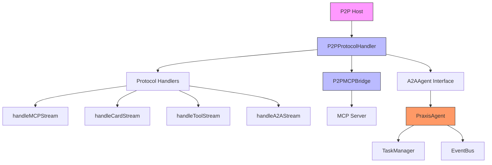
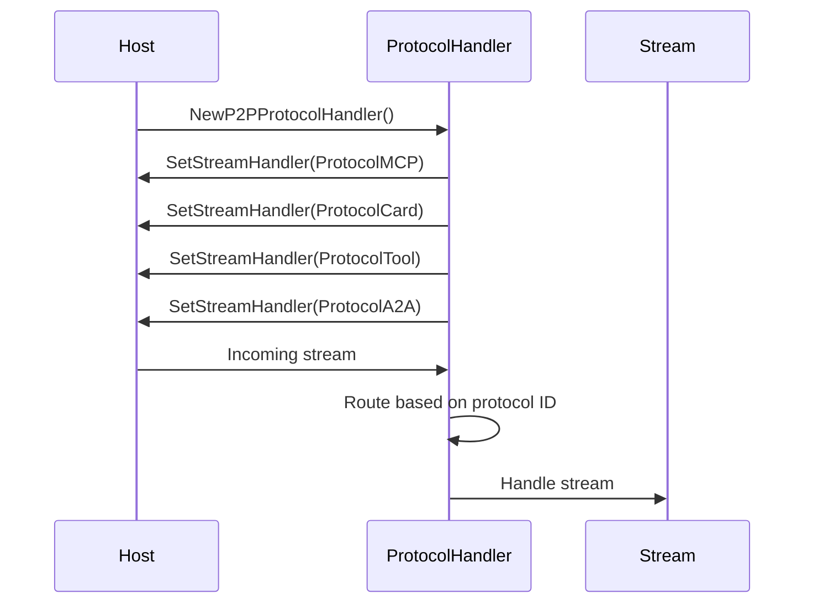
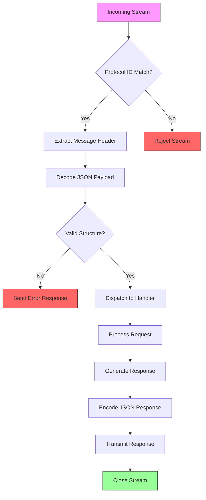
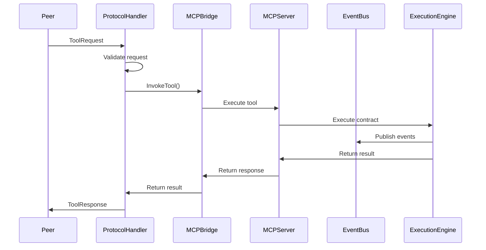
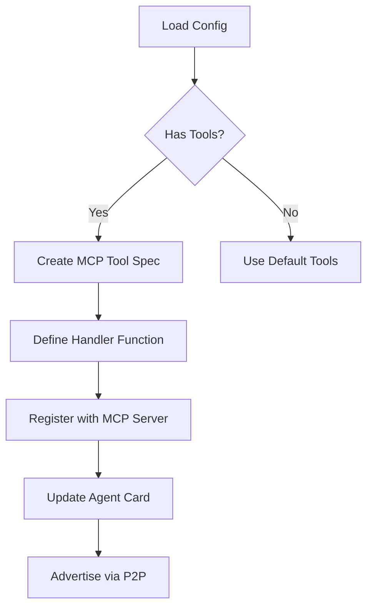
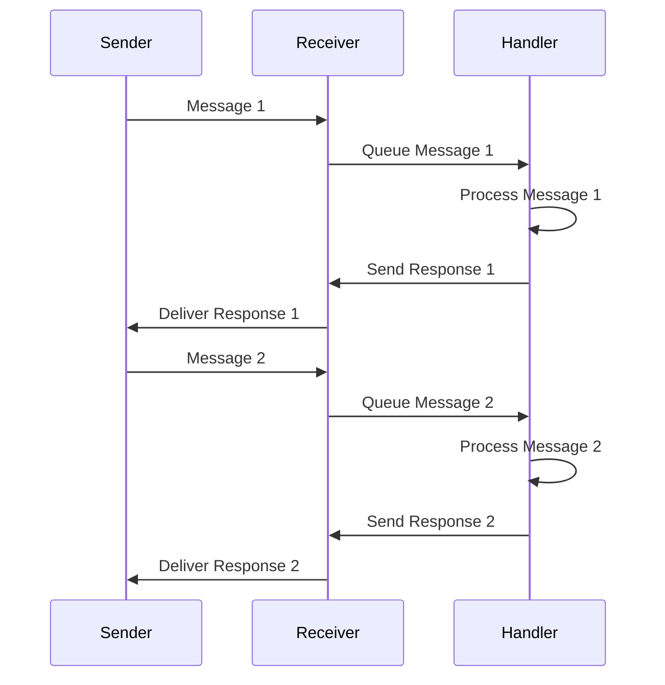
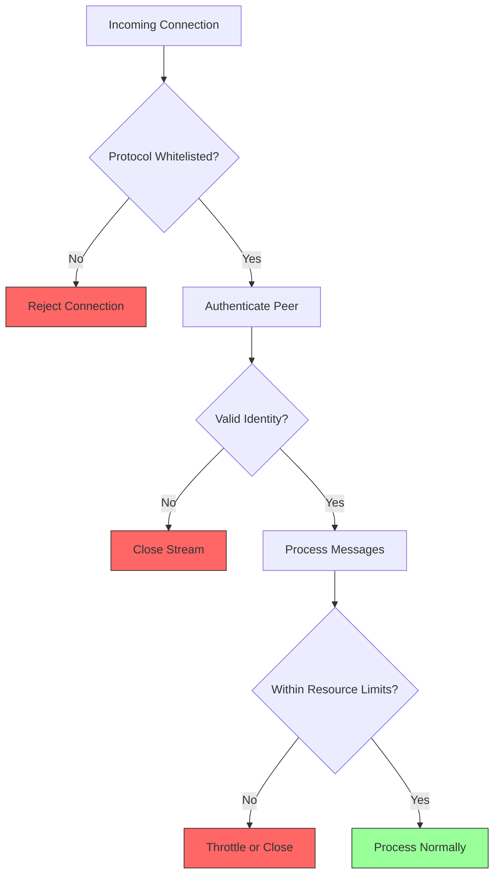
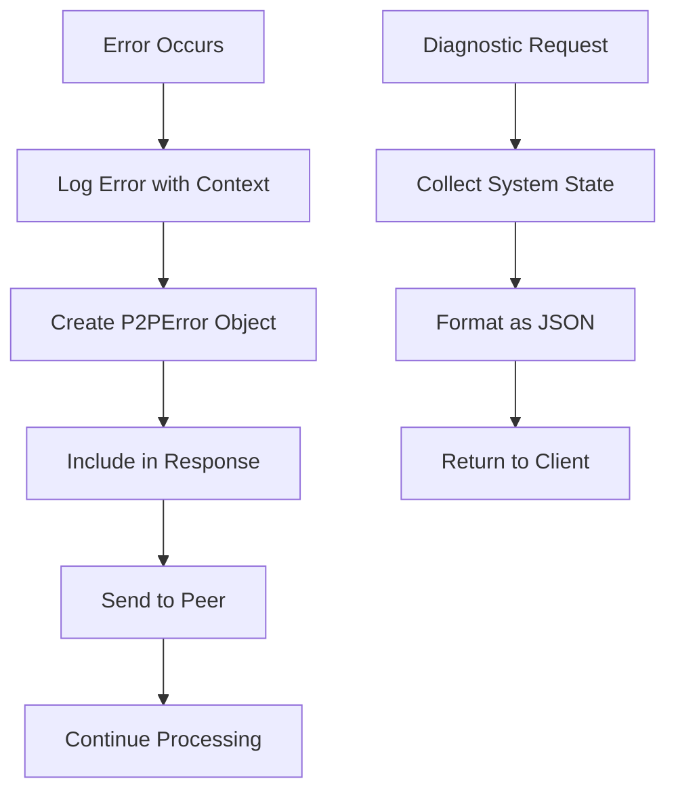

# Protocol Handler and Message Routing


## Table of Contents
1. [Introduction](#introduction)
2. [Core Components Overview](#core-components-overview)
3. [Protocol Handler Architecture](#protocol-handler-architecture)
4. [Message Routing and Protocol Registration](#message-routing-and-protocol-registration)
5. [Message Parsing Pipeline](#message-parsing-pipeline)
6. [Integration with Bridge and EventBus](#integration-with-bridge-and-eventbus)
7. [Custom Protocol Implementation Example](#custom-protocol-implementation-example)
8. [Message Ordering and Flow Control](#message-ordering-and-flow-control)
9. [Security Mechanisms](#security-mechanisms)
10. [Error Handling and Diagnostics](#error-handling-and-diagnostics)

## Introduction
The ProtocolHandler is a core component responsible for managing message routing in the P2P layer of the Praxis agent framework. It enables communication between distributed agents through libp2p protocol streams, supporting multiple communication protocols including A2A (Agent-to-Agent) and MCP (Model Context Protocol). The handler facilitates structured message exchange, tool invocation, agent discovery, and capability negotiation across the peer-to-peer network.

This document provides a comprehensive analysis of the ProtocolHandler implementation, detailing its architecture, message processing pipeline, integration points, and security mechanisms. The system enables decentralized agent collaboration through standardized protocol IDs and structured data exchange formats.

## Core Components Overview
The ProtocolHandler system consists of three primary components working in concert:
- **P2PProtocolHandler**: Manages incoming streams and dispatches messages based on protocol IDs
- **P2PMCPBridge**: Facilitates integration between P2P communications and MCP services
- **A2A Task Manager**: Handles asynchronous task processing and state management

These components work together to enable seamless message routing, tool execution, and agent coordination across the distributed network.



**Diagram sources**
- [internal/p2p/protocol.go](file://internal/p2p/protocol.go#L1-L50)
- [internal/agent/agent.go](file://internal/agent/agent.go#L1-L100)

**Section sources**
- [internal/p2p/protocol.go](file://internal/p2p/protocol.go#L1-L50)
- [internal/agent/agent.go](file://internal/agent/agent.go#L1-L100)

## Protocol Handler Architecture
The P2PProtocolHandler serves as the central message router in the P2P communication layer. It registers multiple protocol handlers using libp2p protocol IDs and manages incoming streams for different types of communication.

The handler maintains several key data structures:
- **peerCards**: Map of peer agent capabilities and tool specifications
- **ourCard**: Local agent's capability advertisement
- **handlers**: Protocol-specific stream handlers
- **mcpBridge**: Connection to MCP services for tool execution
- **agent**: Interface to A2A protocol operations

```mermaid
classDiagram
class P2PProtocolHandler {
+host Host
+logger Logger
+handlers Map~ProtocolID,StreamHandler~
+peerCards Map~PeerID,AgentCard~
+ourCard AgentCard
+mcpBridge P2PMCPBridge
+agent A2AAgent
+SetMCPBridge(bridge)
+SetAgent(agent)
+handleMCPStream(stream)
+handleCardStream(stream)
+handleToolStream(stream)
+handleA2AStream(stream)
}
class AgentCard {
+Name string
+Version string
+PeerID string
+Capabilities []string
+Tools []ToolSpec
+Timestamp int64
}
class ToolSpec {
+Name string
+Description string
+Parameters []ToolParameter
}
class ToolParameter {
+Name string
+Type string
+Description string
+Required bool
}
class P2PMessage {
+Type string
+ID string
+Method string
+Params interface{}
+Result interface{}
+Error P2PError
}
class P2PError {
+Code int
+Message string
}
P2PProtocolHandler --> AgentCard : "maintains"
P2PProtocolHandler --> ToolSpec : "uses"
P2PProtocolHandler --> P2PMessage : "processes"
P2PProtocolHandler --> P2PError : "returns"
ToolSpec --> ToolParameter : "contains"
```

**Diagram sources**
- [internal/p2p/protocol.go](file://internal/p2p/protocol.go#L1-L200)

**Section sources**
- [internal/p2p/protocol.go](file://internal/p2p/protocol.go#L1-L200)

## Message Routing and Protocol Registration
The ProtocolHandler registers four distinct protocol handlers using specific libp2p protocol IDs:

```go
const (
    ProtocolMCP  = protocol.ID("/praxis/mcp/1.0.0")
    ProtocolCard = protocol.ID("/praxis/card/1.0.0")
    ProtocolTool = protocol.ID("/praxis/tool/1.0.0")
    ProtocolA2A  = protocol.ID("/praxis/a2a/1.0.0")
)
```

Each protocol ID corresponds to a specific communication purpose:
- **ProtocolMCP**: General MCP message exchange
- **ProtocolCard**: Agent capability discovery and card exchange
- **ProtocolTool**: Remote tool invocation
- **ProtocolA2A**: Agent-to-Agent task management

The registration occurs in `NewP2PProtocolHandler`:



**Diagram sources**
- [internal/p2p/protocol.go](file://internal/p2p/protocol.go#L50-L100)

**Section sources**
- [internal/p2p/protocol.go](file://internal/p2p/protocol.go#L50-L100)

## Message Parsing Pipeline
The message parsing pipeline processes incoming data through several stages: header extraction, payload decoding, protocol dispatch, and response generation.

For the MCP protocol stream, the handler uses JSON decoding to process messages:

```go
func (h *P2PProtocolHandler) handleMCPStream(stream network.Stream) {
    defer stream.Close()
    decoder := json.NewDecoder(stream)
    encoder := json.NewEncoder(stream)

    for {
        var msg P2PMessage
        if err := decoder.Decode(&msg); err != nil {
            break
        }

        response := h.processMCPMessage(msg)
        encoder.Encode(response)
    }
}
```

The pipeline includes:
1. **Stream establishment**: libp2p creates a bidirectional stream
2. **Header extraction**: Protocol ID identifies message type
3. **Payload decoding**: JSON unmarshaling of message content
4. **Message validation**: Structure and field verification
5. **Protocol dispatch**: Routing to appropriate handler
6. **Response generation**: Creating structured response
7. **Payload encoding**: JSON marshaling of response
8. **Stream transmission**: Sending response back to peer



**Diagram sources**
- [internal/p2p/protocol.go](file://internal/p2p/protocol.go#L100-L200)

**Section sources**
- [internal/p2p/protocol.go](file://internal/p2p/protocol.go#L100-L200)

## Integration with Bridge and EventBus
The ProtocolHandler integrates with the P2PMCPBridge component to forward messages to higher-level services like the MCP server and EventBus. This integration enables remote tool execution and event-driven architecture.

The bridge connection is established through `SetMCPBridge`:

```go
func (h *P2PProtocolHandler) SetMCPBridge(bridge *P2PMCPBridge) {
    h.mcpBridge = bridge
}
```

When handling tool invocations, the ProtocolHandler uses the bridge to execute remote tools:



The integration also connects to the A2AAgent interface for task management:

```go
func (h *P2PProtocolHandler) SetAgent(agent A2AAgent) {
    h.agent = agent
}
```

This allows A2A protocol messages to be dispatched to the agent's task manager for asynchronous processing.

**Diagram sources**
- [internal/p2p/protocol.go](file://internal/p2p/protocol.go#L200-L300)
- [internal/agent/agent.go](file://internal/agent/agent.go#L500-L600)

**Section sources**
- [internal/p2p/protocol.go](file://internal/p2p/protocol.go#L200-L300)
- [internal/agent/agent.go](file://internal/agent/agent.go#L500-L600)

## Custom Protocol Implementation Example
The system supports custom protocol implementations through the registration of new protocol handlers. The existing implementation demonstrates this pattern with the tool invocation protocol.

A custom tool request structure:

```go
type ToolRequest struct {
    ID          string                 `json:"id"`
    ToolName    string                 `json:"tool_name"`
    Arguments   map[string]interface{} `json:"args"`
    Timestamp   int64                  `json:"timestamp"`
}

type ToolResponse struct {
    ID       string      `json:"id"`
    Result   interface{} `json:"result"`
    Error    *P2PError   `json:"error,omitempty"`
    Duration int64       `json:"duration"`
}
```

Registration and handling:

```go
host.SetStreamHandler(ProtocolTool, handler.handleToolStream)

func (h *P2PProtocolHandler) handleToolStream(stream network.Stream) {
    var request ToolRequest
    json.NewDecoder(stream).Decode(&request)

    result, err := h.processTool(request)

    response := ToolResponse{
        ID: request.ID,
        Result: result,
        Error: err,
        Duration: time.Since(time.Unix(request.Timestamp, 0)).Milliseconds(),
    }

    json.NewEncoder(stream).Encode(response)
}
```

The agent registers tools dynamically from configuration:



**Diagram sources**
- [internal/p2p/protocol.go](file://internal/p2p/protocol.go#L300-L400)
- [internal/agent/agent.go](file://internal/agent/agent.go#L600-L800)

**Section sources**
- [internal/p2p/protocol.go](file://internal/p2p/protocol.go#L300-L400)
- [internal/agent/agent.go](file://internal/agent/agent.go#L600-L800)

## Message Ordering and Flow Control
The ProtocolHandler implements several mechanisms to ensure reliable message delivery and prevent resource exhaustion.

For message ordering, the system relies on TCP-like ordering provided by the underlying libp2p stream multiplexing (yamux). Each protocol stream maintains message order within that stream.

Flow control is implemented through:
- **Stream-level backpressure**: Built into libp2p's yamux multiplexer
- **Message size limits**: Implicit through memory constraints
- **Rate limiting**: Not explicitly implemented but possible through middleware
- **Connection limits**: Configurable through libp2p parameters

The handler processes messages sequentially within each stream, preventing race conditions:

```go
for {
    var msg P2PMessage
    if err := decoder.Decode(&msg); err != nil {
        break
    }

    response := h.processMCPMessage(msg)
    encoder.Encode(response)
}
```

This sequential processing ensures that responses are sent in the same order as requests are received.



**Diagram sources**
- [internal/p2p/protocol.go](file://internal/p2p/protocol.go#L100-L200)

**Section sources**
- [internal/p2p/protocol.go](file://internal/p2p/protocol.go#L100-L200)

## Security Mechanisms
The ProtocolHandler implements several security measures to protect against malicious actors and denial-of-service attacks.

### Protocol Whitelisting
Only explicitly registered protocols are accepted:

```go
host.SetStreamHandler(ProtocolMCP, handler.handleMCPStream)
host.SetStreamHandler(ProtocolCard, handler.handleCardStream)
host.SetStreamHandler(ProtocolTool, handler.handleToolStream)
host.SetStreamHandler(ProtocolA2A, handler.handleA2AStream)
```

Unregistered protocols are automatically rejected by libp2p.

### Message Size Limits
While not explicitly configured, the JSON decoding process inherently limits message size based on available memory. The system could be enhanced with explicit size limits:

```go
// Potential enhancement
const MaxMessageSize = 1 << 20 // 1MB
limitedReader := io.LimitReader(stream, MaxMessageSize)
decoder := json.NewDecoder(limitedReader)
```

### Denial-of-Service Protection
The system includes several DoS protection mechanisms:
- **Stream timeouts**: Configurable at the libp2p level
- **Resource limits**: Memory and CPU constraints
- **Authentication**: Peer identity through libp2p cryptographic keys
- **Rate limiting**: Could be implemented through middleware

The agent card system provides capability discovery without exposing internal implementation details:

```go
type AgentCard struct {
    Name         string     `json:"name"`
    Version      string     `json:"version"`
    PeerID       string     `json:"peerId"`
    Capabilities []string   `json:"capabilities"`
    Tools        []ToolSpec `json:"tools"`
    Timestamp    int64      `json:"timestamp"`
}
```

This allows peers to discover available tools while maintaining security boundaries.



**Diagram sources**
- [internal/p2p/protocol.go](file://internal/p2p/protocol.go#L1-L50)
- [internal/p2p/protocol.go](file://internal/p2p/protocol.go#L200-L300)

**Section sources**
- [internal/p2p/protocol.go](file://internal/p2p/protocol.go#L1-L50)
- [internal/p2p/protocol.go](file://internal/p2p/protocol.go#L200-L300)

## Error Handling and Diagnostics
The ProtocolHandler implements comprehensive error handling and diagnostic capabilities.

Error responses follow a standardized format:

```go
type P2PError struct {
    Code    int    `json:"code"`
    Message string `json:"message"`
}
```

The system logs detailed information for debugging:

```go
h.logger.Infof("Handling MCP stream from peer: %s", peerID.ShortString())
h.logger.Debugf("Received P2P message: type=%s, method=%s", msg.Type, msg.Method)
h.logger.Errorf("Failed to decode message: %v", err)
```

Diagnostic endpoints are available through the HTTP interface:

```go
a.httpServer.GET("/p2p/info", a.handleGetP2PInfo)
a.httpServer.GET("/p2p/cards", a.handleGetP2PCards)
a.httpServer.GET("/mcp/tools", a.handleGetMCPTools)
```

These provide visibility into the P2P network state, connected peers, and available tools.



**Section sources**
- [internal/p2p/protocol.go](file://internal/p2p/protocol.go#L100-L200)
- [internal/agent/agent.go](file://internal/agent/agent.go#L800-L1000)

**Referenced Files in This Document**
- [internal/a2a/types.go](file://internal/a2a/types.go)
- [internal/agent/agent.go](file://internal/agent/agent.go)
- [internal/p2p/protocol.go](file://internal/p2p/protocol.go)
