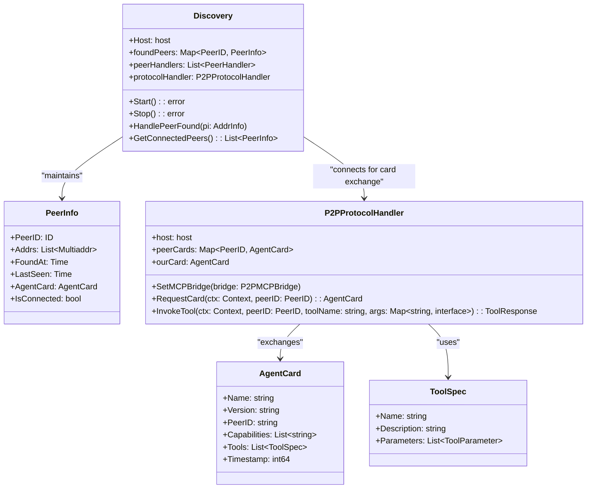
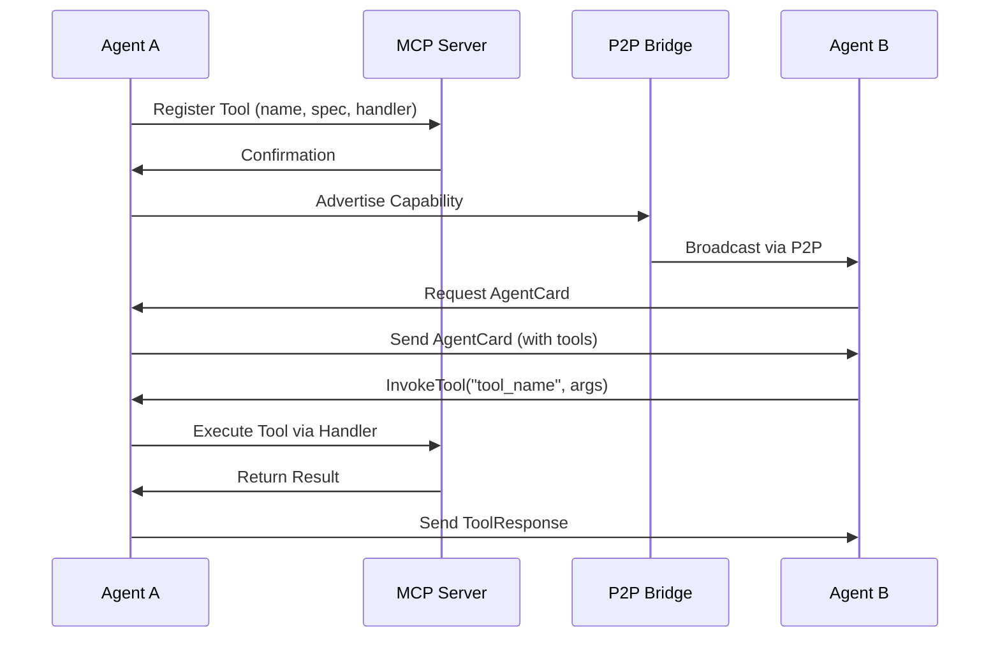
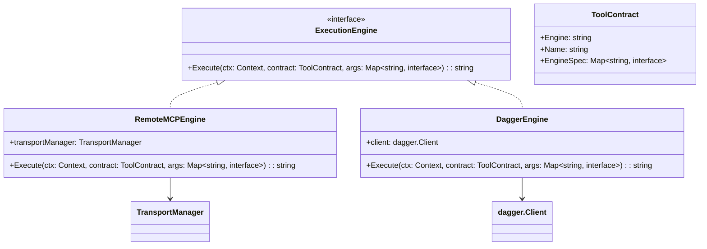
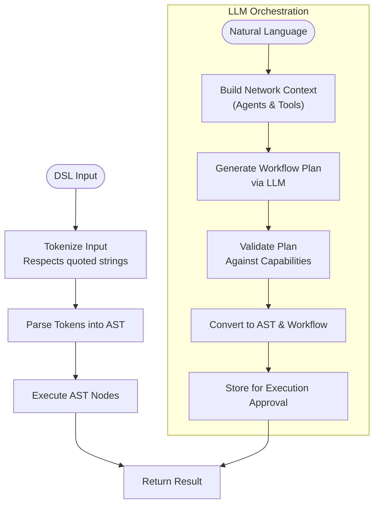
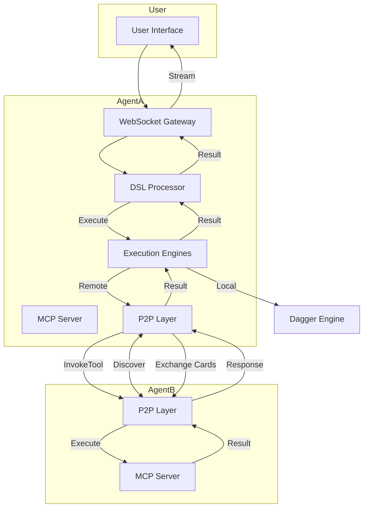

# Core Services

## Table of Contents
1. [Introduction](#introduction)
2. [P2P Networking](#p2p-networking)
3. [MCP Protocol](#mcp-protocol)
4. [Execution Engines](#execution-engines)
5. [DSL Processing](#dsl-processing)
6. [Service Integration and Workflow](#service-integration-and-workflow)
7. [Performance and Configuration](#performance-and-configuration)
8. [Operational Best Practices](#operational-best-practices)
9. [Conclusion](#conclusion)

## Introduction
The Praxis agent is a distributed AI system designed to enable seamless collaboration between autonomous agents through a modular architecture. This document details the four core service categories that power the agent: P2P Networking for decentralized discovery and communication, MCP Protocol for standardized tool sharing, Execution Engines for secure task execution, and DSL Processing for interpreting natural language commands. These services work in concert to enable distributed AI workflows, allowing agents to dynamically discover each other, share capabilities, execute tasks locally or remotely, and process high-level user instructions into executable workflows. The architecture emphasizes modularity, extensibility, and real-time collaboration, making it suitable for complex, multi-agent environments.

## P2P Networking

The P2P Networking service enables agent discovery and direct communication using the libp2p framework. It provides a decentralized mechanism for agents to find each other on the same network, establish secure connections, and exchange capability information without relying on centralized coordination. This service forms the foundation for agent-to-agent (A2A) interactions and dynamic network formation.

**Diagram sources**
- [discovery.go](file://internal/p2p/discovery.go#L1-L283)
- [protocol.go](file://internal/p2p/protocol.go#L1-L536)

**Section sources**
- [discovery.go](file://internal/p2p/discovery.go#L1-L283)
- [protocol.go](file://internal/p2p/protocol.go#L1-L536)

The `Discovery` service uses mDNS (multicast DNS) to broadcast and detect agents on the local network. Each agent advertises itself with the service tag `praxis-p2p-mcp`, allowing others to discover it. When a peer is found, the system automatically attempts to establish a libp2p connection and initiates a card exchange process via the `P2PProtocolHandler`. The `AgentCard` contains comprehensive information about the agent's identity, version, and available tools, enabling capability-based routing of tasks.

Agents maintain a registry of connected peers and monitor connection health. The discovery loop runs every 10 seconds (`DiscoveryInterval`), checking peer connectivity and removing stale entries after 5 minutes of inactivity. This ensures the network view remains current and reliable. The P2P layer uses secure communication with noise encryption and yamux stream multiplexing, providing both security and efficiency for concurrent operations.

## MCP Protocol

The MCP (Modular Capability Protocol) service enables standardized tool sharing between agents. It allows agents to expose their capabilities as reusable tools that can be discovered and invoked by other agents in the network. The protocol supports multiple transport mechanisms (SSE, HTTP, STDIO) and provides a consistent interface for tool registration, discovery, and execution.

**Diagram sources**
- [server.go](file://internal/mcp/server.go#L1-L327)
- [bridge.go](file://internal/p2p/bridge.go#L1-L200)
- [protocol.go](file://internal/p2p/protocol.go#L1-L536)

**Section sources**
- [server.go](file://internal/mcp/server.go#L1-L327)
- [protocol.go](file://internal/p2p/protocol.go#L1-L536)

The `MCPServerWrapper` manages tool registration and execution, supporting capabilities for tools, resources, and prompts. Tools are defined with a name, description, and parameter specifications, allowing clients to understand how to use them. When an agent starts, it registers system tools such as `analyze_dsl` and `execute_workflow`, along with dynamic tools configured in `agent.yaml`.

The P2P bridge (`P2PMCPBridge`) integrates MCP with the P2P layer, allowing remote tool invocation over the peer-to-peer network. When a tool is called on a remote agent, the request is serialized and sent via the `/praxis/tool/1.0.0` protocol stream. The receiving agent executes the tool through its MCP server and returns the result. This abstraction enables seamless distributed execution while maintaining the simplicity of local function calls.

## Execution Engines

Execution Engines provide the runtime environment for executing tasks securely and efficiently. The system supports multiple execution engines, allowing tasks to be processed locally or on remote systems based on their requirements. The engine abstraction enables pluggable backends for different execution environments and security models.

**Diagram sources**
- [execution.go](file://internal/contracts/execution.go#L1-L16)
- [remote_engine.go](file://internal/mcp/remote_engine.go#L1-L53)
- [dagger.go](file://internal/dagger/engine.go#L1-L200)

**Section sources**
- [execution.go](file://internal/contracts/execution.go#L1-L16)
- [remote_engine.go](file://internal/mcp/remote_engine.go#L1-L53)

The `ExecutionEngine` interface defines a uniform contract for task execution, with the `ToolContract` specifying the engine type, tool name, and engine-specific configuration. Two primary engines are implemented:

1. **Remote MCP Engine**: Executes tools on external MCP servers via SSE. It uses the `TransportManager` to manage connections to remote endpoints and handles the complete request-response cycle. The engine specification must include an `address` field pointing to the target server.

2. **Dagger Engine**: Executes tasks in isolated containers using the Dagger engine. This provides strong security guarantees by running code in sandboxed environments. The engine is initialized on-demand when first used, preventing startup failures if Docker is unavailable.

Engines are registered in the agent's `executionEngines` map and accessed by name. The generic handler in `agent.go` routes tool calls to the appropriate engine based on the tool's configuration, enabling flexible execution strategies.

## DSL Processing

DSL Processing enables the interpretation of natural language commands into executable workflows. The system uses a dual-layer approach with a traditional DSL parser and an LLM-powered orchestrator, allowing both deterministic command execution and intelligent workflow planning. This service bridges user intent with distributed task execution.

**Diagram sources**
- [analyzer.go](file://internal/dsl/analyzer.go#L1-L545)
- [orchestrator.go](file://internal/dsl/orchestrator.go#L1-L1172)

**Section sources**
- [analyzer.go](file://internal/dsl/analyzer.go#L1-L545)
- [orchestrator.go](file://internal/dsl/orchestrator.go#L1-L1172)

The `Analyzer` class provides basic DSL parsing with a simple command syntax (e.g., `CALL read_file --filename test.txt`). Commands are tokenized, parsed into an Abstract Syntax Tree (AST), and executed sequentially. The `OrchestratorAnalyzer` extends this with LLM integration, enabling natural language understanding and intelligent workflow planning.

When LLM is enabled, all input is treated as a natural language request. The orchestrator queries the network to discover available agents and tools, then uses the LLM to generate a workflow plan that optimally utilizes available resources. The plan is validated against actual agent capabilities before being converted to an executable AST. This approach enables complex, multi-step workflows that span multiple agents while ensuring feasibility.

## Service Integration and Workflow

The core services work together to enable distributed AI workflows, from initial agent discovery to final result delivery. The integration follows a layered architecture where each service provides well-defined interfaces for others to consume, enabling loose coupling and independent evolution.

**Diagram sources**
- [agent.go](file://internal/agent/agent.go#L1-L1563)
- [websocket_gateway.go](file://internal/api/websocket_gateway.go#L1-L200)
- [orchestrator.go](file://internal/dsl/orchestrator.go#L1-L1172)

**Section sources**
- [agent.go](file://internal/agent/agent.go#L1-L1563)
- [websocket_gateway.go](file://internal/api/websocket_gateway.go#L1-L200)

The workflow begins with a user command received via WebSocket. The `WebSocketGateway` forwards the command to the `OrchestratorAnalyzer`, which either parses it as DSL or uses the LLM to generate a workflow plan. The plan is converted to an AST and stored for user approval. Upon execution, local tasks are handled by the Dagger engine, while remote tasks are routed through the P2P layer to the appropriate agent.

The event bus (`EventBus`) coordinates communication between components, broadcasting progress updates, logs, and results to connected clients. This enables real-time feedback during long-running operations. The system also supports A2A (Agent-to-Agent) messaging and task management through the `TaskManager`, allowing agents to collaborate on complex, multi-phase workflows.

## Performance and Configuration

The Praxis agent is designed for high performance and adaptability through configurable parameters and optimization strategies. Key performance considerations include network efficiency, execution latency, and resource utilization.

**Configuration Options:**
- **P2P Port**: Configurable port for libp2p communication (default: 4001)
- **SSE Port**: Port for MCP Server-Sent Events (default: 3001)
- **WebSocket Port**: Port for real-time client communication (default: 8080)
- **Log Level**: Configurable verbosity (debug, info, warn, error)
- **Tool Caching**: DSL tool results cached for 5 minutes (1000 entry limit)
- **Agent Card Update**: Automatic refresh when tools are registered

**Performance Optimizations:**
- **Connection Reuse**: Persistent P2P connections reduce handshake overhead
- **Card Caching**: Agent capability information cached to minimize network calls
- **Lazy Engine Initialization**: Dagger engine starts only when first needed
- **Stream Multiplexing**: Yamux allows multiple streams over single connection
- **Batched Discovery**: mDNS queries batched every 10 seconds

The system uses efficient data serialization (JSON over streams) and maintains connection state to minimize latency. For high-throughput scenarios, the configuration can be tuned to optimize for either low latency (frequent discovery) or reduced bandwidth (longer discovery intervals).

## Operational Best Practices

To ensure reliable and secure operation of the Praxis agent, follow these best practices:

**Deployment:**
- Use Docker containers for consistent environments
- Expose only necessary ports (P2P, SSE, WebSocket)
- Run with non-root privileges
- Monitor resource usage (CPU, memory, network)

**Security:**
- Keep libp2p private keys secure
- Validate all tool inputs to prevent injection attacks
- Use network segmentation for sensitive agents
- Regularly update dependencies

**Monitoring:**
- Enable debug logging during development
- Monitor event bus for workflow progress
- Track cache hit rates for DSL operations
- Watch for stale peer connections

**Scaling:**
- Deploy multiple agents for load distribution
- Use capability-based routing to direct tasks
- Implement health checks for critical agents
- Plan for network discovery limitations (mDNS is local network only)

The agent provides built-in monitoring through the WebSocket gateway, which streams logs, progress updates, and execution results. The `handleGetCacheStats` endpoint allows inspection of the DSL tool cache, while `handleListPeers` provides visibility into the current network topology.

## Conclusion

The Praxis agent's core services form a robust foundation for distributed AI workflows. The P2P Networking layer enables decentralized agent discovery and communication, while the MCP Protocol standardizes tool sharing across the network. Execution Engines provide secure, pluggable runtimes for task processing, and DSL Processing bridges natural language commands with executable workflows. These services are tightly integrated through well-defined interfaces and event-driven communication, enabling agents to collaborate effectively on complex tasks. The architecture prioritizes modularity, security, and real-time interaction, making it suitable for dynamic, multi-agent environments where adaptability and reliability are paramount.

**Referenced Files in This Document**
- [agent.go](file://internal/agent/agent.go#L1-L1563)
- [discovery.go](file://internal/p2p/discovery.go#L1-L283)
- [protocol.go](file://internal/p2p/protocol.go#L1-L536)
- [server.go](file://internal/mcp/server.go#L1-L327)
- [remote_engine.go](file://internal/mcp/remote_engine.go#L1-L53)
- [execution.go](file://internal/contracts/execution.go#L1-L16)
- [analyzer.go](file://internal/dsl/analyzer.go#L1-L545)
- [orchestrator.go](file://internal/dsl/orchestrator.go#L1-L1172)
- [config.go](file://internal/config/config.go)
- [types.go](file://internal/config/types.go)
- [dagger.go](file://internal/dagger/engine.go)
- [websocket_gateway.go](file://internal/api/websocket_gateway.go)
- [event_bus.go](file://internal/bus/event_bus.go)
- [transport.go](file://internal/mcp/transport.go)
- [bridge.go](file://internal/p2p/bridge.go)
