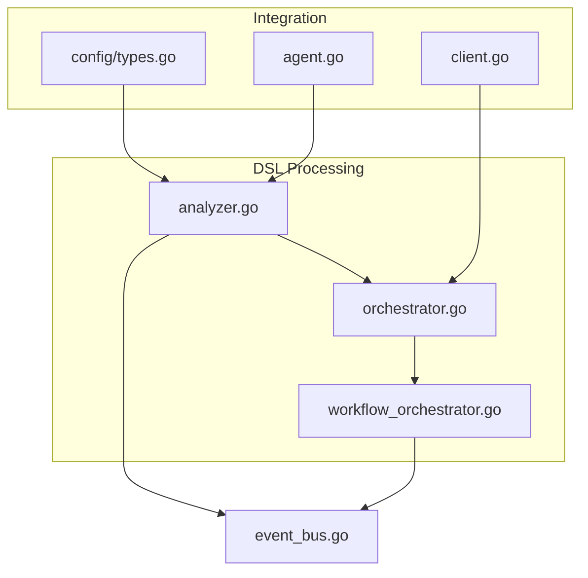
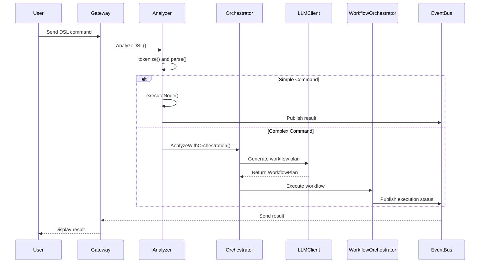
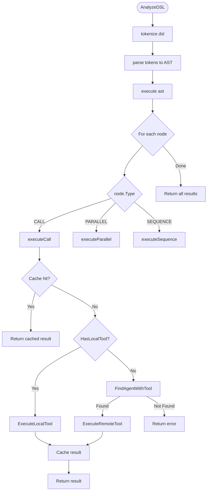
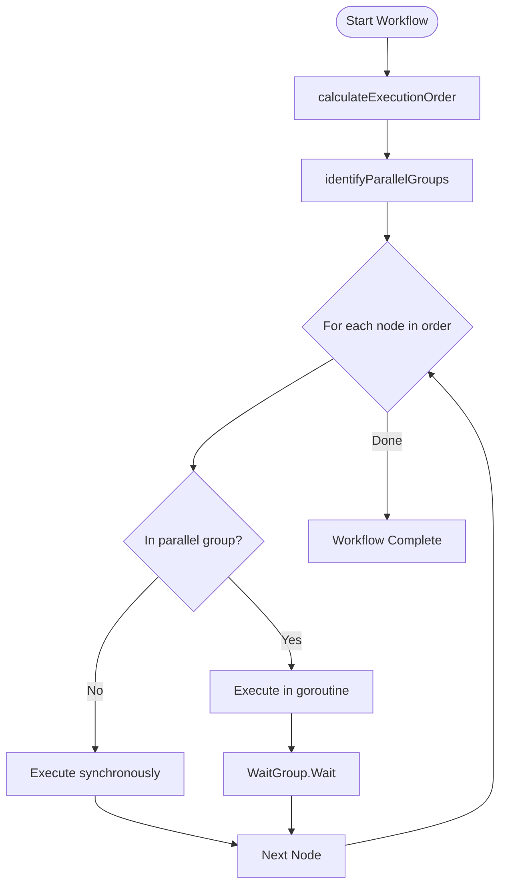
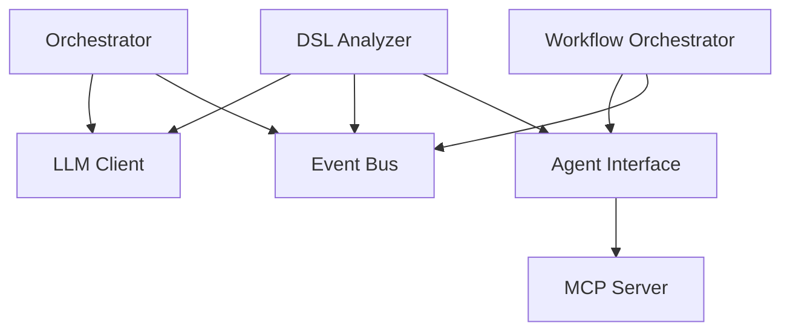

# DSL Processing


## Table of Contents
1. [Introduction](#introduction)
2. [Project Structure](#project-structure)
3. [Core Components](#core-components)
4. [Architecture Overview](#architecture-overview)
5. [Detailed Component Analysis](#detailed-component-analysis)
6. [Dependency Analysis](#dependency-analysis)
7. [Performance Considerations](#performance-considerations)
8. [Troubleshooting Guide](#troubleshooting-guide)
9. [Conclusion](#conclusion)

## Introduction
The DSL (Domain Specific Language) Processing sub-component is responsible for interpreting natural language commands and transforming them into executable workflows. This system enables users to interact with distributed agents using high-level instructions, which are parsed into Abstract Syntax Trees (ASTs), analyzed for intent, and orchestrated into multi-step execution plans. The core components include the **DSL Analyzer**, which handles syntax parsing and execution, and the **Workflow Orchestrator**, which coordinates complex, multi-agent workflows. Integration with LLMs enables semantic understanding and dynamic planning. This document details the architecture, syntax rules, execution patterns, configuration options, and error handling mechanisms.

## Project Structure
The DSL processing functionality is primarily located in the `internal/dsl` and `internal/workflow` directories. The system integrates with LLM services, agent coordination, and event-driven communication via the internal bus.



**Diagram sources**
- [analyzer.go](file://internal/dsl/analyzer.go#L0-L544)
- [orchestrator.go](file://internal/dsl/orchestrator.go#L0-L44)
- [workflow_orchestrator.go](file://internal/workflow/workflow_orchestrator.go#L344-L448)
- [client.go](file://internal/llm/client.go#L40-L72)
- [types.go](file://internal/config/types.go#L84-L135)

**Section sources**
- [analyzer.go](file://internal/dsl/analyzer.go#L0-L544)
- [orchestrator.go](file://internal/dsl/orchestrator.go#L0-L44)

## Core Components
The DSL processing system consists of two primary components: the **Analyzer** and the **Orchestrator**. The Analyzer parses DSL commands into ASTs and executes simple operations, while the Orchestrator leverages LLMs to generate and manage complex, multi-step workflows. The system supports both local and remote tool execution via P2P communication and caches results for performance optimization.

**Section sources**
- [analyzer.go](file://internal/dsl/analyzer.go#L0-L544)
- [orchestrator.go](file://internal/dsl/orchestrator.go#L0-L44)

## Architecture Overview
The DSL processing pipeline begins with a natural language input, which is tokenized and parsed into an AST. For simple commands, the Analyzer executes them directly. For complex requests, the Orchestrator engages an LLM to generate a structured workflow plan, which is then executed by the Workflow Orchestrator. The system uses an event bus to communicate results and status updates.



**Diagram sources**
- [analyzer.go](file://internal/dsl/analyzer.go#L0-L544)
- [orchestrator.go](file://internal/dsl/orchestrator.go#L0-L44)
- [client.go](file://internal/llm/client.go#L40-L72)
- [workflow_orchestrator.go](file://internal/workflow/workflow_orchestrator.go#L344-L448)

## Detailed Component Analysis

### DSL Analyzer Analysis
The `Analyzer` in `analyzer.go` is responsible for parsing and executing DSL commands. It supports a structured syntax with commands like `CALL`, `WORKFLOW`, `TASK`, `PARALLEL`, and `SEQUENCE`.

#### Syntax Rules and Command Structure
The DSL supports both positional and named arguments. Commands are line-based, with support for quoted strings and comments (lines starting with `#`).

**Valid DSL Commands:**
```
CALL read_file "report.txt"
CALL write_file output.txt "Generated content"
CALL delete_file --filename temp.txt --force true
PARALLEL
  CALL list_files
  CALL check_status
SEQUENCE
  CALL prepare_data
  CALL process_data
```

#### Argument Parsing Mechanism
The analyzer uses `parseQuotedFields` to handle quoted strings and escape characters. Arguments are converted into a `map[string]interface{}`:
- Positional arguments are mapped by convention (e.g., first argument to `filename` for `read_file`).
- Named arguments use `--key value` syntax and are directly mapped.

```go
// Example: CALL write_file test.txt "Hello World"
argsMap = {
  "filename": "test.txt",
  "content": "Hello World"
}
```

#### Execution Logic
The `executeNode` method dispatches based on node type:
- `CALL`: Executes a tool locally or remotely.
- `PARALLEL`: Runs child nodes concurrently.
- `SEQUENCE`: Runs child nodes in order, failing on first error.

Caching is implemented via `llm.ToolCache` with a default of 1000 entries and 5-minute TTL.



**Diagram sources**
- [analyzer.go](file://internal/dsl/analyzer.go#L0-L544)

**Section sources**
- [analyzer.go](file://internal/dsl/analyzer.go#L0-L544)

### Workflow Orchestrator Analysis
The `OrchestratorAnalyzer` extends the base `Analyzer` with LLM integration to handle complex, ambiguous, or high-level requests.

#### LLM Integration and Intent Recognition
The `client.go` file defines the `LLMClient` which communicates with external LLMs to generate `WorkflowPlan` structures. The plan includes nodes, edges, and metadata such as estimated duration and complexity.

```go
type WorkflowPlan struct {
    ID          string         `json:"id"`
    Description string         `json:"description"`
    Nodes       []WorkflowNode `json:"nodes"`
    Edges       []WorkflowEdge `json:"edges"`
    Metadata    PlanMetadata   `json:"metadata"`
}
```

The orchestrator uses the LLM to:
- Interpret natural language into structured plans.
- Assess workflow complexity (`simple`, `medium`, `complex`).
- Recommend execution strategies (e.g., parallelization).

#### Workflow Execution Patterns
The `workflow_orchestrator.go` executes plans with support for:
- **Conditional Logic**: Nodes with dependencies (`DependsOn`) are executed in topological order.
- **Error Recovery**: Failed nodes in parallel execution do not halt the entire workflow, but sequence execution stops on error.



**Diagram sources**
- [orchestrator.go](file://internal/dsl/orchestrator.go#L0-L44)
- [client.go](file://internal/llm/client.go#L40-L72)
- [workflow_orchestrator.go](file://internal/workflow/workflow_orchestrator.go#L344-L448)

**Section sources**
- [orchestrator.go](file://internal/dsl/orchestrator.go#L0-L44)
- [client.go](file://internal/llm/client.go#L40-L72)
- [workflow_orchestrator.go](file://internal/workflow/workflow_orchestrator.go#L344-L448)

## Dependency Analysis
The DSL processing system has tight integration with several internal components:
- **LLM Client**: For semantic analysis and workflow generation.
- **Event Bus**: For asynchronous communication and status updates.
- **Agent Interface**: For tool discovery and execution (local/remote).
- **MCP Server**: Exposes DSL analysis as a tool via `analyze_dsl`.



**Diagram sources**
- [analyzer.go](file://internal/dsl/analyzer.go#L0-L544)
- [orchestrator.go](file://internal/dsl/orchestrator.go#L0-L44)
- [client.go](file://internal/llm/client.go#L40-L72)
- [workflow_orchestrator.go](file://internal/workflow/workflow_orchestrator.go#L344-L448)

**Section sources**
- [analyzer.go](file://internal/dsl/analyzer.go#L0-L544)
- [orchestrator.go](file://internal/dsl/orchestrator.go#L0-L44)

## Performance Considerations
The system includes several performance optimizations:
- **Caching**: Tool execution results are cached for 5 minutes by default.
- **Parallel Execution**: Independent tasks are executed concurrently.
- **Complexity-Based Optimization**: Simple commands bypass LLM processing.

### Configuration Options
Configurable parameters are defined in `types.go`:

**LLM Configuration:**
- `Provider`: LLM backend (e.g., OpenAI).
- `Model`: Model name (e.g., gpt-4).
- `Timeout`: Request timeout (default: 30s).
- `MaxTokens`: Maximum response tokens.
- `Temperature`: Creativity level (0.0–1.0).

**Function Calling:**
- `StrictMode`: Enforce schema adherence.
- `MaxParallelCalls`: Limit concurrent tool calls.
- `ToolTimeout`: Per-tool execution timeout.

**Caching:**
- `Enabled`: Toggle caching.
- `TTL`: Cache entry lifetime.
- `MaxSize`: Maximum cache entries.

**Rate Limiting:**
- `RequestsPerMinute`: API call limit.
- `TokensPerMinute`: Token usage limit.

These can be set via environment variables or config files (e.g., `agent.yaml`).

**Section sources**
- [types.go](file://internal/config/types.go#L84-L135)

## Troubleshooting Guide
Common issues and resolution strategies:

### Common Parsing Errors
- **Empty DSL Query**: Ensure command is not whitespace or comment-only.
- **Unmatched Quotes**: Check for balanced quotation marks in arguments.
- **Invalid Command**: Verify command is one of `CALL`, `WORKFLOW`, `PARALLEL`, etc.

### Ambiguity Resolution
- **Tool Not Found**: The system searches local and remote agents. Ensure the tool is registered in the agent's card.
- **Ambiguous Intent**: The orchestrator uses LLM to disambiguate. Provide more context in the command.

### Performance Issues
- **High Latency**: Check LLM API key and network connectivity.
- **Cache Misses**: Increase `MaxSize` or `TTL` in config.
- **Timeouts**: Increase `Timeout` or `ToolTimeout` settings.

### Error Recovery
- **Sequence Failure**: The workflow stops at the first failed step. Use `PARALLEL` for fault tolerance.
- **Remote Execution Failure**: Verify peer availability and tool registration.

**Section sources**
- [analyzer.go](file://internal/dsl/analyzer.go#L0-L544)
- [orchestrator.go](file://internal/dsl/orchestrator.go#L0-L44)

## Conclusion
The DSL Processing system provides a robust framework for natural language interaction with distributed agents. By combining structured DSL syntax with LLM-powered orchestration, it supports both simple commands and complex workflows. Key features include caching, parallel execution, and comprehensive error handling. Configuration options allow tuning for performance and reliability. Future improvements could include dynamic LLM model selection and enhanced error recovery strategies.

**Referenced Files in This Document**
- [analyzer.go](file://internal/dsl/analyzer.go#L0-L544)
- [orchestrator.go](file://internal/dsl/orchestrator.go#L0-L44)
- [client.go](file://internal/llm/client.go#L40-L72)
- [workflow_orchestrator.go](file://internal/workflow/workflow_orchestrator.go#L344-L448)
- [types.go](file://internal/config/types.go#L84-L135)
