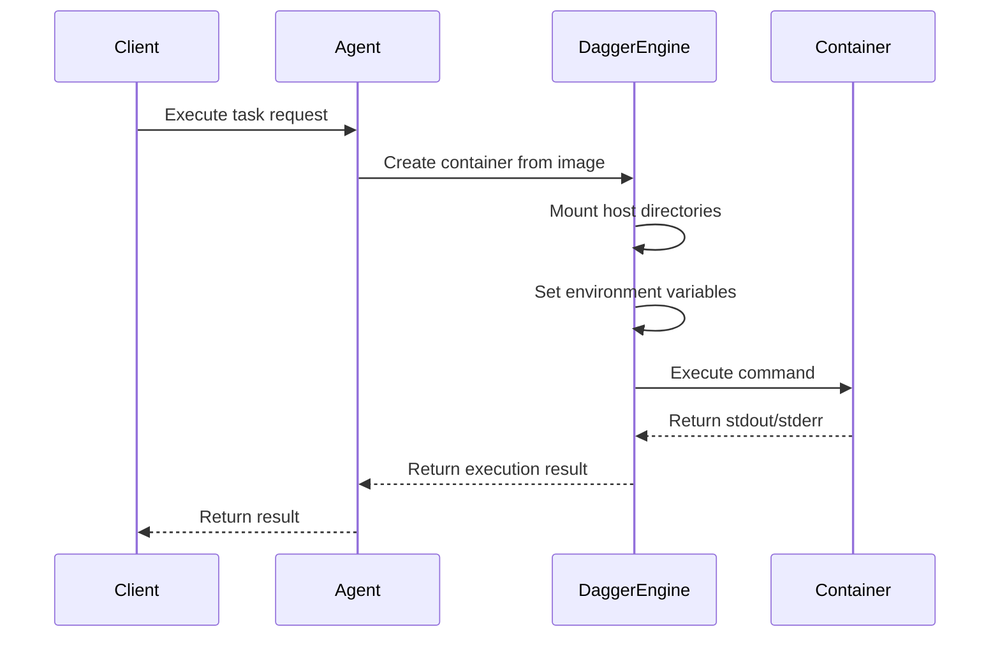
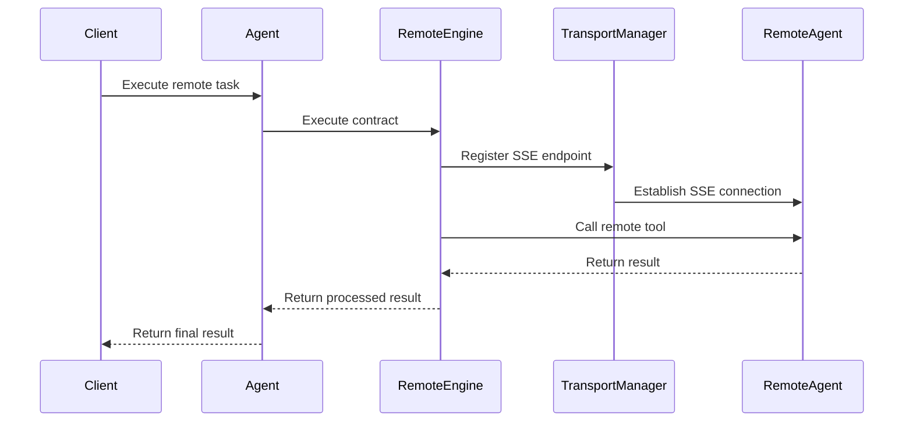
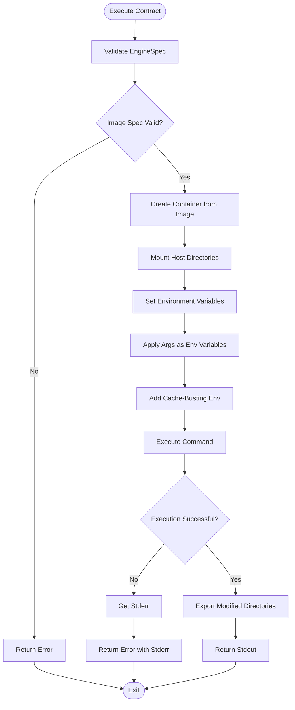
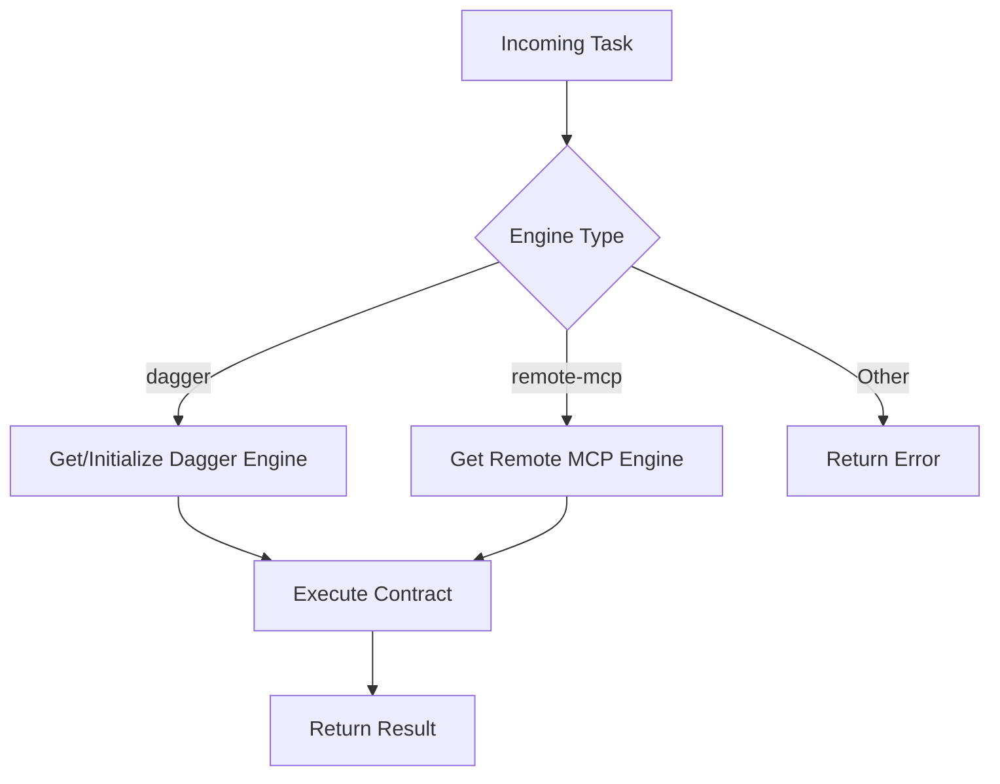

# Execution Engines


## Table of Contents
1. [Introduction](#introduction)
2. [Execution Contract Interface](#execution-contract-interface)
3. [Dagger Engine Implementation](#dagger-engine-implementation)
4. [Remote MCP Engine Implementation](#remote-mcp-engine-implementation)
5. [Engine Configuration Parameters](#engine-configuration-parameters)
6. [Task Execution Flow](#task-execution-flow)
7. [Orchestrator Task Routing](#orchestrator-task-routing)
8. [Performance and Fault Tolerance](#performance-and-fault-tolerance)
9. [Security Considerations](#security-considerations)

## Introduction
The Execution Engines sub-component provides a modular architecture for executing tasks through different execution backends. The system supports two primary execution engines: the Dagger engine for secure, containerized local execution, and the Remote MCP Engine for delegating work to other agents in the network. This document details the implementation, configuration, and integration of these engines within the orchestrator framework.

**Section sources**
- [agent.go](file://internal/agent/agent.go#L1-L50)

## Execution Contract Interface

The `ExecutionEngine` interface defined in `execution.go` establishes a uniform contract for all execution engines. This interface ensures consistent interaction patterns regardless of the underlying execution mechanism.

```go
// ExecutionEngine определяет абстракцию для выполнения любого ToolContract.
type ExecutionEngine interface {
	Execute(ctx context.Context, contract ToolContract, args map[string]interface{}) (string, error)
}
```

The `ToolContract` structure contains essential execution metadata:
- **Engine**: Specifies the execution engine to use (e.g., "dagger", "remote-mcp")
- **Name**: Identifies the tool or task to execute
- **EngineSpec**: Contains engine-specific configuration parameters

This contract-based approach enables the orchestrator to route tasks to appropriate engines without knowledge of their internal implementation details.

**Section sources**
- [execution.go](file://internal/contracts/execution.go#L0-L14)

## Dagger Engine Implementation

The Dagger engine provides secure, containerized task execution using the Dagger.io platform. It creates isolated environments for task execution, ensuring security and reproducibility.



**Diagram sources**
- [engine.go](file://internal/dagger/engine.go#L0-L183)

**Section sources**
- [engine.go](file://internal/dagger/engine.go#L0-L183)

### Key Implementation Details

The Dagger engine implementation includes several critical components:

#### Container Configuration
The engine configures containers with:
- **Image specification**: Base container image from `engineSpec.image`
- **Command execution**: Command array from `engineSpec.command`
- **Directory mounting**: Host directories mapped to container paths via `engineSpec.mounts`
- **Environment variables**: Both fixed (`engineSpec.env`) and dynamic (from `args`) variables

#### Security and Isolation
```go
// Apply args as environment variables (for shell substitution)
for key, val := range args {
    container = container.WithEnvVariable(key, fmt.Sprintf("%v", val))
}

// Add timestamp to prevent Dagger caching
container = container.WithEnvVariable("CACHE_BUST", fmt.Sprintf("%d", time.Now().UnixNano()))
```

The engine enhances security by:
- Validating host directory existence before mounting
- Preventing directory traversal attacks through absolute path resolution
- Using environment variables for parameter injection instead of command-line arguments
- Implementing cache busting to prevent unintended result reuse

#### Resource Management
The engine properly manages resources by:
- Exporting modified directories back to the host after execution
- Providing warning messages (rather than failing) when export operations fail
- Properly closing the Dagger client connection through the `Close()` method

## Remote MCP Engine Implementation

The Remote MCP Engine enables cross-agent task delegation through the Model Context Protocol (MCP). It facilitates distributed execution by forwarding tasks to other agents in the network.



**Diagram sources**
- [remote_engine.go](file://internal/mcp/remote_engine.go#L0-L52)

**Section sources**
- [remote_engine.go](file://internal/mcp/remote_engine.go#L0-L52)

### Key Implementation Details

The Remote MCP Engine implementation includes:

#### Endpoint Management
```go
// Регистрируем эндпоинт в TransportManager, если его еще нет.
clientName := address
e.transportManager.RegisterSSEEndpoint(clientName, address, nil)
```

The engine dynamically registers SSE endpoints with the TransportManager, enabling connection reuse and efficient communication with remote agents.

#### Result Processing
```go
// Извлекаем текстовый результат из ответа MCP.
if result != nil && len(result.Content) > 0 {
    if textContent, ok := result.Content[0].(*mcpTypes.TextContent); ok {
        return textContent.Text, nil
    }
}
```

The engine extracts text content from MCP responses, providing a clean string result to the caller while handling cases where no text output is available.

#### Error Handling
The engine provides descriptive error messages that include:
- Missing address specification in the contract
- Failed remote tool calls with both tool name and address
- Underlying transport errors propagated from the TransportManager

## Engine Configuration Parameters

### Dagger Engine Configuration

The Dagger engine supports the following configuration parameters in the `engineSpec` field:

```json
{
  "image": "python:3.11-slim",
  "command": ["python", "/shared/analyzer.py"],
  "mounts": {
    "/host/path": "/container/path"
  },
  "env": {
    "VAR_NAME": "value"
  },
  "env_passthrough": ["HOST_VAR"]
}
```

- **image**: Required Docker image for container creation
- **command**: Command array to execute within the container
- **mounts**: Directory mappings from host to container
- **env**: Fixed environment variables to set in the container
- **env_passthrough**: Host environment variable names to forward to the container

### Remote MCP Engine Configuration

The Remote MCP Engine requires the following configuration:

```json
{
  "address": "http://remote-agent:8090"
}
```

- **address**: Required URL of the remote MCP server endpoint

**Section sources**
- [engine.go](file://internal/dagger/engine.go#L0-L183)
- [remote_engine.go](file://internal/mcp/remote_engine.go#L0-L52)

## Task Execution Flow

The task execution flow demonstrates how the Dagger engine processes a contract:



**Diagram sources**
- [engine.go](file://internal/dagger/engine.go#L0-L183)

**Section sources**
- [engine.go](file://internal/dagger/engine.go#L0-L183)

## Orchestrator Task Routing

The orchestrator routes tasks to appropriate engines based on the `engine` field in the `ToolContract`. The agent maintains a registry of available execution engines and selects the appropriate one at runtime.

```go
// Get or initialize Dagger Engine
engine, ok := a.executionEngines[engineName]
if !ok {
    if engineName == "dagger" {
        a.logger.Info("Initializing Dagger Engine on first use...")
        daggerEngine, err := dagger.NewEngine(ctx)
        if err != nil {
            return mcpTypes.NewToolResultError(fmt.Sprintf("Dagger Engine initialization failed: %v", err)), nil
        }
        a.executionEngines["dagger"] = daggerEngine
        engine = daggerEngine
    } else {
        err := fmt.Errorf("execution engine '%s' not found or not initialized", engineName)
        return mcpTypes.NewToolResultError(err.Error()), nil
    }
}
```

The orchestrator follows this routing logic:
1. Check if the requested engine is already initialized
2. For the Dagger engine, initialize it on first use (lazy initialization)
3. Return an error if the requested engine is not available
4. Execute the contract using the selected engine

The orchestrator also supports backward compatibility with legacy handlers while maintaining the modern contract-based approach.



**Diagram sources**
- [agent.go](file://internal/agent/agent.go#L400-L450)
- [orchestrator.go](file://internal/dsl/orchestrator.go#L350-L360)

**Section sources**
- [agent.go](file://internal/agent/agent.go#L400-L450)
- [orchestrator.go](file://internal/dsl/orchestrator.go#L350-L360)

## Performance and Fault Tolerance

### Performance Implications

**Local vs Remote Execution:**
- **Dagger (Local)**: Higher startup overhead due to container creation, but lower latency for execution and data access
- **Remote MCP**: Lower startup overhead, but network latency for communication and potential bandwidth constraints for data transfer

**Resource Monitoring:**
The Dagger engine provides visibility into execution through:
- Standard output and error streams
- Warning messages for export failures
- Logging of container creation and execution steps

### Fault Tolerance Mechanisms

The execution engines implement several fault tolerance features:

#### Dagger Engine
- **Graceful directory export**: Failed exports generate warnings but don't fail the entire task
- **Host directory validation**: Checks for directory existence before mounting
- **Error context preservation**: Returns stderr content when available to aid debugging

#### Remote MCP Engine
- **Endpoint registration**: Ensures connections are properly established before execution
- **Descriptive error messages**: Includes both tool name and address in error messages
- **Transport abstraction**: Relies on the TransportManager for connection reliability

#### Orchestrator-Level Resilience
- **Lazy engine initialization**: Delays Dagger initialization until first use, preventing startup failures
- **Comprehensive logging**: Detailed logs for engine selection and execution steps
- **Structured error handling**: Consistent error patterns across engine types

**Section sources**
- [engine.go](file://internal/dagger/engine.go#L0-L183)
- [remote_engine.go](file://internal/mcp/remote_engine.go#L0-L52)
- [agent.go](file://internal/agent/agent.go#L400-L450)

## Security Considerations

### Sandboxing and Isolation

The Dagger engine provides strong sandboxing through:
- **Container isolation**: Each task runs in a separate container with its own filesystem and process space
- **Controlled directory mounting**: Only explicitly specified directories are accessible within the container
- **Network isolation**: By default, containers have no network access unless explicitly configured

### Input Validation

Both engines implement rigorous input validation:

**Dagger Engine:**
- Validates the presence of required fields (`image`, `command`)
- Checks host directory existence before mounting
- Safely converts configuration values with type checking
- Prevents directory traversal through absolute path resolution

**Remote MCP Engine:**
- Validates the presence of the `address` field in the contract
- Ensures the address is a non-empty string
- Uses the TransportManager for secure endpoint registration

### Privilege Escalation Prevention

The system prevents privilege escalation through:

**Container Security:**
- Running containers without elevated privileges by default
- Not mounting sensitive host directories (e.g., `/`, `/etc`, `/root`)
- Using minimal base images (e.g., `python:3.11-slim`)

**Execution Context:**
- Passing parameters through environment variables instead of command-line arguments to prevent shell injection
- Not supporting arbitrary image pulling (images are specified in configuration)
- Implementing cache busting to prevent unintended result reuse

**Access Control:**
- The Remote MCP Engine only connects to explicitly specified endpoints
- The orchestrator validates tool availability before execution
- Local tool execution is restricted to registered MCP tools

**Section sources**
- [engine.go](file://internal/dagger/engine.go#L0-L183)
- [remote_engine.go](file://internal/mcp/remote_engine.go#L0-L52)
- [agent.go](file://internal/agent/agent.go#L400-L450)

**Referenced Files in This Document**
- [execution.go](file://internal/contracts/execution.go)
- [engine.go](file://internal/dagger/engine.go)
- [remote_engine.go](file://internal/mcp/remote_engine.go)
- [agent.go](file://internal/agent/agent.go)
- [orchestrator.go](file://internal/dsl/orchestrator.go)
