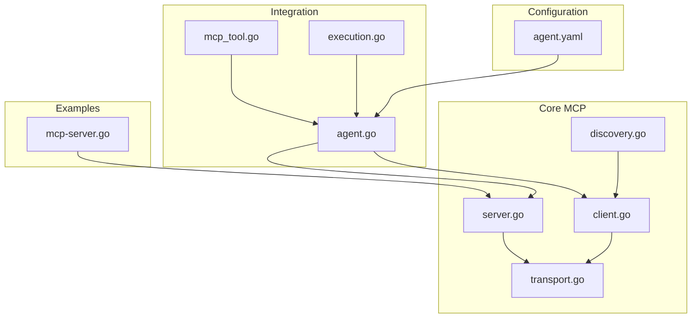
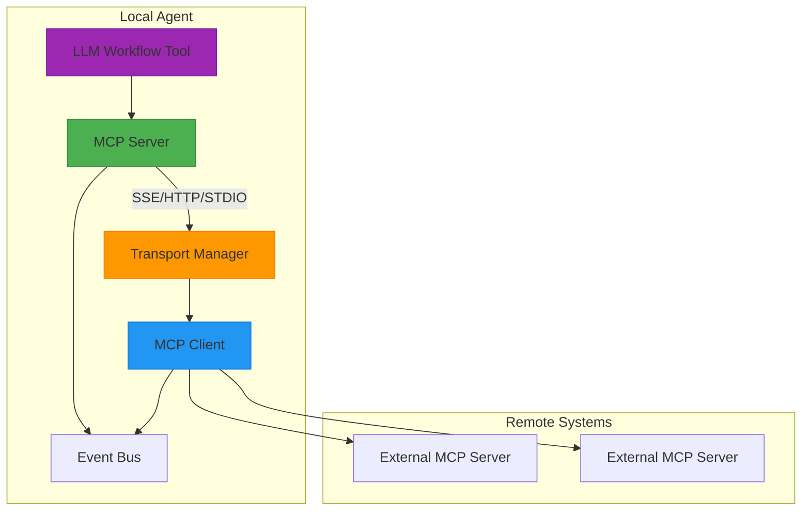
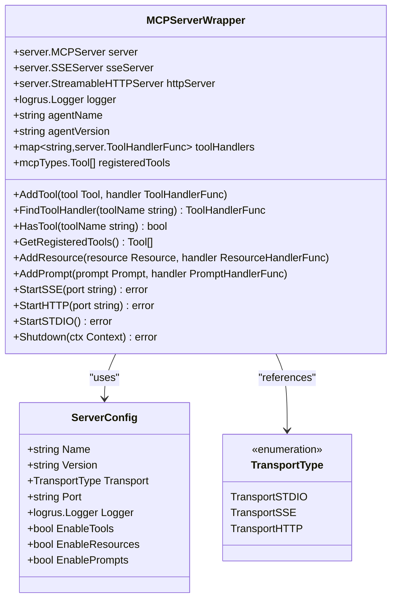
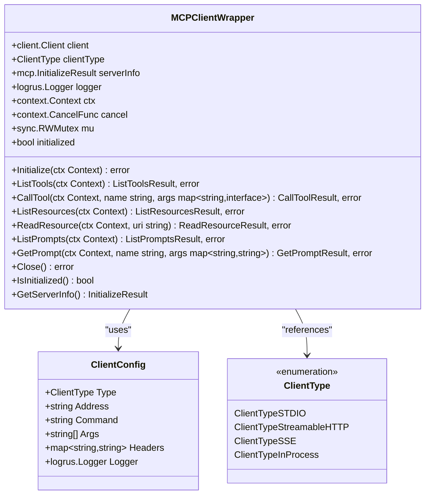
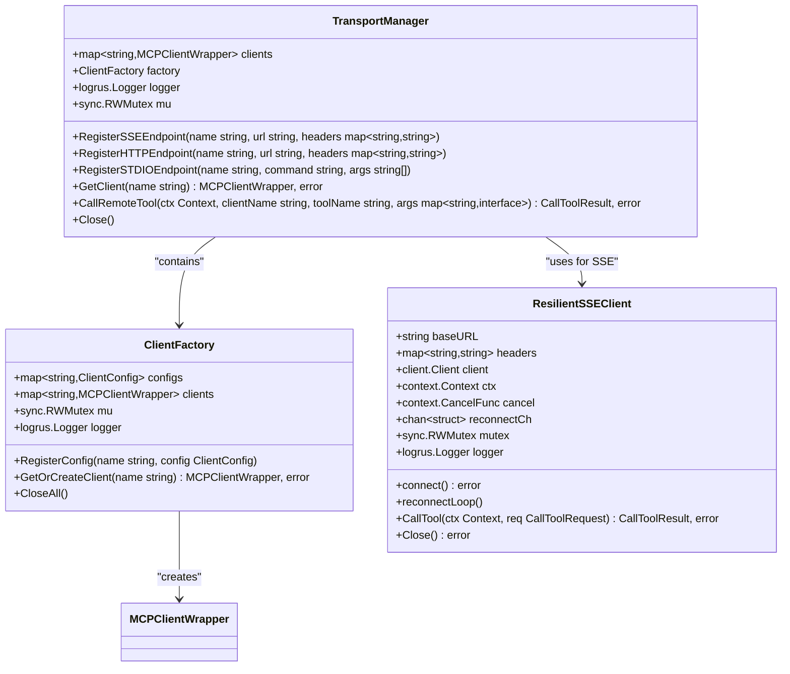
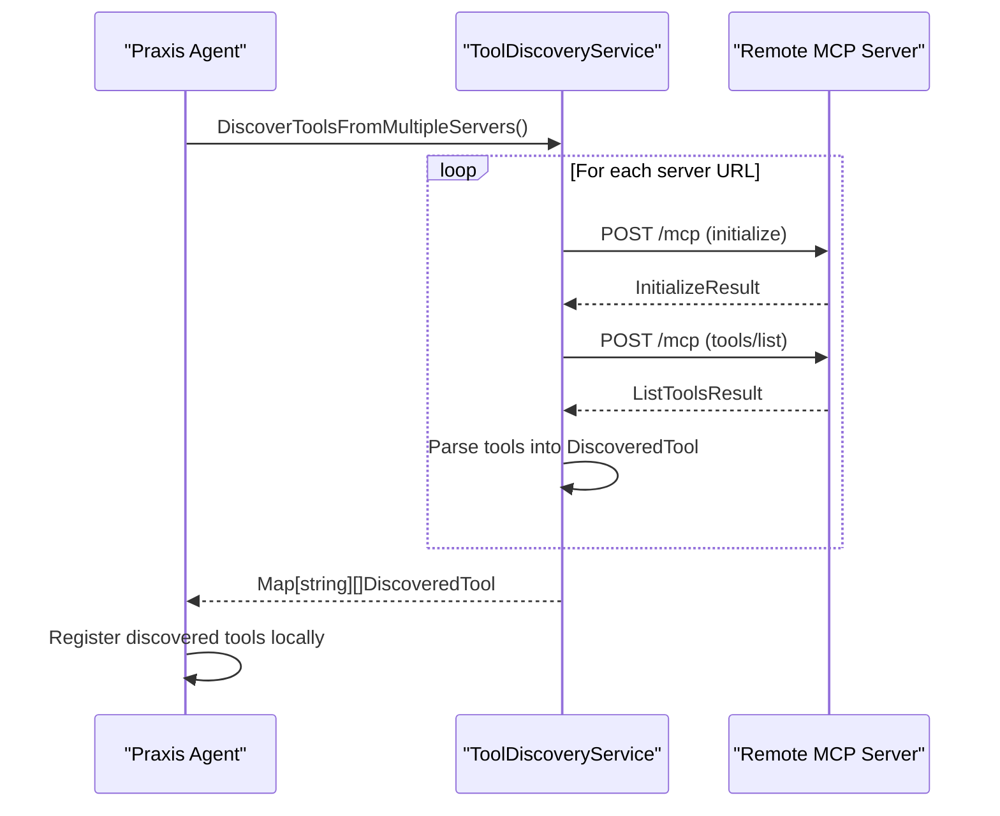
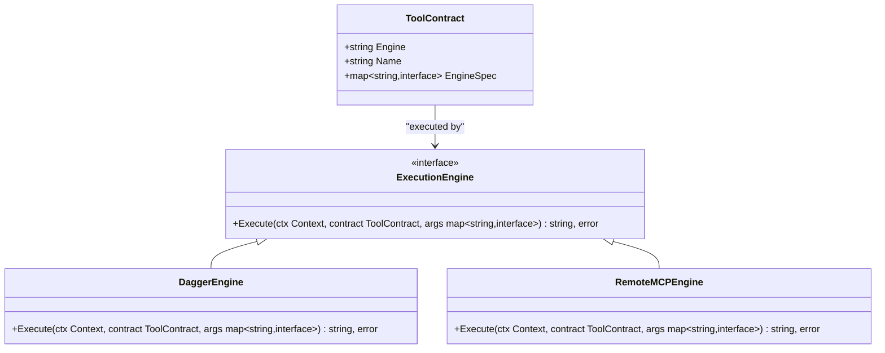
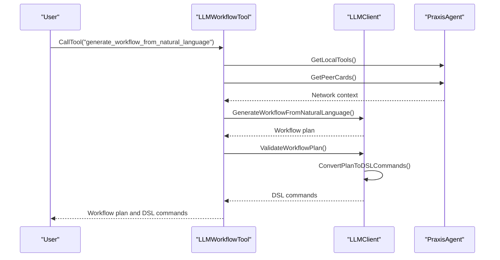
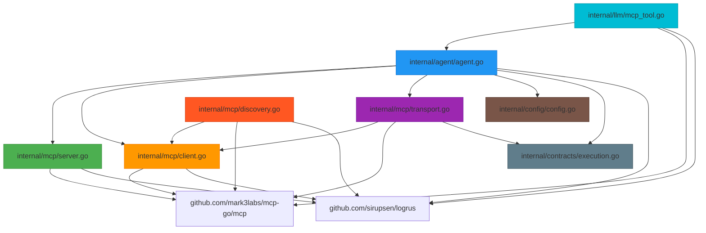

# MCP Protocol


## Table of Contents
1. [Introduction](#introduction)
2. [Project Structure](#project-structure)
3. [Core Components](#core-components)
4. [Architecture Overview](#architecture-overview)
5. [Detailed Component Analysis](#detailed-component-analysis)
6. [Dependency Analysis](#dependency-analysis)
7. [Performance Considerations](#performance-considerations)
8. [Troubleshooting Guide](#troubleshooting-guide)
9. [Conclusion](#conclusion)

## Introduction
The Model Context Protocol (MCP) enables secure, standardized communication between autonomous agents by exposing tools, resources, and prompts through a unified interface. This document provides a comprehensive analysis of the MCP implementation in the Praxis Go SDK, covering server and client implementations, transport mechanisms, service discovery, tool contracts, and integration with LLM systems. The protocol supports multiple transport methods including SSE, HTTP, and STDIO, enabling flexible deployment across distributed environments.

## Project Structure
The MCP implementation is organized within the `internal/mcp` directory, with supporting components in `internal/agent`, `internal/llm`, and `internal/contracts`. Key directories include:
- `internal/mcp`: Core MCP server, client, transport, and discovery logic
- `internal/agent`: Agent-level integration and tool registration
- `internal/llm`: LLM-powered dynamic tool generation
- `internal/contracts`: Tool execution contracts and engines
- `configs`: Configuration files defining MCP endpoints and tools
- `examples`: Sample MCP server implementations



**Diagram sources**
- [server.go](file://internal/mcp/server.go)
- [client.go](file://internal/mcp/client.go)
- [transport.go](file://internal/mcp/transport.go)
- [discovery.go](file://internal/mcp/discovery.go)
- [agent.go](file://internal/agent/agent.go)
- [mcp_tool.go](file://internal/llm/mcp_tool.go)
- [execution.go](file://internal/contracts/execution.go)
- [agent.yaml](file://configs/agent.yaml)
- [mcp-server.go](file://examples/mcp-server.go)

**Section sources**
- [internal/mcp/server.go](file://internal/mcp/server.go)
- [internal/mcp/client.go](file://internal/mcp/client.go)
- [internal/mcp/transport.go](file://internal/mcp/transport.go)
- [internal/mcp/discovery.go](file://internal/mcp/discovery.go)
- [internal/agent/agent.go](file://internal/agent/agent.go)
- [internal/llm/mcp_tool.go](file://internal/llm/mcp_tool.go)
- [internal/contracts/execution.go](file://internal/contracts/execution.go)
- [configs/agent.yaml](file://configs/agent.yaml)
- [examples/mcp-server.go](file://examples/mcp-server.go)

## Core Components
The MCP protocol implementation consists of several core components that work together to enable agent-to-agent communication and tool sharing. The server component exposes tools through standardized endpoints, while the client discovers and invokes remote tools. The transport layer abstracts communication methods, and the discovery service enables dynamic tool registration. The integration with LLM systems allows for intelligent workflow generation based on natural language requests.

**Section sources**
- [server.go](file://internal/mcp/server.go#L1-L50)
- [client.go](file://internal/mcp/client.go#L1-L50)
- [transport.go](file://internal/mcp/transport.go#L1-L50)
- [discovery.go](file://internal/mcp/discovery.go#L1-L50)

## Architecture Overview
The MCP architecture follows a modular design with clear separation of concerns between server, client, transport, and discovery components. Agents expose tools through MCP servers that can be accessed via multiple transport protocols. Clients connect to remote servers to discover and invoke tools, with the transport manager handling connection pooling and resilience. The discovery service enables automatic registration of external tools, while the LLM integration provides intelligent workflow planning.



**Diagram sources**
- [server.go](file://internal/mcp/server.go#L1-L100)
- [client.go](file://internal/mcp/client.go#L1-L100)
- [transport.go](file://internal/mcp/transport.go#L1-L100)
- [discovery.go](file://internal/mcp/discovery.go#L1-L100)
- [mcp_tool.go](file://internal/llm/mcp_tool.go#L1-L100)

## Detailed Component Analysis

### Server Implementation
The MCP server implementation wraps the underlying `github.com/mark3labs/mcp-go/server` package with additional functionality for tool management and transport handling. The `MCPServerWrapper` struct provides a convenient interface for registering tools, resources, and prompts, while tracking handlers and specifications for service discovery.



**Diagram sources**
- [server.go](file://internal/mcp/server.go#L1-L200)

**Section sources**
- [server.go](file://internal/mcp/server.go#L1-L327)

#### Tool Registration Process
The server exposes tools through a registration process that defines both the tool contract and its execution handler. Tools are specified using the MCP type system, which supports string, number, and boolean parameters with validation constraints.

```go
func (w *MCPServerWrapper) AddTool(tool mcpTypes.Tool, handler server.ToolHandlerFunc) {
    w.server.AddTool(tool, handler)
    w.toolHandlers[tool.Name] = handler
    w.registeredTools = append(w.registeredTools, tool)
    w.logger.Debugf("Added tool: %s", tool.Name)
}
```

The example from `agent.go` shows dynamic tool registration from configuration:

```go
toolSpec := mcpTypes.NewTool(toolCfg.Name, mcpOptions...)
handler := a.createGenericHandler(toolCfg)
a.mcpServer.AddTool(toolSpec, handler)
```

### Client Implementation
The MCP client implementation provides a wrapper around the underlying MCP client library with connection management and thread safety. The `MCPClientWrapper` handles initialization, tool invocation, and resource access with proper context management and error handling.



**Diagram sources**
- [client.go](file://internal/mcp/client.go#L1-L200)

**Section sources**
- [client.go](file://internal/mcp/client.go#L1-L292)

#### Remote Tool Invocation
The client provides a straightforward interface for invoking remote tools with proper error handling and context propagation:

```go
func (w *MCPClientWrapper) CallTool(ctx context.Context, name string, args map[string]interface{}) (*mcp.CallToolResult, error) {
    w.mu.RLock()
    if !w.initialized {
        w.mu.RUnlock()
        return nil, fmt.Errorf("client not initialized")
    }
    w.mu.RUnlock()

    request := mcp.CallToolRequest{}
    request.Params.Name = name
    request.Params.Arguments = args

    w.logger.Debugf("Calling tool %s with args: %v", name, args)

    result, err := w.client.CallTool(ctx, request)
    if err != nil {
        return nil, fmt.Errorf("tool call failed: %w", err)
    }

    return result, nil
}
```

### Transport Layer
The transport layer provides abstraction over different communication methods and includes connection pooling, resilience, and centralized management of MCP clients. The `TransportManager` serves as a factory and registry for MCP clients, preventing connection leaks and enabling efficient reuse.



**Diagram sources**
- [transport.go](file://internal/mcp/transport.go#L1-L200)

**Section sources**
- [transport.go](file://internal/mcp/transport.go#L1-L295)

#### Multiple Communication Methods
The transport layer supports three primary communication methods:

1. **SSE (Server-Sent Events)**: For streaming responses with automatic reconnection
2. **HTTP**: For standard request-response patterns
3. **STDIO**: For process-based communication

The `TransportManager` provides registration methods for each transport type:

```go
func (tm *TransportManager) RegisterSSEEndpoint(name, url string, headers map[string]string) {
    config := ClientConfig{
        Type:    ClientTypeSSE,
        Address: url,
        Headers: headers,
        Logger:  tm.logger,
    }
    tm.factory.RegisterConfig(name, config)
}

func (tm *TransportManager) RegisterHTTPEndpoint(name, url string, headers map[string]string) {
    config := ClientConfig{
        Type:    ClientTypeStreamableHTTP,
        Address: url,
        Headers: headers,
        Logger:  tm.logger,
    }
    tm.factory.RegisterConfig(name, config)
}

func (tm *TransportManager) RegisterSTDIOEndpoint(name, command string, args []string) {
    config := ClientConfig{
        Type:    ClientTypeSTDIO,
        Command: command,
        Args:    args,
        Logger:  tm.logger,
    }
    tm.factory.RegisterConfig(name, config)
}
```

### Service Discovery Mechanism
The service discovery mechanism enables automatic detection and registration of tools from external MCP servers. The `ToolDiscoveryService` performs HTTP requests to remote servers to retrieve their tool lists and creates local representations of discovered tools.



**Diagram sources**
- [discovery.go](file://internal/mcp/discovery.go#L1-L200)

**Section sources**
- [discovery.go](file://internal/mcp/discovery.go#L1-L226)

#### Discovery Implementation
The discovery service makes direct HTTP requests to MCP servers using the JSON-RPC protocol:

```go
func (s *ToolDiscoveryService) DiscoverToolsFromServer(ctx context.Context, serverURL string) ([]DiscoveredTool, error) {
    // Step 1: Initialize connection
    initRequest := map[string]interface{}{
        "jsonrpc": "2.0",
        "id":      1,
        "method":  "initialize",
        "params": map[string]interface{}{
            "protocolVersion": mcpTypes.LATEST_PROTOCOL_VERSION,
            "capabilities":    map[string]interface{}{},
            "clientInfo": map[string]interface{}{
                "name":    "Praxis MCP Discovery",
                "version": "1.0.0",
            },
        },
    }

    serverInfo, err := s.makeSSERequest(ctx, serverURL, initRequest)
    if err != nil {
        return nil, fmt.Errorf("failed to initialize MCP connection: %w", err)
    }

    // Step 2: List available tools
    toolsRequest := map[string]interface{}{
        "jsonrpc": "2.0",
        "id":      2,
        "method":  "tools/list",
        "params":  map[string]interface{}{},
    }

    toolsResponse, err := s.makeSSERequest(ctx, serverURL, toolsRequest)
    if err != nil {
        return nil, fmt.Errorf("failed to list tools: %w", err)
    }
```

### Tool Contract Definition
The `ToolContract` struct defines a language-agnostic API contract for tools, specifying the execution engine, tool name, and engine-specific configuration. This enables dynamic routing of tool calls to appropriate execution engines.



**Diagram sources**
- [execution.go](file://internal/contracts/execution.go#L1-L16)

**Section sources**
- [execution.go](file://internal/contracts/execution.go#L1-L16)

#### Contract Usage
The `ToolContract` is used by execution engines to determine how to execute a tool:

```go
type ToolContract struct {
    Engine     string                 `json:"engine"`
    Name       string                 `json:"name"`
    EngineSpec map[string]interface{} `json:"engineSpec"`
}

type ExecutionEngine interface {
    Execute(ctx context.Context, contract ToolContract, args map[string]interface{}) (string, error)
}
```

In the agent configuration, tools are defined with their engine and specifications:

```yaml
tools:
  - name: "python_analyzer"
    description: "Analyzes data using an external Python script"
    engine: "dagger"
    engineSpec:
      image: "python:3.11-slim"
      command: ["python", "/shared/analyzer.py"]
      mounts:
        ./shared: /shared
  - name: "greet_external"
    description: "Calls a greeting tool on an external MCP server"
    engine: "remote-mcp"
    engineSpec:
      address: "http://host.docker.internal:8080"
```

### LLM Integration
The LLM integration enables dynamic workflow generation from natural language requests. The `LLMWorkflowTool` exposes an MCP tool that uses an LLM to convert natural language into executable workflows, analyzing the current network topology to optimize task distribution.



**Diagram sources**
- [mcp_tool.go](file://internal/llm/mcp_tool.go#L1-L200)

**Section sources**
- [mcp_tool.go](file://internal/llm/mcp_tool.go#L1-L362)

#### Dynamic Tool Binding
The LLM tool is registered with the MCP server like any other tool:

```go
func (t *LLMWorkflowTool) GetGenerateWorkflowTool() mcpTypes.Tool {
    return mcpTypes.NewTool("generate_workflow_from_natural_language",
        mcpTypes.WithDescription("Converts natural language requests into executable P2P workflow plans using LLM intelligence. Analyzes current network capabilities and generates optimal task distribution across agents."),
        mcpTypes.WithString("request",
            mcpTypes.Required(),
            mcpTypes.Description("Natural language description of what you want to accomplish")),
        mcpTypes.WithBoolean("include_network_analysis",
            mcpTypes.DefaultBool(true),
            mcpTypes.Description("Whether to include current network topology analysis in the response")),
    )
}
```

The handler generates workflows using the LLM client:

```go
func (t *LLMWorkflowTool) GenerateWorkflowHandler(ctx context.Context, req mcpTypes.CallToolRequest) (*mcpTypes.CallToolResult, error) {
    args := req.GetArguments()
    userRequest, _ := args["request"].(string)
    includeNetworkAnalysis, _ := args["include_network_analysis"].(bool)

    // Build current network context
    networkContext, err := t.buildNetworkContext()
    if err != nil {
        return mcpTypes.NewToolResultError(fmt.Sprintf("Failed to analyze network: %v", err)), nil
    }

    // Generate workflow using LLM
    plan, err := t.llmClient.GenerateWorkflowFromNaturalLanguage(ctx, userRequest, networkContext)
    if err != nil {
        return mcpTypes.NewToolResultError(fmt.Sprintf("LLM workflow generation failed: %v", err)), nil
    }
```

## Dependency Analysis
The MCP components have well-defined dependencies that follow a layered architecture. The core dependencies flow from the agent layer down to the transport and protocol layers.



**Diagram sources**
- [go.mod](file://go.mod#L1-L20)
- [internal/agent/agent.go](file://internal/agent/agent.go#L1-L50)
- [internal/mcp/server.go](file://internal/mcp/server.go#L1-L20)
- [internal/mcp/client.go](file://internal/mcp/client.go#L1-L20)
- [internal/mcp/transport.go](file://internal/mcp/transport.go#L1-L20)
- [internal/llm/mcp_tool.go](file://internal/llm/mcp_tool.go#L1-L20)
- [internal/mcp/discovery.go](file://internal/mcp/discovery.go#L1-L20)
- [internal/config/config.go](file://internal/config/config.go#L1-L20)
- [internal/contracts/execution.go](file://internal/contracts/execution.go#L1-L20)

**Section sources**
- [internal/agent/agent.go](file://internal/agent/agent.go#L1-L1563)
- [internal/mcp/server.go](file://internal/mcp/server.go#L1-L327)
- [internal/mcp/client.go](file://internal/mcp/client.go#L1-L292)
- [internal/mcp/transport.go](file://internal/mcp/transport.go#L1-L295)
- [internal/llm/mcp_tool.go](file://internal/llm/mcp_tool.go#L1-L362)
- [internal/mcp/discovery.go](file://internal/mcp/discovery.go#L1-L226)
- [internal/config/config.go](file://internal/config/config.go#L1-L200)
- [internal/contracts/execution.go](file://internal/contracts/execution.go#L1-L16)

## Performance Considerations
The MCP implementation includes several performance optimizations:

1. **Connection Pooling**: The `TransportManager` maintains a pool of clients to avoid repeated connection establishment
2. **Thread Safety**: Read-write mutexes protect shared state in clients and transport managers
3. **Resilient Connections**: The `ResilientSSEClient` automatically reconnects on connection failures
4. **Caching**: LLM responses are cached to avoid redundant computations
5. **Asynchronous Operations**: Server startup and shutdown operations are performed in goroutines

The configuration allows tuning of performance parameters:

```yaml
mcp:
  limits:
    max_concurrent_requests: 100
    request_timeout_ms: 30000
    max_response_size_bytes: 10485760
    max_servers_per_node: 10
    connection_pool_size: 5
    retry_attempts: 3
    retry_backoff_ms: 1000
```

## Troubleshooting Guide
Common issues and their solutions:

**Section sources**
- [server.go](file://internal/mcp/server.go#L1-L327)
- [client.go](file://internal/mcp/client.go#L1-L292)
- [transport.go](file://internal/mcp/transport.go#L1-L295)
- [discovery.go](file://internal/mcp/discovery.go#L1-L226)
- [agent.go](file://internal/agent/agent.go#L1-L1563)

### Connection Failures
**Symptoms**: Client initialization fails, tool calls return connection errors
**Causes**:
- Server not running or unreachable
- Incorrect URL or port
- Network firewall blocking connections
- Authentication headers missing

**Solutions**:
1. Verify server is running and accessible
2. Check URL and port configuration
3. Test connectivity with curl or similar tool
4. Ensure required headers are provided

### Version Incompatibility
**Symptoms**: Protocol errors, unrecognized methods, invalid responses
**Causes**:
- Client and server using different MCP protocol versions
- Incompatible tool specifications

**Solutions**:
1. Ensure both client and server use compatible protocol versions
2. Check `LATEST_PROTOCOL_VERSION` constant
3. Update dependencies to compatible versions

### Timeout Management
**Symptoms**: Tool calls hang or return timeout errors
**Causes**:
- Long-running operations
- Network latency
- Server overload

**Solutions**:
1. Adjust timeout settings in configuration:
```yaml
mcp:
  limits:
    request_timeout_ms: 30000
```
2. Implement proper context cancellation
3. Use streaming responses for long operations

### Tool Registration Issues
**Symptoms**: Tools not found, "Method not found" errors
**Causes**:
- Tool not properly registered with server
- Handler function missing or incorrect
- Tool name mismatch

**Solutions**:
1. Verify tool registration code:
```go
server.AddTool(tool, handler)
```
2. Check that handler function matches signature
3. Use `GetRegisteredTools()` to verify registration

## Conclusion
The MCP Protocol implementation in the Praxis Go SDK provides a robust foundation for agent-to-agent communication with support for multiple transport methods, dynamic service discovery, and LLM-powered workflow generation. The modular architecture separates concerns between server, client, transport, and discovery components, enabling flexible deployment and extension. Key strengths include connection resilience, thread safety, and seamless integration with external systems through standardized contracts. The configuration system allows fine-tuning of performance and reliability parameters, while comprehensive error handling ensures graceful degradation in failure scenarios.

**Referenced Files in This Document**
- [server.go](file://internal/mcp/server.go)
- [client.go](file://internal/mcp/client.go)
- [transport.go](file://internal/mcp/transport.go)
- [discovery.go](file://internal/mcp/discovery.go)
- [mcp_tool.go](file://internal/llm/mcp_tool.go)
- [agent.go](file://internal/agent/agent.go)
- [execution.go](file://internal/contracts/execution.go)
- [agent.yaml](file://configs/agent.yaml)
- [mcp-server.go](file://examples/mcp-server.go)
