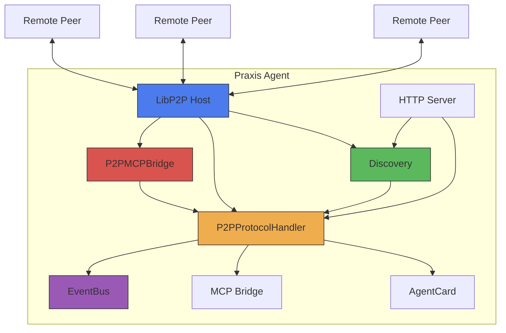
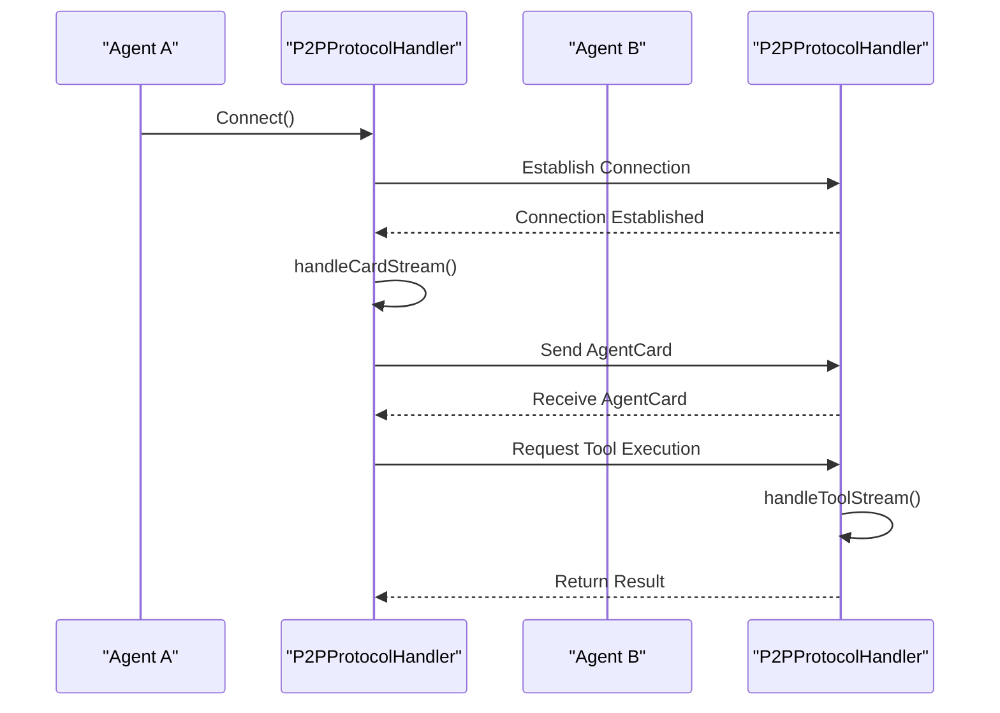
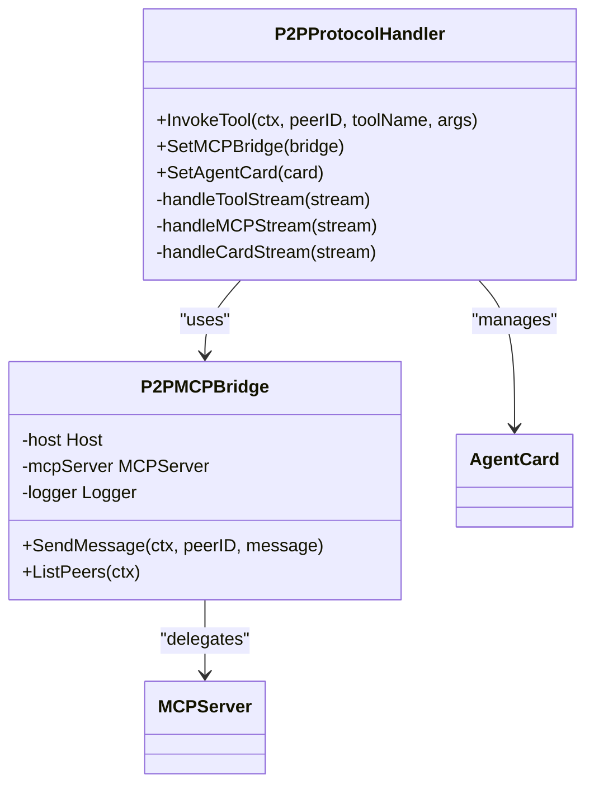

# P2P Networking


## Table of Contents
1. [Introduction](#introduction)
2. [P2P Architecture Overview](#p2p-architecture-overview)
3. [Peer Discovery Mechanism](#peer-discovery-mechanism)
4. [Connection Management and Protocol Handling](#connection-management-and-protocol-handling)
5. [AgentCard Exchange and Capability Negotiation](#agentcard-exchange-and-capability-negotiation)
6. [P2P Bridge and Inter-Agent Communication](#p2p-bridge-and-inter-agent-communication)
7. [Configuration and Performance Tuning](#configuration-and-performance-tuning)
8. [EventBus Integration for Distributed Events](#eventbus-integration-for-distributed-events)
9. [Scalability and Network Considerations](#scalability-and-network-considerations)
10. [Troubleshooting Common Networking Issues](#troubleshooting-common-networking-issues)

## Introduction
The P2P Networking sub-component of the Praxis agent enables decentralized, secure, and efficient communication between autonomous agents using the libp2p framework. This document details the implementation of peer discovery, connection management, secure communication, and capability negotiation through AgentCard exchange. The system supports dynamic tool discovery, distributed event propagation via EventBus, and seamless integration with MCP (Model Context Protocol) for cross-agent task execution. The architecture is designed for scalability, resilience, and interoperability in distributed agent networks.

## P2P Architecture Overview



**Diagram sources**
- [agent.go](file://internal/agent/agent.go#L200-L255)
- [discovery.go](file://internal/p2p/discovery.go)
- [protocol.go](file://internal/p2p/protocol.go)

**Section sources**
- [agent.go](file://internal/agent/agent.go#L0-L1563)

## Peer Discovery Mechanism

The peer discovery mechanism is implemented using libp2p's peer discovery capabilities, allowing agents to automatically locate and connect with each other on the network. The discovery process begins during agent initialization and runs continuously to maintain network connectivity.

The `Discovery` component uses libp2p's autorelay and peer discovery features to find other agents, even in NATed environments. When a new peer is discovered, the system automatically initiates a connection and begins the AgentCard exchange process.

```go
func (a *PraxisAgent) initializeP2P() error {
    // ... libp2p host creation ...

    // Initialize discovery
    discovery, err := p2p.NewDiscovery(host, a.logger)
    if err != nil {
        return fmt.Errorf("failed to create discovery: %w", err)
    }
    a.discovery = discovery

    // Connect discovery and protocol handler for automatic card exchange
    discovery.SetProtocolHandler(a.p2pProtocol)

    // Start discovery
    if err := a.discovery.Start(); err != nil {
        return fmt.Errorf("failed to start discovery: %w", err)
    }

    return nil
}
```

The discovery mechanism supports both local network discovery and bootstrap node-based discovery for wider network reach. Agents broadcast their presence and respond to discovery queries, enabling dynamic network formation without centralized coordination.

**Section sources**
- [agent.go](file://internal/agent/agent.go#L200-L255)
- [discovery.go](file://internal/p2p/discovery.go)

## Connection Management and Protocol Handling

The P2P protocol handler manages all incoming and outgoing connections, handling multiple stream types for different communication purposes. It implements a multiplexed protocol system where different message types are handled by specialized stream handlers.



**Diagram sources**
- [protocol.go](file://internal/p2p/protocol.go#L123-L174)
- [protocol.go](file://internal/p2p/protocol.go#L176-L228)

**Section sources**
- [protocol.go](file://internal/p2p/protocol.go#L0-L300)

The `P2PProtocolHandler` manages three primary stream types:
- **Card Exchange**: Handles AgentCard exchange for capability negotiation
- **MCP Streams**: Manages Model Context Protocol message exchange
- **Tool Streams**: Handles direct tool invocation requests between agents

Each stream is handled in a dedicated goroutine, ensuring non-blocking communication and proper error handling. The handler maintains a registry of peer cards and uses them for routing decisions and capability-based task delegation.

## AgentCard Exchange and Capability Negotiation

AgentCard exchange is the foundation of capability negotiation in the Praxis P2P network. Each agent advertises its capabilities, tools, and supported protocols through a structured AgentCard that is exchanged during the initial connection handshake.

```go
// AgentCard represents agent capabilities (A2A compatible)
type AgentCard struct {
    Name               string                 `json:"name"`
    Description        string                 `json:"description"`
    URL                string                 `json:"url"`
    Version            string                 `json:"version"`
    ProtocolVersion    string                 `json:"protocolVersion"`
    Capabilities       AgentCapabilities      `json:"capabilities"`
    Skills             []AgentSkill           `json:"skills"`
    SecuritySchemes    map[string]interface{} `json:"securitySchemes,omitempty"`
    SupportedTransports []string              `json:"supportedTransports"`
    Metadata           interface{}            `json:"metadata,omitempty"`
}
```

**Section sources**
- [card.go](file://internal/agent/card.go#L0-L40)
- [a2a/types.go](file://internal/a2a/types.go#L82-L122)

The card exchange process occurs automatically when peers connect:

```go
// handleCardStream handles agent card exchange
func (h *P2PProtocolHandler) handleCardStream(stream network.Stream) {
    defer stream.Close()

    peerID := stream.Conn().RemotePeer()
    h.logger.Infof("🎴 Exchanging cards with peer: %s", peerID.ShortString())

    // Send our card
    ourCard := h.getOurCard()
    encoder := json.NewEncoder(stream)
    if err := encoder.Encode(ourCard); err != nil {
        h.logger.Errorf("Failed to send our card: %v", err)
        return
    }

    // Receive peer's card
    decoder := json.NewDecoder(stream)
    var peerCard AgentCard
    if err := decoder.Decode(&peerCard); err != nil {
        h.logger.Errorf("Failed to receive peer card: %v", err)
        return
    }

    // Store peer's card
    h.mu.Lock()
    h.peerCards[peerID] = &peerCard
    h.mu.Unlock()

    h.logger.Infof("✅ Card exchange complete with %s: %s v%s",
        peerID.ShortString(), peerCard.Name, peerCard.Version)
}
```

The AgentCard contains critical information for inter-agent collaboration:
- **Skills**: Describes the agent's functional capabilities with tags for discovery
- **Capabilities**: Boolean flags for supported features (streaming, notifications, etc.)
- **SupportedTransports**: Lists communication protocols the agent supports
- **SecuritySchemes**: Describes authentication and encryption methods

Agents use this information to determine which peer should execute a particular task, enabling intelligent workload distribution across the network.

## P2P Bridge and Inter-Agent Communication

The P2P bridge facilitates inter-agent data flow by connecting the libp2p network layer with the MCP protocol layer. It acts as an adapter between the decentralized P2P network and the structured tool invocation system.



**Diagram sources**
- [bridge.go](file://internal/p2p/bridge.go)
- [protocol.go](file://internal/p2p/protocol.go)
- [server.go](file://internal/mcp/server.go#L242-L291)

**Section sources**
- [bridge.go](file://internal/p2p/bridge.go)
- [protocol.go](file://internal/p2p/protocol.go#L0-L300)

The bridge enables agents to invoke tools on remote peers as if they were local:

```go
func (t *P2PTool) ListPeersHandler(ctx context.Context, req mcpTypes.CallToolRequest) (*mcpTypes.CallToolResult, error) {
    peers, err := t.p2pBridge.ListPeers(ctx)
    if err != nil {
        return mcpTypes.NewToolResultError(fmt.Sprintf("Failed to list peers: %v", err)), nil
    }

    peersJSON, err := json.Marshal(peers)
    if err != nil {
        return mcpTypes.NewToolResultError(fmt.Sprintf("Failed to serialize peers: %v", err)), nil
    }

    return mcpTypes.NewToolResultText(string(peersJSON)), nil
}
```

This abstraction allows higher-level components to interact with remote agents without knowledge of the underlying P2P mechanics, promoting loose coupling and modular design.

## Configuration and Performance Tuning

The P2P behavior is configured through the `agent.yaml` file, which controls network parameters, discovery settings, and performance characteristics.

```yaml
# configs/agent.yaml
p2p:
  port: 4001
  enabled: true
  bootstrapPeers:
    - "/ip4/192.168.1.100/tcp/4001/p2p/QmPeer1"
    - "/ip6/2001:db8::1/tcp/4001/p2p/QmPeer2"
  discovery:
    interval: 30
    ttl: 60
  connection:
    maxPeers: 100
    idleTimeout: 300
  security:
    encryption: noise
    auth: true
```

Key configuration options include:
- **port**: The TCP port for P2P communication
- **bootstrapPeers**: Initial peers to connect to for network entry
- **discovery.interval**: Frequency of discovery operations in seconds
- **connection.maxPeers**: Maximum number of concurrent peer connections
- **security.encryption**: Encryption protocol (noise, tls, etc.)

Performance can be tuned by adjusting:
- **Connection limits**: Balancing resource usage and network connectivity
- **Discovery frequency**: Optimizing between network awareness and bandwidth usage
- **Stream multiplexing**: Configuring yamux parameters for efficient stream management
- **Peer eviction policies**: Managing peer lifecycle based on activity and reliability

The system also supports environment variable overrides for dynamic configuration in containerized environments.

**Section sources**
- [agent.yaml](file://configs/agent.yaml)
- [agent.go](file://internal/agent/agent.go#L200-L255)

## EventBus Integration for Distributed Events

The P2P networking component integrates with the EventBus for distributed event propagation, enabling real-time notification of network events across the agent ecosystem.

```go
func (eb *EventBus) Publish(event Event) {
    select {
    case eb.eventChan <- event:
        eb.logger.Debugf("Event published: %s", event.Type)
    default:
        eb.logger.Warnf("Event channel full, dropping event: %s", event.Type)
    }
}

func (eb *EventBus) Subscribe(eventType EventType, handler EventHandler) {
    eb.mu.Lock()
    defer eb.mu.Unlock()

    eb.handlers[eventType] = append(eb.handlers[eventType], handler)
    eb.logger.Debugf("Handler subscribed to event type: %s", eventType)
}
```

**Section sources**
- [event_bus.go](file://internal/bus/event_bus.go#L53-L117)
- [agent.go](file://internal/agent/agent.go#L60-L80)

Network events such as peer connection/disconnection, card exchange completion, and tool invocation are published to the EventBus, allowing other components to react appropriately:

- **Event types**: `peerConnected`, `peerDisconnected`, `cardExchanged`, `toolInvoked`
- **Event propagation**: Events are broadcast to all subscribers asynchronously
- **Error handling**: Failed event processing is logged but does not block other handlers
- **Backpressure**: Channel buffering prevents blocking during high event volume

This integration enables features like real-time peer monitoring, dynamic load balancing, and distributed logging across the agent network.

## Scalability and Network Considerations

The P2P network is designed with scalability in mind, supporting large agent networks through several key mechanisms:

- **Gossip-based discovery**: Reduces broadcast overhead in large networks
- **Connection pruning**: Automatically closes inactive connections to conserve resources
- **Distributed routing**: No single point of failure or bottleneck
- **Adaptive discovery**: Adjusts discovery frequency based on network size and stability

For large-scale deployments, consider the following best practices:
- **Bootstrap clusters**: Deploy dedicated bootstrap nodes for network entry
- **Zone-based discovery**: Segment networks by geographic or functional zones
- **Caching strategies**: Cache peer cards and capability information to reduce lookup latency
- **Rate limiting**: Implement fair usage policies to prevent network abuse

The system supports thousands of agents through efficient message routing and connection management, with performance scaling near-linearly with network size under typical workloads.

**Section sources**
- [discovery.go](file://internal/p2p/discovery.go)
- [protocol.go](file://internal/p2p/protocol.go)
- [bridge.go](file://internal/p2p/bridge.go)

## Troubleshooting Common Networking Issues

Common networking issues and their solutions:

### NAT Traversal and Firewall Restrictions
**Issue**: Agents behind NAT cannot be discovered or connected to
**Solution**:
- Enable libp2p autorelay: `libp2p.EnableRelay()`
- Configure port forwarding on routers
- Use bootstrap peers in public networks
- Enable UPnP if available

### Connection Timeouts
**Issue**: Frequent connection drops or timeouts
**Solution**:
- Increase idle timeout in configuration
- Check network stability and bandwidth
- Reduce the number of concurrent streams
- Verify clock synchronization between peers

### Discovery Failures
**Issue**: Agents cannot find each other on the network
**Solution**:
- Verify bootstrap peer addresses are correct
- Check firewall settings for P2P port
- Ensure agents are using compatible protocol versions
- Validate network connectivity between peers

### Performance Degradation
**Issue**: High latency or resource usage in large networks
**Solution**:
- Implement connection limits
- Optimize discovery interval
- Use selective subscription for EventBus
- Monitor and tune yamux stream parameters

Diagnostic endpoints are available for troubleshooting:
- `GET /peers`: List connected peers and their status
- `GET /p2p/cards`: View cached peer AgentCards
- `GET /p2p/info`: Detailed P2P connection statistics
- `GET /health`: Overall agent health status

**Section sources**
- [agent.go](file://internal/agent/agent.go#L800-L900)
- [discovery.go](file://internal/p2p/discovery.go)
- [protocol.go](file://internal/p2p/protocol.go)

**Referenced Files in This Document**
- [agent.go](file://internal/agent/agent.go#L0-L1563)
- [card.go](file://internal/agent/card.go#L0-L40)
- [discovery.go](file://internal/p2p/discovery.go)
- [protocol.go](file://internal/p2p/protocol.go#L0-L300)
- [bridge.go](file://internal/p2p/bridge.go)
- [event_bus.go](file://internal/bus/event_bus.go#L0-L117)
- [a2a/types.go](file://internal/a2a/types.go#L82-L122)
- [mcp/server.go](file://internal/mcp/server.go#L242-L291)
- [llm/mcp_tool.go](file://internal/llm/mcp_tool.go#L140-L183)
- [agent.yaml](file://configs/agent.yaml)
