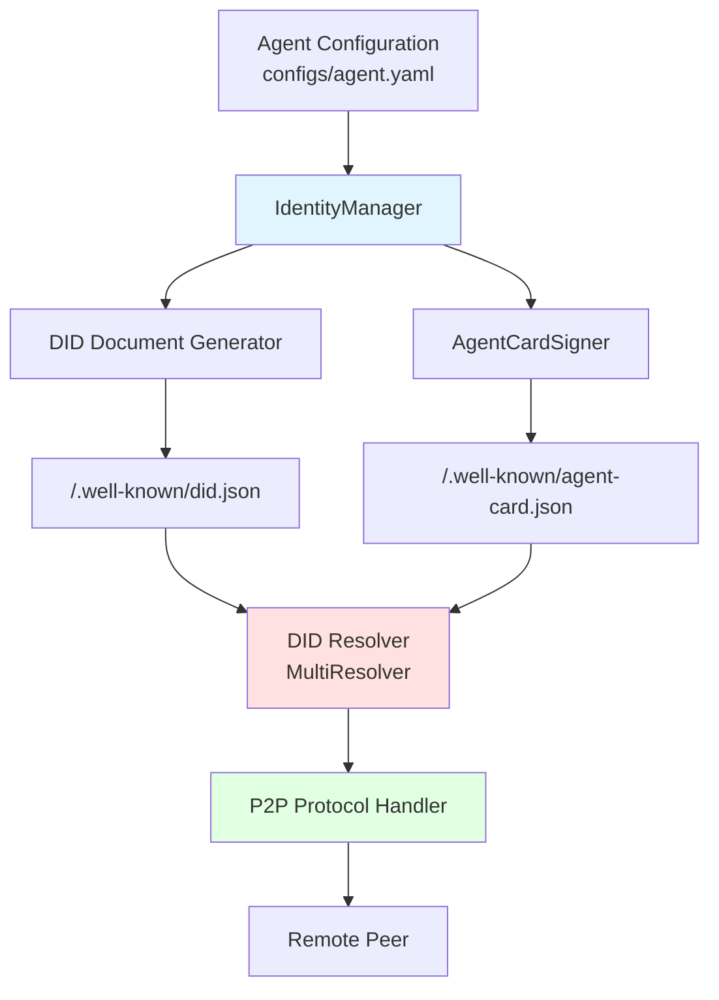
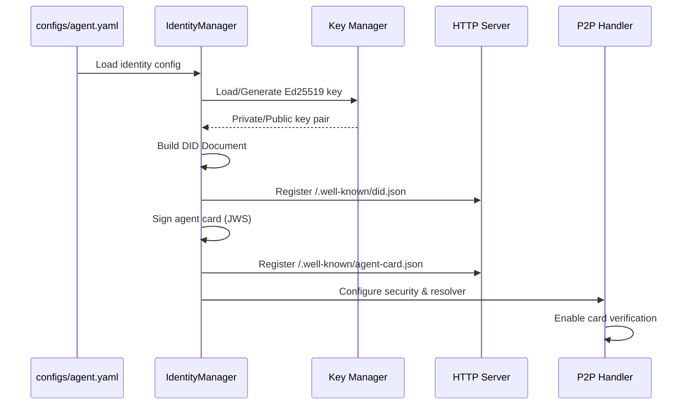
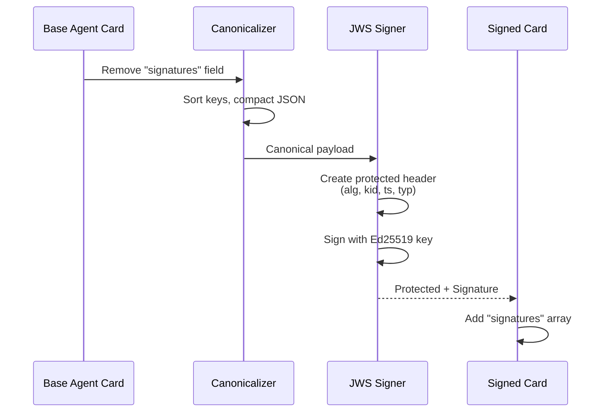
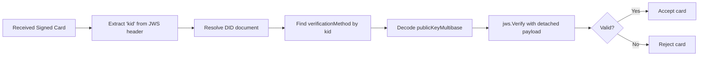

# DID Integration in Praxis Go SDK: Comprehensive Overview and Testing Guide

> Version 1.0 — September 2025
> Project: `praxis-go-sdk_did`
> Author:

---

## Table of Contents

1. [Executive Summary](#executive-summary)
2. [Why DID Matters for Praxis](#why-did-matters-for-praxis)
3. [Architectural Overview](#architectural-overview)
4. [Core Components](#core-components)
5. [Implementation Details](#implementation-details)
6. [Configuration Guide](#configuration-guide)
7. [Testing Protocol](#testing-protocol)
8. [Troubleshooting Guide](#troubleshooting-guide)
9. [Production Recommendations](#production-recommendations)
10. [References](#references)

---

## 1. Executive Summary

This document provides a comprehensive guide to the Decentralized Identifier (DID) implementation in the Praxis Go SDK. The integration enables agents to:

- **Establish verifiable identity** using W3C DID standards (`did:web`, `did:webvh`)
- **Sign and verify agent cards** using JWS (JSON Web Signature) with Ed25519 cryptography
- **Enable secure P2P communication** with cryptographic verification
- **Support multiple DID methods** with extensible resolver architecture

### Key Features

✅ **W3C DID Core Compliance** — Full support for DID documents with Ed25519 verification keys
✅ **Multiple DID Methods** — `did:web` for web-based identities, `did:webvh` for content-hash verification
✅ **Automatic Card Signing** — Agent cards are cryptographically signed using JWS detached payload format
✅ **P2P Security** — Automatic card exchange with signature verification
✅ **Caching & Performance** — Configurable TTL-based DID document caching
✅ **Developer Tools** — CLI utilities for DID resolution and verification testing

---

## 2. Why DID Matters for Praxis

### 2.1 Decentralization

Unlike traditional PKI (Public Key Infrastructure) that relies on centralized Certificate Authorities, DIDs enable:

- **Self-sovereign identity** — Agents control their own identifiers and keys
- **No single point of failure** — No dependency on centralized trust anchors
- **Censorship resistance** — Identity documents can be hosted anywhere

### 2.2 Interoperability

DIDs follow W3C standards, enabling:

- **Cross-platform verification** — Any DID-compliant system can verify Praxis agent identities
- **Export to external systems** — Indexers, explorers, smart contracts can consume DID documents
- **Future-proof architecture** — Support for emerging DID methods and cryptographic suites

### 2.3 Security & Trust

- **Cryptographic proofs** — All agent cards are signed with Ed25519 keys
- **Key rotation** — Update DID document without changing the identifier
- **Tamper detection** — `did:webvh` ensures content integrity via SHA-256 hashing

---

## 3. Architectural Overview

### 3.1 High-Level Component Diagram



### 3.2 DID Document Lifecycle



### 3.3 Agent Card Signing Flow



---

## 4. Core Components

### 4.1 IdentityManager (`internal/agent/identity.go`)

**Responsibilities:**

- Load or generate Ed25519 keys from file
- Build DID documents with required contexts
- Sign agent cards using JWS detached payload
- Normalize DID document contexts

**Key Methods:**

- `NewIdentityManager(cfg)` — Initialize identity from configuration
- `buildDIDDocument()` — Construct W3C-compliant DID document
- `SignAgentCard(card)` — Create cryptographic signature for card
- `normalizeContexts()` — Ensure context uniqueness and ordering

### 4.2 AgentCardSigner (`internal/crypto/jwsdetached.go`)

**Responsibilities:**

- Canonicalize JSON before signing (RFC 8785)
- Create JWS signatures with `WithDetachedPayload` option
- Embed metadata in protected header (timestamp, card version)

**Protected Header Fields:**

```json
{
  "alg": "EdDSA",
  "kid": "did:web:example.com#key-1",
  "ts": "2025-09-26T09:51:53Z",
  "typ": "application/prxs-agent-card+jws",
  "cardVersion": "0.2.9"
}
```

### 4.3 DID Resolver (`internal/did`)

**Architecture:**

- `MultiResolver` — Caching layer with TTL-based expiration
- `WebResolver` — HTTP-based resolution for `did:web`
- `WebVHResolver` — Content-hash verification for `did:webvh`

**Resolution Flow:**

```
did:web:example.com → https://example.com/.well-known/did.json
did:webvh:example.com:sha256-abc123 → Verify SHA-256(canonical JSON) == abc123
```

### 4.4 P2P Security Layer (`internal/p2p`)

**Features:**

- Automatic card exchange via `ProtocolA2ACard` stream
- Configurable signature verification (`verify_peer_cards`)
- DID resolution integration for peer validation
- Rejection of unsigned/invalid cards

**Security Flags:**

- `sign_cards: true` — Enable card signing
- `verify_peer_cards: true` — Require valid signatures from peers
- `sign_a2a: false` — (Future) Sign A2A JSON-RPC messages
- `verify_a2a: false` — (Future) Verify A2A message signatures

---

## 5. Implementation Details

### 5.1 DID Document Structure

```json
{
  "@context": [
    "https://www.w3.org/ns/did/v1",
    "https://w3id.org/security/suites/ed25519-2020/v1"
  ],
  "id": "did:web:localhost%3A8000",
  "verificationMethod": [
    {
      "id": "did:web:localhost%3A8000#key-1",
      "type": "Ed25519VerificationKey2020",
      "controller": "did:web:localhost%3A8000",
      "publicKeyMultibase": "z6Mkq..."
    }
  ],
  "authentication": ["did:web:localhost%3A8000#key-1"],
  "assertionMethod": ["did:web:localhost%3A8000#key-1"],
  "service": [
    {
      "id": "did:web:localhost%3A8000#agent-card",
      "type": "AgentCard",
      "serviceEndpoint": "http://localhost:8000/.well-known/agent-card.json"
    }
  ]
}
```

### 5.2 JSON Canonicalization (RFC 8785)

Before signing, the agent card undergoes:

1. **Field removal** — `signatures` field is removed
2. **Key sorting** — All object keys sorted lexicographically
3. **Compact serialization** — No whitespace, minimal separators
4. **UTF-8 encoding** — Byte-level deterministic representation

**Example:**

```go
canonical, err := canonicaljson.Marshal(cardWithoutSigs)
// Result: {"agent":{"name":"praxis"},"version":"1.0.0"}
```

### 5.3 Signature Verification Process



---

## 6. Configuration Guide

### 6.1 Basic Agent Configuration

```yaml
agent:
  name: "praxis-agent-1"
  version: "1.0.0"
  url: "http://localhost:8000"

  identity:
    did: "did:web:localhost%3A8000"
    did_doc_uri: "http://localhost:8000/.well-known/did.json"
    key:
      type: "ed25519"
      source: "file"
      path: "./configs/keys/ed25519.key"
      id: "key-1"

  security:
    sign_cards: true
    verify_peer_cards: true
    sign_a2a: false
    verify_a2a: false

  did_cache_ttl: "60s"
```

### 6.2 Multi-Agent Setup

For testing P2P interactions, configure a second agent:

```yaml
# configs/agent2_auto.yaml
agent:
  name: "praxis-agent-2"
  version: "1.0.0"
  url: "http://localhost:8001"

  identity:
    did: "did:web:localhost%3A8001"
    did_doc_uri: "http://localhost:8001/.well-known/did.json"
    key:
      type: "ed25519"
      source: "file"
      path: "./configs/keys/ed25519-agent2.key"
      id: "key-1"
```

### 6.3 Production Considerations

**HTTPS Requirement:**

```yaml
agent:
  url: "https://agent.example.com"
  identity:
    did: "did:web:agent.example.com"
    did_doc_uri: "https://agent.example.com/.well-known/did.json"
```

**Key Security:**

- Store private keys in encrypted volumes or secret management systems
- Never commit `.key` files to version control (use `.gitignore`)
- Implement key rotation procedures

---

## 7. Testing Protocol

### 7.1 Unit Tests

```bash
# Run all tests
go test ./...

# Test specific modules
go test ./internal/did/webvh -run TestWebVHResolver -v
go test ./internal/agent -run TestBuildDIDDocumentAddsEd25519Context -v
go test ./internal/crypto -run TestJWSDetachedSignAndVerify -v
```

### 7.2 Local Development Testing

#### Step 1: Environment Preparation

```bash
# Set dummy API keys (required for agent startup)
export OPENAI_API_KEY=dummy
export CONTEXT7_API_KEY=dummy

# Clean previous state
pkill -f praxis-agent || true
rm -f configs/keys/ed25519.key
```

#### Step 2: Start Agent

```bash
# Start agent in background
go run ./agent --config configs/agent.yaml > /tmp/praxis-agent.log 2>&1 &
AGENT_PID=$!

# Wait for startup
sleep 3
```

#### Step 3: Verify Endpoints

```bash
# Check DID document
curl -s http://localhost:8000/.well-known/did.json | jq

# Expected output includes:
# - "@context": [...W3C DID Core, Ed25519 Suite...]
# - "verificationMethod": [...]
# - "service": [...]

# Check signed agent card
curl -s http://localhost:8000/.well-known/agent-card.json | jq '.signatures'

# Expected output:
# [
#   {
#     "protected": "eyJhbGc...",
#     "signature": "dGhpcyBp..."
#   }
# ]
```

#### Step 4: Test `did:webvh` Resolution

```bash
# Download DID document
curl -s http://localhost:8000/.well-known/did.json > /tmp/did.json

# Calculate content hash
HASH=$(python3 -c "
import json, hashlib, base64
with open('/tmp/did.json') as f:
    doc = json.load(f)
canonical = json.dumps(doc, separators=(',', ':'), sort_keys=True)
digest = hashlib.sha256(canonical.encode()).digest()
print(base64.b32encode(digest).decode().rstrip('=').lower())
")

# Test resolution
go run ./cmd/tools/resolvercheck \
  --did "did:webvh:localhost%3A8000:sha256-$HASH" \
  --allow-insecure

# Expected output:
# ✅ WebVH verification details:
#    Expected hash: sha256-abc123...
#    Computed hash: sha256-abc123...
#    Match: true
```

#### Step 5: Cleanup

```bash
kill $AGENT_PID
```

### 7.3 Docker Compose Testing

#### Step 1: Build and Start

```bash
# Build images
docker compose build

# Start services
docker compose up -d

# Verify containers are healthy
docker compose ps
```

#### Step 2: Verify Both Agents

```bash
# Agent 1 (port 8000)
curl -s http://localhost:8000/.well-known/did.json | jq '.id'
curl -s http://localhost:8000/.well-known/agent-card.json | jq '.signatures'

# Agent 2 (port 8001)
curl -s http://localhost:8001/.well-known/did.json | jq '.id'
curl -s http://localhost:8001/.well-known/agent-card.json | jq '.signatures'
```

#### Step 3: Verify P2P Card Exchange

```bash
# Check for successful card exchange
docker compose logs praxis-agent-1 | grep "Received card"

# Expected output:
# ✅ Received card from praxis-agent-2

# Check for DID verification logs
docker compose logs praxis-agent-1 | grep "🔐 DID"

# Expected output:
# 🔐 DID signature verified for did:web:localhost%3A8001

# Ensure no rejections
docker compose logs praxis-agent-1 | grep "Rejected"

# Expected: no output (empty)
```

#### Step 4: Stress Testing

```bash
# Send multiple requests
for i in {1..10}; do
  curl -s http://localhost:8000/.well-known/agent-card.json > /dev/null
  echo "Request $i completed"
done

# Check cache performance in logs
docker compose logs praxis-agent-1 | grep "cache"
```

#### Step 5: Cleanup

```bash
docker compose down --volumes
```

### 7.4 Negative Testing Scenarios

#### Test 1: Invalid Signature

```bash
# Modify signed card manually
curl -s http://localhost:8000/.well-known/agent-card.json > /tmp/card.json

# Corrupt signature field
jq '.signatures[0].signature = "invalid"' /tmp/card.json > /tmp/card-invalid.json

# Attempt verification (should fail)
# Use custom verification script or modify P2P test to inject invalid card
```

#### Test 2: Missing DID Document

```bash
# Attempt to resolve non-existent DID
go run ./cmd/tools/resolvercheck \
  --did "did:web:nonexistent.example.com" \
  --allow-insecure

# Expected: HTTP 404 error
```

#### Test 3: Content Hash Mismatch

```bash
# Use incorrect hash in did:webvh
go run ./cmd/tools/resolvercheck \
  --did "did:webvh:localhost%3A8000:sha256-wronghash" \
  --allow-insecure

# Expected: "content hash mismatch" error
```

---

## 8. Troubleshooting Guide

### 8.1 Common Configuration Errors

| Symptom                                                 | Root Cause                               | Solution                            |
| ------------------------------------------------------- | ---------------------------------------- | ----------------------------------- |
| `DID identity not configured; skipping DID endpoints` | Missing `agent.identity` block in YAML | Add complete identity configuration |
| `bind: address already in use`                        | Port conflict with previous instance     | `lsof -i :8000 && kill <PID>`     |
| `OpenAI API key cannot be empty`                      | Missing environment variables            | `export OPENAI_API_KEY=dummy`     |
| `missing kid in signature header`                     | Card signing failed or disabled          | Enable `sign_cards: true`         |

### 8.2 DID Resolution Errors

| Error Message                                 | Cause                                       | Fix                                                 |
| --------------------------------------------- | ------------------------------------------- | --------------------------------------------------- |
| `failed to resolve DID: connection refused` | Target agent not running                    | Start the agent or check network connectivity       |
| `content hash mismatch`                     | DID document changed after hash calculation | Recalculate hash:`sha256(canonical JSON)`         |
| `invalid publicKeyMultibase`                | Key encoding error                          | Verify Ed25519 key is properly base58-encoded       |
| `HTTP 404: /.well-known/did.json`           | Endpoint not registered                     | Check identity configuration and agent startup logs |

### 8.3 P2P Card Exchange Issues

| Log Message                                          | Meaning                                    | Action                                              |
| ---------------------------------------------------- | ------------------------------------------ | --------------------------------------------------- |
| `Rejected A2A card: signature verification failed` | Signature invalid or DID resolution failed | Verify both agents have correct DIDs and resolvers  |
| `missing 'did' field in card`                      | Card not properly signed                   | Check `sign_cards: true` and restart agent        |
| `Peer card verify: context deadline exceeded`      | DID resolver timeout                       | Increase `did_cache_ttl` or check network latency |

### 8.4 Docker-Specific Issues

**Problem:** `dial tcp [::1]:8000: connect: connection refused` inside container

**Cause:** Container trying to access localhost instead of inter-container network

**Solution:**

```yaml
# Use service name instead of localhost
external_mcp_servers:
  - "http://praxis-agent-1:8000"  # ✅ Correct
  # - "http://localhost:8000"      # ❌ Wrong
```

---

## 9. Production Recommendations

### 9.1 Infrastructure Requirements

**DNS & TLS:**

- Use real domains with valid SSL certificates
- Configure reverse proxy (nginx/Caddy) for HTTPS termination
- Example: `did:web:agent.praxis.io` → `https://agent.praxis.io/.well-known/did.json`

**Key Management:**

- Store private keys in HSM (Hardware Security Module) or KMS (AWS/GCP/Azure)
- Implement automated key rotation (quarterly recommended)
- Use separate keys for signing vs. encryption

**Monitoring:**

- Track DID resolution latency and cache hit rates
- Alert on signature verification failures
- Monitor `/.well-known/` endpoint availability (SLO: 99.9%)

### 9.2 Security Best Practices

**Key Protection:**

```bash
# Set strict file permissions
chmod 600 configs/keys/*.key

# Use encrypted volumes in production
# Example Kubernetes secret:
kubectl create secret generic agent-keys \
  --from-file=ed25519.key=./configs/keys/ed25519.key
```

**DID Document Integrity:**

- Use `did:webvh` in production for tamper-proof verification
- Implement version history for DID documents (blockchain anchoring planned)
- Regular audits of published DID documents

**Network Security:**

- Enable mutual TLS for P2P connections
- Whitelist allowed DID domains (future configuration option)
- Rate-limit `/.well-known/` endpoints to prevent DoS

### 9.3 Scalability Considerations

**Caching Strategy:**

```yaml
# Production configuration
agent:
  did_cache_ttl: "3600s"  # 1 hour for stable production DIDs
  did_cache_max_size: 1000  # Future: configurable cache size
```

**Load Balancing:**

- Deploy multiple agent replicas behind load balancer
- Share DID resolution cache via Redis (planned feature)
- Use CDN for `/.well-known/` static files

---

## 10. References

### 10.1 Standards & Specifications

- [W3C DID Core Specification](https://www.w3.org/TR/did-core/)
- [DID Method Web](https://w3c-ccg.github.io/did-method-web/)
- [JSON Web Signature (RFC 7515)](https://datatracker.ietf.org/doc/html/rfc7515)
- [JSON Canonicalization Scheme (RFC 8785)](https://www.rfc-editor.org/rfc/rfc8785)
- [Ed25519 Signature Suite 2020](https://w3c-ccg.github.io/ld-cryptosuite-registry/#eddsa-2020)

### 10.2 Implementation Libraries

- [lestrrat-go/jwx](https://github.com/lestrrat-go/jwx) — JWS/JWE/JWT implementation
- [canonicaljson-go](https://github.com/gibson042/canonicaljson-go) — RFC 8785 compliance
- [go-multibase](https://github.com/multiformats/go-multibase) — Multibase encoding

### 10.3 Related Documentation

- `docs/did-architecture-guide.md` — Detailed Russian-language architecture guide
- `docs/did-end-to-end-manual.md` — Step-by-step testing manual (Russian)
- `docs/did-web-overview.md` — Introduction to `did:web` method
- `docs/did-webvh-validation-report.md` — WebVH implementation validation

---

## Appendix A: Complete Test Checklist

- [ ] **Unit Tests Pass:** `go test ./...` returns 0 failures
- [ ] **DID Document Published:** `curl http://localhost:8000/.well-known/did.json` returns 200
- [ ] **Card Signatures Present:** Agent card contains `signatures` array with valid JWS
- [ ] **did:web Resolution:** `resolvercheck` successfully resolves `did:web` identifier
- [ ] **did:webvh Verification:** Content hash matches computed SHA-256 digest
- [ ] **P2P Card Exchange:** Logs show successful card receipt with signature verification
- [ ] **Negative Tests:** Invalid signatures properly rejected, missing DIDs logged as errors
- [ ] **Docker Deployment:** Both agents start healthy in `docker compose`
- [ ] **Performance:** DID resolution completes in <500ms (with caching)

---

## Appendix B: Sample CLI Resolver Output

```
$ go run ./cmd/tools/resolvercheck --did "did:webvh:localhost%3A8000:sha256-abc123" --allow-insecure

🔍 Resolving DID: did:webvh:localhost%3A8000:sha256-abc123
📡 Using HTTP (insecure mode enabled)
✅ DID Document retrieved successfully

📄 DID Document:
{
  "@context": [
    "https://www.w3.org/ns/did/v1",
    "https://w3id.org/security/suites/ed25519-2020/v1"
  ],
  "id": "did:webvh:localhost%3A8000:sha256-abc123",
  "verificationMethod": [
    {
      "id": "did:webvh:localhost%3A8000:sha256-abc123#key-1",
      "type": "Ed25519VerificationKey2020",
      "controller": "did:webvh:localhost%3A8000:sha256-abc123",
      "publicKeyMultibase": "z6MkqRYqQiSgvZQdnBytw86Qbs2ZWUkGv22od935YF4s8M7V"
    }
  ]
}

🔐 WebVH Verification Details:
   Expected hash: sha256-abc123
   Computed hash: sha256-abc123
   ✅ Content hash verification PASSED

✅ Resolution successful!
```

---

**Document Version:** 1.0
**Last Updated:** September 2025
**Maintainer:** Praxis Labs Tech Team
