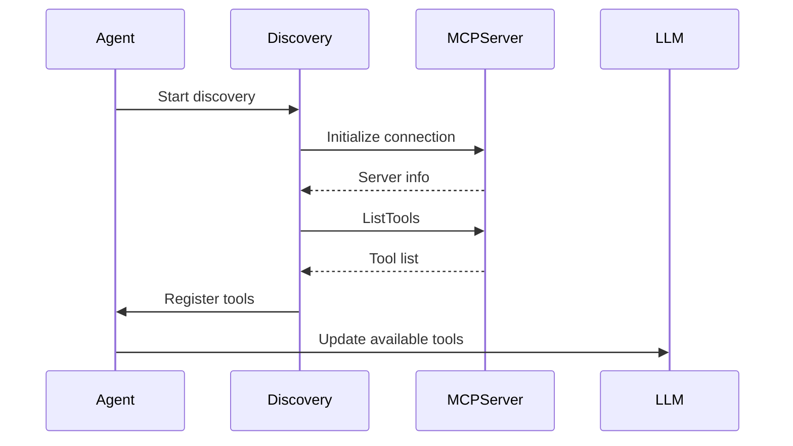
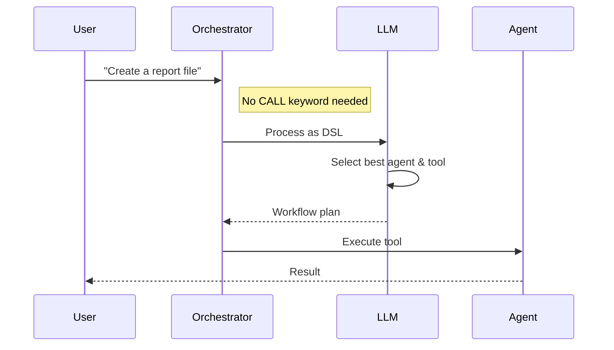

# Dynamic MCP Tool Discovery and LLM-Based DSL

## Overview

This document describes the new approach to MCP tool discovery and DSL processing in the Praxis P2P Agent SDK. The system now supports:

1. **Dynamic MCP Tool Discovery** - Automatically discovers tools from any MCP server using StreamableHTTP
2. **LLM-Based DSL Processing** - ALL messages are treated as DSL commands and processed by LLM
3. **Intelligent Agent Selection** - LLM automatically selects the best agent for each task

## Key Changes

### 1. Dynamic Tool Discovery

Instead of hardcoding tools, the system now:
- Connects to MCP servers via StreamableHTTP
- Calls `ListTools` to discover available tools
- Automatically registers discovered tools with proper handlers
- Falls back to hardcoded tools only if discovery fails

```go
// New discovery service
discoveryService := mcp.NewToolDiscoveryService(logger)

// Discover tools from MCP server
discoveredTools, err := discoveryService.DiscoverToolsFromServer(ctx, serverURL)

// Each tool is automatically registered
for _, tool := range discoveredTools {
    // Register tool with dynamic handler
}
```

### 2. LLM-Based DSL (No More CALL Keyword)

**Before**: Users had to use specific syntax like `CALL tool_name args`

**Now**: ANY message is interpreted as a DSL command:
- "Create a file called report.txt" → LLM understands and executes
- "Analyze the Python script in the shared folder" → LLM finds the right tool
- "List all files and then read config.json" → LLM creates a workflow

### 3. Intelligent Agent Selection

The LLM now considers multiple factors when selecting an agent:
1. **Tool Availability** - Which agents have the required tool?
2. **Agent Specialization** - Some agents may be better for certain tasks
3. **Load Balancing** - Distribute work across agents
4. **Locality** - Prefer local execution when possible

## Configuration

### New Configuration Fields

```yaml
agent:
  # External MCP servers for automatic tool discovery
  external_mcp_endpoints:
    - "http://localhost:3000/mcp"  # MCP server 1
    - "http://localhost:3001/mcp"  # MCP server 2

llm:
  # Enable LLM for all DSL processing
  always_use_llm_for_dsl: true
```

### Example Configuration

See `configs/agent_with_mcp_discovery.yaml` for a complete example.

## Architecture

### Tool Discovery Flow



### DSL Processing Flow



## Implementation Details

### ToolDiscoveryService

Located in `internal/mcp/discovery.go`:

```go
type ToolDiscoveryService struct {
    logger *logrus.Logger
}

func (s *ToolDiscoveryService) DiscoverToolsFromServer(
    ctx context.Context, 
    serverURL string,
) ([]DiscoveredTool, error)
```

### LLM System Prompt Enhancement

The LLM system prompt now includes:
- Instructions to treat ANY message as a DSL command
- Agent selection criteria
- Dynamic tool documentation from all discovered tools
- Routing intelligence for multi-agent systems

### Fallback Mechanism

If dynamic discovery fails, the system falls back to hardcoded tools:
- `read_file_external`
- `write_file_external`  
- `list_directory_external`
- `create_directory_external`

## Usage Examples

### Starting an Agent with Discovery

```bash
# Set MCP server endpoints in config
export MCP_SERVER_1="http://localhost:3000/mcp"
export MCP_SERVER_2="http://localhost:3001/mcp"

# Start agent with discovery config
go run agent/main.go -config configs/agent_with_mcp_discovery.yaml
```

### Natural Language Commands

All of these work without "CALL":

```bash
# File operations
"Create a file called data.json with sample data"
"Read the configuration from config.yaml"
"List all Python files in the project"

# Complex workflows
"Analyze all Python files and create a summary report"
"Find the largest file and compress it"

# Multi-agent tasks
"Use agent-2 to process data.csv then agent-1 to visualize results"
```

## Benefits

1. **No More Hardcoding** - Tools are discovered dynamically from any MCP server
2. **Natural Language** - Users don't need to learn DSL syntax
3. **Intelligent Routing** - LLM selects the best agent for each task
4. **Extensibility** - Add new MCP servers without code changes
5. **Flexibility** - Works with any MCP-compliant server

## Migration Guide

### For Existing Configurations

1. Add `external_mcp_endpoints` to your agent config
2. Set `always_use_llm_for_dsl: true` in LLM config
3. Remove hardcoded tool definitions (optional, kept for fallback)

### For Custom Tools

If you have custom tools:
1. Implement them as MCP servers
2. Add the server URL to `external_mcp_endpoints`
3. Tools will be auto-discovered on agent startup

## Troubleshooting

### Tools Not Discovered

Check:
- MCP server is running and accessible
- Server URL is correct (use StreamableHTTP endpoint)
- Server implements `ListTools` correctly
- Network connectivity to server

### LLM Not Processing Commands

Verify:
- `always_use_llm_for_dsl: true` is set
- OpenAI API key is configured
- LLM client is initialized properly

### Agent Selection Issues

Ensure:
- Agents have exchanged cards (P2P discovery)
- Tool names are unique across agents
- Network context is properly built

## Future Enhancements

1. **Tool Caching** - Cache discovered tools for faster startup
2. **Hot Reload** - Dynamically add/remove MCP servers at runtime
3. **Tool Versioning** - Support multiple versions of the same tool
4. **Advanced Routing** - Cost-based and latency-based agent selection
5. **Tool Composition** - Combine multiple tools into higher-level operations