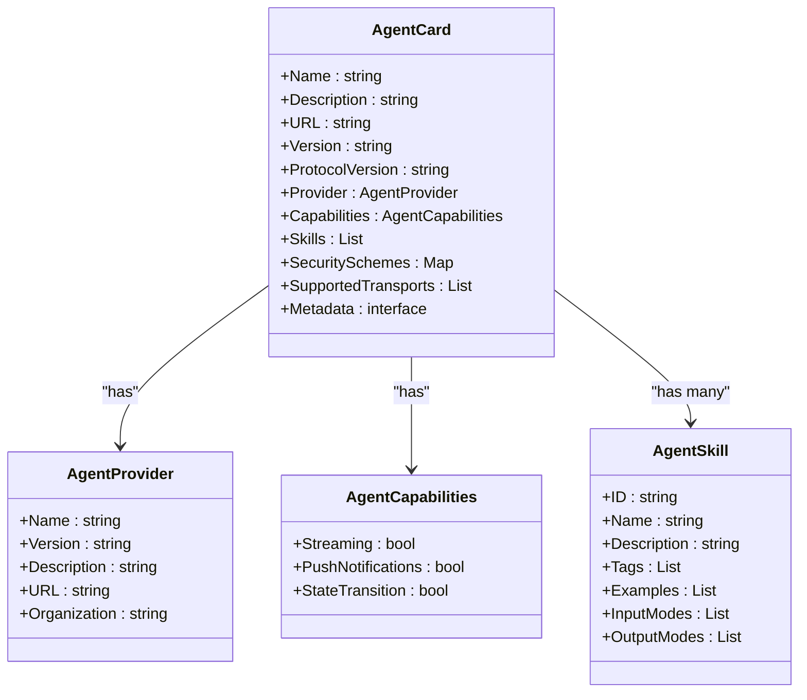
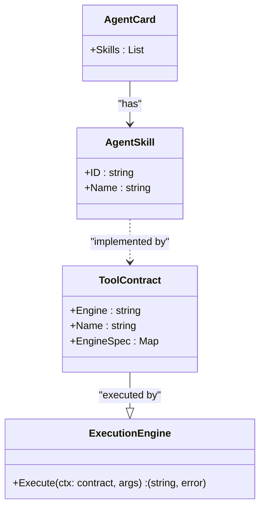
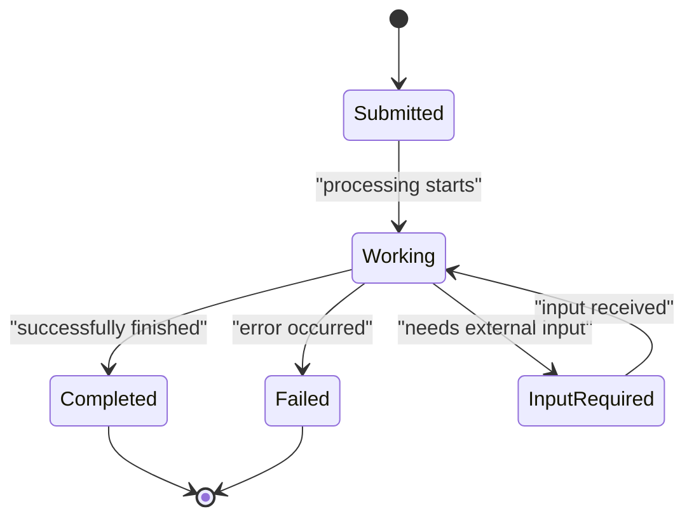
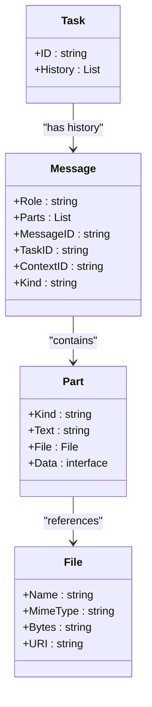
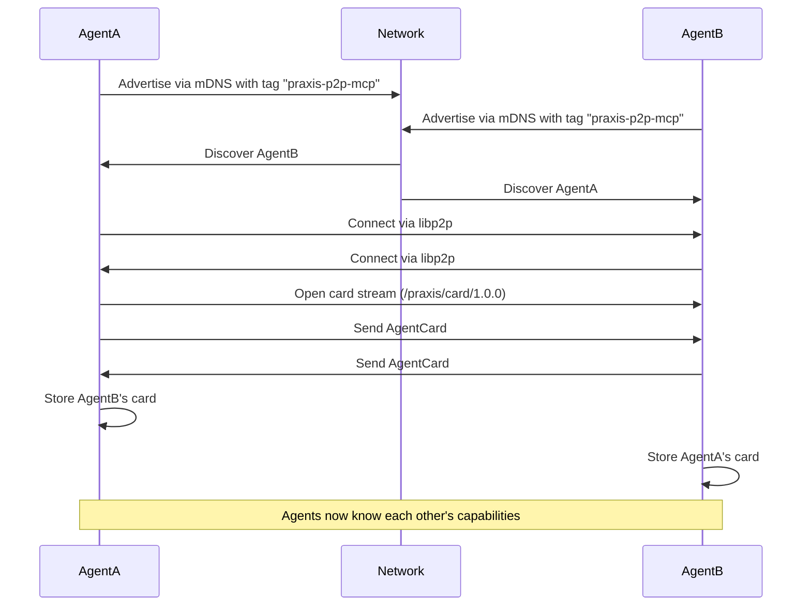
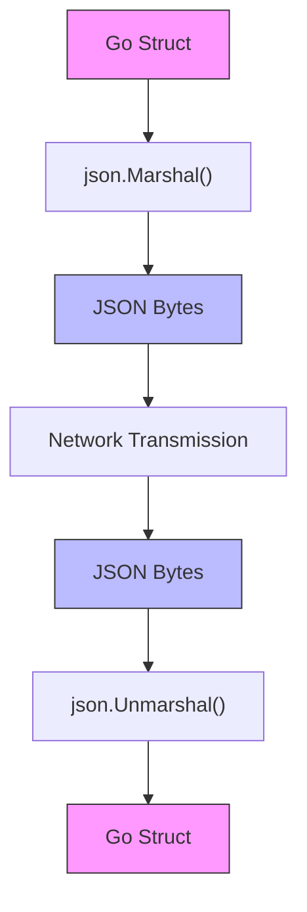

# Data Models


## Table of Contents
1. [AgentCard Structure](#agentcard-structure)
2. [ToolContract Schema](#toolcontract-schema)
3. [Task Model for A2A Operations](#task-model-for-a2a-operations)
4. [Message Format for Agent Communication](#message-format-for-agent-communication)
5. [DiscoveryMessage for P2P Network Scanning](#discoverymessage-for-p2p-network-scanning)
6. [Data Model Relationships](#data-model-relationships)
7. [Serialization and Deserialization](#serialization-and-deserialization)

## AgentCard Structure

The `AgentCard` structure serves as a digital identity and capability declaration for agents within the Praxis system. It enables discovery, interoperability, and secure communication between agents in a decentralized network. Multiple definitions exist across the codebase, reflecting different contexts and protocol versions.

The primary `AgentCard` definition in `internal/agent/card.go` contains comprehensive metadata about an agent:

```go
type AgentCard struct {
	Name               string                 `json:"name"`
	Description        string                 `json:"description"`
	URL                string                 `json:"url"`
	Version            string                 `json:"version"`
	ProtocolVersion    string                 `json:"protocolVersion"`
	Provider           *AgentProvider         `json:"provider,omitempty"`
	Capabilities       AgentCapabilities      `json:"capabilities"`
	Skills             []AgentSkill           `json:"skills"`
	SecuritySchemes    map[string]interface{} `json:"securitySchemes,omitempty"`
	SupportedTransports []string              `json:"supportedTransports"`
	Metadata           interface{}            `json:"metadata,omitempty"`
}
```

A simplified version used in P2P protocols (`internal/p2p/protocol.go`) focuses on essential discovery information:

```go
type AgentCard struct {
	Name         string     `json:"name"`
	Version      string     `json:"version"`
	PeerID       string     `json:"peerId"`
	Capabilities []string   `json:"capabilities"`
	Tools        []ToolSpec `json:"tools"`
	Timestamp    int64      `json:"timestamp"`
}
```

### Field Definitions

**AgentCard (Full Specification)**
- `Name`: Unique identifier for the agent (string)
- `Description`: Human-readable description of agent purpose (string)
- `URL`: Public endpoint for agent interaction (string)
- `Version`: Semantic version of the agent implementation (string)
- `ProtocolVersion`: Version of the communication protocol supported (string)
- `Provider`: Organization or individual responsible for the agent (AgentProvider)
- `Capabilities`: Functional capabilities of the agent (AgentCapabilities)
- `Skills`: Array of AgentSkill objects representing available functions
- `SecuritySchemes`: Authentication and authorization mechanisms supported (map)
- `SupportedTransports`: Communication protocols supported (array of strings)
- `Metadata`: Arbitrary additional information (interface{})

**AgentProvider**
- `Name`: Provider organization name (string)
- `Version`: Provider software version (string, optional)
- `Description`: Provider description (string, optional)
- `URL`: Provider website (string, optional)
- `Organization`: Legacy field for backward compatibility (string, optional)

**AgentCapabilities**
- `Streaming`: Whether agent supports streaming responses (*bool, optional)
- `PushNotifications`: Whether agent can send push notifications (*bool, optional)
- `StateTransition`: Whether agent supports stateful operations (*bool, optional)

**AgentSkill**
- `ID`: Unique identifier for the skill (string)
- `Name`: Human-readable name of the skill (string)
- `Description`: Detailed description of what the skill does (string)
- `Tags`: Array of keywords for categorization (array of strings, optional)
- `Examples`: Sample usage scenarios (array of strings, optional)
- `InputModes`: Supported input formats (array of strings, optional)
- `OutputModes`: Supported output formats (array of strings, optional)

The `AgentCard` is serialized to JSON for transmission and deserialized upon receipt. In P2P contexts, it's exchanged during the card stream handshake protocol, where both peers send their cards over a dedicated protocol channel (`/praxis/card/1.0.0`).



**Diagram sources**
- [card.go](file://internal/agent/card.go#L3-L41)

**Section sources**
- [card.go](file://internal/agent/card.go#L3-L41)
- [agent.go](file://internal/agent/agent.go#L100-L150)
- [protocol.go](file://internal/p2p/protocol.go#L84-L97)

### JSON Example

```json
{
  "name": "MarketAnalysisAgent",
  "description": "Analyzes cryptocurrency markets and generates trading signals",
  "url": "https://agent.praxis.network:8080",
  "version": "1.2.0",
  "protocolVersion": "1.0.0",
  "provider": {
    "name": "Praxis Labs",
    "version": "1.0.0",
    "description": "AI research and development",
    "url": "https://praxis.network"
  },
  "capabilities": {
    "streaming": true,
    "pushNotifications": false,
    "stateTransition": true
  },
  "skills": [
    {
      "id": "market-trend-analysis",
      "name": "Market Trend Analysis",
      "description": "Identifies trends in cryptocurrency price data",
      "tags": ["analysis", "crypto", "trends"],
      "examples": ["Analyze BTC price trend for the last 24 hours"],
      "inputModes": ["text"],
      "outputModes": ["text", "data"]
    }
  ],
  "securitySchemes": {
    "apiKey": {
      "type": "apiKey",
      "in": "header",
      "name": "X-API-Key"
    }
  },
  "supportedTransports": ["http", "websocket", "p2p"],
  "metadata": {
    "industry": "finance",
    "specialization": "cryptocurrency"
  }
}
```

## ToolContract Schema

The `ToolContract` schema defines a standardized interface for tools that can be executed within the Praxis system. It provides a language-agnostic way to describe tool capabilities, parameters, and execution requirements, enabling interoperability between different components and agents.

Defined in `internal/contracts/execution.go`, the `ToolContract` structure is:

```go
type ToolContract struct {
	Engine     string                 `json:"engine"`
	Name       string                 `json:"name"`
	EngineSpec map[string]interface{} `json:"engineSpec"`
}
```

### Field Definitions

- `Engine`: Identifier for the execution engine responsible for running this tool (string). Common values include "dagger", "remote-mcp", or custom engine names.
- `Name`: Unique name of the tool within its engine context (string).
- `EngineSpec`: Engine-specific configuration and metadata (map[string]interface{}). This flexible structure allows different engines to define their own requirements.

The `ToolContract` is paired with the `ExecutionEngine` interface, which defines how tools are executed:

```go
type ExecutionEngine interface {
	Execute(ctx context.Context, contract ToolContract, args map[string]interface{}) (string, error)
}
```

This design enables pluggable execution engines, where different tools can be processed by specialized components based on their engine type.

### Validation Rules

- `Engine` must be non-empty and match a registered execution engine.
- `Name` must be unique within the context of its engine.
- `EngineSpec` must conform to the schema expected by the specified engine.

### Relationships

The `ToolContract` is referenced by the `AgentCard` through the `Skills` field, where each skill may correspond to one or more tool contracts. Tools are also invoked during task execution when the workflow requires external functionality.



**Diagram sources**
- [execution.go](file://internal/contracts/execution.go#L5-L9)

**Section sources**
- [execution.go](file://internal/contracts/execution.go#L5-L15)
- [agent.go](file://internal/agent/agent.go#L200-L250)
- [execution_test.go](file://internal/contracts/execution_test.go#L5-L30)

### JSON Example

```json
{
  "engine": "dagger",
  "name": "python-analyzer",
  "engineSpec": {
    "image": "python:3.9-slim",
    "command": ["python", "/scripts/analyze.py"],
    "volumes": [
      {
        "source": "/local/data",
        "target": "/container/data"
      }
    ],
    "environment": {
      "API_KEY": "secret-key-123"
    }
  }
}
```

## Task Model for A2A Operations

The `Task` model represents the fundamental unit of work in the A2A (Agent-to-Agent) communication system. It encapsulates a request, its execution state, history, and results, providing a structured way to manage asynchronous operations between agents.

Defined in `internal/a2a/types.go`, the `Task` structure is:

```go
type Task struct {
	ID        string      `json:"id"`
	ContextID string      `json:"contextId"`
	Status    TaskStatus  `json:"status"`
	History   []Message   `json:"history,omitempty"`
	Artifacts []Artifact  `json:"artifacts,omitempty"`
	Metadata  interface{} `json:"metadata,omitempty"`
	Kind      string      `json:"kind"` // always "task"
}
```

### Field Definitions

- `ID`: Unique identifier for the task (string, required).
- `ContextID`: Identifier for the conversation or workflow context (string, required).
- `Status`: Current state of the task execution (TaskStatus, required).
- `History`: Ordered list of messages exchanged during task execution ([]Message, optional).
- `Artifacts`: Outputs or results generated during task execution ([]Artifact, optional).
- `Metadata`: Arbitrary additional information (interface{}, optional).
- `Kind`: Type discriminator, always set to "task" (string).

### TaskStatus Structure

```go
type TaskStatus struct {
	State     string   `json:"state"`
	Message   *Message `json:"message,omitempty"`
	Timestamp string   `json:"timestamp,omitempty"`
}
```

- `State`: Current state of the task. Valid values include "submitted", "working", "completed", "failed", and "input-required".
- `Message`: Latest message related to the task status (*Message, optional).
- `Timestamp`: RFC3339 formatted timestamp of the last status update (string, optional).

### Validation Rules

- `ID` must be a valid UUID.
- `ContextID` must be present and non-empty.
- `State` must be one of the predefined valid states.
- `Timestamp` must be in RFC3339 format when present.

### Priority and State Management

Tasks are managed by the `TaskManager` in `internal/a2a/task_manager.go`, which handles lifecycle operations:

- **Creation**: Tasks are created in the "submitted" state.
- **Processing**: Status transitions to "working" when execution begins.
- **Completion**: Status changes to "completed" upon successful execution.
- **Failure**: Status changes to "failed" when errors occur.
- **Input Required**: Status changes to "input-required" when human or external input is needed.

The `TaskManager` also handles result storage through the `Artifacts` array, where each artifact represents a generated output.



**Diagram sources**
- [types.go](file://internal/a2a/types.go#L7-L15)

**Section sources**
- [types.go](file://internal/a2a/types.go#L7-L199)
- [task_manager.go](file://internal/a2a/task_manager.go#L0-L199)

### JSON Example

```json
{
  "id": "task-7e5b9a3c-1f2d-4c8a-9b1e-2f3c4d5e6f7a",
  "contextId": "ctx-1a2b3c4d-5e6f-7a8b-9c0d-1e2f3g4h5i6j",
  "status": {
    "state": "completed",
    "timestamp": "2025-09-05T14:30:00Z",
    "message": {
      "role": "agent",
      "parts": [
        {
          "kind": "text",
          "text": "Market analysis completed successfully"
        }
      ],
      "messageId": "msg-5a6b7c8d",
      "taskId": "task-7e5b9a3c-1f2d-4c8a-9b1e-2f3c4d5e6f7a",
      "contextId": "ctx-1a2b3c4d-5e6f-7a8b-9c0d-1e2f3g4h5i6j",
      "kind": "message"
    }
  },
  "history": [
    {
      "role": "user",
      "parts": [
        {
          "kind": "text",
          "text": "Analyze the current BTC market trend"
        }
      ],
      "messageId": "msg-1a2b3c4d",
      "taskId": "task-7e5b9a3c-1f2d-4c8a-9b1e-2f3c4d5e6f7a",
      "contextId": "ctx-1a2b3c4d-5e6f-7a8b-9c0d-1e2f3g4h5i6j",
      "kind": "message"
    },
    {
      "role": "agent",
      "parts": [
        {
          "kind": "text",
          "text": "Starting market analysis..."
        }
      ],
      "messageId": "msg-2b3c4d5e",
      "taskId": "task-7e5b9a3c-1f2d-4c8a-9b1e-2f3c4d5e6f7a",
      "contextId": "ctx-1a2b3c4d-5e6f-7a8b-9c0d-1e2f3g4h5i6j",
      "kind": "message"
    }
  ],
  "artifacts": [
    {
      "artifactId": "art-3c4d5e6f",
      "name": "market-trend-report",
      "description": "Generated market trend analysis",
      "parts": [
        {
          "kind": "text",
          "text": "BTC shows bullish trend with 5% increase in 24 hours"
        }
      ]
    }
  ],
  "metadata": {
    "priority": "high",
    "source": "user-request"
  },
  "kind": "task"
}
```

## Message Format for Agent Communication

The `Message` format defines the structure for communication between agents in the A2A system. It represents a single turn in a conversation or interaction, containing content parts and metadata for routing and context.

Defined in `internal/a2a/types.go`, the `Message` structure is:

```go
type Message struct {
	Role      string `json:"role"`
	Parts     []Part `json:"parts"`
	MessageID string `json:"messageId"`
	TaskID    string `json:"taskId,omitempty"`
	ContextID string `json:"contextId,omitempty"`
	Kind      string `json:"kind"` // always "message"
}
```

### Field Definitions

- `Role`: Indicates the sender role. Valid values are "user" (initiating agent) and "agent" (responding agent).
- `Parts`: Array of content units that make up the message body ([]Part, required).
- `MessageID`: Unique identifier for the message (string, required).
- `TaskID`: Reference to the associated task (string, optional).
- `ContextID`: Reference to the conversation context (string, optional).
- `Kind`: Type discriminator, always set to "message" (string).

### Part Structure

```go
type Part struct {
	Kind string      `json:"kind"`
	Text string      `json:"text,omitempty"`
	File *File       `json:"file,omitempty"`
	Data interface{} `json:"data,omitempty"`
}
```

- `Kind`: Type of content. Valid values are "text", "file", and "data".
- `Text`: Text content when Kind is "text".
- `File`: File attachment metadata when Kind is "file".
- `Data`: Arbitrary structured data when Kind is "data".

### File Structure

```go
type File struct {
	Name     string `json:"name,omitempty"`
	MimeType string `json:"mimeType,omitempty"`
	Bytes    string `json:"bytes,omitempty"` // base64 encoded
	URI      string `json:"uri,omitempty"`
}
```

### Validation Rules

- `Role` must be either "user" or "agent".
- `Parts` must contain at least one element.
- `MessageID` must be a valid identifier.
- When `Kind` is "text", `Text` must be non-empty.
- When `Kind` is "file", either `URI` or `Bytes` must be present.

### Usage in Task Execution

Messages are added to a task's `History` array as the conversation progresses. The `TaskManager` ensures that messages are properly linked to their parent task and context.



**Diagram sources**
- [types.go](file://internal/a2a/types.go#L25-L32)

**Section sources**
- [types.go](file://internal/a2a/types.go#L25-L199)
- [task_manager.go](file://internal/a2a/task_manager.go#L100-L150)

### JSON Example

```json
{
  "role": "user",
  "parts": [
    {
      "kind": "text",
      "text": "Please analyze the following market data"
    },
    {
      "kind": "data",
      "data": {
        "symbol": "BTC",
        "period": "24h",
        "indicators": ["rsi", "macd"]
      }
    },
    {
      "kind": "file",
      "file": {
        "name": "market_data.csv",
        "mimeType": "text/csv",
        "uri": "https://storage.praxis.network/data/market_data_20250905.csv"
      }
    }
  ],
  "messageId": "msg-9a8b7c6d-5e4f-3g2h-1i0j-9k8l7m6n5o4p",
  "taskId": "task-7e5b9a3c-1f2d-4c8a-9b1e-2f3c4d5e6f7a",
  "contextId": "ctx-1a2b3c4d-5e6f-7a8b-9c0d-1e2f3g4h5i6j",
  "kind": "message"
}
```

## DiscoveryMessage for P2P Network Scanning

After thorough analysis of the codebase, there is no explicit `DiscoveryMessage` type defined in the Praxis system. Instead, peer discovery is handled through the mDNS (multicast DNS) protocol with the service tag `praxis-p2p-mcp`, as defined in `internal/p2p/discovery.go`.

The discovery process works as follows:

1. Agents broadcast their presence on the local network using mDNS with the service tag `praxis-p2p-mcp`.
2. When a peer is discovered, the system creates a `PeerInfo` structure to track it:
```go
type PeerInfo struct {
	ID          peer.ID
	Addrs       []multiaddr.Multiaddr
	FoundAt     time.Time
	LastSeen    time.Time
	AgentCard   interface{}
	IsConnected bool
}
```

3. Once a peer is discovered and connected, agents automatically exchange their `AgentCard` through the card stream protocol on `/praxis/card/1.0.0`.

The actual discovery mechanism uses the `mdns` package from libp2p, and the notification of discovered peers is handled through the `HandlePeerFound` method in the `Discovery` struct. There is no dedicated message format for discovery; instead, the libp2p framework handles the underlying communication.

The process flow for peer discovery and card exchange is:



**Diagram sources**
- [discovery.go](file://internal/p2p/discovery.go#L0-L283)
- [protocol.go](file://internal/p2p/protocol.go#L0-L536)

**Section sources**
- [discovery.go](file://internal/p2p/discovery.go#L0-L283)
- [protocol.go](file://internal/p2p/protocol.go#L84-L97)

Although there is no `DiscoveryMessage` type, the `PeerInfo` structure serves as the in-memory representation of discovered peers, containing their network addresses and eventually their `AgentCard`. The discovery process is automatic and triggered by the `runDiscoveryLoop` which checks peer connections every 10 seconds.

## Data Model Relationships

The key data models in the Praxis system are interconnected to support agent communication, task execution, and network discovery. The relationships between these models form the foundation of the system's functionality.

### Core Relationships

1. **AgentCard → ToolContract**: An agent's capabilities (skills) are implemented by one or more tool contracts. Each `AgentSkill` corresponds to a `ToolContract` that defines how the skill is executed.

2. **Task → Message**: A task contains a history of messages that document the conversation and execution process. Messages are added to the task's history as they are exchanged.

3. **Task → Artifact**: Tasks generate artifacts as outputs of their execution. Each artifact is associated with a specific task.

4. **Message → Part**: Messages are composed of one or more parts, which can contain text, files, or structured data.

5. **Agent → AgentCard**: Each agent has an associated agent card that describes its identity and capabilities.

6. **P2P Network → AgentCard**: During peer discovery, agents exchange their cards to learn about each other's capabilities.

### Relationship Diagram

```mermaid
erDiagram
AGENTCARD ||--o{ TOOLCONTRACT : "implements"
AGENTCARD ||--o{ AGENTSKILL : "has"
TASK ||--o{ MESSAGE : "has history"
TASK ||--o{ ARTIFACT : "produces"
MESSAGE ||--o{ PART : "contains"
PART ||--o{ FILE : "references"
AGENT ||--|| AGENTCARD : "has"
PEER ||--|| AGENTCARD : "exchanges"
class AgentCard {
Name
Version
Capabilities
Skills
}
class ToolContract {
Engine
Name
EngineSpec
}
class Task {
ID
Status
History
Artifacts
}
class Message {
Role
Parts
MessageID
}
class Part {
Kind
Text
File
Data
}
class Artifact {
ArtifactID
Name
Parts
}
class Agent {
Name
Host
Card
}
class Peer {
ID
Addrs
AgentCard
}
```

**Diagram sources**
- [card.go](file://internal/agent/card.go#L3-L41)
- [execution.go](file://internal/contracts/execution.go#L5-L9)
- [types.go](file://internal/a2a/types.go#L7-L199)
- [discovery.go](file://internal/p2p/discovery.go#L0-L283)

**Section sources**
- [card.go](file://internal/agent/card.go#L3-L41)
- [execution.go](file://internal/contracts/execution.go#L5-L15)
- [types.go](file://internal/a2a/types.go#L7-L199)
- [task_manager.go](file://internal/a2a/task_manager.go#L0-L199)
- [discovery.go](file://internal/p2p/discovery.go#L0-L283)

The relationship between these models enables the core functionality of the Praxis system:
- Agents discover each other through P2P discovery and exchange `AgentCard` information
- Based on the `AgentCard`, agents understand what `Skills` are available
- Each `Skill` is backed by a `ToolContract` that defines how it executes
- When a task is created, it references these capabilities through messages
- The task execution produces artifacts and maintains a message history
- All communication follows the structured message format

This interconnected model supports decentralized agent collaboration, where agents can dynamically discover each other, understand their capabilities, and collaborate on tasks without centralized coordination.

## Serialization and Deserialization

The Praxis system uses JSON as the primary serialization format for all data models, enabling interoperability between different components, agents, and programming languages.

### Serialization Process

All key data models implement JSON marshaling through struct tags (`json:"fieldname"`). The Go standard library's `encoding/json` package is used for serialization and deserialization.

When a model is transmitted over the network:
1. The Go struct is marshaled to JSON using `json.Marshal()`
2. The JSON bytes are sent over the communication channel (HTTP, WebSocket, or P2P stream)
3. The receiving end unmarshals the JSON bytes back into the corresponding struct using `json.Unmarshal()`

### P2P Protocol Implementation

In the P2P layer (`internal/p2p/protocol.go`), message handling follows this pattern:

```go
// Sending a message
encoder := json.NewEncoder(stream)
if err := encoder.Encode(ourCard); err != nil {
    // handle error
}

// Receiving a message
decoder := json.NewDecoder(stream)
var peerCard AgentCard
if err := decoder.Decode(&peerCard); err != nil {
    // handle error
}
```

This pattern is used consistently across all P2P protocols (card exchange, tool invocation, MCP communication).

### Error Handling

The system includes robust error handling for serialization operations:
- Invalid JSON is rejected with appropriate error messages
- Missing required fields result in validation errors
- Type mismatches are caught during unmarshaling
- Network transmission errors are handled at the stream level

### Content-Type Headers

When using HTTP-based communication, the system sets appropriate headers:
```
Content-Type: application/json
```

This ensures that clients and servers correctly interpret the message format.

### Example Serialization Flow



**Diagram sources**
- [protocol.go](file://internal/p2p/protocol.go#L150-L200)
- [types.go](file://internal/a2a/types.go#L0-L199)

**Section sources**
- [protocol.go](file://internal/p2p/protocol.go#L150-L200)
- [types.go](file://internal/a2a/types.go#L0-L199)
- [agent.go](file://internal/agent/agent.go#L500-L550)

The serialization system is designed to be:
- **Interoperable**: JSON format allows integration with non-Go systems
- **Extensible**: New fields can be added with omitempty tags for backward compatibility
- **Efficient**: Direct struct-to-JSON mapping with minimal overhead
- **Robust**: Comprehensive error handling for malformed data

This approach ensures that data can flow seamlessly between different parts of the system while maintaining data integrity and type safety.

**Referenced Files in This Document**
- [agent.go](file://internal/agent/agent.go#L0-L1563)
- [card.go](file://internal/agent/card.go#L0-L41)
- [execution.go](file://internal/contracts/execution.go#L0-L15)
- [types.go](file://internal/a2a/types.go#L0-L199)
- [task_manager.go](file://internal/a2a/task_manager.go#L0-L199)
- [protocol.go](file://internal/p2p/protocol.go#L0-L536)
- [discovery.go](file://internal/p2p/discovery.go#L0-L283)
