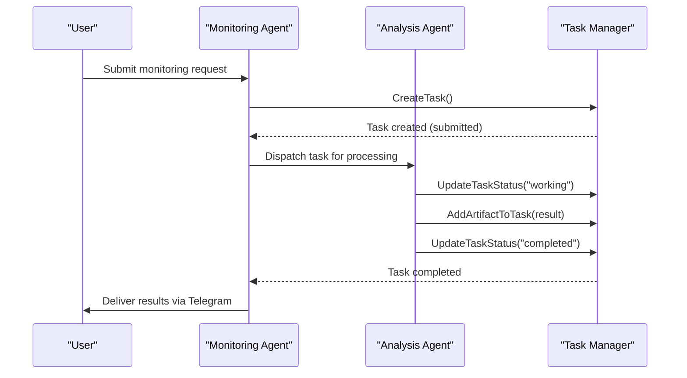
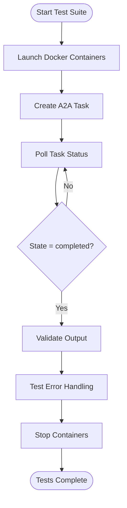

# Examples and Use Cases


## Table of Contents
1. [Social Media Monitoring Example](#social-media-monitoring-example)
2. [Multi-Agent Collaboration Scenario](#multi-agent-collaboration-scenario)
3. [Filesystem MCP Server Example](#filesystem-mcp-server-example)
4. [End-to-End A2A Testing with Docker](#end-to-end-a2a-testing-with-docker)

## Social Media Monitoring Example

This example demonstrates how to use the Praxis agent to monitor social media content from Twitter and automatically post analysis results to Telegram. The workflow involves two Python scripts: `twitter_scraper.py` for collecting tweets and `telegram_post.py` for sending messages.

The process begins with configuring the Twitter scraper to target specific accounts or keywords. Once tweets are collected and analyzed, the results are formatted and passed to the Telegram script for dissemination. This automation enables real-time monitoring of public sentiment, brand mentions, or market trends.

Key configuration steps include:
- Setting up Twitter API credentials in environment variables
- Specifying target accounts (e.g., @elonmusk, @binance) in the scraper
- Configuring Telegram bot token and chat ID for message delivery
- Defining analysis parameters such as sentiment thresholds or keyword filters

Expected output includes JSON files in the `shared/reports/` directory containing raw tweet data and processed insights. These artifacts can be further analyzed or used as input for other workflows.

**Section sources**
- [twitter_scraper.py](file://shared/twitter_scraper.py)
- [telegram_post.py](file://shared/telegram_post.py)

## Multi-Agent Collaboration Scenario

This scenario illustrates how multiple Praxis agents can collaborate to process data and deliver results. One agent is responsible for data collection and analysis, while another handles result dissemination.

The collaboration follows the Agent-to-Agent (A2A) protocol, where tasks are created, assigned, and tracked using JSON-RPC messages. When a monitoring agent detects relevant social media content, it creates an A2A task with the collected data. The task is then processed asynchronously by the analysis agent, which updates the task status through various states: "submitted", "working", "completed", or "failed".



**Diagram sources**
- [task_manager.go](file://internal/a2a/task_manager.go#L63-L100)
- [types.go](file://internal/a2a/types.go#L10-L40)

**Section sources**
- [task_manager.go](file://internal/a2a/task_manager.go)
- [types.go](file://internal/a2a/types.go)

## Filesystem MCP Server Example

The filesystem MCP server provides a standardized interface for agents to interact with local or remote filesystems. The example implementation in `mcp-filesystem-server.go` demonstrates how to expose file operations as discoverable tools.

The server is launched using the `start-mcp-filesystem.sh` script, which sets up an SSE (Server-Sent Events) endpoint at `http://localhost:3000/mcp`. It serves two directories: a dedicated test directory (`./test-filesystem`) and the shared resources folder (`./shared`).

```bash
#!/bin/bash
npx -y @modelcontextprotocol/server-filesystem@latest \
  --transport sse \
  --sse-url http://localhost:3000/mcp \
  ./test-filesystem ./shared
```

Once running, the server exposes standard file operations such as:
- `read_file`: Retrieve file contents
- `write_file`: Create or update files
- `list_directory`: Enumerate directory contents
- `create_directory`: Make new directories

Agents can discover and use these tools automatically through the MCP discovery mechanism. The educational value lies in understanding how external services can be integrated into the agent ecosystem through standardized protocols.

**Section sources**
- [start-mcp-filesystem.sh](file://examples/start-mcp-filesystem.sh)
- [mcp-filesystem-server.go](file://examples/mcp-filesystem-server.go)

## End-to-End A2A Testing with Docker

The `test_a2a_full_docker.sh` script provides a comprehensive end-to-end test of the A2A (Agent-to-Agent) communication framework using Docker containers. This test validates the complete lifecycle of A2A tasks across isolated agent instances.

The testing process includes:
1. Starting multiple agent containers with different configurations
2. Creating A2A tasks via JSON-RPC requests
3. Polling task status through various states
4. Validating error handling for invalid requests
5. Cleaning up resources after test completion



**Diagram sources**
- [test_a2a_full_docker.sh](file://test_a2a_full_docker.sh#L344-L386)
- [task_manager.go](file://internal/a2a/task_manager.go)

**Section sources**
- [test_a2a_full_docker.sh](file://test_a2a_full_docker.sh)
- [task_manager.go](file://internal/a2a/task_manager.go)

**Referenced Files in This Document**   
- [start-mcp-filesystem.sh](file://examples/start-mcp-filesystem.sh)
- [mcp-filesystem-server.go](file://examples/mcp-filesystem-server.go)
- [test_a2a_full_docker.sh](file://test_a2a_full_docker.sh)
- [task_manager.go](file://internal/a2a/task_manager.go)
- [types.go](file://internal/a2a/types.go)
- [agent.go](file://internal/agent/agent.go)
- [twitter_scraper.py](file://shared/twitter_scraper.py)
- [telegram_post.py](file://shared/telegram_post.py)