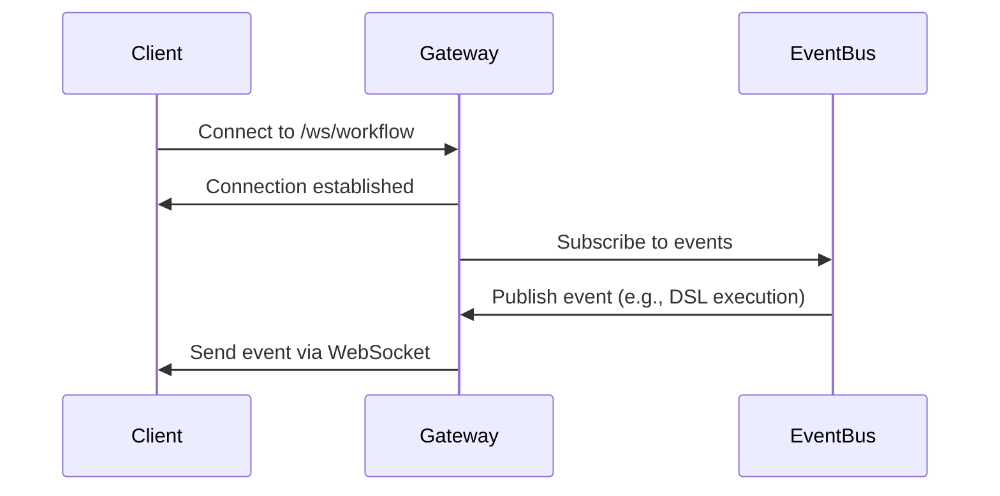

# Getting Started


## Table of Contents
1. [Introduction](#introduction)
2. [Prerequisites](#prerequisites)
3. [Repository Setup](#repository-setup)
4. [Environment Configuration](#environment-configuration)
5. [Agent Configuration](#agent-configuration)
6. [Running the Agent](#running-the-agent)
7. [Hello World Example](#hello-world-example)
8. [Health Check and WebSocket Verification](#health-check-and-websocket-verification)
9. [Common Pitfalls and Solutions](#common-pitfalls-and-solutions)

## Introduction
This guide provides a comprehensive walkthrough for setting up and running the Praxis agent. The Praxis agent is a distributed AI workflow orchestration platform that enables decentralized agent communication through P2P networking and supports tool sharing via the Model Context Protocol (MCP). This document covers prerequisites, configuration, execution methods, and verification steps to ensure a smooth onboarding experience.

## Prerequisites
Before setting up the Praxis agent, ensure your system meets the following requirements:

- **Go 1.20+**: Required for building and running the agent from source.
- **Docker**: Used for containerized execution of tools and services.
- **Dagger**: A CI/CD engine that integrates with Docker for executing workflows.
- **Git**: For cloning the repository.

To verify installations:
```bash
go version
docker --version
dagger version
git --version
```

**Section sources**
- [README.md](file://README.md#L1-L177)

## Repository Setup
Clone the Praxis repository to your local machine:

```bash
git clone https://github.com/praxis/praxis-go-sdk.git
cd praxis-go-sdk
```

The project structure includes:
- `agent/main.go`: Entry point of the agent.
- `configs/`: Contains configuration files like `agent.yaml`.
- `internal/`: Core implementation packages.
- `pkg/utils/`: Utility functions for environment, logging, and network setup.
- `examples/`: Example configurations and scripts.

**Section sources**
- [project_structure](file://#L1-L100)

## Environment Configuration
The agent uses environment variables for runtime configuration. Create a `.env` file in the root directory or set these variables directly.

### Required Variables
- `AGENT_NAME`: Unique identifier for the agent (e.g., "praxis-agent-1").

### Optional Variables
- `OPENAI_API_KEY`: Enables natural language workflows via LLM integration.
- `HTTP_PORT`: HTTP API port (default: 8000).
- `P2P_PORT`: P2P communication port (default: 4001).
- `WEBSOCKET_PORT`: WebSocket port for frontend (default: 9000).
- `LOG_LEVEL`: Logging level: debug, info, warn, error (default: info).
- `MCP_ENABLED`: Enable MCP server (default: true).

Example `.env`:
```bash
AGENT_NAME=praxis-agent-1
OPENAI_API_KEY=sk-your-key-here
LOG_LEVEL=info
```

The `pkg/utils/env.go` file provides utility functions to handle environment variables:

```go
// GetEnv retrieves an environment variable or returns a default value
func GetEnv(key, defaultVal string) string {
	if val := os.Getenv(key); val != "" {
		return val
	}
	return defaultVal
}

// BoolFromEnv converts an environment variable to a boolean
func BoolFromEnv(key string, defaultVal bool) bool {
	val := os.Getenv(key)
	if val == "" {
		return defaultVal
	}
	val = strings.ToLower(val)
	return val == "true" || val == "yes" || val == "1" || val == "on"
}
```

These utilities are used in `agent.go` to load configuration from both file and environment sources.

**Section sources**
- [pkg/utils/env.go](file://pkg/utils/env.go#L1-L54)
- [README.md](file://README.md#L60-L90)

## Agent Configuration
The agent's behavior is controlled by `configs/agent.yaml`. This file defines agent metadata, P2P settings, HTTP server configuration, MCP options, LLM integration, and logging.

Key sections in `agent.yaml`:

```yaml
agent:
  name: "praxis-agent-from-yaml"
  version: "1.0.0"
  url: "http://localhost:8000"
  shared_dir: "./shared"

p2p:
  enabled: true
  port: 4001
  secure: true

http:
  enabled: true
  port: 8000
  host: "0.0.0.0"

mcp:
  enabled: true

logging:
  level: "info"
  format: "text"
  file: ""
```

The configuration is loaded in `main.go` using `config.LoadConfig()`:

```go
appConfig, err := config.LoadConfig(*configFile, logger)
if err != nil {
	logger.Fatalf("Failed to load configuration: %v", err)
}
```

This configuration is then adapted to the agent's internal `Config` struct.

**Section sources**
- [configs/agent.yaml](file://configs/agent.yaml#L1-L119)
- [agent/main.go](file://agent/main.go#L20-L30)

## Running the Agent
You can run the Praxis agent either directly or via Docker.

### Direct Execution
1. Build the agent:
   ```bash
   go build -o praxis-agent agent/main.go
   ```
2. Run the agent:
   ```bash
   ./praxis-agent --config configs/agent.yaml
   ```

### Docker Execution
1. Build the Docker image:
   ```bash
   docker build -t praxis-agent:latest .
   ```
2. Start the agent using Docker Compose:
   ```bash
   docker-compose -f docker-compose.yml up -d
   ```

The agent initializes components in this order:
1. Parses command-line flags
2. Loads configuration
3. Sets up logging
4. Initializes P2P networking
5. Starts HTTP server
6. Registers tools and starts services

```go
func main() {
	configFile := flag.String("config", "configs/agent.yaml", "Path to configuration file")
	flag.Parse()

	logger := logrus.New()
	logger.SetLevel(logrus.InfoLevel)

	appConfig, err := config.LoadConfig(*configFile, logger)
	if err != nil {
		logger.Fatalf("Failed to load configuration: %v", err)
	}

	agentConfig := agent.AdaptAppConfigToAgentConfig(appConfig)
	praxisAgent, err := agent.NewPraxisAgent(agentConfig)
	if err != nil {
		logger.Fatalf("Failed to create agent: %v", err)
	}

	if err := praxisAgent.Start(); err != nil {
		logger.Fatalf("Failed to start agent: %v", err)
	}
}
```

**Section sources**
- [agent/main.go](file://agent/main.go#L1-L75)
- [README.md](file://README.md#L30-L45)

## Hello World Example
Execute a simple "Hello World" command using the DSL (Domain Specific Language):

```bash
curl -X POST http://localhost:8000/execute \
  -H "Content-Type: application/json" \
  -d '{"dsl": "CALL write_file hello.txt \"Hello from Praxis!\""}'
```

Verify the file was created:
```bash
docker exec praxis-agent-2 cat /shared/hello.txt
```

This command uses the `write_file` tool defined in `agent.yaml` under the `tools` section. The tool executes within a Dagger container, writing the specified content to a file in the shared directory.

You can also test with a natural language command (requires `OPENAI_API_KEY`):
```bash
curl -X POST http://localhost:8000/execute \
  -H "Content-Type: application/json" \
  -d '{"query": "create a file called greeting.txt with content Hello World"}'
```

**Section sources**
- [README.md](file://README.md#L47-L55)
- [configs/agent.yaml](file://configs/agent.yaml#L10-L119)

## Health Check and WebSocket Verification
Once the agent is running, verify its status using health check endpoints and WebSocket connections.

### Health Check Endpoint
Access the `/health` endpoint to confirm the agent is operational:

```bash
curl http://localhost:8000/health
```

Expected response:
```json
{
  "status": "healthy",
  "agent": "praxis-agent-1",
  "version": "1.0.0"
}
```

The handler is implemented in `internal/agent/agent.go`:

```go
func (a *PraxisAgent) handleHealth(c *gin.Context) {
	c.JSON(200, gin.H{
		"status":  "healthy",
		"agent":   a.name,
		"version": a.version,
	})
}
```

### WebSocket Connection
The agent exposes a WebSocket gateway for real-time communication. Connect using a WebSocket client:

```javascript
const ws = new WebSocket('ws://localhost:9000/ws/workflow');
ws.onopen = () => console.log('Connected to Praxis agent');
ws.onmessage = (event) => console.log('Message:', event.data);
```

The `WebSocketGateway` in `internal/api/websocket_gateway.go` handles client connections:

```go
func (gw *WebSocketGateway) handleWebSocket(w http.ResponseWriter, r *http.Request) {
	conn, err := upgrader.Upgrade(w, r, nil)
	if err != nil {
		gw.logger.Errorf("WebSocket upgrade failed: %v", err)
		return
	}

	client := &Client{
		hub:      gw.hub,
		conn:     conn,
		send:     make(chan []byte, 256),
		clientID: fmt.Sprintf("client-%d", time.Now().UnixNano()),
	}

	gw.hub.register <- client
	go client.writePump()
	go gw.readPump(client)
}
```

Clients receive real-time updates about workflow execution, logs, and events through this connection.



**Diagram sources**
- [internal/api/websocket_gateway.go](file://internal/api/websocket_gateway.go#L76-L200)
- [internal/agent/agent.go](file://internal/agent/agent.go#L717-L723)

**Section sources**
- [internal/agent/agent.go](file://internal/agent/agent.go#L717-L723)
- [internal/api/websocket_gateway.go](file://internal/api/websocket_gateway.go#L1-L200)

## Common Pitfalls and Solutions
This section addresses frequent setup issues and their resolutions.

### Port Conflicts
**Issue**: "port already in use" errors when starting the agent.
**Solution**: Change the port in `agent.yaml` or via environment variables:
```yaml
http:
  port: 8002
p2p:
  port: 4002
```
Or set:
```bash
export HTTP_PORT=8002
export P2P_PORT=4002
```

### Docker Permissions
**Issue**: Permission denied when accessing Docker socket.
**Solution**: Ensure your user is in the `docker` group:
```bash
sudo usermod -aG docker $USER
```
Log out and back in for changes to take effect.

### Configuration Syntax Errors
**Issue**: "Failed to load configuration" due to YAML syntax errors.
**Solution**: Validate `agent.yaml` using a YAML linter. Common issues include:
- Incorrect indentation
- Missing quotes around strings with special characters
- Invalid boolean values (use `true`/`false`)

Use `yamllint configs/agent.yaml` to detect issues.

### Missing OPENAI_API_KEY
**Issue**: Natural language processing fails silently.
**Solution**: Set the API key in `.env` or environment:
```bash
export OPENAI_API_KEY=your_key_here
```

### WebSocket Connection Failures
**Issue**: WebSocket connection rejected.
**Solution**: Check if `WEBSOCKET_PORT` matches the client connection and ensure no firewall is blocking the port.

**Section sources**
- [README.md](file://README.md#L1-L177)
- [configs/agent.yaml](file://configs/agent.yaml#L1-L119)
- [pkg/utils/env.go](file://pkg/utils/env.go#L1-L54)

**Referenced Files in This Document**
- [main.go](file://agent/main.go)
- [env.go](file://pkg/utils/env.go)
- [logging.go](file://pkg/utils/logging.go)
- [network.go](file://pkg/utils/network.go)
- [agent.go](file://internal/agent/agent.go)
- [websocket_gateway.go](file://internal/api/websocket_gateway.go)
- [config.go](file://internal/config/config.go)
- [agent.yaml](file://configs/agent.yaml)
