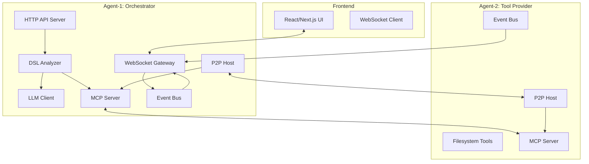
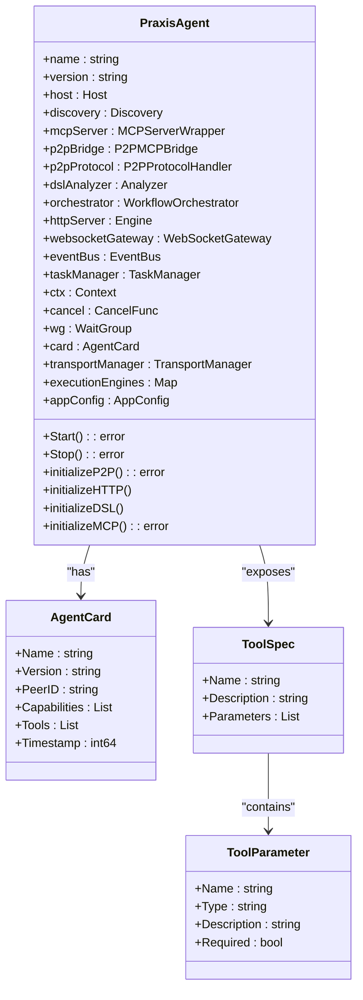
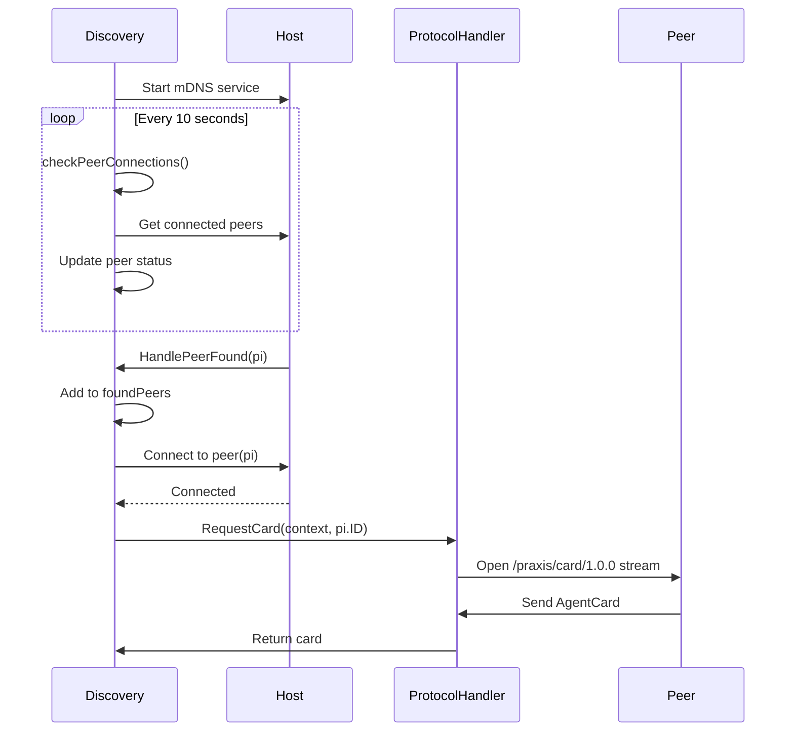
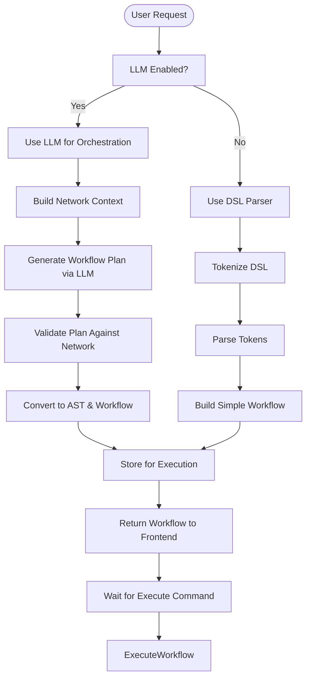
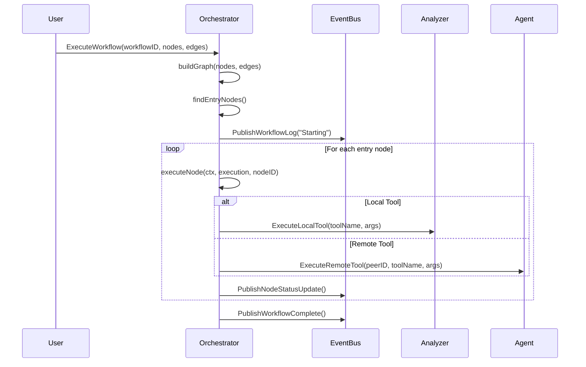
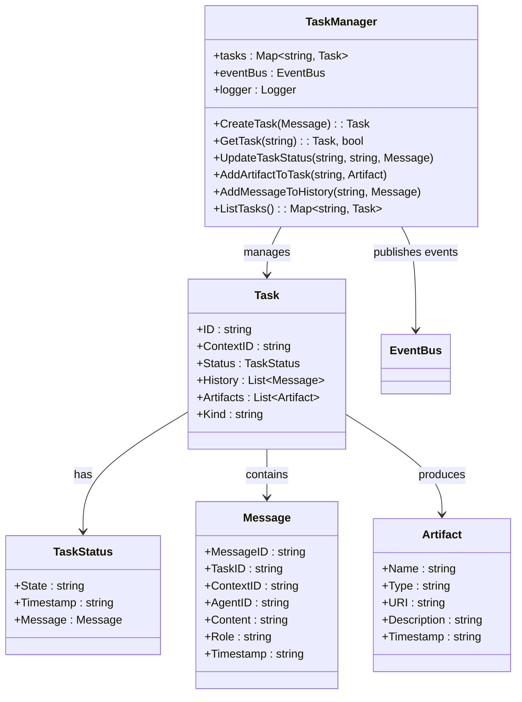
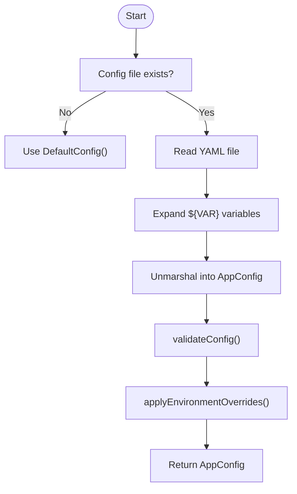
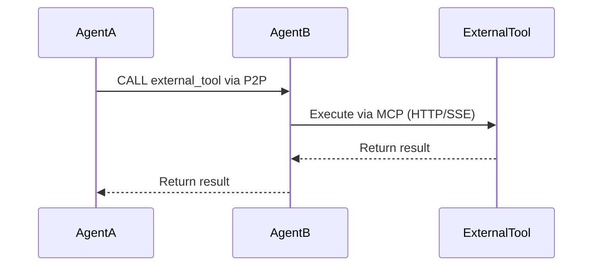

# Project Overview

## Table of Contents
1. [Project Overview](#project-overview)
2. [Core Components](#core-components)
3. [Architecture Overview](#architecture-overview)
4. [Detailed Component Analysis](#detailed-component-analysis)
5. [Workflow Orchestration and DSL Processing](#workflow-orchestration-and-dsl-processing)
6. [Agent-to-Agent Communication and Task Management](#agent-to-agent-communication-and-task-management)
7. [Configuration and Initialization](#configuration-and-initialization)
8. [External Tool Integration via MCP](#external-tool-integration-via-mcp)
9. [Conclusion](#conclusion)

## Core Components

The Praxis Go SDK is a distributed AI agent orchestration platform designed to enable decentralized collaboration among autonomous agents through peer-to-peer (P2P) networking and the Model Context Protocol (MCP). Its primary purpose is to facilitate seamless agent-to-agent communication, dynamic tool sharing, and natural language-driven workflow execution across a decentralized network.

The system enables AI agents to automatically discover each other, share capabilities, and collaboratively execute complex tasks using either Domain Specific Language (DSL) commands or natural language instructions. This architecture supports dynamic, scalable, and resilient multi-agent systems where agents can specialize in different functions—such as data scraping, file operations, or LLM-based reasoning—and coordinate their efforts without centralized control.

Key goals of the Praxis Go SDK include:
- Enabling decentralized agent collaboration through libp2p-based P2P networking
- Supporting dynamic tool sharing and remote execution via MCP
- Allowing both DSL-based and natural language-driven workflow orchestration
- Providing real-time monitoring and event-driven feedback through WebSocket and SSE
- Facilitating containerized deployment with Docker and docker-compose

The target audience includes AI engineers building autonomous agent networks, distributed systems developers working on decentralized applications, and DevOps engineers managing scalable AI infrastructure. The platform is particularly useful for scenarios requiring multi-agent task coordination, automated data processing pipelines, and cross-agent tool invocation.

**Section sources**
- [README.md](file://README.md#L1-L176)

## Architecture Overview

**Diagram sources**
- [README.md](file://README.md#L60-L75)

## Detailed Component Analysis

### PraxisAgent Structure and Initialization

The `PraxisAgent` struct is the central component of the system, encapsulating all core functionalities required for agent operation, communication, and orchestration. It is initialized via `NewPraxisAgent`, which configures P2P networking, HTTP endpoints, DSL parsing, MCP services, and workflow orchestration.

**Diagram sources**
- [internal/agent/agent.go](file://internal/agent/agent.go#L39-L66)

**Section sources**
- [internal/agent/agent.go](file://internal/agent/agent.go#L0-L200)
- [agent/main.go](file://agent/main.go#L0-L74)

### P2P Networking and Agent Discovery

Agents discover and connect to each other using mDNS-based peer discovery over libp2p. The `Discovery` service runs a periodic loop to detect new peers and maintain connection status. Upon discovering a peer, it automatically initiates a connection and exchanges agent capability cards.

**Diagram sources**
- [internal/p2p/discovery.go](file://internal/p2p/discovery.go#L0-L199)
- [internal/p2p/protocol.go](file://internal/p2p/protocol.go#L0-L199)

**Section sources**
- [internal/p2p/discovery.go](file://internal/p2p/discovery.go#L0-L199)
- [internal/p2p/protocol.go](file://internal/p2p/protocol.go#L0-L199)

## Workflow Orchestration and DSL Processing

### DSL and Natural Language Processing Pipeline

The system supports two modes of command interpretation: direct DSL execution and natural language orchestration via LLM. The `OrchestratorAnalyzer` determines the appropriate path based on LLM availability and request complexity.

**Diagram sources**
- [internal/dsl/orchestrator.go](file://internal/dsl/orchestrator.go#L0-L199)
- [internal/llm/client.go](file://internal/llm/client.go#L0-L199)

**Section sources**
- [internal/dsl/orchestrator.go](file://internal/dsl/orchestrator.go#L0-L199)
- [internal/llm/client.go](file://internal/llm/client.go#L0-L199)

### Workflow Execution Engine

The `WorkflowOrchestrator` executes complex workflows by traversing a directed graph of nodes and edges, executing tasks in parallel or sequence based on dependencies. It publishes real-time status updates via the event bus.

**Diagram sources**
- [internal/workflow/workflow_orchestrator.go](file://internal/workflow/workflow_orchestrator.go#L0-L199)

**Section sources**
- [internal/workflow/workflow_orchestrator.go](file://internal/workflow/workflow_orchestrator.go#L0-L199)

## Agent-to-Agent Communication and Task Management

### A2A Task Management System

The `TaskManager` handles the lifecycle of agent-to-agent (A2A) tasks, including creation, status updates, artifact storage, and history tracking. It integrates with the event bus to provide real-time monitoring.

**Diagram sources**
- [internal/a2a/task_manager.go](file://internal/a2a/task_manager.go#L0-L199)

**Section sources**
- [internal/a2a/task_manager.go](file://internal/a2a/task_manager.go#L0-L199)

## Configuration and Initialization

The agent configuration is managed through a hierarchical system combining YAML files and environment variables. The `LoadConfig` function reads `agent.yaml`, applies environment overrides, and validates the final configuration.

**Diagram sources**
- [internal/config/config.go](file://internal/config/config.go#L0-L180)

**Section sources**
- [internal/config/config.go](file://internal/config/config.go#L0-L180)
- [configs/agent.yaml](file://configs/agent.yaml#L0-L118)

## External Tool Integration via MCP

The Praxis agent can integrate with external tools via the Model Context Protocol (MCP). The `MCPServerWrapper` allows registration of tools that can be invoked remotely by other agents. Example implementations like `mcp-server.go` demonstrate how external services can expose capabilities.

**Section sources**
- [internal/mcp/server.go](file://internal/mcp/server.go#L0-L199)
- [examples/mcp-server.go](file://examples/mcp-server.go#L0-L100)

## Conclusion

The Praxis Go SDK provides a robust foundation for building distributed AI agent networks with decentralized coordination, dynamic tool sharing, and intelligent workflow orchestration. By combining P2P networking, MCP-based tool integration, and LLM-powered natural language understanding, it enables the creation of flexible, scalable, and autonomous multi-agent systems.

Key strengths include its event-driven architecture, real-time monitoring capabilities, and support for both DSL and natural language interfaces. The system is well-suited for applications such as automated data processing pipelines, collaborative AI assistants, and distributed task execution frameworks.

Future enhancements could include enhanced security features, improved load balancing across agents, and expanded support for additional LLM providers and tool protocols.

**Referenced Files in This Document**
- [agent/main.go](file://agent/main.go)
- [internal/agent/agent.go](file://internal/agent/agent.go)
- [internal/dsl/analyzer.go](file://internal/dsl/analyzer.go)
- [internal/dsl/orchestrator.go](file://internal/dsl/orchestrator.go)
- [internal/mcp/server.go](file://internal/mcp/server.go)
- [internal/p2p/protocol.go](file://internal/p2p/protocol.go)
- [internal/p2p/discovery.go](file://internal/p2p/discovery.go)
- [internal/a2a/task_manager.go](file://internal/a2a/task_manager.go)
- [internal/workflow/workflow_orchestrator.go](file://internal/workflow/workflow_orchestrator.go)
- [internal/llm/client.go](file://internal/llm/client.go)
- [internal/config/config.go](file://internal/config/config.go)
- [configs/agent.yaml](file://configs/agent.yaml)
- [examples/mcp-server.go](file://examples/mcp-server.go)
- [README.md](file://README.md)
