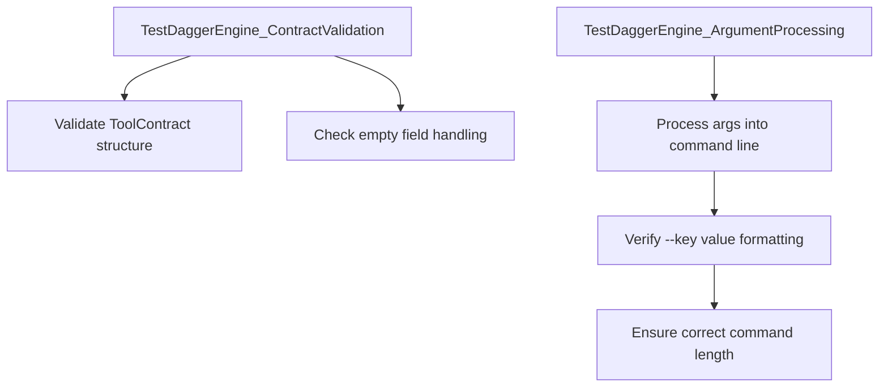
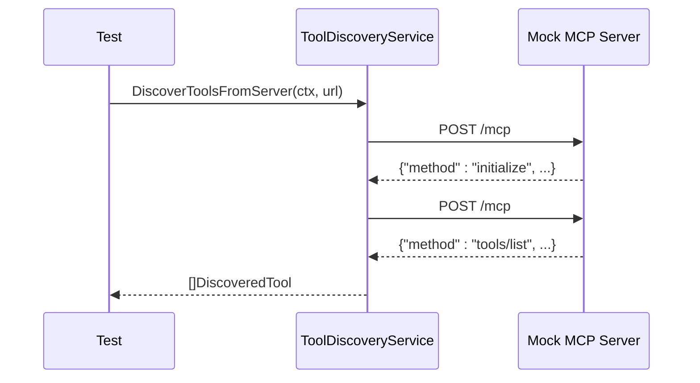
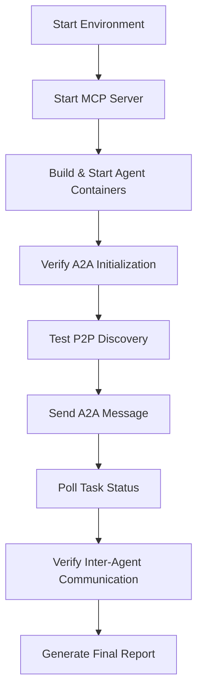
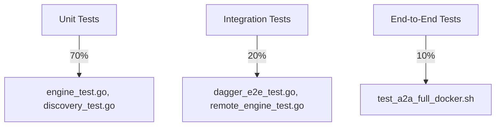
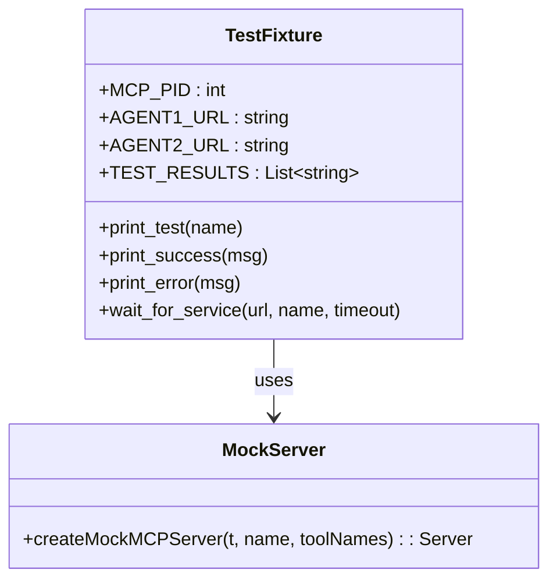

# Testing Strategy


## Table of Contents
1. [Unit Testing Strategies](#unit-testing-strategies)
2. [Integration Testing for Component Interactions](#integration-testing-for-component-interactions)
3. [End-to-End Testing with test_a2a_full_docker.sh](#end-to-end-testing-with-test_a2a_full_dockersh)
4. [Test Pyramid and Code Coverage Goals](#test-pyramid-and-code-coverage-goals)
5. [Testing Event-Driven and Asynchronous Components](#testing-event-driven-and-asynchronous-components)
6. [Test Fixtures and Mock Implementations](#test-fixtures-and-mock-implementations)

## Unit Testing Strategies

The Praxis agent employs a comprehensive unit testing strategy focused on isolating and validating core components. Unit tests are implemented using Go's built-in `testing` framework, complemented by assertion libraries such as `testify/assert` and `testify/require` for expressive and reliable test validation.

### Dagger Engine Unit Testing

The Dagger engine is tested through both unit and integration approaches. Unit tests focus on validating internal logic such as contract validation and argument processing, while integration tests verify actual execution against a running Dagger engine.



**Diagram sources**
- [engine_test.go](file://internal/dagger/engine_test.go#L229-L288)

**Section sources**
- [engine_test.go](file://internal/dagger/engine_test.go#L229-L288)

### MCP Discovery Unit Testing

The MCP (Modular Capability Protocol) discovery mechanism is rigorously unit tested to ensure reliable tool discovery from remote servers. The `ToolDiscoveryService` is tested in isolation using HTTP mocking to simulate server responses without external dependencies.

Key test cases include:
- Successful discovery from a single MCP server
- Handling of server initialization and tool listing
- Extraction and parsing of server metadata
- Validation of discovered tool schemas

A helper function `createMockMCPServer` is used to simulate MCP servers with configurable behavior, enabling deterministic test outcomes.



**Diagram sources**
- [discovery_test.go](file://internal/mcp/discovery_test.go#L0-L185)
- [discovery.go](file://internal/mcp/discovery.go#L0-L89)

**Section sources**
- [discovery_test.go](file://internal/mcp/discovery_test.go#L0-L185)
- [discovery.go](file://internal/mcp/discovery.go#L0-L89)

## Integration Testing for Component Interactions

Integration tests validate the correct interaction between components, ensuring that interfaces and communication protocols function as expected.

### P2P Connection Establishment

The test suite verifies peer-to-peer discovery and agent card exchange. The `test_a2a_full_docker.sh` script confirms that agents discover each other via P2P protocols and successfully exchange capability cards.

Key validation steps:
- Agents log "Card exchange complete" messages
- `/p2p/cards` endpoint returns peer information
- Discovered peers expose correct tool metadata

```bash
local p2p_response=$(curl -s "$AGENT1_URL/p2p/cards")
local peer_count=$(echo "$p2p_response" | jq '.cards | length')
assert [ "$peer_count" -gt 0 ]
```

### MCP Tool Invocation

Integration tests confirm that the agent can invoke tools exposed by MCP servers. The test script starts a local `mcp-filesystem-server.go` that exposes file operations, then verifies the agent can discover and use these tools.

The workflow includes:
1. Starting the MCP server via `go run examples/mcp-filesystem-server.go`
2. Confirming server readiness via health check
3. Agent discovering tools via `/mcp` endpoint
4. Executing tool calls (e.g., file read/write)

**Section sources**
- [test_a2a_full_docker.sh](file://test_a2a_full_docker.sh#L127-L146)
- [discovery.go](file://internal/mcp/discovery.go#L41-L89)

## End-to-End Testing with test_a2a_full_docker.sh

The `test_a2a_full_docker.sh` script provides a comprehensive end-to-end validation of multi-agent workflows using Docker Compose. It orchestrates two Praxis agents and an MCP server to test the full A2A (Agent-to-Agent) protocol.

### Test Workflow



**Diagram sources**
- [test_a2a_full_docker.sh](file://test_a2a_full_docker.sh#L0-L832)

The script follows a structured sequence:
1. **Prerequisite Check**: Validates `OPENAI_API_KEY`, Docker, curl, jq
2. **Environment Setup**: Cleans previous state, starts MCP server
3. **Agent Deployment**: Builds and starts two agent containers via `docker-compose up`
4. **Protocol Validation**: Tests A2A message sending, task lifecycle, and error handling
5. **Cleanup**: Stops containers and saves logs

### Key End-to-End Scenarios

- **A2A Message Flow**: Agent 1 sends a message via `message/send`, creating a task that transitions through `submitted` → `working` → `completed` states
- **Task Status Polling**: Script polls `/execute` with `tasks/get` to monitor task progress
- **Inter-Agent Communication**: Agent 1 delegates work to Agent 2 via A2A protocol
- **Legacy DSL Compatibility**: Tests conversion of legacy DSL requests to A2A tasks

**Section sources**
- [test_a2a_full_docker.sh](file://test_a2a_full_docker.sh#L0-L832)

## Test Pyramid and Code Coverage Goals

The testing strategy follows a test pyramid model with a strong foundation of unit tests, a moderate layer of integration tests, and a smaller set of end-to-end tests.

### Test Distribution



While explicit code coverage goals are not documented in the repository, the presence of unit tests for core logic (contract validation, argument processing) and comprehensive end-to-end validation suggests an implicit goal of high coverage for critical paths.

The test suite emphasizes:
- **Reliability**: Tests skip in CI when external dependencies (Docker, Dagger) are unavailable
- **Observability**: Detailed logging and final JSON report generation
- **Reproducibility**: Self-contained Docker environment

**Section sources**
- [engine_test.go](file://internal/dagger/engine_test.go)
- [test_a2a_full_docker.sh](file://test_a2a_full_docker.sh)

## Testing Event-Driven and Asynchronous Components

The Praxis agent architecture is event-driven, with components like the event bus and WebSocket gateway handling asynchronous operations.

### Testing Asynchronous Workflows

The end-to-end test script validates asynchronous task execution by polling the task status endpoint until completion:

```bash
while [ $attempt -le $max_attempts ]; do
    local state=$(curl -s "$AGENT1_URL/execute" | jq -r '.result.status.state')
    case "$state" in
        "completed") break ;;
        "failed") exit 1 ;;
    esac
    sleep 2
done
```

This pattern ensures the system correctly handles long-running tasks and state transitions.

### WebSocket Gateway Testing

The `websocket_gateway_test.go` file contains tests for WebSocket communication, validating:
- Connection establishment
- Message routing
- Error handling during transmission
- Client disconnection handling

These tests use Go's `httptest` package to simulate WebSocket clients and verify event propagation.

**Section sources**
- [test_a2a_full_docker.sh](file://test_a2a_full_docker.sh#L344-L386)
- [websocket_gateway_test.go](file://internal/api/websocket_gateway_test.go)

## Test Fixtures and Mock Implementations

The test suite leverages several fixture and mocking patterns to enable reliable and isolated testing.

### HTTP Server Mocking

The MCP discovery tests use Go's `httptest.NewServer` to create mock HTTP servers that simulate MCP protocol interactions:

```go
server := httptest.NewServer(http.HandlerFunc(func(w http.ResponseWriter, r *http.Request) {
    var request map[string]interface{}
    json.NewDecoder(r.Body).Decode(&request)
    method := request["method"].(string)
    switch method {
    case "initialize":
        json.NewEncoder(w).Encode(initializeResponse)
    case "tools/list":
        json.NewEncoder(w).Encode(toolsListResponse)
    }
}))
```

This allows testing discovery logic without requiring real MCP servers.

### Helper Test Functions

The `createMockMCPServer` function encapsulates mock server creation with configurable server name and tool list, promoting test reuse and consistency.

### Environment Simulation

The `test_a2a_full_docker.sh` script acts as a high-level test fixture, orchestrating:
- Docker Compose environment
- MCP server process
- Agent containers
- Log collection and analysis

It uses temporary files (e.g., `/tmp/current_task_id`) to share state between test phases.



**Diagram sources**
- [test_a2a_full_docker.sh](file://test_a2a_full_docker.sh#L0-L832)
- [discovery_test.go](file://internal/mcp/discovery_test.go#L138-L185)

**Section sources**
- [test_a2a_full_docker.sh](file://test_a2a_full_docker.sh#L0-L832)
- [discovery_test.go](file://internal/mcp/discovery_test.go#L138-L185)

**Referenced Files in This Document**
- [engine_test.go](file://internal/dagger/engine_test.go#L0-L318)
- [discovery_test.go](file://internal/mcp/discovery_test.go#L0-L185)
- [discovery.go](file://internal/mcp/discovery.go#L0-L89)
- [test_a2a_full_docker.sh](file://test_a2a_full_docker.sh#L0-L832)
- [engine.go](file://internal/dagger/engine.go)
- [execution_test.go](file://internal/contracts/execution_test.go)
- [websocket_gateway_test.go](file://internal/api/websocket_gateway_test.go)
- [hooks_test.go](file://internal/logger/hooks_test.go)
- [remote_engine_test.go](file://internal/mcp/remote_engine_test.go)
