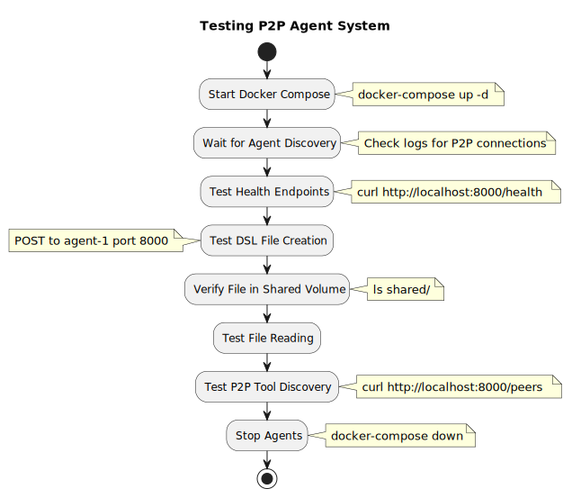

# Praxis P2P Agent Usage Guide

## Table of Contents

1. [Quick Start](#quick-start)
2. [Adding New Tools](#adding-new-tools)
3. [API Reference](#api-reference)
4. [Configuration](#configuration)
5. [Testing Guide](#testing-guide)
6. [Troubleshooting](#troubleshooting)

## Quick Start

### Prerequisites

- Go 1.21+
- Docker & Docker Compose
- Linux/macOS/Windows with WSL2

### Building the Project

```bash
# Clone the repository
git clone https://github.com/praxis/praxis-go-sdk.git
cd praxis-go-sdk-clean_good

# Build the binary
go build -o praxis-agent ./cmd/agent/main.go

# For Docker deployment (Linux binary)
GOOS=linux GOARCH=amd64 go build -o praxis-agent ./cmd/agent/main.go
```

### Running with Docker Compose

```bash
# Build and start agents
docker compose build
docker compose up -d

# Check logs
docker compose logs -f

# Stop agents
docker compose down
```

### Testing the System

```bash
# Create a file via DSL (agent-1 -> agent-2)
curl -X POST http://localhost:8000/execute \
  -H "Content-Type: application/json" \
  -d '{"dsl": "CALL write_file test.txt \"Hello from P2P agent\""}'

# Read the file
curl -X POST http://localhost:8000/execute \
  -H "Content-Type: application/json" \
  -d '{"dsl": "CALL read_file test.txt"}'

# List files
curl -X POST http://localhost:8000/execute \
  -H "Content-Type: application/json" \
  -d '{"dsl": "CALL list_files"}'
```

## Adding New Tools

### Step 1: Create Tool Implementation

Create a new file `internal/mcp/custom_tool.go`:

```go
package mcp

import (
    "context"
    "fmt"
    mcpTypes "github.com/mark3labs/mcp-go/mcp"
    "github.com/sirupsen/logrus"
)

type CustomTool struct {
    logger *logrus.Logger
    // Add any dependencies
}

func NewCustomTool(logger *logrus.Logger) *CustomTool {
    return &CustomTool{
        logger: logger,
    }
}

// Define the tool specification
func (t *CustomTool) GetTool() mcpTypes.Tool {
    return mcpTypes.NewTool("custom_operation",
        mcpTypes.WithDescription("Performs a custom operation"),
        mcpTypes.WithString("input",
            mcpTypes.Required(),
            mcpTypes.Description("Input for the operation"),
        ),
        mcpTypes.WithBoolean("verbose",
            mcpTypes.DefaultBool(false),
            mcpTypes.Description("Enable verbose output"),
        ),
    )
}

// Implement the handler
func (t *CustomTool) Handler(ctx context.Context, req mcpTypes.CallToolRequest) (*mcpTypes.CallToolResult, error) {
    args := req.GetArguments()
    input, _ := args["input"].(string)
    verbose, _ := args["verbose"].(bool)

    if input == "" {
        return mcpTypes.NewToolResultError("input is required"), nil
    }

    // Implement your tool logic here
    result := fmt.Sprintf("Processed: %s", input)

    if verbose {
        t.logger.Infof("Custom tool executed: %s", result)
    }

    return mcpTypes.NewToolResultText(result), nil
}
```

### Step 2: Register Tool in Agent

Update `internal/agent/agent.go` in the `initializeMCP()` method:

```go
func (a *PraxisAgent) initializeMCP() error {
    // ... existing code ...

    // Add custom tool
    customTool := mcp.NewCustomTool(a.logger)
    a.mcpServer.AddTool(
        customTool.GetTool(),
        customTool.Handler,
    )

    a.logger.Info("Registered custom tool")

    // ... rest of the code ...
}
```

### Step 3: Tool Discovery

The tool will automatically be:

1. Added to the agent's A2A card
2. Discoverable by other agents
3. Executable via DSL commands

### Step 4: Test Your Tool

```bash
# Test locally
curl -X POST http://localhost:8000/execute \
  -H "Content-Type: application/json" \
  -d '{"dsl": "CALL custom_operation \"test input\""}'

# With verbose flag
curl -X POST http://localhost:8000/execute \
  -H "Content-Type: application/json" \
  -d '{"dsl": "CALL custom_operation \"test input\" true"}'
```

## API Reference

### HTTP Endpoints

#### POST /execute

Execute a DSL command.

**Request:**

```json
{
  "dsl": "CALL tool_name arg1 arg2"
}
```

**Response:**

```json
{
  "result": {
    "status": "completed",
    "results": [
      {
        "tool": "tool_name",
        "status": "executed",
        "result": {...},
        "executed_by": "peer_id"
      }
    ]
  }
}
```

#### GET /health

Health check endpoint.

**Response:**

```json
{
  "status": "healthy",
  "agent": "praxis-agent-1",
  "version": "1.0.0"
}
```

## Configuration

### Environment Variables

The system supports configuration via environment variables or the `configs/agent.yaml` file:

```bash
# Agent configuration
AGENT_NAME=praxis-agent-1
AGENT_VERSION=1.0.0

# Network ports (from docker-compose.yml)
HTTP_PORT=8000                # Main HTTP API port
P2P_PORT=4001                 # P2P communication port
SSE_PORT=8090                 # Server-Sent Events port
WEBSOCKET_PORT=9000           # WebSocket Gateway port

# Features
MCP_ENABLED=true              # Enable MCP server
LOG_LEVEL=info                # Logging level: debug, info, warn, error

# LLM Configuration (optional)
OPENAI_API_KEY=sk-your-key    # Required for LLM features

# P2P Configuration
BOOTSTRAP_PEERS=""            # P2P bootstrap peers (optional)

# Shared directory for filesystem tools
SHARED_DIR=/shared
```

For detailed configuration, see `configs/agent.yaml` which includes advanced settings for:
- P2P networking (mDNS, DHT, bootstrap nodes)
- MCP limits and timeouts
- LLM provider settings and rate limiting
- Caching and logging preferences

### Default Ports

| Service | Default Port | Description |
|---------|--------------|-------------|
| HTTP API | 8000 | REST API endpoint |
| P2P | 4001 | libp2p communication |
| MCP SSE | 8090 | Server-sent events for MCP |
| WebSocket | 9000 | WebSocket Gateway |

### DSL Commands Quick Reference

| Command | Description | Example |
|---------|-------------|---------|
| `CALL write_file` | Create/write a file | `CALL write_file test.txt "content"` |
| `CALL read_file` | Read file contents | `CALL read_file test.txt` |
| `CALL list_files` | List all files | `CALL list_files` |
| `CALL delete_file` | Delete a file | `CALL delete_file test.txt` |
| `CALL <custom>` | Call custom tool | `CALL analyze_data '{"key": "value"}'` |

## Testing Guide

### Basic Testing Flow



```bash
# Start Docker Compose
docker-compose up -d

# Wait for Agent Discovery (check logs for P2P connections)
docker compose logs -f

# Test Health Endpoints
curl http://localhost:8000/health
curl http://localhost:8001/health

# Test DSL File Creation (POST to agent-1 port 8000)
curl -X POST http://localhost:8000/execute \
  -H "Content-Type: application/json" \
  -d '{"dsl": "CALL write_file test.txt \"Hello from P2P agent\""}'

# Verify File in Shared Volume
ls shared/

# Test File Reading
curl -X POST http://localhost:8000/execute \
  -H "Content-Type: application/json" \
  -d '{"dsl": "CALL read_file test.txt"}'

# Test P2P Tool Discovery (if endpoint exists)
curl http://localhost:8000/peers

# Stop agents
docker-compose down
```

### Advanced Testing Scenarios

#### Testing Remote Tool Execution

1. Start both agents
2. Ensure agent-1 connects to agent-2
3. Execute a tool available only on agent-2 from agent-1
4. Verify the tool executes on agent-2 and results return to agent-1

#### Testing P2P Discovery

1. Start agent-1
2. Start agent-2 after a delay
3. Check logs for automatic discovery
4. Verify A2A card exchange
5. Test cross-agent tool execution

#### Testing Network Resilience

1. Start both agents
2. Stop agent-2 temporarily
3. Attempt tool execution from agent-1
4. Restart agent-2
5. Verify reconnection and tool execution

## Troubleshooting

### Common Issues

#### 1. Agents Not Discovering Each Other

**Symptoms:**
- No peer connections in logs
- Tools not available remotely

**Solutions:**
- Check mDNS service is running
- Verify network connectivity
- Check firewall settings
- Ensure both agents are on same network

#### 2. Tool Execution Fails

**Symptoms:**
- "Tool not found" errors
- Timeout errors

**Solutions:**
- Check agent A2A cards are exchanged
- Verify tool is registered correctly
- Check P2P connections are stable
- Review tool handler implementation

#### 3. DSL Parsing Errors

**Symptoms:**
- DSL syntax errors
- Unexpected command results

**Solutions:**
- Verify DSL syntax is correct
- Check argument types and formats
- Review DSL analyzer logs
- Test with simple commands first

#### 4. Port Conflicts

**Symptoms:**
- "Address already in use" errors
- Service startup failures

**Solutions:**
- Change ports in docker-compose.yml
- Check for other services on same ports
- Use `netstat` or `lsof` to identify conflicts

#### 5. Docker Issues

**Symptoms:**
- Container build failures
- Volume mount issues

**Solutions:**
- Run `docker compose build --no-cache`
- Check Docker daemon is running
- Verify volume paths exist
- Review Docker logs

### Debug Commands

```bash
# Check agent logs
docker compose logs -f praxis-agent-1
docker compose logs -f praxis-agent-2

# Check network connectivity
docker compose exec praxis-agent-1 ping praxis-agent-2

# Check P2P connections
curl http://localhost:8000/health
curl http://localhost:8001/health

# Check shared volume
docker compose exec praxis-agent-1 ls -la /shared
docker compose exec praxis-agent-2 ls -la /shared

# Check processes
docker compose ps
```

### Log Analysis

Look for these key log messages:

```bash
# Successful startup
"Agent initialized successfully"
"P2P discovery started"
"MCP server started"

# Peer discovery
"Discovered peer"
"P2P connection established"
"Agent card exchanged"

# Tool execution
"Executing tool locally"
"Routing tool to peer"
"Tool executed successfully"

# Errors to investigate
"Failed to connect to peer"
"Tool handler not found"
"DSL parsing failed"
"P2P stream error"
```
