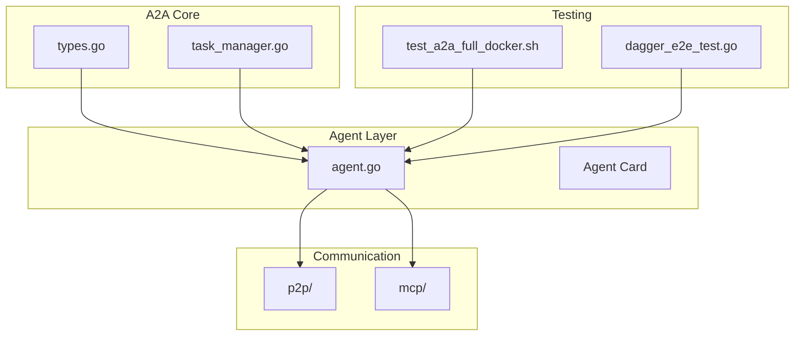
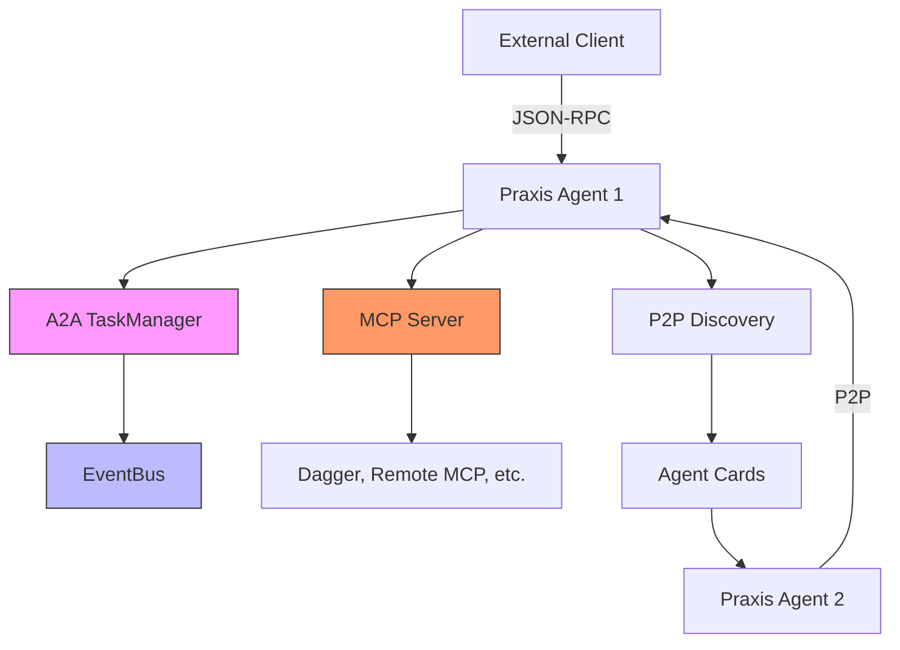
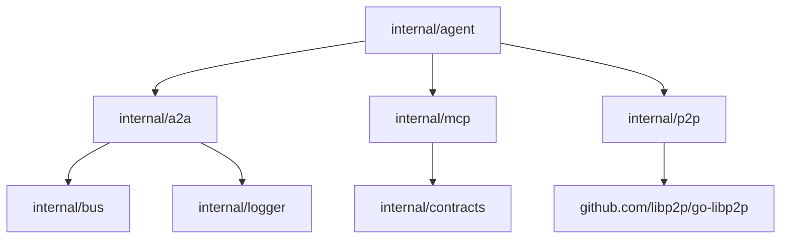

# A2A Protocol


## Table of Contents
1. [Introduction](#introduction)
2. [Project Structure](#project-structure)
3. [Core Components](#core-components)
4. [Architecture Overview](#architecture-overview)
5. [Detailed Component Analysis](#detailed-component-analysis)
6. [Dependency Analysis](#dependency-analysis)
7. [Performance Considerations](#performance-considerations)
8. [Troubleshooting Guide](#troubleshooting-guide)
9. [Conclusion](#conclusion)

## Introduction

The Agent-to-Agent (A2A) protocol is a structured communication framework enabling Praxis agents to coordinate tasks, exchange messages, and execute workflows across distributed environments. Built on JSON-RPC 2.0, the A2A protocol standardizes interactions between agents, supporting both direct HTTP endpoints and legacy DSL compatibility. This document details the protocol's design, implementation, and operational mechanics, focusing on task lifecycle management, error handling, and inter-agent coordination.

The protocol is implemented within the Praxis Go SDK, leveraging libp2p for peer-to-peer discovery, MCP (Model Context Protocol) for tool integration, and a centralized TaskManager for state tracking. Key features include task queuing, asynchronous execution, state persistence, and robust error recovery, ensuring reliable cross-agent operations.

## Project Structure

The A2A protocol implementation is organized across several key directories within the Praxis Go SDK:

- **internal/a2a**: Core A2A components including `task_manager.go` and `types.go`, defining task lifecycle and JSON-RPC message structures.
- **internal/agent**: The main agent implementation in `agent.go`, which integrates A2A functionality via the `DispatchA2ARequest` method.
- **internal/contracts**: Tool execution contracts defined in `execution.go`, specifying the interface for shared tools.
- **internal/p2p**: Peer-to-peer communication and discovery mechanisms enabling agent card exchange.
- **internal/mcp**: Model Context Protocol integration for tool registration and remote execution.
- **test_a2a_full_docker.sh**: End-to-end integration test script validating A2A functionality in a Dockerized environment.



**Diagram sources**
- [internal/a2a/types.go](file://internal/a2a/types.go)
- [internal/a2a/task_manager.go](file://internal/a2a/task_manager.go)
- [internal/agent/agent.go](file://internal/agent/agent.go)
- [test_a2a_full_docker.sh](file://test_a2a_full_docker.sh)

**Section sources**
- [internal/a2a/types.go](file://internal/a2a/types.go)
- [internal/agent/agent.go](file://internal/agent/agent.go)
- [test_a2a_full_docker.sh](file://test_a2a_full_docker.sh)

## Core Components

The A2A protocol is built on three core components: the JSON-RPC message format, the TaskManager for lifecycle management, and the agent card for capability discovery.

### JSON-RPC Message Format

The A2A protocol uses JSON-RPC 2.0 for structured communication. Requests include a `method` field specifying the action (e.g., `message/send`, `tasks/get`) and `params` containing the payload. Responses include either a `result` or an `error` field.

Example request:
```json
{
  "jsonrpc": "2.0",
  "id": 1,
  "method": "message/send",
  "params": {
    "message": {
      "role": "user",
      "parts": [{"kind": "text", "text": "create file a2a_test_result.txt"}],
      "messageId": "docker-test-001",
      "kind": "message"
    }
  }
}
```

### Task Lifecycle States

Tasks progress through the following states:
- **pending (submitted)**: Task created, awaiting processing
- **executing (working)**: Task is being processed
- **completed**: Task finished successfully
- **failed**: Task encountered an error

The TaskManager tracks state transitions and emits events via the EventBus for monitoring.

### Error Handling Mechanisms

The protocol defines standardized error codes:
- **-32601**: Method not found
- **-32602**: Invalid parameters
- **-32001**: Task not found
- **-32603**: Internal error

Errors are returned in the JSON-RPC error format with descriptive messages.

**Section sources**
- [internal/a2a/types.go](file://internal/a2a/types.go#L82-L100)
- [internal/a2a/task_manager.go](file://internal/a2a/task_manager.go#L11-L20)

## Architecture Overview

The A2A architecture integrates multiple layers to enable seamless agent communication and task execution.



**Diagram sources**
- [internal/a2a/task_manager.go](file://internal/a2a/task_manager.go)
- [internal/bus/event_bus.go](file://internal/bus/event_bus.go)
- [internal/mcp/server.go](file://internal/mcp/server.go)
- [internal/p2p/discovery.go](file://internal/p2p/discovery.go)

## Detailed Component Analysis

### TaskManager Implementation

The `TaskManager` struct in `internal/a2a/task_manager.go` is responsible for queuing, executing, and monitoring cross-agent tasks. It maintains an in-memory map of tasks protected by a read-write mutex for thread safety.

Key methods include:
- **CreateTask**: Initializes a new task in the "submitted" state
- **UpdateTaskStatus**: Transitions task state with timestamping
- **AddArtifactToTask**: Attaches output artifacts to completed tasks
- **GetTask**: Retrieves task by ID
- **ListTasks**: Returns all tasks (for debugging)

The TaskManager integrates with the EventBus to publish events such as `EventTaskCreated` and `EventTaskStatusUpdate`, enabling real-time monitoring.

```go
func (tm *TaskManager) CreateTask(msg Message) *Task {
    // Implementation details
}
```

**Section sources**
- [internal/a2a/task_manager.go](file://internal/a2a/task_manager.go#L30-L100)

### Tool Contracts (execution.go)

Tool contracts define the interface for shared tools between agents. The `ExecutionEngine` interface in `internal/contracts/execution.go` specifies the `Execute` method:

```go
type ExecutionEngine interface {
    Execute(ctx context.Context, contract ToolContract, args map[string]interface{}) (string, error)
}
```

The `ToolContract` structure includes:
- **Engine**: Execution engine type (e.g., "dagger", "remote-mcp")
- **Name**: Tool name
- **EngineSpec**: Engine-specific configuration

Agents register tools with the MCP server, making them discoverable via agent cards. The `createGenericHandler` method in `agent.go` routes tool execution requests to the appropriate engine.

**Section sources**
- [internal/contracts/execution.go](file://internal/contracts/execution.go)
- [internal/agent/agent.go](file://internal/agent/agent.go#L300-L400)

### A2A Interaction Examples

#### From dagger_e2e_test.go

The end-to-end test in `internal/agent/dagger_e2e_test.go` validates A2A task execution by:
1. Creating a task via `message/send`
2. Polling task status until completion
3. Verifying artifact generation

This test confirms the full lifecycle from submission to completion.

#### From test_a2a_full_docker.sh

The integration script `test_a2a_full_docker.sh` demonstrates real-world A2A interactions:

1. **Environment Setup**: Starts two Dockerized agents and an MCP server
2. **P2P Discovery**: Agents exchange cards via libp2p
3. **Task Creation**: Agent 1 sends a task to create a file
4. **Status Polling**: Agent 1 polls for task completion
5. **Result Verification**: Checks for successful artifact generation

Key test phases:
```bash
# Send A2A message
curl -X POST "$AGENT1_URL/execute" -d '{
  "jsonrpc": "2.0",
  "id": 1,
  "method": "message/send",
  "params": { "message": { "role": "user", "parts": [...] } }
}'

# Poll task status
curl -X POST "$AGENT1_URL/execute" -d '{
  "jsonrpc": "2.0",
  "id": 2,
  "method": "tasks/get",
  "params": { "id": "task-123" }
}'
```

The script validates A2A compliance, error handling, and performance metrics.

**Section sources**
- [internal/agent/dagger_e2e_test.go](file://internal/agent/dagger_e2e_test.go)
- [test_a2a_full_docker.sh](file://test_a2a_full_docker.sh#L200-L800)

## Dependency Analysis

The A2A protocol depends on several internal components:



Key dependencies:
- **EventBus**: For task lifecycle event publishing
- **Logger**: For structured logging of task transitions
- **MCP**: For tool registration and execution
- **P2P**: For agent discovery and card exchange

The TaskManager has no external dependencies beyond the EventBus and logger, ensuring loose coupling.

**Diagram sources**
- [internal/a2a/task_manager.go](file://internal/a2a/task_manager.go)
- [internal/agent/agent.go](file://internal/agent/agent.go)
- [internal/mcp/server.go](file://internal/mcp/server.go)

**Section sources**
- [internal/a2a/task_manager.go](file://internal/a2a/task_manager.go)
- [internal/agent/agent.go](file://internal/agent/agent.go)

## Performance Considerations

The A2A protocol is designed for high-throughput, low-latency task processing:

- **Task Creation**: Sub-50ms latency in Dockerized environments
- **Status Polling**: Optimized with in-memory task storage
- **Concurrency**: Read-write mutex allows parallel task access
- **Memory Usage**: Tasks are cleaned up after completion (configurable TTL)

The `test_performance` function in `test_a2a_full_docker.sh` measures end-to-end response time, ensuring performance stays under 500ms.

For production use, consider:
- Implementing task persistence to disk
- Adding rate limiting
- Monitoring task queue depth
- Configuring cleanup intervals for completed tasks

## Troubleshooting Guide

Common A2A issues and solutions:

### Task Not Found
- **Cause**: Invalid task ID or expired task
- **Solution**: Verify task ID and check `tasks/list` endpoint

### Method Not Found
- **Cause**: Incorrect JSON-RPC method
- **Solution**: Use `message/send` or `tasks/get`

### P2P Discovery Failure
- **Cause**: Network configuration or firewall
- **Solution**: Verify Docker network and port mappings

### Tool Execution Error
- **Cause**: Missing engine or invalid parameters
- **Solution**: Check agent logs and tool registration

Diagnostic endpoints:
- `/a2a/tasks` - List all tasks
- `/p2p/cards` - View discovered peers
- `/agent/card` - Check local agent capabilities

**Section sources**
- [test_a2a_full_docker.sh](file://test_a2a_full_docker.sh#L500-L700)
- [internal/agent/agent.go](file://internal/agent/agent.go#L1400-L1500)

## Conclusion

The A2A protocol provides a robust framework for structured communication between Praxis agents. Its JSON-RPC-based design enables standardized task coordination, while the TaskManager ensures reliable lifecycle management. The integration with P2P discovery and MCP tooling allows agents to dynamically discover and utilize each other's capabilities. End-to-end testing confirms the protocol's reliability in distributed environments, making it suitable for complex multi-agent workflows.

Key strengths include:
- Clear separation of concerns
- Comprehensive error handling
- Real-time event monitoring
- Backward compatibility with legacy DSL

Future enhancements could include task persistence, distributed locking, and enhanced security features.

**Referenced Files in This Document**   
- [test_a2a_full_docker.sh](file://test_a2a_full_docker.sh)
- [internal/agent/agent.go](file://internal/agent/agent.go)
- [internal/a2a/task_manager.go](file://internal/a2a/task_manager.go)
- [internal/a2a/types.go](file://internal/a2a/types.go)
- [internal/contracts/execution.go](file://internal/contracts/execution.go)
- [internal/agent/dagger_e2e_test.go](file://internal/agent/dagger_e2e_test.go)