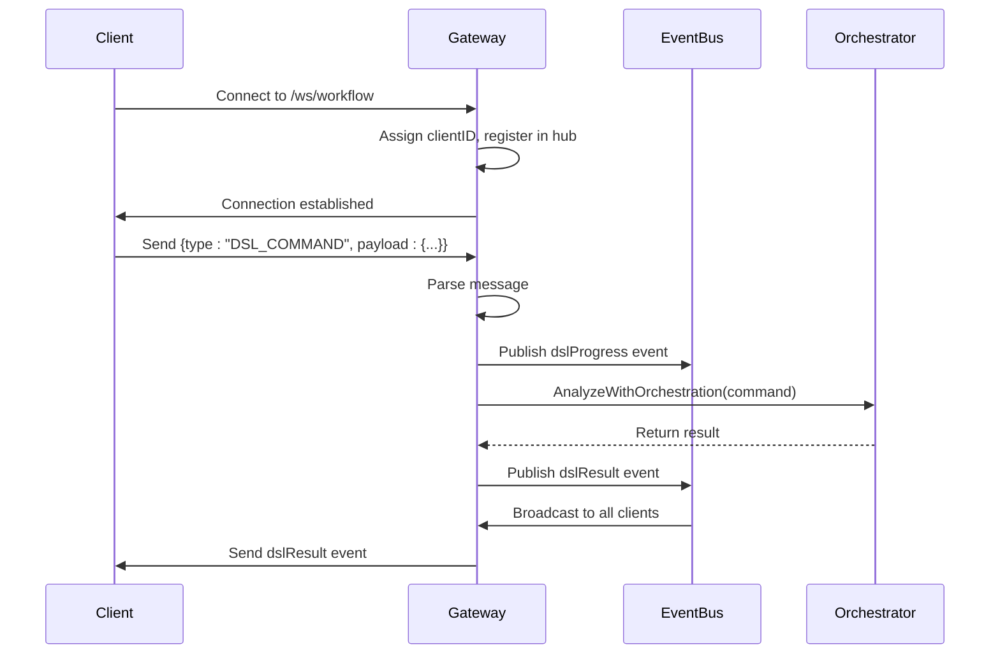
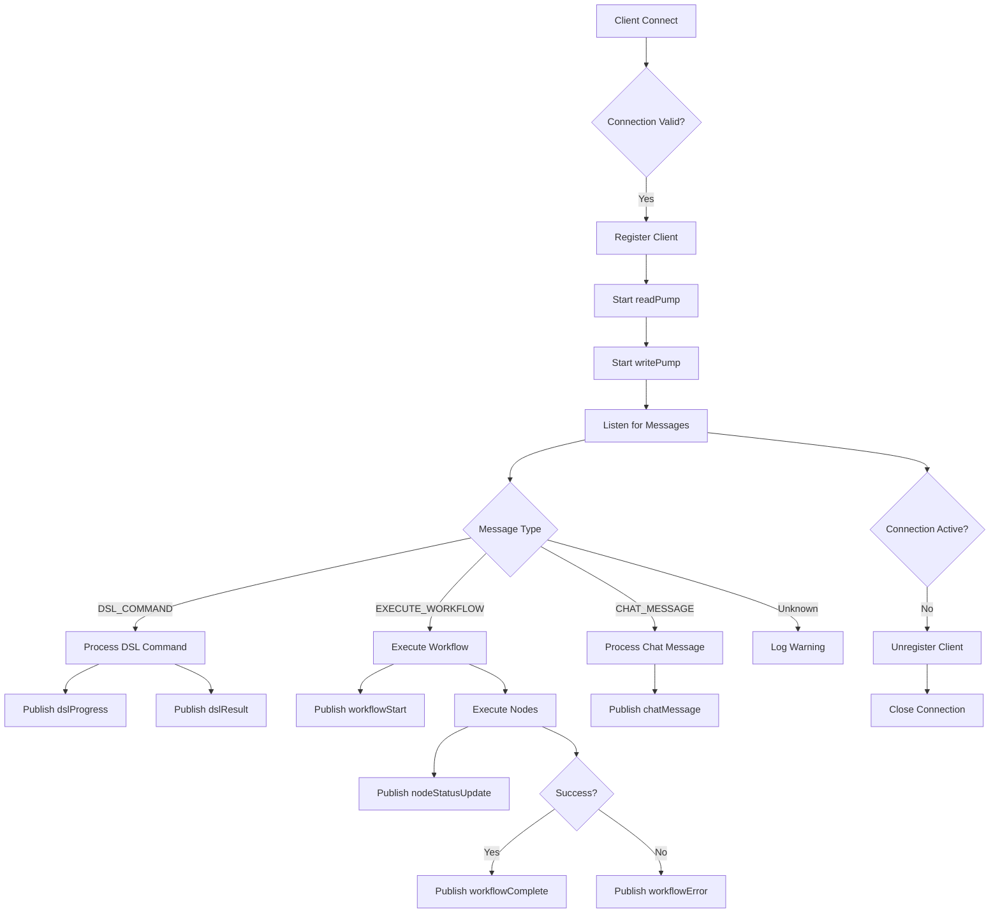

# API Reference


## Table of Contents
1. [RESTful API Endpoints](#restful-api-endpoints)
2. [WebSocket Interface](#websocket-interface)
3. [MCP Server Endpoints](#mcp-server-endpoints)
4. [Rate Limiting and Connection Management](#rate-limiting-and-connection-management)

## RESTful API Endpoints

The Praxis agent exposes HTTP endpoints for health checks, agent status, and configuration management. These endpoints are enabled via the `http` configuration block in `agent.yaml`.

### Health Check Endpoint
**HTTP Method**: `GET`  
**URL Pattern**: `/health`  
**Authentication**: None  
**Description**: Returns the operational status of the agent.

**Response Schema (JSON)**:
```json
{
  "status": "string",
  "timestamp": "string",
  "version": "string"
}
```

**Example Request**:
```bash
curl http://localhost:8000/health
```

**Example Response**:
```json
{
  "status": "healthy",
  "timestamp": "2025-09-05T14:00:00Z",
  "version": "1.0.0"
}
```

### Agent Status Endpoint
**HTTP Method**: `GET`  
**URL Pattern**: `/status`  
**Authentication**: None  
**Description**: Returns detailed agent status including configuration and active components.

**Response Schema (JSON)**:
```json
{
  "agent": {
    "name": "string",
    "version": "string",
    "url": "string"
  },
  "http": {
    "enabled": "boolean",
    "port": "number"
  },
  "p2p": {
    "enabled": "boolean",
    "port": "number"
  },
  "mcp": {
    "enabled": "boolean"
  },
  "llm": {
    "enabled": "boolean",
    "provider": "string"
  }
}
```

**Example Request**:
```bash
curl http://localhost:8000/status
```

**Example Response**:
```json
{
  "agent": {
    "name": "praxis-agent-from-yaml",
    "version": "1.0.0",
    "url": "http://localhost:8000"
  },
  "http": {
    "enabled": true,
    "port": 8000
  },
  "p2p": {
    "enabled": true,
    "port": 4001
  },
  "mcp": {
    "enabled": true
  },
  "llm": {
    "enabled": true,
    "provider": "openai"
  }
}
```

### Configuration Management Endpoint
**HTTP Method**: `GET`  
**URL Pattern**: `/config`  
**Authentication**: None  
**Description**: Returns the current agent configuration as defined in `agent.yaml`.

**Response Schema (JSON)**:
- Full configuration structure matching `agent.yaml`, including `agent`, `http`, `p2p`, `mcp`, `llm`, and `logging` sections.

**Example Request**:
```bash
curl http://localhost:8000/config
```

**Section sources**
- [agent.yaml](file://configs/agent.yaml#L1-L118)

## WebSocket Interface

The WebSocket interface enables real-time event streaming, command execution, and agent monitoring. It is accessible at `ws://localhost:8000/ws/workflow`.

### Connection Lifecycle
1. **Connection**: Client connects to `/ws/workflow`.
2. **Upgrade**: HTTP connection is upgraded to WebSocket.
3. **Registration**: Client is registered in the hub with a unique `clientID`.
4. **Heartbeat**: Ping/pong mechanism maintains connection (ping every 54 seconds, pong expected within 60 seconds).
5. **Termination**: Connection closed on error or client disconnection.

### WebSocket Message Types

#### Client-to-Server Messages
| Type | Payload Schema | Description |
|------|----------------|-------------|
| `DSL_COMMAND` | `{ "command": "string", "workflowId": "string" }` | Submit a DSL command for processing |
| `EXECUTE_WORKFLOW` | `{ "workflowId": "string", "nodes": [...], "edges": [...] }` | Execute a workflow by ID or definition |
| `CHAT_MESSAGE` | `{ "content": "string", "sender": "string" }` | Send a chat message for processing |

#### Server-to-Client Events (via EventBus)
| Event Type | Payload Schema | Description |
|-----------|----------------|-------------|
| `dslProgress` | `{ "stage": "string", "message": "string", "command": "string" }` | DSL parsing progress update |
| `dslResult` | `{ "success": "boolean", "command": "string", "result": "object", "error": "string" }` | Result of DSL analysis |
| `workflowStart` | `{ "workflowId": "string" }` | Workflow execution has started |
| `nodeStatusUpdate` | `{ "workflowId": "string", "nodeId": "string", "status": "string" }` | Node execution status update |
| `workflowLog` | `{ "workflowId": "string", "level": "string", "message": "string" }` | Log message from workflow execution |
| `workflowComplete` | `{ "workflowId": "string", "result": "object", "message": "string" }` | Workflow completed successfully |
| `workflowError` | `{ "workflowId": "string", "message": "string", "nodeId": "string" }` | Workflow execution error |
| `chatMessage` | `{ "content": "string", "sender": "string" }` | Chat message from assistant or system |
| `error` | `{ "message": "string" }` | Error message from server |

### Example: Execute a Workflow via WebSocket
```javascript
const ws = new WebSocket('ws://localhost:8000/ws/workflow');

ws.onopen = () => {
  ws.send(JSON.stringify({
    type: 'EXECUTE_WORKFLOW',
    payload: {
      workflowId: 'workflow-123',
      nodes: [
        { id: 'node1', tool: 'python_analyzer', input: 'input_file=data.txt' }
      ],
      edges: []
    }
  }));
};

ws.onmessage = (event) => {
  const data = JSON.parse(event.data);
  console.log(data.type, data.payload);
};
```

### Connection Parameters
| Parameter | Value | Description |
|---------|-------|-------------|
| `writeWait` | 10 seconds | Time allowed to write a message |
| `pongWait` | 60 seconds | Time allowed to read pong response |
| `pingPeriod` | 54 seconds | Interval for sending ping messages |
| `maxMessageSize` | 512 KB | Maximum message size from client |
| `send buffer size` | 256 messages | Internal message queue capacity |



**Diagram sources**
- [websocket_gateway.go](file://internal/api/websocket_gateway.go#L275-L347)
- [event_bus.go](file://internal/bus/event_bus.go#L119-L135)

**Section sources**
- [websocket_gateway.go](file://internal/api/websocket_gateway.go#L0-L199)
- [websocket_gateway.go](file://internal/api/websocket_gateway.go#L549-L571)

## MCP Server Endpoints

The Praxis agent supports MCP (Modular Control Plane) servers for tool discovery and invocation. External MCP endpoints are configured in `agent.yaml`.

### Tool Discovery
**HTTP Method**: `GET`  
**URL Pattern**: `/mcp/discover`  
**Authentication**: None  
**Description**: Returns list of available tools from local and external MCP servers.

**Response Schema (JSON)**:
```json
[
  {
    "name": "string",
    "description": "string",
    "inputSchema": "object"
  }
]
```

**Example Request**:
```bash
curl http://localhost:8000/mcp/discover
```

**Example Response**:
```json
[
  {
    "name": "python_analyzer",
    "description": "Analyzes data using an external Python script",
    "inputSchema": {
      "type": "object",
      "properties": {
        "input_file": {
          "type": "string"
        }
      },
      "required": ["input_file"]
    }
  }
]
```

### Tool Invocation
**HTTP Method**: `POST`  
**URL Pattern**: `/mcp/invoke/{toolName}`  
**Authentication**: None  
**Description**: Execute a registered tool with provided parameters.

**Request Schema (JSON)**:
```json
{
  "arguments": {
    "param1": "value1"
  }
}
```

**Response Schema (JSON)**:
```json
{
  "result": "object",
  "error": "string"
}
```

**Example Request**:
```bash
curl -X POST http://localhost:8000/mcp/invoke/python_analyzer \
  -H "Content-Type: application/json" \
  -d '{"arguments": {"input_file": "data.txt"}}'
```

**Configuration Example** (`agent.yaml`):
```yaml
tools:
  - name: "python_analyzer"
    description: "Analyzes data using an external Python script"
    engine: "dagger"
    params:
      - name: "input_file"
        type: "string"
        required: "true"
    engineSpec:
      image: "python:3.11-slim"
      command: ["python", "/shared/analyzer.py"]
      mounts:
        ./shared: /shared
```

**Section sources**
- [agent.yaml](file://configs/agent.yaml#L1-L118)

## Rate Limiting and Connection Management

### Rate Limiting Policies
The agent enforces rate limiting at multiple levels:

**LLM Rate Limiting** (`llm.rate_limiting` in `agent.yaml`):
- `requests_per_minute`: 60
- `tokens_per_minute`: 100000

**MCP Server Limits** (`mcp.limits` in `agent.yaml`):
- `max_concurrent_requests`: 100
- `request_timeout_ms`: 30000
- `max_response_size_bytes`: 10485760 (10MB)
- `connection_pool_size`: 5
- `retry_attempts`: 3
- `retry_backoff_ms`: 1000

### Connection Management Best Practices
1. **WebSocket Clients**:
   - Handle reconnection logic with exponential backoff
   - Respect `maxMessageSize` (512KB) to avoid connection drops
   - Respond to ping messages within 60 seconds
   - Use message batching to reduce network overhead

2. **Error Handling**:
   - Listen for `error` events for client-specific errors
   - Monitor `workflowError` events for execution failures
   - Implement retry logic for transient errors (e.g., network issues)

3. **Resource Management**:
   - Close WebSocket connections when inactive
   - Limit concurrent workflow executions based on system resources
   - Monitor agent logs via `workflowLog` events



**Diagram sources**
- [websocket_gateway.go](file://internal/api/websocket_gateway.go#L152-L257)
- [websocket_gateway.go](file://internal/api/websocket_gateway.go#L275-L546)

**Section sources**
- [websocket_gateway.go](file://internal/api/websocket_gateway.go#L0-L199)
- [agent.yaml](file://configs/agent.yaml#L1-L118)

**Referenced Files in This Document**   
- [agent.yaml](file://configs/agent.yaml)
- [websocket_gateway.go](file://internal/api/websocket_gateway.go)
- [event_bus.go](file://internal/bus/event_bus.go)