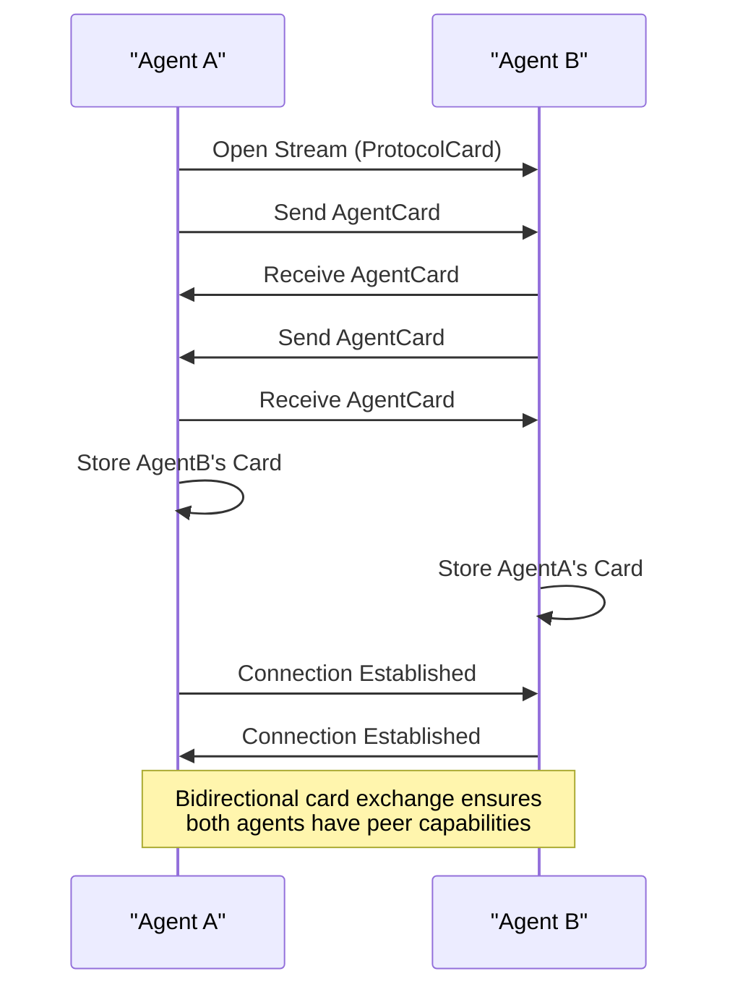
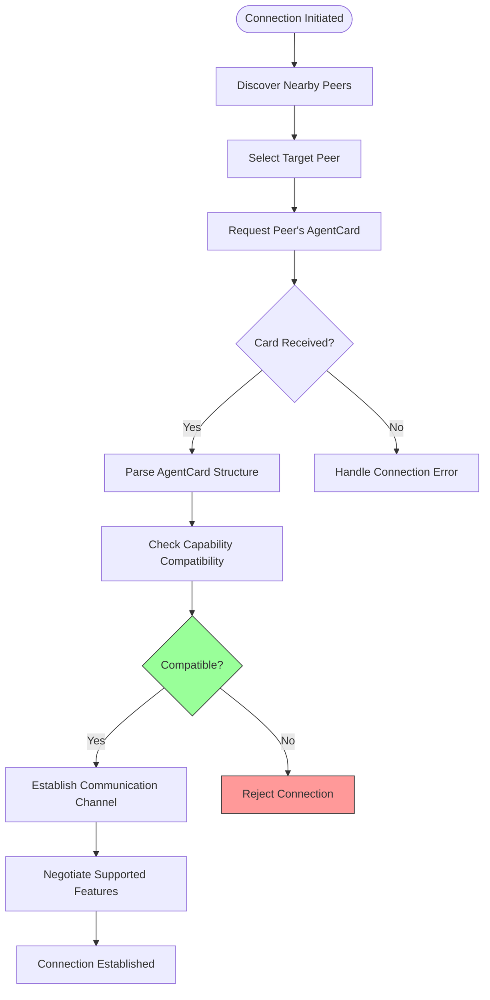
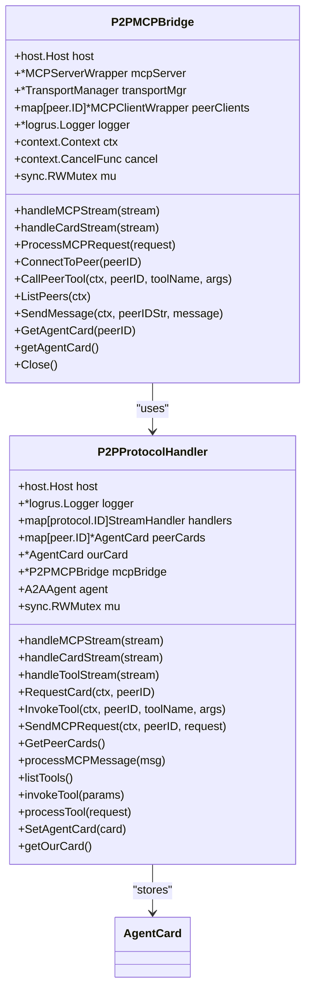
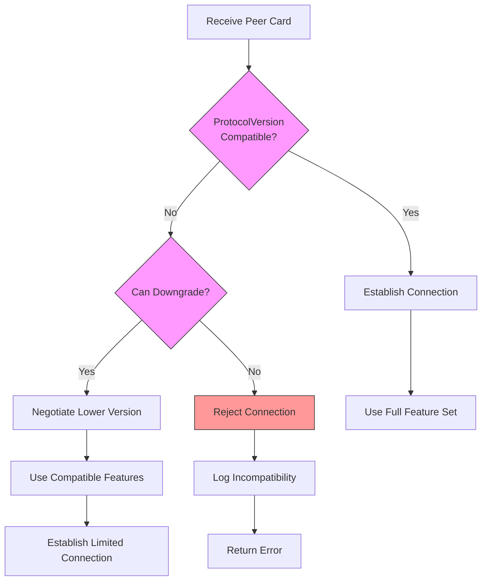

# Agent Card Exchange and Capability Negotiation


## Table of Contents
1. [Introduction](#introduction)
2. [AgentCard Structure and Serialization](#agentcard-structure-and-serialization)
3. [P2P Handshake and Card Exchange](#p2p-handshake-and-card-exchange)
4. [Capability Negotiation Workflow](#capability-negotiation-workflow)
5. [Bridge Component Processing](#bridge-component-processing)
6. [Configuration and Runtime Examples](#configuration-and-runtime-examples)
7. [Compatibility and Version Handling](#compatibility-and-version-handling)
8. [Extending the AgentCard Schema](#extending-the-agentcard-schema)

## Introduction
The Agent Card exchange process is a fundamental mechanism in the Praxis P2P network that enables agents to discover, assess, and establish communication with peers. This document details how the `AgentCard` structure is used during the initial handshake to advertise capabilities such as supported tools, MCP endpoints, and execution engines. The capability negotiation workflow ensures that agents can assess compatibility before establishing full communication channels. The Bridge component plays a crucial role in processing incoming cards and maintaining an updated view of peer capabilities. This system supports dynamic extension of the AgentCard schema with custom metadata fields, allowing for flexible and evolving agent capabilities.

## AgentCard Structure and Serialization

The `AgentCard` structure serves as a comprehensive capability advertisement for agents in the P2P network. It contains essential information that allows peers to understand what an agent can do and how to interact with it.

```mermaid
classDiagram
class AgentCard {
+string Name
+string Description
+string URL
+string Version
+string ProtocolVersion
+AgentProvider Provider
+AgentCapabilities Capabilities
+AgentSkill[] Skills
+map[string]interface{} SecuritySchemes
+string[] SupportedTransports
+interface{} Metadata
}
class AgentProvider {
+string Name
+string Version
+string Description
+string URL
+string Organization
}
class AgentCapabilities {
+*bool Streaming
+*bool PushNotifications
+*bool StateTransition
}
class AgentSkill {
+string ID
+string Name
+string Description
+string[] Tags
+string[] Examples
+string[] InputModes
+string[] OutputModes
}
AgentCard --> AgentProvider : "has"
AgentCard --> AgentCapabilities : "has"
AgentCard --> AgentSkill : "has many"
```

**Diagram sources**
- [card.go](file://internal/agent/card.go#L0-L40)

**Section sources**
- [card.go](file://internal/agent/card.go#L0-L40)

The `AgentCard` is serialized to JSON format during transmission, leveraging Go's built-in JSON marshaling capabilities. The serialization process preserves all fields defined in the struct tags, ensuring consistent data exchange between agents. When an agent initializes, it creates its `AgentCard` with information from both configuration files and runtime parameters. The card is then used in multiple contexts: served via HTTP endpoints, transmitted during P2P handshakes, and exposed through MCP resource endpoints.

## P2P Handshake and Card Exchange

The P2P handshake process begins when two agents discover each other through the network discovery mechanism. The card exchange follows a specific protocol to ensure both parties receive and store each other's capabilities.



**Diagram sources**
- [protocol.go](file://internal/p2p/protocol.go#L120-L180)

**Section sources**
- [protocol.go](file://internal/p2p/protocol.go#L120-L180)

The card exchange occurs over a dedicated protocol stream identified by `ProtocolCard = protocol.ID("/praxis/card/1.0.0")`. When an agent receives a connection request, it immediately sends its own card and waits to receive the peer's card. This bidirectional exchange ensures that both agents have up-to-date information about each other's capabilities. The `P2PProtocolHandler` manages this process through the `handleCardStream` method, which handles both sending and receiving operations in a single stream. After successful exchange, the peer's card is stored in the `peerCards` map for future reference and capability assessment.

## Capability Negotiation Workflow

The capability negotiation workflow enables agents to assess compatibility before establishing full communication channels. This process occurs automatically during the initial connection phase and can be triggered on-demand for specific operations.



**Diagram sources**
- [agent.go](file://internal/agent/agent.go#L600-L650)
- [protocol.go](file://internal/p2p/protocol.go#L200-L250)

**Section sources**
- [agent.go](file://internal/agent/agent.go#L600-L650)

During capability negotiation, agents evaluate several key factors including protocol version compatibility, supported transports, required security schemes, and available skills. The process begins with retrieving the peer's `AgentCard` either from cache or by requesting it directly. The local agent then analyzes the card to determine if it has the necessary capabilities to interact with the peer. For example, if a tool invocation is planned, the agent checks whether the peer has the required skills and whether the protocol versions are compatible. This assessment prevents unnecessary connection attempts and ensures efficient resource utilization across the network.

## Bridge Component Processing

The Bridge component, implemented as `P2PMCPBridge`, plays a critical role in processing incoming agent cards and maintaining the local agent's view of peer capabilities. It acts as an intermediary between the P2P network layer and the MCP protocol implementation.



**Diagram sources**
- [bridge.go](file://internal/p2p/bridge.go#L20-L50)
- [protocol.go](file://internal/p2p/protocol.go#L20-L50)

**Section sources**
- [bridge.go](file://internal/p2p/bridge.go#L20-L50)

The Bridge component processes incoming cards by storing them in its internal cache and making them available for subsequent operations. When a new card is received, it updates the local view of the peer's capabilities, which can then be used for tool invocation decisions and other collaborative operations. The Bridge also exposes methods like `GetAgentCard(peerID)` that allow other components to query peer capabilities. This centralized management ensures consistency across the agent's interactions with different peers and enables efficient capability-based routing of requests.

## Configuration and Runtime Examples

Agent capabilities can be defined through configuration files and modified at runtime. The configuration approach allows for declarative specification of agent properties, while runtime initialization enables dynamic capability assignment.

```yaml
agent:
  name: "praxis-agent-from-yaml"
  version: "1.0.0"
  description: "Praxis P2P Agent with Event-Driven Architecture"
  url: "http://localhost:8000"
  shared_dir: "./shared"
  tools:
    - name: "python_analyzer"
      description: "Analyzes data using an external Python script"
      engine: "dagger"
      params:
        - name: "input_file"
          type: "string"
          required: "true"
    - name: "greet_external"
      description: "Calls a greeting tool on an external MCP server"
      engine: "remote-mcp"
      params:
        - name: "name"
          type: "string"
          required: "true"
  skills:
    - id: "dsl-analysis"
      name: "DSL Analysis"
      description: "Analyze and execute DSL workflows with LLM orchestration"
      tags: ["dsl", "workflow", "orchestration", "llm"]
    - id: "p2p-communication"
      name: "P2P Communication"
      description: "Communicate with other agents via P2P network using A2A protocol"
      tags: ["p2p", "networking", "agent-to-agent", "a2a"]
```

**Section sources**
- [agent.yaml](file://configs/agent.yaml#L0-L50)

At runtime, the agent initializes its `AgentCard` based on the configuration and additional runtime parameters. The `initializeAgentCard()` method in `agent.go` creates the card with properties like name, version, URL, and capabilities. Skills are populated from both configuration and runtime discovery, with tags from skills being added to the capabilities list. The card is then converted to the P2P-specific format and registered with the `P2PProtocolHandler`. This two-step process—configuration loading followed by runtime initialization—ensures that agents have accurate and up-to-date capability information when engaging with peers.

## Compatibility and Version Handling

The system handles version incompatibilities through explicit protocol version checking and graceful degradation strategies. This ensures that agents can detect and respond appropriately to version mismatches.



**Diagram sources**
- [agent.go](file://internal/agent/agent.go#L550-L570)
- [a2a/types.go](file://internal/a2a/types.go#L100-L110)

**Section sources**
- [agent.go](file://internal/agent/agent.go#L550-L570)

Version compatibility is primarily managed through the `ProtocolVersion` field in the `AgentCard`. When agents exchange cards, they compare their protocol versions to determine compatibility. The system follows a forward-compatible approach where newer agents can communicate with older ones by limiting their feature set to what the older version supports. If the version mismatch is too great and no compatible feature set exists, the connection is rejected with an appropriate error message. This prevents silent failures and ensures that agents only attempt collaborations when they can reliably communicate. The version checking occurs during the capability negotiation phase, before any resource-intensive operations are initiated.

## Extending the AgentCard Schema

The `AgentCard` schema can be extended with custom metadata fields to support additional capabilities or domain-specific information. This extensibility is achieved through the `Metadata` field, which accepts any interface{} type.

```go
// Example of extending AgentCard with custom metadata
agentCard := &AgentCard{
    Name:       "extended-agent",
    Version:    "1.0.0",
    Metadata: map[string]interface{}{
        "implementation": "praxis-go-sdk",
        "runtime":        "go",
        "engines":        []string{"dagger", "remote-mcp"},
        "custom": map[string]interface{}{
            "deployment": "kubernetes",
            "region":     "us-west-2",
            "priority":   5,
        },
    },
}
```

**Section sources**
- [card.go](file://internal/agent/card.go#L0-L40)
- [agent.go](file://internal/agent/agent.go#L550-L580)

The `Metadata` field in the `AgentCard` struct is defined as `interface{}` with the JSON tag `metadata,omitempty`, allowing it to contain any valid JSON-serializable data structure. This design enables developers to add custom fields without modifying the core schema. For example, deployment-specific information like Kubernetes namespace, cloud region, or priority levels can be included to support advanced routing or load balancing decisions. The metadata is preserved during serialization and transmission, making it available to peer agents for decision-making purposes. This extensibility ensures that the AgentCard system can evolve to meet new requirements without breaking backward compatibility.

**Referenced Files in This Document**   
- [card.go](file://internal/agent/card.go#L0-L40)
- [agent.go](file://internal/agent/agent.go#L500-L700)
- [protocol.go](file://internal/p2p/protocol.go#L100-L250)
- [bridge.go](file://internal/p2p/bridge.go#L200-L300)
- [agent.yaml](file://configs/agent.yaml#L0-L50)