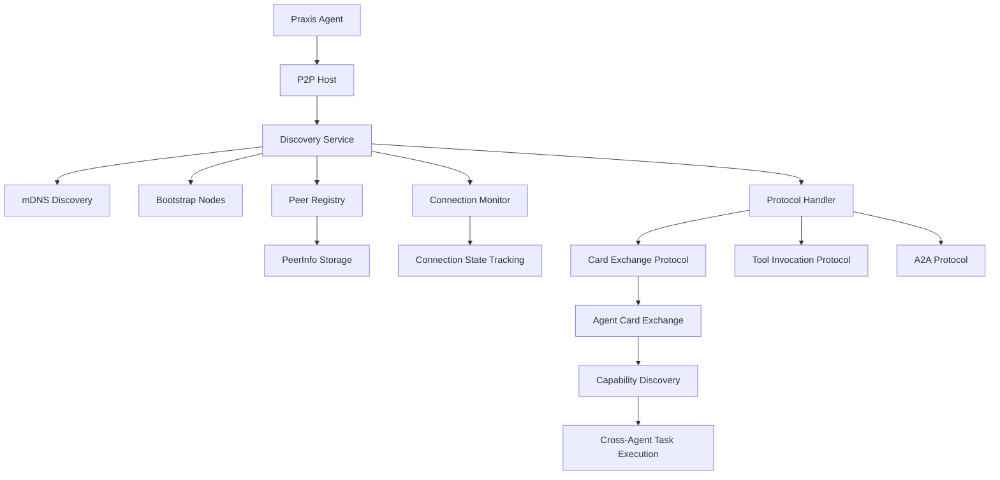
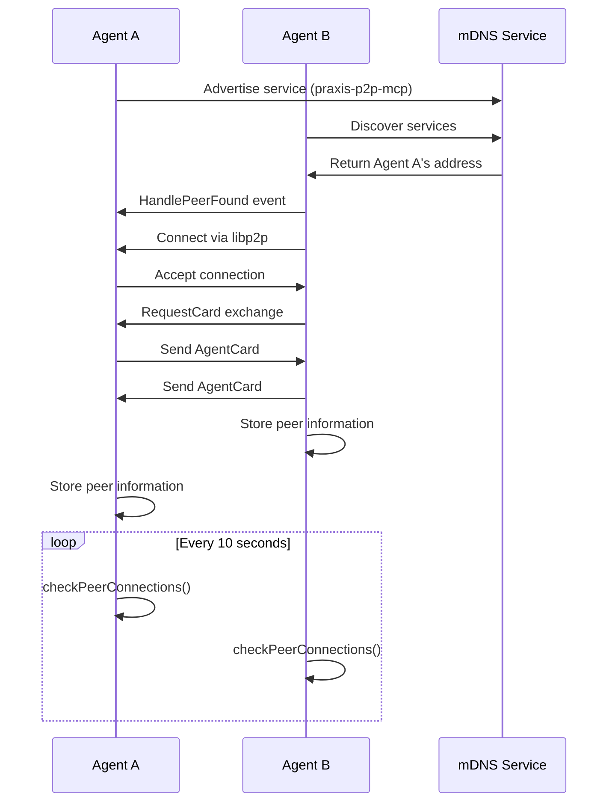

# Peer Discovery Mechanism


## Table of Contents
1. [Introduction](#introduction)
2. [Core Components](#core-components)
3. [Architecture Overview](#architecture-overview)
4. [Discovery Process Flow](#discovery-process-flow)
5. [Peer Identification and Metadata Exchange](#peer-identification-and-metadata-exchange)
6. [Integration with libp2p Protocols](#integration-with-libp2p-protocols)
7. [Configuration Options](#configuration-options)
8. [Bootstrap Node Integration](#bootstrap-node-integration)
9. [Test Scenarios and Validation](#test-scenarios-and-validation)
10. [Common Issues and Troubleshooting](#common-issues-and-troubleshooting)
11. [Performance Considerations](#performance-considerations)

## Introduction
The Peer Discovery Mechanism in the Praxis P2P networking layer enables automated detection and connection between distributed agents. This system implements a multi-layered approach combining mDNS for local network discovery and structured peer metadata exchange through custom protocols. The mechanism allows agents to dynamically discover each other, establish secure connections, and exchange capability information necessary for collaborative task execution. The implementation is built on libp2p and integrates with the Model Context Protocol (MCP) to enable tool sharing and distributed processing across the network.

## Core Components

The peer discovery system consists of several interconnected components that work together to enable automated agent detection and connection management.

### Discovery Struct
The `Discovery` struct is the central component responsible for managing peer discovery operations. It maintains a registry of discovered peers and handles connection state monitoring.

```go
type Discovery struct {
	host            host.Host
	mdnsService     mdns.Service
	foundPeers      map[peer.ID]*PeerInfo
	peerHandlers    []PeerHandler
	protocolHandler *P2PProtocolHandler
	logger          *logrus.Logger
	ctx             context.Context
	cancel          context.CancelFunc
	mu              sync.RWMutex
}
```

This struct manages peer lifecycle events, connection monitoring, and integrates with the P2P protocol handler for automatic card exchange upon connection establishment.

**Section sources**
- [discovery.go](file://internal/p2p/discovery.go#L20-L45)

### PeerInfo Structure
The `PeerInfo` struct contains comprehensive information about discovered peers, including network addresses, connection status, and capability metadata.

```go
type PeerInfo struct {
	ID          peer.ID
	Addrs       []multiaddr.Multiaddr
	FoundAt     time.Time
	LastSeen    time.Time
	AgentCard   interface{}
	IsConnected bool
}
```

This structure serves as the primary data model for tracking peer state throughout the discovery and connection lifecycle.

**Section sources**
- [discovery.go](file://internal/p2p/discovery.go#L47-L57)

## Architecture Overview

The peer discovery architecture integrates multiple libp2p components to create a robust agent detection system that operates across different network environments.



**Diagram sources**
- [discovery.go](file://internal/p2p/discovery.go#L20-L57)
- [protocol.go](file://internal/p2p/protocol.go#L45-L75)

## Discovery Process Flow

The discovery process follows a systematic sequence of operations to detect, connect, and validate peer agents on the network.



**Diagram sources**
- [discovery.go](file://internal/p2p/discovery.go#L80-L273)
- [protocol.go](file://internal/p2p/protocol.go#L176-L228)

### Discovery Lifecycle
The discovery lifecycle consists of several key phases:

1. **Service Initialization**: The discovery service starts and begins advertising the agent's presence on the network using mDNS with the service tag "praxis-p2p-mcp".
2. **Peer Detection**: The mDNS service detects other agents broadcasting the same service tag and triggers the `HandlePeerFound` callback.
3. **Connection Establishment**: The system attempts to establish a libp2p connection with the discovered peer using its multiaddr information.
4. **Card Exchange**: Upon successful connection, agents automatically exchange capability cards containing metadata about their available tools and services.
5. **Connection Monitoring**: A periodic loop checks the connection status of all discovered peers and removes stale entries after 5 minutes of inactivity.

**Section sources**
- [discovery.go](file://internal/p2p/discovery.go#L80-L273)

## Peer Identification and Metadata Exchange

The system implements a comprehensive peer identification mechanism that goes beyond simple network addressing to include rich metadata about agent capabilities.

### Agent Card Structure
The `AgentCard` struct serves as the primary mechanism for exchanging agent metadata and capabilities:

```go
type AgentCard struct {
	Name         string     `json:"name"`
	Version      string     `json:"version"`
	PeerID       string     `json:"peerId"`
	Capabilities []string   `json:"capabilities"`
	Tools        []ToolSpec `json:"tools"`
	Timestamp    int64      `json:"timestamp"`
}
```

This card contains essential information that enables agents to understand each other's capabilities and determine compatibility for task delegation.

**Section sources**
- [protocol.go](file://internal/p2p/protocol.go#L75-L82)

### Tool Specification Model
The system includes a detailed tool specification model that describes available functionality:

```go
type ToolSpec struct {
	Name        string          `json:"name"`
	Description string          `json:"description"`
	Parameters  []ToolParameter `json:"parameters"`
}
```

Each tool parameter is further described with type, description, and required status, enabling precise understanding of tool interfaces across the network.

**Section sources**
- [protocol.go](file://internal/p2p/protocol.go#L70-L73)

## Integration with libp2p Protocols

The discovery mechanism integrates with libp2p's native peer discovery protocols while extending them with custom functionality for agent-specific requirements.

### mDNS Integration
The system uses libp2p's mDNS discovery service for local network peer detection:

```go
mdnsService := mdns.NewMdnsService(d.host, DiscoveryServiceTag, notifee)
```

This implementation uses the service tag "praxis-p2p-mcp" to identify Praxis agents on the local network, allowing for targeted discovery within the agent ecosystem.

**Section sources**
- [discovery.go](file://internal/p2p/discovery.go#L88-L92)

### Protocol Handler Integration
The discovery system integrates with the P2P protocol handler to enable automatic capability exchange:

```go
// Connect discovery and protocol handler for automatic card exchange
discovery.SetProtocolHandler(a.p2pProtocol)
```

This integration ensures that whenever a new peer is discovered and connected, the system automatically initiates a card exchange process to share capability information.

**Section sources**
- [agent.go](file://internal/agent/agent.go#L185-L188)

## Configuration Options

The peer discovery system provides several configuration options that can be adjusted through the agent configuration file to optimize behavior for different deployment scenarios.

### Discovery Parameters
The following parameters control the discovery behavior:

- **DiscoveryInterval**: The frequency of connection health checks (default: 10 seconds)
- **StalePeerTimeout**: The duration after which inactive peers are removed (5 minutes)
- **ConnectionTimeout**: The timeout for establishing connections with discovered peers (30 seconds)

These parameters balance network responsiveness with resource utilization, preventing excessive network traffic while maintaining timely peer detection.

**Section sources**
- [discovery.go](file://internal/p2p/discovery.go#L15-L16)

### Network Interface Configuration
The configuration file allows specification of network interfaces and ports:

```yaml
p2p:
  enabled: true
  port: 4001
  secure: true
  rendezvous: "praxis-agents"
  enable_mdns: true
  enable_dht: true
  bootstrap_nodes: []
```

These settings control which network interfaces are used, whether encryption is enabled, and whether mDNS and DHT discovery are activated.

**Section sources**
- [agent.yaml](file://configs/agent.yaml#L20-L26)

## Bootstrap Node Integration

The system supports bootstrap node integration to facilitate initial network connectivity, particularly in environments where mDNS discovery may be limited.

### Bootstrap Connection Method
The `ConnectToBootstrapPeers` method enables connection to predefined bootstrap nodes:

```go
func (d *Discovery) ConnectToBootstrapPeers(bootstrapPeers []string) error {
	for _, peerAddr := range bootstrapPeers {
		addr, err := multiaddr.NewMultiaddr(peerAddr)
		if err != nil {
			d.logger.Errorf("Invalid bootstrap peer address %s: %v", peerAddr, err)
			continue
		}

		peerInfo, err := peer.AddrInfoFromP2pAddr(addr)
		if err != nil {
			d.logger.Errorf("Failed to parse peer info from %s: %v", peerAddr, err)
			continue
		}

		d.logger.Infof("Connecting to bootstrap peer: %s", peerInfo.ID)

		go d.connectToPeer(*peerInfo)
	}

	return nil
}
```

This method processes a list of bootstrap peer addresses, converts them to libp2p AddrInfo structures, and initiates connections to each peer.

**Section sources**
- [discovery.go](file://internal/p2p/discovery.go#L253-L273)

### Configuration Example
Bootstrap nodes can be configured in the agent configuration file:

```yaml
p2p:
  bootstrap_nodes:
    - "/ip4/192.168.1.100/tcp/4001/p2p/12D3KooWFx...
    - "/ip4/192.168.1.101/tcp/4001/p2p/12D3KooWGx...
```

This configuration allows agents to connect to known peers when starting up, which can then introduce them to additional peers in the network.

**Section sources**
- [agent.yaml](file://configs/agent.yaml#L25-L26)

## Test Scenarios and Validation

The system includes test scenarios that validate both successful and failed discovery operations.

### Successful Discovery Scenario
The integration test verifies successful peer discovery and card exchange:

```bash
# Wait for P2P discovery
sleep 10

# Check P2P cards
local p2p_response=$(curl -s "$AGENT1_URL/p2p/cards")
local peer_count=$(echo "$p2p_response" | jq '.cards | length')

# Verify card exchange
local card_exchange_count=$(docker logs praxis-agent-1 praxis-agent-2 2>&1 | grep -c "Card exchange complete")
```

This test confirms that agents can discover each other, establish connections, and successfully exchange capability cards.

**Section sources**
- [test_a2a_full_docker.sh](file://test_a2a_full_docker.sh#L218-L255)

### Failed Discovery Scenario
The test also validates error handling when discovery fails:

```bash
if [ "$peer_count" -gt 0 ]; then
    print_success "P2P discovery working: $peer_count peers discovered"
else
    print_error "No P2P peers discovered"
    
    # Check logs for discovery issues
    docker logs praxis-agent-1 2>&1 | grep -E "(Discovered|Card exchange|Connected)" | tail -5
    return 1
fi
```

This scenario checks for common failure points and provides diagnostic information to help troubleshoot connectivity issues.

**Section sources**
- [test_a2a_full_docker.sh](file://test_a2a_full_docker.sh#L238-L248)

## Common Issues and Troubleshooting

The peer discovery system may encounter several common issues in different deployment environments.

### Network Isolation
Agents running in isolated network environments may fail to discover each other due to:

- **Firewall restrictions**: Blocking UDP traffic on the mDNS port (5353) or the configured P2P port
- **Network segmentation**: Agents on different subnets without multicast routing
- **Container networking**: Docker containers without proper network configuration

**Troubleshooting**: Verify network connectivity between agents and ensure that the configured P2P ports are accessible.

### Duplicate Peer Entries
The system prevents duplicate peer entries by checking the peer ID before adding a new entry:

```go
if pi.ID == d.host.ID() {
    return
}

peerInfo, exists := d.foundPeers[pi.ID]
if !exists {
    // New peer - create entry
    peerInfo = &PeerInfo{...}
    d.foundPeers[pi.ID] = peerInfo
} else {
    // Existing peer - update information
    peerInfo.LastSeen = time.Now()
    peerInfo.Addrs = pi.Addrs
}
```

This logic ensures that each peer is represented only once in the registry, even if discovered multiple times.

**Section sources**
- [discovery.go](file://internal/p2p/discovery.go#L128-L143)

### Firewall Traversal
For agents behind firewalls or NAT, the system relies on libp2p's built-in NAT traversal capabilities:

- **AutoRelay**: Enables relay connections when direct connections fail
- **Hole punching**: Attempts to establish direct connections through NAT
- **Port forwarding**: Requests routers to open ports for incoming connections

These mechanisms are enabled by default in the libp2p configuration to maximize connectivity across different network topologies.

## Performance Considerations

The peer discovery system includes several performance optimizations to handle different deployment scales.

### Connection Monitoring
The system uses a periodic loop to monitor peer connections:

```go
func (d *Discovery) runDiscoveryLoop() {
	ticker := time.NewTicker(DiscoveryInterval)
	defer ticker.Stop()

	for {
		select {
		case <-d.ctx.Done():
			return
		case <-ticker.C:
			d.checkPeerConnections()
		}
	}
}
```

This approach balances timely detection of connection changes with minimal resource consumption by checking connections every 10 seconds rather than continuously polling.

**Section sources**
- [discovery.go](file://internal/p2p/discovery.go#L104-L115)

### Aggressive Scanning Impact
Aggressive scanning intervals can lead to:

- **Increased network traffic**: Frequent mDNS queries and responses
- **Higher CPU utilization**: Constant processing of discovery events
- **Memory growth**: Accumulation of peer entries if stale peers are not properly cleaned up

The current implementation mitigates these issues by using a moderate discovery interval and automatically removing peers that haven't been seen in 5 minutes.

### Optimization Strategies
For large-scale deployments, consider the following optimization strategies:

1. **Increase DiscoveryInterval**: Reduce the frequency of connection checks in stable networks
2. **Implement selective discovery**: Limit discovery to specific subnets or network segments
3. **Use bootstrap nodes**: Rely more on bootstrap nodes than mDNS in large networks
4. **Implement peer filtering**: Only connect to peers with specific capabilities needed for current tasks

These strategies can reduce network overhead while maintaining reliable peer discovery in large-scale deployments.

**Referenced Files in This Document**   
- [discovery.go](file://internal/p2p/discovery.go)
- [protocol.go](file://internal/p2p/protocol.go)
- [bridge.go](file://internal/p2p/bridge.go)
- [agent.go](file://internal/agent/agent.go)
- [agent.yaml](file://configs/agent.yaml)
- [agent2_auto.yaml](file://configs/agent2_auto.yaml)
- [discovery_test.go](file://internal/mcp/discovery_test.go)
- [test_a2a_full_docker.sh](file://test_a2a_full_docker.sh)