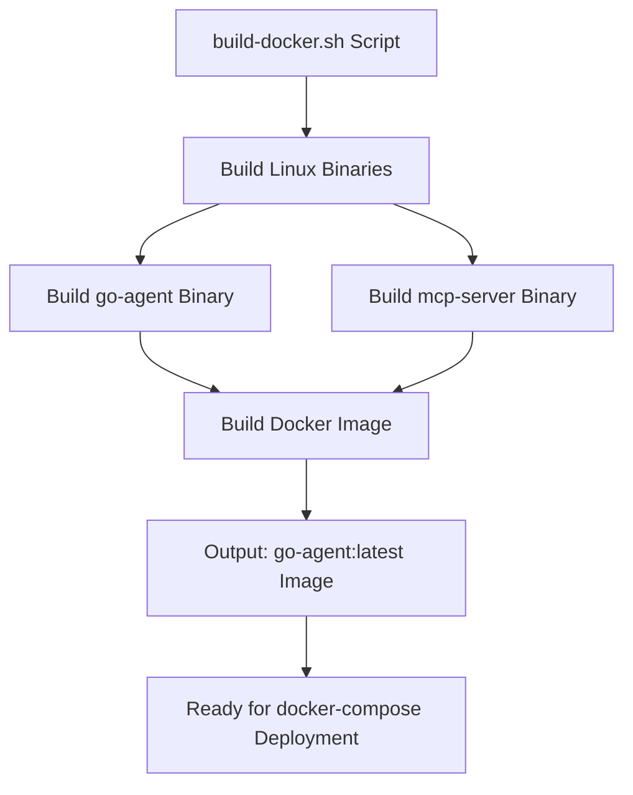
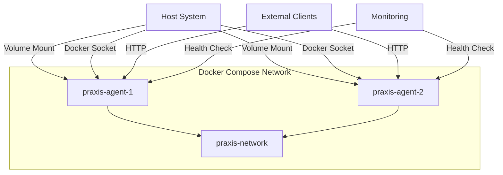
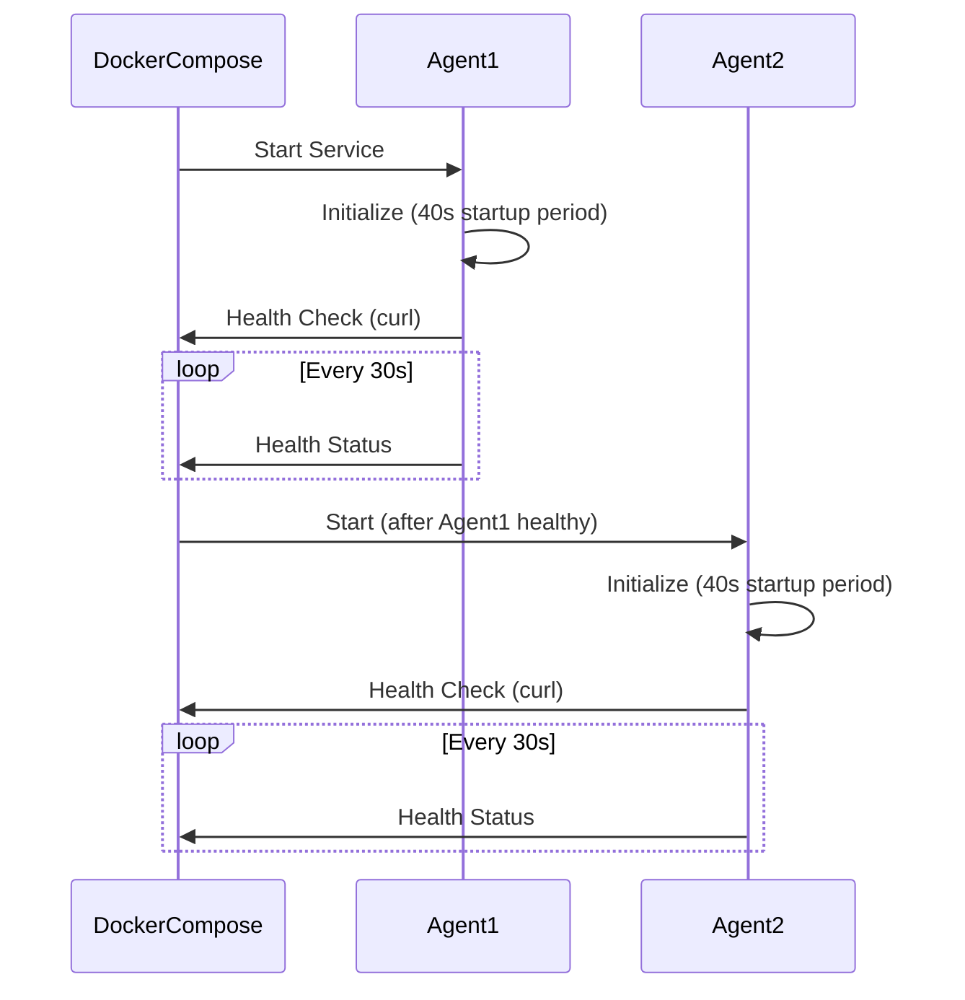
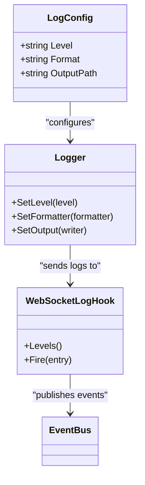
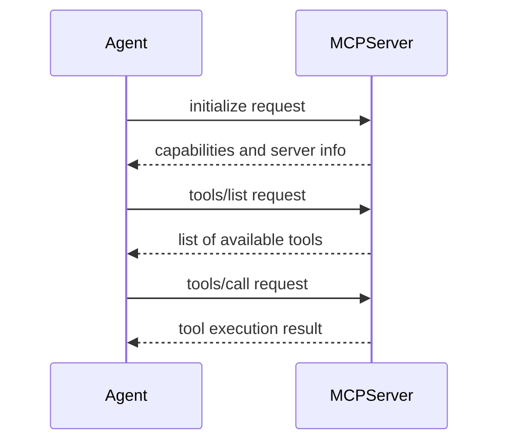

# Deployment


## Table of Contents
1. [Docker-Based Deployment](#docker-based-deployment)
2. [Multi-Agent Network Setup](#multi-agent-network-setup)
3. [Production Considerations](#production-considerations)
4. [Scaling Agent Networks](#scaling-agent-networks)
5. [External MCP Server Deployment](#external-mcp-server-deployment)
6. [Backup and Recovery Procedures](#backup-and-recovery-procedures)

## Docker-Based Deployment

The Praxis agent deployment is containerized using Docker, with a build script and Docker Compose configuration enabling consistent deployment across environments. The `build-docker.sh` script orchestrates the entire build process, compiling binaries and building Docker images.



**Diagram sources**
- [build-docker.sh](file://build-docker.sh#L1-L54)

**Section sources**
- [build-docker.sh](file://build-docker.sh#L1-L54)

The primary deployment method uses Docker Compose, which defines two agent services (`praxis-agent-1` and `praxis-agent-2`) that communicate over a shared bridge network. The configuration exposes multiple ports for different communication protocols:

- **HTTP API**: Port 8000/8001
- **WebSocket**: Port 8090/8091
- **P2P**: Port 4001/4002
- **SSE**: Port 9000/9001

Volume mounting is configured to share data between the host and containers:
- `./shared:/app/shared` - Shared data directory
- `./configs:/app/configs` - Configuration files
- `/var/run/docker.sock:/var/run/docker.sock` - Docker socket for Dagger integration

Environment variables control agent behavior and configuration, including API keys, logging levels, and service endpoints. The health check configuration uses `wget` to verify service availability at the `/health` endpoint, with a 10-second interval and 30-second startup period.



**Diagram sources**
- [docker-compose.yml](file://docker-compose.yml#L1-L87)

**Section sources**
- [docker-compose.yml](file://docker-compose.yml#L1-L87)

## Multi-Agent Network Setup

For production-like environments, the `examples/docker-compose-golden.yml` file provides a golden configuration for multi-agent networks. This configuration uses the same Docker Compose syntax but with enhanced health check parameters and consistent configuration patterns.

The key differences from the standard configuration include:
- Health check interval increased to 30 seconds
- Timeout increased to 10 seconds
- Start period extended to 40 seconds
- Use of `curl` instead of `wget` for health checks
- Consistent configuration across both agents

The dependency chain ensures that `praxis-agent-2` only starts after `praxis-agent-1` is healthy, creating a reliable startup sequence for interdependent agents. Both agents use the golden configuration files (`agent1_golden.yaml` and `agent2_golden.yaml`) which likely contain production-ready settings.



**Diagram sources**
- [examples/docker-compose-golden.yml](file://examples/docker-compose-golden.yml#L1-L83)

**Section sources**
- [examples/docker-compose-golden.yml](file://examples/docker-compose-golden.yml#L1-L83)

## Production Considerations

### Resource Allocation
The Docker Compose configuration implicitly handles resource allocation through container isolation. For explicit resource constraints, additional Docker Compose parameters like `mem_limit`, `cpus`, and `mem_reservation` can be added to the service definitions.

### Logging Strategies
The system uses logrus for logging with configurable levels. The `pkg/utils/logging.go` file defines the logging configuration structure, supporting both text and JSON formats. Logs can be directed to stdout, files, or both. The configuration allows setting:
- Log level (debug, info, warning, error)
- Output format (text or JSON)
- Output file path

The system also includes a WebSocket log hook that sends log entries to the EventBus for real-time monitoring by WebSocket clients.



**Diagram sources**
- [pkg/utils/logging.go](file://pkg/utils/logging.go#L1-L56)
- [internal/logger/hooks.go](file://internal/logger/hooks.go#L1-L61)

**Section sources**
- [pkg/utils/logging.go](file://pkg/utils/logging.go#L1-L56)

### Monitoring Setup
The deployment includes comprehensive health checks for service monitoring. Each agent service has a health check that verifies the HTTP API endpoint is responsive. The health check configuration includes:
- Test command: HTTP request to `/health` endpoint
- Interval: 10-30 seconds between checks
- Timeout: 5-10 seconds for response
- Retries: 3 attempts before marking as unhealthy
- Start period: 30-40 seconds for initial startup

Monitoring can be extended by exposing metrics endpoints and integrating with Prometheus or other monitoring systems.

### Security Hardening
Security is addressed through several mechanisms:
- Environment variables for sensitive data (API keys)
- Configuration validation to prevent invalid settings
- Secure P2P communication (when enabled)
- Isolated container environments

The configuration system validates critical settings, such as ensuring MCP server transport is either 'stdio' or 'sse', and that required fields are present. Sensitive information like API keys should be provided through environment variables rather than hardcoded in configuration files.

## Scaling Agent Networks

Agent networks can be scaled by adding additional agent services to the Docker Compose configuration. The current setup demonstrates a two-agent network, but additional agents can be added following the same pattern.

The LLM client includes load balancing considerations, with logic to distribute work across multiple agents when possible. The orchestrator considers several factors when routing tasks:
- Tool availability on agents
- Agent specialization
- Load balancing across agents
- Locality of tools

For large-scale deployments, consider:
- Using Docker Swarm or Kubernetes for orchestration
- Implementing service discovery mechanisms
- Adding load balancers for HTTP API access
- Monitoring resource utilization across agents

The P2P network configuration supports scaling through libp2p features like mDNS and DHT, allowing agents to discover each other automatically within the network.

## External MCP Server Deployment

External MCP servers can be deployed using the provided `examples/mcp-server.go` implementation. This Go program implements the Model Context Protocol (MCP) specification, exposing tools and resources to Praxis agents.

The example server provides several tools:
- **greet**: Generate greeting messages with different styles
- **calculate**: Perform mathematical calculations
- **get_time**: Retrieve current server time
- **context_search**: Search through available context data

Resources provided by the server include:
- Server information
- List of available tools

The server uses JSON-RPC over stdin/stdout for communication, making it compatible with the MCP STDIO transport. It can be built and run independently of the main agent:

```bash
go build -o mcp-server examples/mcp-server.go
./mcp-server
```

Agents can connect to external MCP servers by specifying the endpoint in their configuration file, as shown in the `agent.yaml` example with the `external_mcp_endpoints` field.



**Diagram sources**
- [examples/mcp-server.go](file://examples/mcp-server.go#L1-L591)

**Section sources**
- [examples/mcp-server.go](file://examples/mcp-server.go#L1-L591)

## Backup and Recovery Procedures

### Configuration Management
The system provides functions for saving and loading configuration, enabling backup and recovery of agent settings. The `internal/config/config.go` file contains `SaveConfig` and `LoadConfig` functions that handle YAML serialization of the configuration structure.

Configuration files should be backed up regularly, especially:
- `configs/agent.yaml` and variant configuration files
- Custom tool configurations
- Network settings

A backup procedure could involve:
```bash
# Backup configuration files
tar -czf praxis-config-backup-$(date +%Y%m%d).tar.gz configs/

# Backup shared data
tar -czf praxis-shared-backup-$(date +%Y%m%d).tar.gz shared/
```

### Agent State Recovery
While the core agent state is ephemeral (stored in memory), the system can be restored to a previous state by:
1. Restoring configuration files from backup
2. Restarting the Docker containers
3. Reconnecting to any persistent data sources

For agents with persistent state, consider implementing regular state export functions and automated backup scripts. The volume mounting configuration already facilitates data persistence by mapping container directories to host directories.

The configuration system includes validation to ensure recovered configurations are valid before use, preventing startup failures due to corrupted or invalid settings.

**Section sources**
- [internal/config/config.go](file://internal/config/config.go#L46-L94)
- [configs/agent.yaml](file://configs/agent.yaml#L1-L119)

**Referenced Files in This Document**   
- [build-docker.sh](file://build-docker.sh)
- [docker-compose.yml](file://docker-compose.yml)
- [examples/docker-compose-golden.yml](file://examples/docker-compose-golden.yml)
- [examples/mcp-server.go](file://examples/mcp-server.go)
- [configs/agent.yaml](file://configs/agent.yaml)
- [shared/Dockerfile](file://shared/Dockerfile)
- [internal/config/config.go](file://internal/config/config.go)
- [pkg/utils/logging.go](file://pkg/utils/logging.go)