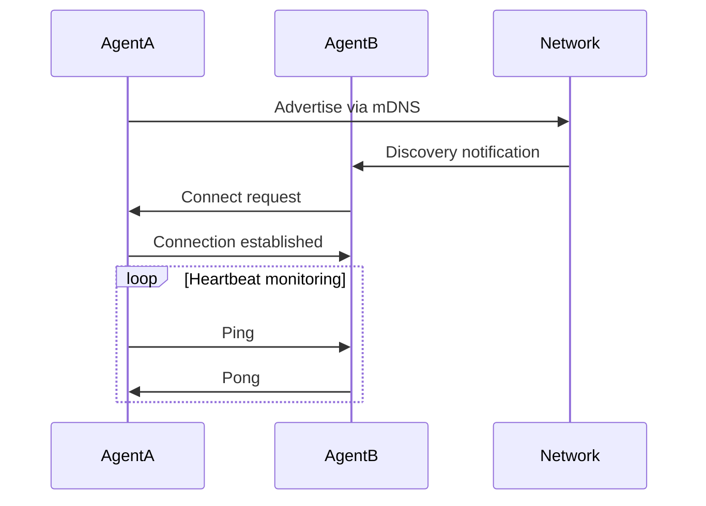
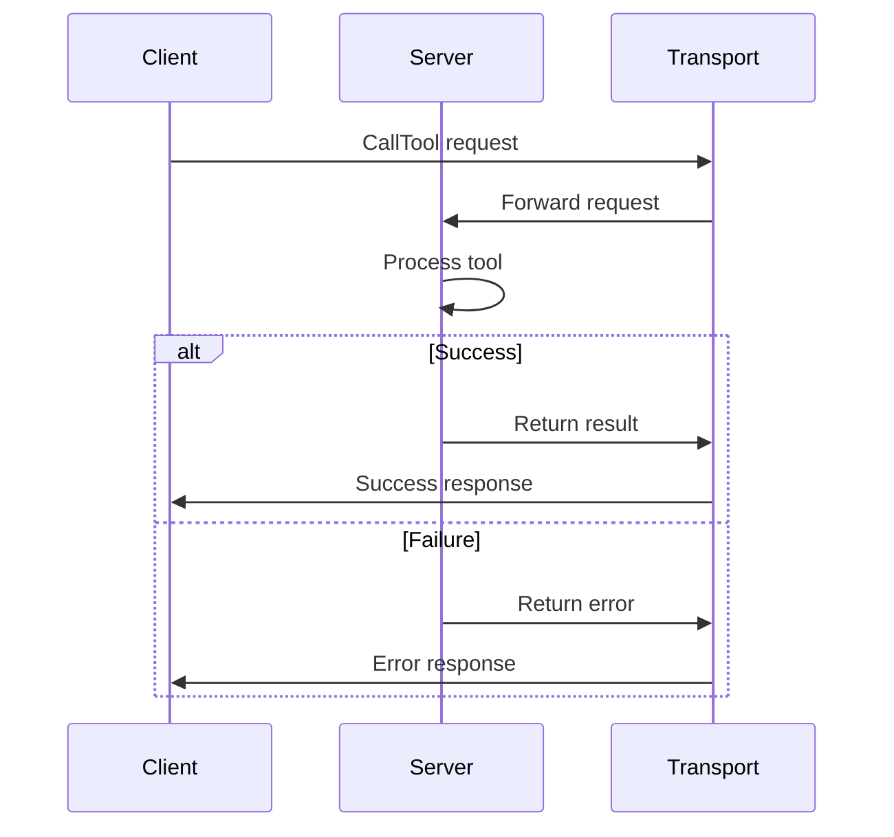
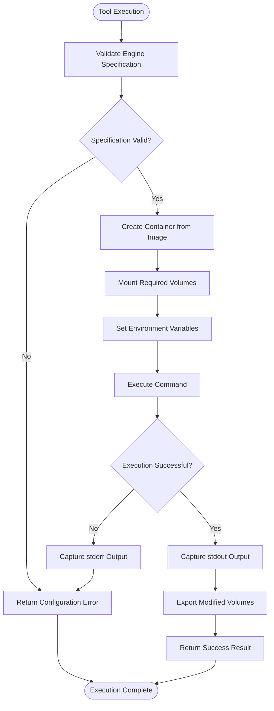
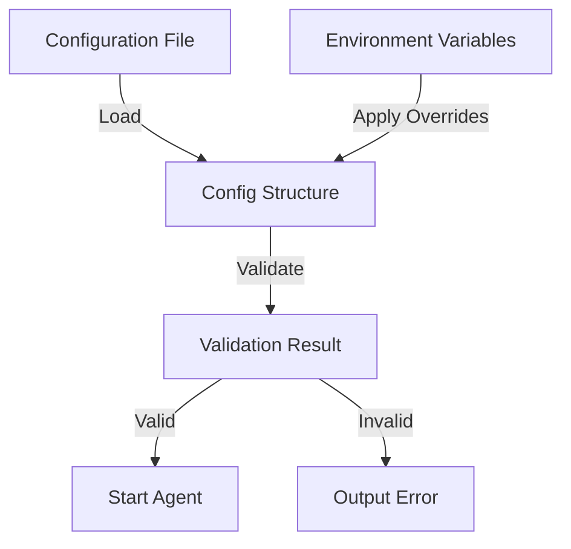

# Troubleshooting


## Table of Contents
1. [Introduction](#introduction)
2. [P2P Connectivity Issues](#p2p-connectivity-issues)
3. [MCP Server/Client Failures](#mcp-serverclient-failures)
4. [Execution Engine Errors](#execution-engine-errors)
5. [Configuration Problems](#configuration-problems)
6. [Logging and Diagnostic Tools](#logging-and-diagnostic-tools)
7. [Network Troubleshooting](#network-troubleshooting)
8. [Debugging Commands and Tools](#debugging-commands-and-tools)

## Introduction
This troubleshooting guide provides comprehensive solutions for common issues encountered when running Praxis agents. The guide is organized by issue category: P2P connectivity, MCP server/client failures, execution engine errors, and configuration problems. Each section includes error symptoms, likely causes, diagnostic steps using logs from hooks.go, and resolution procedures. The document also covers network troubleshooting for libp2p connectivity, MCP endpoint validation, and Docker/Dagger execution issues. Special attention is given to interpreting log levels and structured logging output as documented in the CHANGELOG.md for known issues and fixes in specific versions.

## P2P Connectivity Issues

### Symptom: Agents Cannot Discover Each Other
**Error Symptom**: Agents fail to establish P2P connections despite being on the same network.

**Likely Causes**:
- mDNS discovery disabled or blocked
- Firewall blocking P2P ports
- Incorrect rendezvous string configuration
- Network segmentation preventing peer discovery

**Diagnostic Steps**:
1. Check logs for mDNS service startup messages:
```bash
grep "Starting P2P discovery service" logs/agent.log
```
2. Verify peer discovery notifications:
```bash
grep "Discovered new peer" logs/agent.log
```
3. Monitor connection attempts:
```bash
grep "Failed to connect to peer" logs/agent.log
```

**Resolution Procedures**:
1. Ensure mDNS is enabled in configuration:
```yaml
p2p:
  enable_mdns: true
```
2. Verify firewall allows traffic on P2P port (default: 4000-4001)
3. Confirm rendezvous string matches across agents:
```yaml
p2p:
  rendezvous: "praxis-agents"
```
4. Check network connectivity between agent hosts

**Section sources**
- [discovery.go](file://internal/p2p/discovery.go#L59-L130)
- [config.go](file://internal/config/config.go#L46-L94)

### Symptom: Intermittent Peer Disconnections
**Error Symptom**: Peers connect briefly then disconnect repeatedly.

**Likely Causes**:
- Network instability
- Resource constraints on agent hosts
- Heartbeat timeout issues
- NAT traversal problems

**Diagnostic Steps**:
1. Monitor connection state changes:
```bash
grep "Peer .* connected" logs/agent.log
grep "Peer .* disconnected" logs/agent.log
```
2. Check for stale peer cleanup:
```bash
grep "Removing stale peer" logs/agent.log
```

**Resolution Procedures**:
1. Increase connection timeout settings
2. Ensure stable network connectivity
3. Verify sufficient system resources (CPU, memory)
4. Configure proper port forwarding if behind NAT



**Diagram sources**
- [discovery.go](file://internal/p2p/discovery.go#L182-L233)
- [protocol.go](file://internal/p2p/protocol.go#L81-L125)

**Section sources**
- [discovery.go](file://internal/p2p/discovery.go#L182-L233)
- [protocol.go](file://internal/p2p/protocol.go#L81-L125)

## MCP Server/Client Failures

### Symptom: MCP Client Initialization Failure
**Error Symptom**: MCP client fails to initialize with connection errors.

**Likely Causes**:
- MCP server not running
- Network connectivity issues
- Incorrect endpoint URL
- Authentication/authorization problems

**Diagnostic Steps**:
1. Check client initialization logs:
```bash
grep "MCP client initialized" logs/agent.log
```
2. Look for connection errors:
```bash
grep "failed to initialize client" logs/agent.log
```
3. Verify server availability:
```bash
curl -v http://localhost:3000/mcp
```

**Resolution Procedures**:
1. Ensure MCP server is running:
```bash
ps aux | grep mcp-server
```
2. Validate endpoint configuration:
```yaml
mcp:
  enabled: true
  servers:
    - name: "filesystem"
      transport: "sse"
      url: "http://localhost:3000/mcp"
```
3. Check network connectivity to MCP server
4. Verify firewall rules allow access to MCP port

**Section sources**
- [client.go](file://internal/mcp/client.go#L49-L106)
- [transport.go](file://internal/mcp/transport.go#L171-L233)

### Symptom: Tool Execution Timeout
**Error Symptom**: MCP tool calls fail with timeout errors.

**Likely Causes**:
- Server overload
- Long-running operations
- Network latency
- Incorrect timeout configuration

**Diagnostic Steps**:
1. Check timeout settings in configuration:
```bash
grep "request_timeout_ms" configs/agent.yaml
```
2. Monitor tool execution times:
```bash
grep "Calling tool" logs/agent.log
```

**Resolution Procedures**:
1. Increase request timeout in configuration:
```yaml
mcp:
  limits:
    request_timeout_ms: 60000
```
2. Optimize server performance
3. Check network latency between client and server
4. Implement proper error handling for long operations



**Diagram sources**
- [client.go](file://internal/mcp/client.go#L49-L106)
- [server.go](file://internal/mcp/server.go#L60-L97)

**Section sources**
- [client.go](file://internal/mcp/client.go#L49-L106)
- [server.go](file://internal/mcp/server.go#L60-L97)

## Execution Engine Errors

### Symptom: Dagger Engine Connection Failure
**Error Symptom**: Dagger engine fails to connect with "failed to connect to dagger" error.

**Likely Causes**:
- Docker daemon not running
- Dagger engine not available
- Permission issues
- Resource constraints

**Diagnostic Steps**:
1. Check Docker service status:
```bash
docker info
```
2. Verify Dagger connection logs:
```bash
grep "failed to connect to dagger" logs/agent.log
```

**Resolution Procedures**:
1. Ensure Docker daemon is running:
```bash
sudo systemctl status docker
```
2. Verify user has Docker permissions:
```bash
docker run hello-world
```
3. Check system resources (memory, CPU)
4. Restart Docker service if needed

**Section sources**
- [engine.go](file://internal/dagger/engine.go#L0-L48)
- [agent.go](file://internal/agent/agent.go#L433-L469)

### Symptom: Tool Execution Fails with Exit Code
**Error Symptom**: Dagger tool execution fails with non-zero exit code.

**Likely Causes**:
- Command errors in container
- Missing dependencies
- File permission issues
- Invalid arguments

**Diagnostic Steps**:
1. Check stderr output from failed execution:
```bash
grep "dagger execution failed" logs/agent.log
```
2. Verify container image availability:
```bash
docker pull <image-name>
```

**Resolution Procedures**:
1. Validate engine specification in configuration:
```yaml
engineSpec:
  image: "python:3.11-slim"
  command: ["python", "/shared/script.py"]
```
2. Ensure required files are mounted:
```yaml
mounts:
  ./shared: /shared
```
3. Check container logs for detailed error messages
4. Verify all dependencies are included in image



**Diagram sources**
- [engine.go](file://internal/dagger/engine.go#L43-L85)
- [agent.go](file://internal/agent/agent.go#L368-L405)

**Section sources**
- [engine.go](file://internal/dagger/engine.go#L43-L85)
- [agent.go](file://internal/agent/agent.go#L368-L405)

## Configuration Problems

### Symptom: Invalid Configuration Errors
**Error Symptom**: Agent fails to start with configuration validation errors.

**Likely Causes**:
- Missing required fields
- Invalid data types
- Environment variable conflicts
- YAML syntax errors

**Diagnostic Steps**:
1. Check configuration validation logs:
```bash
grep "invalid configuration" logs/agent.log
```
2. Validate YAML syntax:
```bash
yamllint configs/agent.yaml
```

**Resolution Procedures**:
1. Verify all required fields are present:
```yaml
agent:
  name: "praxis-agent"
  version: "1.0.0"
```
2. Check data types match expected format
3. Resolve environment variable conflicts
4. Use configuration validation tool

**Section sources**
- [config.go](file://internal/config/config.go#L46-L94)
- [types.go](file://internal/config/types.go#L0-L31)

### Symptom: Environment Variable Overrides Not Applied
**Error Symptom**: Environment variables do not override configuration values.

**Likely Causes**:
- Incorrect environment variable names
- Variable precedence issues
- Type conversion problems
- Late application of overrides

**Diagnostic Steps**:
1. Check override application logs:
```bash
grep "applyEnvironmentOverrides" logs/agent.log
```
2. Verify environment variables are set:
```bash
printenv | grep AGENT_NAME
```

**Resolution Procedures**:
1. Use correct environment variable names:
```bash
AGENT_NAME="my-agent"
P2P_ENABLED=true
```
2. Ensure variables are set before agent startup
3. Check variable types match expected values
4. Restart agent after changing environment variables



**Diagram sources**
- [config.go](file://internal/config/config.go#L46-L94)
- [types.go](file://internal/config/types.go#L33-L54)

**Section sources**
- [config.go](file://internal/config/config.go#L46-L94)
- [types.go](file://internal/config/types.go#L33-L54)

## Logging and Diagnostic Tools

### Interpreting Log Levels and Structured Logging
The Praxis agent uses structured logging with multiple levels for effective troubleshooting:

**Log Levels**:
- **Trace**: Detailed step-by-step execution flow
- **Debug**: Development and diagnostic information
- **Info**: Normal operational messages
- **Warn**: Potential issues requiring attention
- **Error**: Errors that prevent normal operation
- **Fatal**: Critical errors causing agent termination

**Structured Logging Format**:
Logs include structured fields for better analysis:
```json
{
  "level": "info",
  "message": "Peer connected",
  "peerId": "12D3KooW...",
  "timestamp": "2025-09-05T14:06:50Z",
  "workflowId": "wf-123"
}
```

**Diagnostic Steps Using hooks.go**:
1. Monitor workflow logs:
```bash
grep "workflowId" logs/agent.log
```
2. Filter by log level:
```bash
grep '"level":"error"' logs/agent.log
```
3. Track specific node execution:
```bash
grep '"nodeId":"node-1"' logs/agent.log
```

The WebSocketLogHook in hooks.go forwards logs to the EventBus for real-time monitoring through the WebSocket interface.

**Section sources**
- [hooks.go](file://internal/logger/hooks.go#L0-L195)
- [agent.go](file://internal/agent/agent.go#L57-L57)

## Network Troubleshooting

### LibP2P Connectivity Testing
Use these commands to diagnose libP2P connectivity issues:

**Check Peer Connections**:
```bash
curl http://localhost:8000/peers
```

**Verify Agent Capabilities**:
```bash
curl http://localhost:8000/p2p/cards
```

**Test Network Connectivity**:
```bash
# Check if P2P port is open
nc -zv localhost 4000

# Test HTTP API
curl -I http://localhost:8000/health
```

**Docker Network Issues**:
When running in Docker, ensure proper network configuration:
```yaml
# docker-compose.yml
services:
  praxis-agent:
    ports:
      - "4000:4000"  # P2P port
      - "8000:8000"  # HTTP API
    extra_hosts:
      - "host.docker.internal:host-gateway"
```

Use host.docker.internal to access services on the host machine from within containers.

**Section sources**
- [README.md](file://README.md#L0-L176)
- [discovery.go](file://internal/p2p/discovery.go#L0-L63)

## Debugging Commands and Tools

### Agent State Inspection
Use these commands to inspect agent state:

**Health Check**:
```bash
curl http://localhost:8000/health
```

**List Connected Peers**:
```bash
curl http://localhost:8000/peers
```

**View Agent Capabilities**:
```bash
curl http://localhost:8000/p2p/cards
```

**Execute DSL Command**:
```bash
curl -X POST http://localhost:8000/execute \
  -H "Content-Type: application/json" \
  -d '{"dsl": "CALL list_peers"}'
```

### Network Topology Inspection
Use these tools to inspect network topology:

**List All Docker Containers**:
```bash
docker ps
```

**Inspect Container Network**:
```bash
docker inspect praxis-agent-1
```

**Monitor Network Traffic**:
```bash
docker logs -f praxis-agent-1
```

**View Configuration**:
```bash
cat configs/agent.yaml
```

These debugging commands provide comprehensive visibility into agent state and network topology, enabling effective troubleshooting of distributed agent issues.

**Section sources**
- [README.md](file://README.md#L0-L176)
- [agent.yaml](file://configs/agent.yaml#L0-L118)

**Referenced Files in This Document**   
- [agent.yaml](file://configs/agent.yaml)
- [config.go](file://internal/config/config.go)
- [types.go](file://internal/config/types.go)
- [discovery.go](file://internal/p2p/discovery.go)
- [protocol.go](file://internal/p2p/protocol.go)
- [client.go](file://internal/mcp/client.go)
- [transport.go](file://internal/mcp/transport.go)
- [server.go](file://internal/mcp/server.go)
- [engine.go](file://internal/dagger/engine.go)
- [agent.go](file://internal/agent/agent.go)
- [hooks.go](file://internal/logger/hooks.go)
- [CHANGELOG.md](file://CHANGELOG.md)
- [README.md](file://README.md)